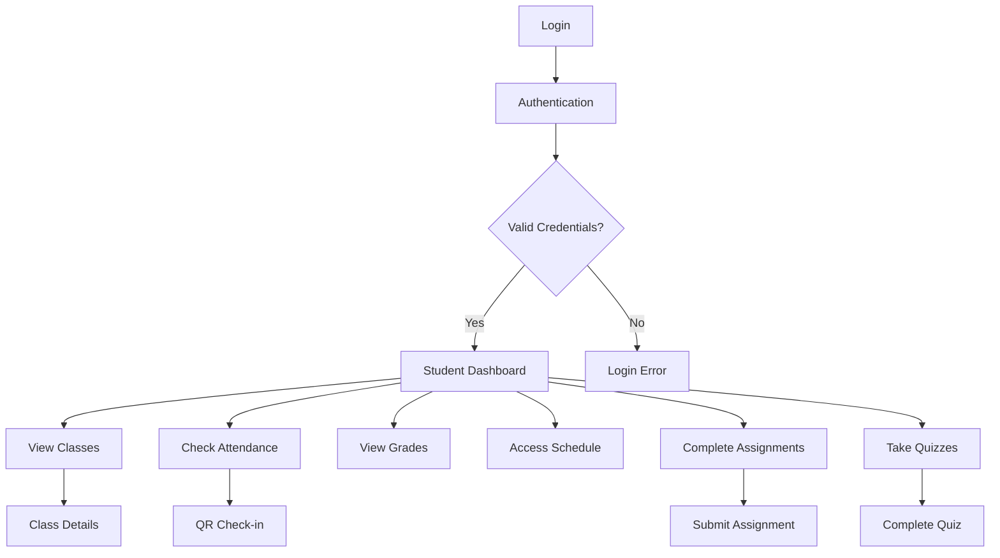
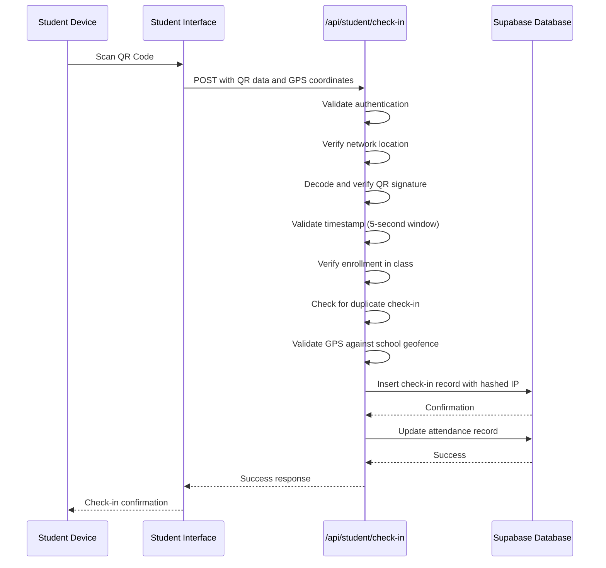

# Student Interface

<cite>
**Referenced Files in This Document**   
- [app/student/layout.tsx](file://app/student/layout.tsx)
- [app/student/page.tsx](file://app/student/page.tsx)
- [app/student/qr-checkin/page.tsx](file://app/student/qr-checkin/page.tsx)
- [app/student/assignments/page.tsx](file://app/student/assignments/page.tsx)
- [app/student/quizzes/page.tsx](file://app/student/quizzes/page.tsx)
- [app/api/student/check-in/route.ts](file://app/api/student/check-in/route.ts)
- [app/api/student/submit-quiz/route.ts](file://app/api/student/submit-quiz/route.ts)
- [app/api/student/dashboard/route.ts](file://app/api/student/dashboard/route.ts)
- [components/qr-scanner.tsx](file://components/qr-scanner.tsx)
- [components/assignment-list.tsx](file://components/assignment-list.tsx)
- [app/student/classes/page.tsx](file://app/student/classes/page.tsx)
- [app/student/grades/page.tsx](file://app/student/grades/page.tsx)
- [app/student/schedule/page.tsx](file://app/student/schedule/page.tsx)
- [components/dashboard-sidebar.tsx](file://components/dashboard-sidebar.tsx)
- [lib/assignment-store.ts](file://lib/assignment-store.ts)
</cite>

## Table of Contents
1. [Introduction](#introduction)
2. [User Experience Flow](#user-experience-flow)
3. [Core Features](#core-features)
4. [API Integration](#api-integration)
5. [Student Workflows](#student-workflows)
6. [UI and Design](#ui-and-design)
7. [Troubleshooting Guide](#troubleshooting-guide)
8. [Accessibility and Performance](#accessibility-and-performance)

## Introduction
The Student Interface is a comprehensive web application that enables students to access their academic information and complete essential educational tasks. Built with Next.js and Supabase, the interface provides a secure, responsive platform for students to manage their academic journey. The system supports key educational functions including class viewing, attendance check-in via QR code, grade tracking, assignment submission, quiz taking, and schedule management. The interface follows a role-based access model, ensuring students can only access features and data relevant to their academic responsibilities.

**Section sources**
- [app/student/layout.tsx](file://app/student/layout.tsx#L1-L60)
- [components/dashboard-sidebar.tsx](file://components/dashboard-sidebar.tsx#L76-L91)

## User Experience Flow
The student experience begins with authentication and progresses through a structured dashboard that provides immediate access to key academic metrics. Upon successful login, students are redirected to their personalized dashboard where they can view their classes, grades, attendance rate, and daily schedule. The navigation is facilitated by a persistent sidebar that organizes all available features in a logical hierarchy. Each page follows a consistent layout pattern with a header containing the page title and user information, followed by content organized into cards and data displays. The interface is designed to minimize cognitive load by presenting information in digestible chunks and providing clear pathways to complete academic tasks.

**Diagram sources **
- [app/student/layout.tsx](file://app/student/layout.tsx#L10-L59)
- [app/student/page.tsx](file://app/student/page.tsx#L40-L202)

## Core Features

### Class Viewing
Students can view all their enrolled classes through the "My Classes" section. Each class card displays essential information including the class name, subject, instructor details, schedule, and classroom location. The interface also shows the number of classmates enrolled in each course, providing social context. Class data is securely retrieved through the `/api/student/classes` endpoint, which validates the student's enrollment status before returning information.

**Section sources**
- [app/student/classes/page.tsx](file://app/student/classes/page.tsx#L23-L124)

### Attendance Check-in via QR Code
The QR-based attendance system allows students to mark their presence in class by scanning a dynamically generated QR code displayed by the instructor. The check-in process incorporates multiple security layers including location verification, IP address tracking, and time-sensitive QR codes. Students must enable GPS to verify their physical presence within the school's geofence. Successful check-ins are recorded with timestamp, location data, and hashed IP address for security auditing.

**Section sources**
- [app/student/qr-checkin/page.tsx](file://app/student/qr-checkin/page.tsx#L38-L309)
- [app/api/student/check-in/route.ts](file://app/api/student/check-in/route.ts#L23-L237)

### Grade Tracking
The grade tracking system provides students with comprehensive insights into their academic performance. The interface displays both overall and class-specific grades using the Philippine Grading System, with visual indicators for performance levels. Students can view detailed breakdowns of their scores by assessment type (exam, quiz, assignment, project) and see historical grade trends. The system calculates weighted averages based on predefined assessment weights and provides immediate feedback on passing/failing status.

**Section sources**
- [app/student/grades/page.tsx](file://app/student/grades/page.tsx#L30-L273)

### Assignment Submission
Students can view available assignments and submit their work through a dedicated submission interface. Each assignment card shows the title, description, due date, maximum score, and submission status. When submitting, students can upload multiple files and include optional comments for the instructor. The system tracks submission timing and automatically flags late submissions. After grading, students can view their scores, teacher feedback, and comparative performance metrics.

**Section sources**
- [app/student/assignments/page.tsx](file://app/student/assignments/page.tsx#L9-L68)
- [components/assignment-list.tsx](file://components/assignment-list.tsx#L40-L271)
- [lib/assignment-store.ts](file://lib/assignment-store.ts#L80-L174)

### Quiz Taking
The quiz system provides a secure environment for students to complete assessments. Quizzes are time-limited and include client-side monitoring for tab switching, copy-paste attempts, and other potential academic integrity violations. The interface supports multiple question types including multiple-choice, true/false, identification, and essay questions. For timed quizzes, a prominent countdown timer is displayed, and submissions are automatically processed when time expires. Results are immediately available for automatically graded questions, while essay responses are marked for manual review.

**Section sources**
- [app/student/quizzes/page.tsx](file://app/student/quizzes/page.tsx#L54-L616)
- [app/api/student/submit-quiz/route.ts](file://app/api/student/submit-quiz/route.ts#L5-L170)

### Schedule Management
Students can view their weekly class schedule organized by day of the week. The schedule interface displays each class with its time slot, subject, instructor, and classroom location. A summary section provides key metrics including total weekly classes, study hours, and number of enrolled subjects. The schedule data is dynamically generated based on the student's class enrollments and the school's timetable configuration.

**Section sources**
- [app/student/schedule/page.tsx](file://app/student/schedule/page.tsx#L34-L144)

## API Integration
The Student Interface communicates with backend services through a series of API routes in the `app/api/student/` directory. These endpoints follow a secure architecture pattern that validates user authentication and authorization before processing requests. All API routes use server-side Supabase clients to interact with the database, ensuring that Row Level Security (RLS) policies are enforced. The integration includes rate limiting to prevent abuse and comprehensive error handling to provide meaningful feedback to users.

### Check-in Operations
The attendance check-in process is handled by the `/api/student/check-in` endpoint, which implements a multi-layered validation system:
1. Authentication verification to confirm the student's identity
2. Network fencing to ensure connection from school Wi-Fi when required
3. IP address hashing for privacy-preserving abuse detection
4. QR code signature verification using HMAC
5. Strict time validation (5-second window)
6. Location verification against school geofence
7. Enrollment validation to confirm class membership
8. Duplicate check-in prevention

**Diagram sources **
- [app/api/student/check-in/route.ts](file://app/api/student/check-in/route.ts#L23-L237)
- [app/student/qr-checkin/page.tsx](file://app/student/qr-checkin/page.tsx#L115-L165)

### Submission Operations
Assignment submissions are processed through client-side state management using Zustand, with data persistence handled by the application's global state. While direct API routes for assignment submission are not present in the current codebase, the system uses the `useAssignmentStore` to manage submission state, which would typically sync with backend services in a production environment. The store maintains assignments and submissions in memory, providing reactive updates to the UI components.

**Section sources**
- [lib/assignment-store.ts](file://lib/assignment-store.ts#L80-L174)
- [components/assignment-list.tsx](file://components/assignment-list.tsx#L40-L271)

## Student Workflows

### Daily QR Check-in
The daily check-in workflow begins when the instructor generates a QR code for the current class session. Students navigate to the QR Check-in page, enable their device's GPS, and use the built-in scanner to read the QR code. The system validates the student's location within the school's geofence and verifies the QR code's authenticity before recording the attendance. A success message is displayed, and the check-in is added to the student's attendance history.

### Submitting an Assignment
To submit an assignment, students navigate to the Assignments page and locate the relevant assignment card. They click the "Submit" button to open the submission dialog, where they can upload files and add comments. After selecting their files, they confirm the submission. The system records the submission with timestamp and status, which is reflected in the assignment card. Students can later view their graded submissions with feedback from instructors.

### Taking a Quiz
When taking a quiz, students select the quiz from their available list and click "Start Quiz." The system validates that the quiz is active and within the allowed time window. The quiz interface displays one question at a time with a countdown timer. Students answer each question and navigate between questions using "Previous" and "Next" buttons. For the final question, the "Submit Quiz" button appears, which processes all answers and calculates the score for automatically graded questions.

## UI and Design
The Student Interface employs a responsive design approach using Tailwind CSS for styling and shadcn/ui components for consistent UI elements. The design follows a mobile-first philosophy, ensuring optimal usability on smartphones and tablets. The color scheme uses a professional blue and white palette with accent colors for status indicators. Key design principles include:

- **Responsive Layout**: Uses CSS Grid and Flexbox for adaptive layouts that work across device sizes
- **Component Composition**: Leverages reusable shadcn/ui components like Card, Button, Badge, and Dialog
- **Accessibility**: Implements proper ARIA labels, keyboard navigation, and semantic HTML
- **Performance**: Uses lazy loading for heavy components like the QR scanner
- **Consistency**: Maintains uniform typography, spacing, and interaction patterns

The interface is organized into a dashboard layout with a fixed sidebar for navigation and a main content area that adapts to the selected feature. Data is presented in card-based layouts with clear visual hierarchy and intuitive icons for quick recognition.

**Section sources**
- [app/student/layout.tsx](file://app/student/layout.tsx#L51-L58)
- [components/dashboard-sidebar.tsx](file://components/dashboard-sidebar.tsx#L186-L225)
- [app/student/page.tsx](file://app/student/page.tsx#L100-L202)

## Troubleshooting Guide

### Failed Check-ins
Common causes of failed check-ins and their solutions:
- **Location access denied**: Enable GPS/location services in device settings
- **Outside school geofence**: Move closer to school premises
- **QR code expired**: Request the instructor to refresh the QR code
- **Camera permission denied**: Grant camera access to the browser/application
- **Network restrictions**: Connect to the school Wi-Fi network if required

### Submission Errors
Issues that may occur during assignment submission:
- **File upload failures**: Check file size and format compatibility
- **Late submission warnings**: Verify the assignment due date and time zone
- **Connection timeouts**: Ensure stable internet connection during submission
- **Duplicate submissions**: The system prevents multiple submissions of the same assignment

**Section sources**
- [app/student/qr-checkin/page.tsx](file://app/student/qr-checkin/page.tsx#L119-L123)
- [components/assignment-list.tsx](file://components/assignment-list.tsx#L190-L192)

## Accessibility and Performance
The Student Interface prioritizes accessibility and mobile performance through several key strategies:

### Accessibility Considerations
- Semantic HTML structure with proper heading hierarchy
- ARIA labels for interactive elements and icons
- Keyboard navigation support for all interactive components
- Sufficient color contrast for text and background elements
- Responsive design that adapts to various screen sizes and orientations
- Screen reader compatibility for all content

### Performance Optimization
- Lazy loading of the QR scanner component to reduce initial bundle size
- Client-side caching of frequently accessed data
- Efficient data fetching using optimized API routes
- Minimal re-renders through proper state management
- Image optimization for avatars and other visual elements
- Progressive loading states to provide feedback during data retrieval

The interface is optimized for mobile users with touch-friendly controls, appropriate tap target sizes, and minimal data usage. The design ensures that core functionality remains accessible even on slower network connections through skeleton loading states and error fallbacks.

**Section sources**
- [components/qr-scanner.tsx](file://components/qr-scanner.tsx#L12-L161)
- [app/student/layout.tsx](file://app/student/layout.tsx#L43-L49)
- [app/student/page.tsx](file://app/student/page.tsx#L88-L97)