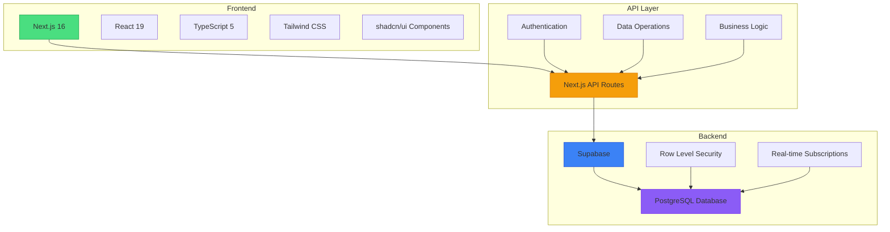
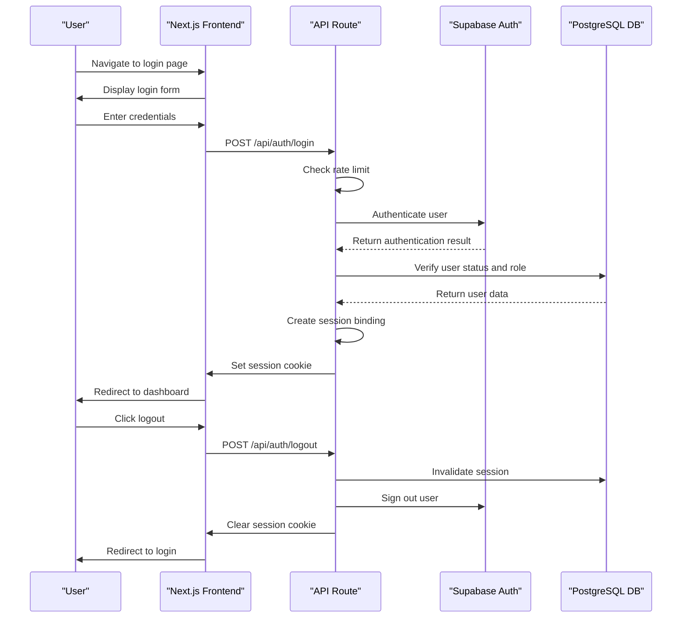
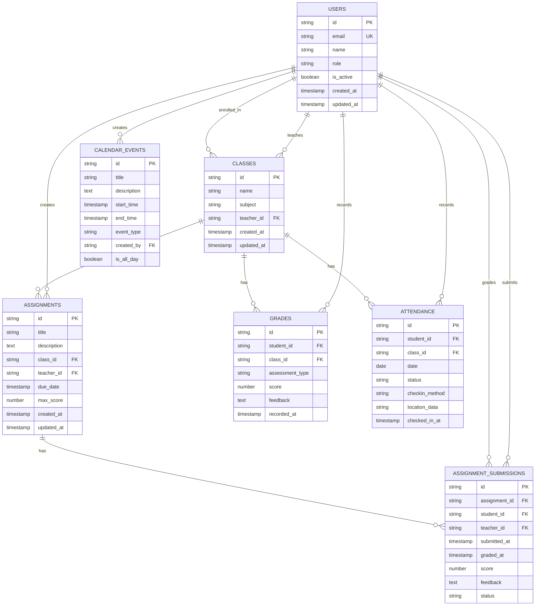

# System Overview

<cite>
**Referenced Files in This Document**   
- [README.md](file://README.md)
- [package.json](file://package.json)
- [app/layout.tsx](file://app/layout.tsx)
- [lib/supabase/client.ts](file://lib/supabase/client.ts)
- [lib/supabase/server.ts](file://lib/supabase/server.ts)
- [app/api/auth/login/route.ts](file://app/api/auth/login/route.ts)
- [app/api/auth/logout/route.ts](file://app/api/auth/logout/route.ts)
- [app/api/check-auth/route.ts](file://app/api/check-auth/route.ts)
- [lib/supabase/middleware.ts](file://lib/supabase/middleware.ts)
- [components/admin-session-guard.tsx](file://components/admin-session-guard.tsx)
- [app/admin/layout.tsx](file://app/admin/layout.tsx)
- [app/teacher/layout.tsx](file://app/teacher/layout.tsx)
- [app/student/layout.tsx](file://app/student/layout.tsx)
- [app/parent/layout.tsx](file://app/parent/layout.tsx)
- [lib/database.types.ts](file://lib/database.types.ts)
</cite>

## Table of Contents
1. [Introduction](#introduction)
2. [System Architecture](#system-architecture)
3. [Core Features](#core-features)
4. [User Roles and Workflows](#user-roles-and-workflows)
5. [Authentication and Security](#authentication-and-security)
6. [Component Organization](#component-organization)
7. [Routing Structure](#routing-structure)
8. [Data Model Overview](#data-model-overview)

## Introduction

The School-Management-System is a full-stack role-based platform designed to streamline school administration and enhance communication between administrators, teachers, students, and parents. Built with modern web technologies, the system provides tailored dashboards for each user role, enabling efficient management of academic activities, attendance, grades, assignments, and communications.

The platform leverages Next.js for its frontend framework, providing server-side rendering and optimized performance. It integrates with Supabase as the backend service, which offers a PostgreSQL database with Row Level Security (RLS) for data protection. This architecture ensures that users can only access data relevant to their roles, maintaining privacy and security across the system.

The system supports four primary user roles: administrators who manage the overall system, teachers who handle classroom activities, students who access learning materials and submit work, and parents who monitor their children's academic progress. Each role has a dedicated interface with specific features and permissions, creating a personalized experience that meets the unique needs of each user group.

**Section sources**
- [README.md](file://README.md#L3-L301)

## System Architecture

The School-Management-System follows a modern full-stack architecture with clear separation of concerns between frontend, backend, and database layers. The system is built on Next.js 16 with React 19, utilizing the App Router pattern for server components and optimized data fetching.

The frontend is implemented using TypeScript 5 with Tailwind CSS for styling, providing a responsive and accessible user interface. The UI components are built using shadcn/ui, a high-quality component library that ensures consistency and usability across the application. State management is handled through a combination of Zustand for client-side state and Supabase for persistent data storage.

The backend infrastructure is powered by Supabase, which provides a PostgreSQL database with real-time capabilities and Row Level Security policies. This security model ensures that data access is strictly controlled based on user roles and relationships, preventing unauthorized access to sensitive information. The system uses Supabase's authentication system for user management, with additional security measures implemented at the application level.

API routes are organized within the app/api directory, following Next.js conventions for server-side endpoints. These routes handle all data operations, including user authentication, CRUD operations for various entities, and specialized functionality like assignment submission and grade management. The API layer serves as the intermediary between the frontend and database, enforcing business logic and security rules.

**Diagram sources**
- [package.json](file://package.json#L7-L75)
- [README.md](file://README.md#L96-L115)
- [app/layout.tsx](file://app/layout.tsx#L1-L43)

**Section sources**
- [README.md](file://README.md#L94-L115)
- [package.json](file://package.json#L7-L75)

## Core Features

The School-Management-System offers a comprehensive suite of features designed to support all aspects of school administration and academic management. These features are organized around the core activities of educational institutions, providing digital solutions for traditional processes.

Attendance tracking is implemented through a QR code-based check-in system that verifies student presence with location validation. Teachers can generate QR codes for their classes, and students scan these codes to record their attendance. The system automatically logs check-in times and locations, providing administrators with accurate attendance records and patterns.

Grade management is a central feature of the system, allowing teachers to input and manage student grades for various assessments. The platform supports different grading scales and weightings, enabling flexible evaluation methods. Students and parents can view grades in real-time, with visual analytics showing grade trends and subject performance over time.

Assignment submission functionality enables teachers to create assignments with due dates, descriptions, and file attachments. Students can submit their work electronically, including file uploads, before the deadline. Teachers can then grade submissions inline, providing scores and feedback directly within the system. The assignment system tracks submission status (pending, submitted, graded, late) and supports late submission policies.

Calendar integration provides a centralized view of school events, including classes, quizzes, exams, holidays, and meetings. The calendar supports color-coded event types and role-based filtering, ensuring users see only relevant events. Users can export calendar events to iCal format for synchronization with external calendars like Google Calendar or Apple Calendar.

Parent-teacher communication is facilitated through a dedicated parent portal that allows parents to monitor their children's academic progress, view attendance records, and access the school calendar. Parents can also communicate directly with teachers through the system, creating a seamless channel for discussing student performance and concerns.

Zoom meeting integration enables virtual classroom sessions and parent-teacher conferences. The system manages Zoom meeting creation, registration, and attendance tracking, providing a complete solution for remote learning and communication. Meeting details are synchronized with the calendar, and attendance records are automatically updated.

**Section sources**
- [README.md](file://README.md#L14-L52)

## User Roles and Workflows

The School-Management-System implements a role-based access control system with four distinct user roles: administrators, teachers, students, and parents. Each role has specific permissions and access to different features, creating tailored workflows that match their responsibilities within the educational ecosystem.

Administrators have the highest level of access, with full system privileges to manage users, configure school settings, and monitor overall system performance. The admin dashboard provides comprehensive analytics and audit logs, enabling administrators to track system usage and identify potential issues. Administrators can create and manage user accounts, assign roles, and control system-wide settings.

Teachers use the teacher portal to manage their classes and students. Their workflow begins with accessing the teacher dashboard, where they can view their schedule, upcoming assignments, and class announcements. Teachers can create new assignments, set due dates, and attach materials for students to download. For attendance, teachers generate QR codes for their classes, which students scan to check in. Teachers can also input grades for assessments and provide feedback on student submissions.

Students access the student portal to manage their academic activities. Upon logging in, they see their personalized dashboard with upcoming assignments, class schedule, and recent grades. Students can submit assignments by uploading files and adding comments before the due date. They can also check their attendance records, view graded assignments with feedback, and access learning materials provided by their teachers.

Parents use the parent monitoring interface to stay informed about their children's academic progress. After logging in, parents can view a summary of their children's grades, attendance patterns, and upcoming events on the shared calendar. Parents can drill down into specific subjects to see grade trends and performance analytics. They can also communicate with teachers through the system's messaging feature and receive important school announcements.

Each role follows a consistent authentication workflow: users navigate to the login page, enter their credentials, and are redirected to their respective dashboards based on their role. The system enforces role-based routing, ensuring users cannot access interfaces intended for other roles. Session management includes timeout controls and activity monitoring to maintain security.

**Section sources**
- [README.md](file://README.md#L154-L214)

## Authentication and Security

The School-Management-System implements a robust authentication and security framework to protect user data and prevent unauthorized access. The system uses Supabase Auth for user management, enhanced with additional security measures at the application level to address specific requirements of a school environment.

Authentication begins with the login process, which includes rate limiting to prevent brute force attacks. The system limits login attempts to five per minute per IP address, returning a generic error message for failed attempts to prevent user enumeration. Upon successful authentication, the system verifies that the user account is active and retrieves the user's role from the database to determine their access level.

Session security is implemented through multiple layers of protection. The system creates session tokens that are bound to device fingerprints and IP addresses, providing additional verification for ongoing sessions. Session binding cookies are configured with HttpOnly, Secure, and SameSite attributes to prevent cross-site scripting and cross-site request forgery attacks. Sessions have both inactivity and absolute timeout limits, with administrators having a 30-minute inactivity timeout and an 8-hour absolute timeout.

Row Level Security (RLS) policies in the Supabase database ensure that users can only access data they are authorized to view. These policies are defined at the database level and enforced for all queries, providing a consistent security model across the application. For example, students can only view their own grades and attendance records, while teachers can access data for their assigned classes.

The system includes specialized API routes for authentication management, such as /api/auth/login for handling login requests and /api/auth/logout for securely ending sessions. The logout process invalidates the session in the database and clears the session binding cookie, ensuring complete session termination. An admin-only endpoint at /api/check-auth allows administrators to verify the authentication status of other users, supporting account management and security audits.

Security monitoring is implemented through audit logs that track important events like login attempts, session creation, and privileged operations. These logs help identify suspicious activities and support incident investigation. The system also includes security headers and content security policies to protect against common web vulnerabilities.

**Diagram sources**
- [app/api/auth/login/route.ts](file://app/api/auth/login/route.ts#L7-L117)
- [app/api/auth/logout/route.ts](file://app/api/auth/logout/route.ts#L6-L36)
- [lib/supabase/server.ts](file://lib/supabase/server.ts#L5-L51)

**Section sources**
- [app/api/auth/login/route.ts](file://app/api/auth/login/route.ts#L7-L117)
- [app/api/auth/logout/route.ts](file://app/api/auth/logout/route.ts#L6-L36)
- [app/api/check-auth/route.ts](file://app/api/check-auth/route.ts#L19-L64)
- [lib/supabase/middleware.ts](file://lib/supabase/middleware.ts#L4-L38)

## Component Organization

The School-Management-System follows a well-organized component structure that promotes reusability, maintainability, and scalability. Components are organized into logical categories based on their functionality and scope, with a clear distinction between UI primitives and higher-level application components.

The component hierarchy begins with the ui directory under components/, which contains low-level UI primitives from shadcn/ui. These include fundamental elements like buttons, inputs, cards, dialogs, and tables that provide consistent styling and behavior across the application. These primitives are built on top of Radix UI components, ensuring accessibility and proper keyboard navigation.

Higher-level components are organized by feature or functionality, such as assignment-list.tsx for displaying assignments, calendar-view.tsx for calendar rendering, and progress-analytics.tsx for visualizing student performance. These components encapsulate specific business logic and data presentation, making them reusable across different parts of the application.

Role-specific components are designed to support the unique requirements of each user type. For example, the admin-session-guard.tsx component implements session management specifically for administrators, including timeout warnings and automatic logout functionality. The dashboard-sidebar component adapts its content based on the user role, providing relevant navigation options for administrators, teachers, students, and parents.

Utility components handle cross-cutting concerns like state management, data fetching, and user experience enhancements. The theme-provider component manages the application's dark/light mode preference, while the notification-center component handles user notifications and alerts. Form components like student-form.tsx and teacher-assignment-manager.tsx provide specialized interfaces for data entry and management.

The system also includes specialized components for integration with external services. The zoom-meeting-card and zoom-meeting-room components manage the display and interaction with Zoom meetings, while the qr-code-generator and qr-scanner components handle the QR-based attendance system. These components abstract the complexity of external APIs, providing a clean interface for the rest of the application.

**Section sources**
- [README.md](file://README.md#L126-L133)
- [components/admin-session-guard.tsx](file://components/admin-session-guard.tsx#L1-L34)

## Routing Structure

The School-Management-System implements a hierarchical routing structure using Next.js App Router, with clear organization based on user roles and functional areas. The routing system enforces role-based access control and provides intuitive navigation paths for different user types.

The application root contains top-level routes for authentication and setup, including /login for user authentication and /setup for initial configuration. The main application interface is organized under role-specific directories: /admin, /teacher, /student, and /parent. Each of these directories contains a layout.tsx file that defines the shared UI structure for that role, including the dashboard sidebar and navigation elements.

Within each role directory, pages are organized by functional area. For example, the admin directory includes pages for announcements, attendance, audit logs, calendar, classes, grades, lessons, meetings, parents, profile, quizzes, schedule, settings, students, teachers, and users. These pages represent the different modules available to administrators, with each page corresponding to a specific management function.

API routes are organized under the /api directory, following a similar role-based structure. The system includes endpoints for admin operations, student and teacher functionality, parent access, and general services like authentication and calendar management. Specialized API routes handle integrations with external services like Zoom, with endpoints for meeting management, attendance tracking, and reporting.

Dynamic routing is used extensively to handle entity-specific operations. For example, the admin/students/[id] route displays details for a specific student, while teacher/quizzes/list provides a list of quizzes for the teacher's classes. These dynamic routes enable personalized content delivery based on the user's context and permissions.

The routing system integrates with the authentication and authorization framework to ensure users can only access routes appropriate to their roles. Middleware and layout components verify user roles before rendering content, redirecting unauthorized users to the login page. This security model is reinforced by Row Level Security policies at the database level, creating a defense-in-depth approach to access control.

**Section sources**
- [app/admin/layout.tsx](file://app/admin/layout.tsx#L1-L62)
- [app/teacher/layout.tsx](file://app/teacher/layout.tsx#L1-L60)
- [app/student/layout.tsx](file://app/student/layout.tsx#L1-L60)
- [app/parent/layout.tsx](file://app/parent/layout.tsx#L1-L44)

## Data Model Overview

The School-Management-System utilizes a relational data model implemented in PostgreSQL through Supabase, with tables designed to represent the core entities of a school environment. The data model supports the system's role-based access control through Row Level Security policies that restrict data access based on user roles and relationships.

The foundation of the data model is the users table, which stores information about all system users including administrators, teachers, students, and parents. Each user has a role field that determines their permissions and access level within the system. The users table is linked to role-specific profile tables that store additional information relevant to each role, such as teacher certifications or student demographic data.

Academic entities are represented through several interconnected tables. The classes table defines course offerings, with relationships to teachers (who teach the class) and students (who are enrolled). The assignments table stores information about academic tasks, including due dates, descriptions, and maximum scores, with foreign keys linking to the corresponding class and teacher. Assignment submissions are tracked in the assignment_submissions table, which records student work, scores, feedback, and submission status.

Assessment data is managed through the grades table, which stores individual grade entries linked to students, classes, and assessment types. The system also includes tables for quizzes and quiz attempts, supporting online assessments with timed quizzes and automated grading. Attendance is tracked in dedicated tables that record student check-ins, with support for both manual entry by teachers and QR code-based automatic recording.

Communication and collaboration features are supported by tables for announcements, calendar events, and messaging. The announcements table stores school-wide or class-specific notices with metadata about the author, target audience, and expiration date. Calendar events are stored with details about event type, timing, and participants, enabling the calendar integration feature. The system also includes tables for managing parent-teacher relationships and student guardianship.

The data model includes audit logging functionality through audit logs tables that track important system events and user activities. These logs support security monitoring and compliance requirements, providing a record of user actions and system changes. The model also includes configuration tables for school settings, user preferences, and system parameters.

**Diagram sources**
- [lib/database.types.ts](file://lib/database.types.ts#L1-L200)

**Section sources**
- [lib/database.types.ts](file://lib/database.types.ts#L1-L574)