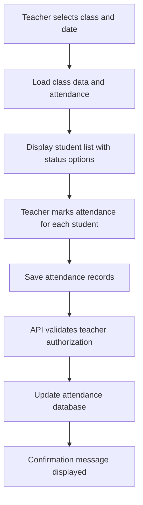
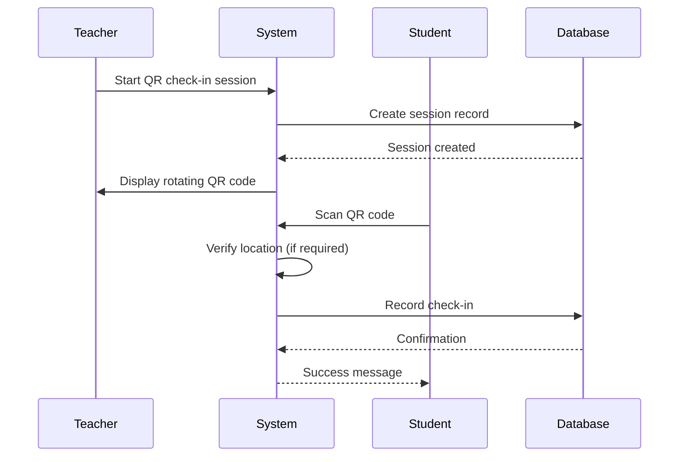
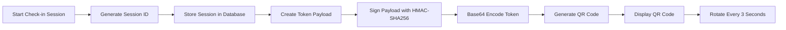
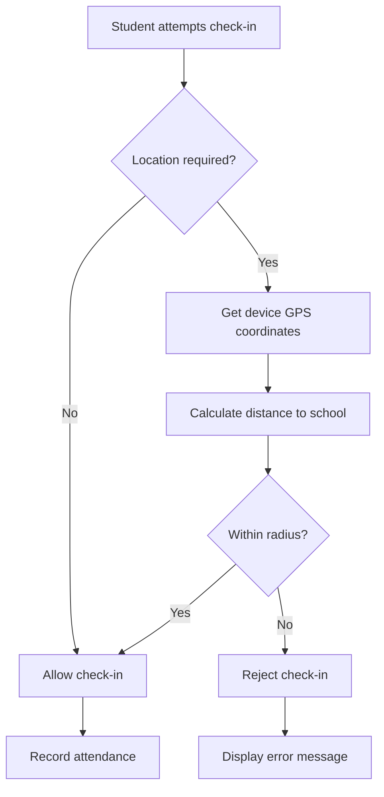
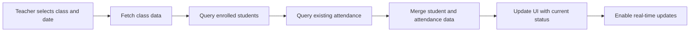

# Attendance Tracking

<cite>
**Referenced Files in This Document**   
- [attendance/page.tsx](file://app/teacher/attendance/page.tsx)
- [qr-attendance/page.tsx](file://app/teacher/qr-attendance/page.tsx)
- [api/teacher/attendance/save/route.ts](file://app/api/teacher/attendance/save/route.ts)
- [api/teacher/generate-qr/route.ts](file://app/api/teacher/generate-qr/route.ts)
- [api/teacher/attendance/class-data/route.ts](file://app/api/teacher/attendance/class-data/route.ts)
- [api/teacher/end-session/route.ts](file://app/api/teacher/end-session/route.ts)
- [attendance-utils.ts](file://lib/attendance-utils.ts)
- [qr-attendance-store.ts](file://lib/qr-attendance-store.ts)
- [qr-code-generator.tsx](file://components/qr-code-generator.tsx)
- [qr-scanner.tsx](file://components/qr-scanner.tsx)
- [student/qr-checkin/page.tsx](file://app/student/qr-checkin/page.tsx)
- [school-location-store.ts](file://lib/school-location-store.ts)
</cite>

## Table of Contents
1. [Introduction](#introduction)
2. [Manual Attendance Entry](#manual-attendance-entry)
3. [QR Code-Based Check-In](#qr-code-based-check-in)
4. [QR Code Generation Process](#qr-code-generation-process)
5. [Session-Based Check-In Windows](#session-based-check-in-windows)
6. [Location Verification](#location-verification)
7. [Real-Time Data Integration](#real-time-data-integration)
8. [Common Issues and Solutions](#common-issues-and-solutions)
9. [Performance Optimizations](#performance-optimizations)
10. [Usage Examples](#usage-examples)

## Introduction
The Attendance Tracking system in the Teacher Portal provides two distinct methods for recording student attendance: manual entry and QR code-based check-in. This comprehensive system enables teachers to efficiently manage attendance for their classes while ensuring data accuracy and security. The implementation leverages modern web technologies and follows best practices for user experience and performance optimization. The system integrates seamlessly with the school's database through secure API routes, providing real-time updates and reliable data persistence.

**Section sources**
- [attendance/page.tsx](file://app/teacher/attendance/page.tsx)
- [qr-attendance/page.tsx](file://app/teacher/qr-attendance/page.tsx)

## Manual Attendance Entry
The manual attendance entry system allows teachers to record attendance through a user-friendly interface. Teachers can select a class and date, then individually mark each student's attendance status as present, absent, late, or excused. The interface displays student information including name, email, and avatar, providing a clear view of the class roster. Attendance statistics are calculated in real-time, showing the total number of students, those present, absent, and late. The system supports saving attendance records through a dedicated API endpoint that validates teacher authorization and class ownership before persisting data to the database.



**Diagram sources**
- [attendance/page.tsx](file://app/teacher/attendance/page.tsx#L34-L253)
- [api/teacher/attendance/save/route.ts](file://app/api/teacher/attendance/save/route.ts#L4-L58)

**Section sources**
- [attendance/page.tsx](file://app/teacher/attendance/page.tsx#L34-L253)
- [api/teacher/attendance/save/route.ts](file://app/api/teacher/attendance/save/route.ts#L4-L58)
- [api/teacher/attendance/class-data/route.ts](file://app/api/teacher/attendance/class-data/route.ts#L4-L67)

## QR Code-Based Check-In
The QR code-based check-in system provides a convenient method for students to mark their attendance by scanning a dynamically generated QR code. Teachers initiate a check-in session through the QR Attendance page, specifying the class, date, time, and whether location verification is required. Once a session is active, a rotating QR code is displayed that updates every 3 seconds to prevent unauthorized sharing. Students use their device's camera to scan the QR code, which automatically records their attendance if they are within the designated school area. The system maintains a history of all check-in sessions, allowing teachers to view past and active sessions.



**Diagram sources**
- [qr-attendance/page.tsx](file://app/teacher/qr-attendance/page.tsx#L54-L579)
- [student/qr-checkin/page.tsx](file://app/student/qr-checkin/page.tsx#L38-L309)
- [api/teacher/generate-qr/route.ts](file://app/api/teacher/generate-qr/route.ts#L7-L79)

**Section sources**
- [qr-attendance/page.tsx](file://app/teacher/qr-attendance/page.tsx#L54-L579)
- [student/qr-checkin/page.tsx](file://app/student/qr-checkin/page.tsx#L38-L309)
- [api/teacher/generate-qr/route.ts](file://app/api/teacher/generate-qr/route.ts#L7-L79)

## QR Code Generation Process
The QR code generation process creates secure, time-limited tokens that students can scan to check in. When a teacher starts a check-in session, the system generates a unique session ID and stores it in the database. The QR code itself does not contain static information but serves as a reference to the active session. Each time the QR code is refreshed (every 3 seconds), the system generates a new token containing the session ID, timestamp, and cryptographic signature. This token is created using HMAC-SHA256 with a server-side secret, ensuring that tokens cannot be forged. The base64-encoded token is then displayed as a QR code, which students scan to initiate the check-in process.



**Diagram sources**
- [api/teacher/generate-qr/route.ts](file://app/api/teacher/generate-qr/route.ts#L7-L79)
- [qr-code-generator.tsx](file://components/qr-code-generator.tsx#L1-L66)

**Section sources**
- [api/teacher/generate-qr/route.ts](file://app/api/teacher/generate-qr/route.ts#L7-L79)
- [qr-code-generator.tsx](file://components/qr-code-generator.tsx#L1-L66)

## Session-Based Check-In Windows
The system implements session-based check-in windows to control the duration and availability of QR code attendance. When a teacher creates a check-in session, they can specify a start time and optional end time. The session remains active until manually ended by the teacher or until the end time is reached. During the active period, students can scan the rotating QR code to check in. The system prevents check-ins outside the designated window, ensuring attendance is only recorded during the appropriate class period. Teachers can view the status of active sessions, including the number of students who have checked in, and can end the session prematurely if needed.

```mermaid
classDiagram
class QRSession {
+id : string
+class_id : string
+teacher_id : string
+date : string
+start_time : string
+end_time : string | null
+status : "active" | "expired"
+require_location : boolean
+checkins : { student_id : string }[]
}
class QRCheckin {
+id : string
+session_id : string
+student_id : string
+checked_in_at : string
+latitude : number
+longitude : number
}
class Teacher {
+id : string
+name : string
}
class Student {
+id : string
+name : string
}
QRSession --> Teacher : "created by"
QRSession --> Student : "allows check-in"
QRCheckin --> QRSession : "belongs to"
QRCheckin --> Student : "recorded for"
```

**Diagram sources**
- [qr-attendance/page.tsx](file://app/teacher/qr-attendance/page.tsx#L54-L579)
- [api/teacher/end-session/route.ts](file://app/api/teacher/end-session/route.ts#L4-L56)

**Section sources**
- [qr-attendance/page.tsx](file://app/teacher/qr-attendance/page.tsx#L54-L579)
- [api/teacher/end-session/route.ts](file://app/api/teacher/end-session/route.ts#L4-L56)

## Location Verification
Location verification ensures that students are physically present at the school when checking in via QR code. The system uses the device's GPS to obtain the student's current coordinates and compares them to the predefined school location. Teachers can require location verification when creating a check-in session, which mandates that students must be within a specified radius of the school campus to successfully check in. The school's location and acceptable radius are configured in the system settings and can be adjusted by administrators. If location services are disabled or the student is outside the allowed range, the check-in attempt is rejected with an appropriate error message.



**Diagram sources**
- [student/qr-checkin/page.tsx](file://app/student/qr-checkin/page.tsx#L38-L309)
- [school-location-store.ts](file://lib/school-location-store.ts#L1-L71)

**Section sources**
- [student/qr-checkin/page.tsx](file://app/student/qr-checkin/page.tsx#L38-L309)
- [school-location-store.ts](file://lib/school-location-store.ts#L1-L71)

## Real-Time Data Integration
The attendance system integrates real-time data from multiple sources to provide up-to-date information to teachers. The `/api/teacher/attendance/class-data` API route fetches current student status for a specific class and date, combining enrollment data with existing attendance records. This allows the interface to display each student's current attendance status immediately upon loading. The system uses efficient database queries with proper indexing to minimize latency and ensure responsive performance. Client-side state management with Zustand enables seamless updates without requiring full page reloads, creating a smooth user experience during attendance recording.



**Diagram sources**
- [attendance/page.tsx](file://app/teacher/attendance/page.tsx#L34-L253)
- [api/teacher/attendance/class-data/route.ts](file://app/api/teacher/attendance/class-data/route.ts#L4-L67)

**Section sources**
- [attendance/page.tsx](file://app/teacher/attendance/page.tsx#L34-L253)
- [api/teacher/attendance/class-data/route.ts](file://app/api/teacher/attendance/class-data/route.ts#L4-L67)

## Common Issues and Solutions
Several common issues may arise during attendance tracking, along with their respective solutions:

**Failed QR Scans**: If a student's device fails to scan the QR code, they can use the manual input option to enter the attendance code. Poor lighting, camera focus issues, or screen brightness can affect scanning success. Ensuring adequate lighting and cleaning the camera lens can resolve most scanning problems.

**Duplicate Check-Ins**: The system prevents duplicate check-ins by maintaining a record of students who have already checked in during a session. If a student attempts to check in multiple times, they receive a message indicating they have already been marked present. This prevents accidental or intentional duplicate entries.

**Location Verification Failures**: Students may encounter issues with location verification if GPS is disabled or if they are outside the school's designated area. The system provides clear error messages and allows teachers to configure sessions without location requirements when appropriate, such as for remote learning scenarios.

**Network Connectivity Issues**: Temporary network problems can disrupt attendance recording. The system includes error handling and retry mechanisms to accommodate brief connectivity interruptions. Teachers can verify attendance records have been saved successfully through confirmation messages.

**Section sources**
- [qr-scanner.tsx](file://components/qr-scanner.tsx#L1-L161)
- [student/qr-checkin/page.tsx](file://app/student/qr-checkin/page.tsx#L38-L309)
- [attendance/page.tsx](file://app/teacher/attendance/page.tsx#L34-L253)

## Performance Optimizations
The attendance system incorporates several performance optimizations to ensure a responsive and efficient user experience:

**Debounced Saves**: When using manual attendance entry, changes are tracked locally and saved in batches rather than making individual API calls for each student. This reduces network overhead and prevents excessive database writes, improving overall system performance.

**Client-Side Validation**: The system performs validation on the client side before submitting data to the server. This includes verifying that a class is selected and that attendance records exist before attempting to save. Immediate feedback is provided to teachers without requiring server round-trips.

**Lazy Loading**: Components such as the QR code generator and scanner are lazy-loaded to reduce initial bundle size and improve page load times. These components are only loaded when needed, optimizing resource usage.

**Efficient Data Fetching**: The system uses targeted database queries with appropriate filtering and indexing to retrieve only necessary data. This minimizes data transfer and processing time, ensuring quick response times even with large datasets.

**Caching**: Frequently accessed data, such as class lists and student information, is cached to reduce redundant database queries. This improves performance when teachers navigate between different classes or dates.

**Section sources**
- [attendance-utils.ts](file://lib/attendance-utils.ts#L1-L42)
- [attendance/page.tsx](file://app/teacher/attendance/page.tsx#L34-L253)
- [qr-attendance/page.tsx](file://app/teacher/qr-attendance/page.tsx#L54-L579)

## Usage Examples
### Starting a Check-In Session
1. Navigate to the QR Attendance page in the Teacher Portal
2. Click "Start New Session" 
3. Select the appropriate class from the dropdown menu
4. Set the date and time for the session
5. Choose whether to require location verification
6. Click "Create Session" to generate a rotating QR code

### Scanning Student QR Codes
1. Display the rotating QR code to students at the beginning of class
2. Students open their device's camera or QR scanner app
3. Students position their device to capture the entire QR code
4. The system automatically processes the scan and records attendance
5. Students receive confirmation of successful check-in

### Saving Attendance Records
1. For manual entry, select the appropriate status for each student
2. Review the attendance summary showing present, absent, and late counts
3. Click "Save Attendance" to submit the records
4. Confirm the success message indicating records were saved
5. Verify the attendance data in the system for accuracy

**Section sources**
- [qr-attendance/page.tsx](file://app/teacher/qr-attendance/page.tsx#L54-L579)
- [attendance/page.tsx](file://app/teacher/attendance/page.tsx#L34-L253)
- [api/teacher/attendance/save/route.ts](file://app/api/teacher/attendance/save/route.ts#L4-L58)