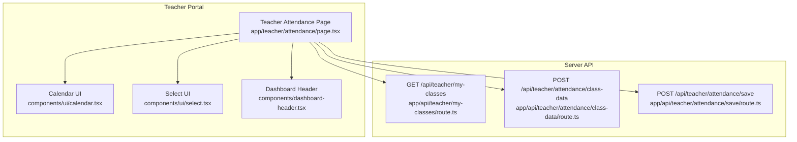
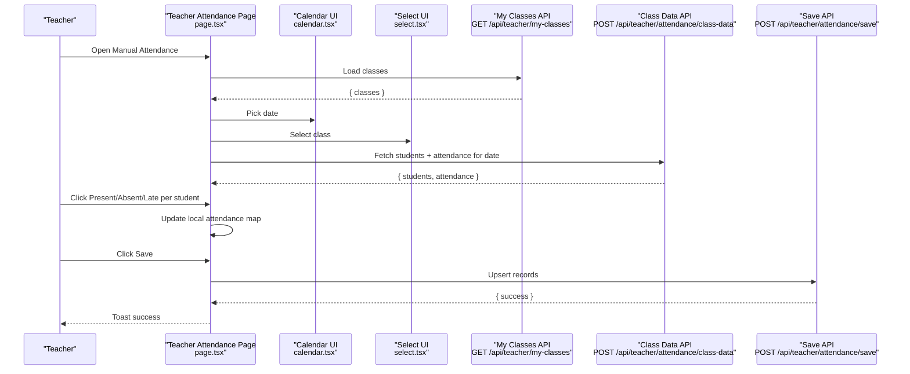
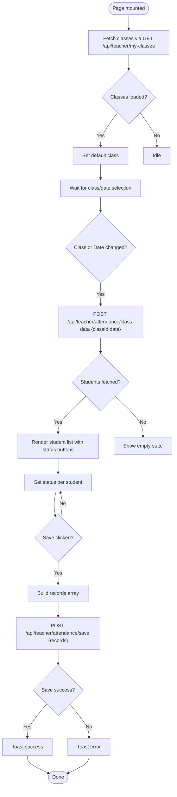
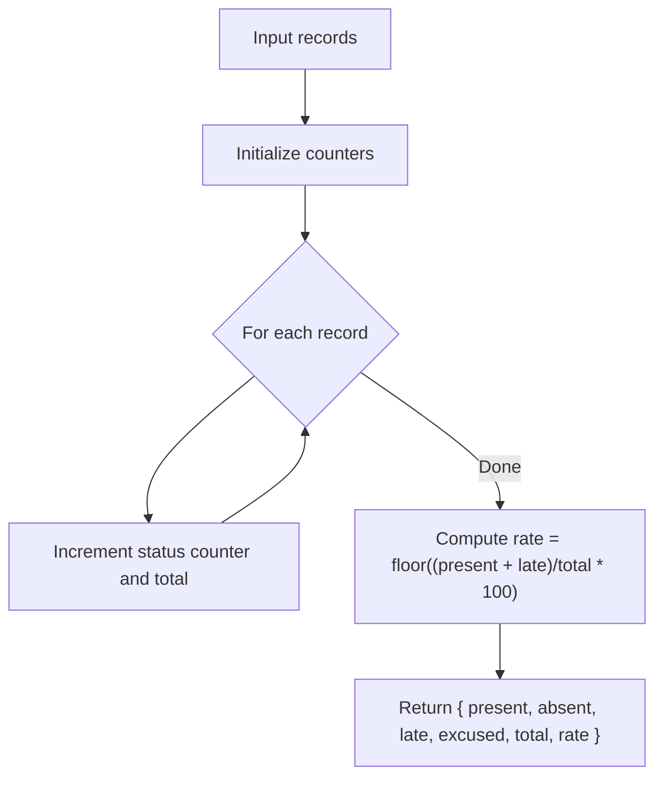

# Manual Attendance Entry

<cite>
**Referenced Files in This Document**
- [app/teacher/attendance/page.tsx](file://app/teacher/attendance/page.tsx)
- [lib/attendance-utils.ts](file://lib/attendance-utils.ts)
- [lib/types.ts](file://lib/types.ts)
- [app/api/teacher/attendance/class-data/route.ts](file://app/api/teacher/attendance/class-data/route.ts)
- [app/api/teacher/attendance/save/route.ts](file://app/api/teacher/attendance/save/route.ts)
- [app/api/teacher/my-classes/route.ts](file://app/api/teacher/my-classes/route.ts)
- [components/ui/calendar.tsx](file://components/ui/calendar.tsx)
- [components/ui/select.tsx](file://components/ui/select.tsx)
- [components/dashboard-header.tsx](file://components/dashboard-header.tsx)
- [supabase/migrations/20260110102108_add_partial_attendance_status.sql](file://supabase/migrations/20260110102108_add_partial_attendance_status.sql)
</cite>

## Table of Contents
1. [Introduction](#introduction)
2. [Project Structure](#project-structure)
3. [Core Components](#core-components)
4. [Architecture Overview](#architecture-overview)
5. [Detailed Component Analysis](#detailed-component-analysis)
6. [Dependency Analysis](#dependency-analysis)
7. [Performance Considerations](#performance-considerations)
8. [Troubleshooting Guide](#troubleshooting-guide)
9. [Conclusion](#conclusion)
10. [Appendices](#appendices)

## Introduction
This document explains the Manual Attendance Entry feature in the Teacher Portal. It focuses on the form-based interface implemented in the teacher attendance page, the workflow for selecting a class, choosing a date, viewing the student list, setting attendance statuses, and saving records. It also documents the backend APIs used for fetching class data and saving attendance, and provides guidance on performance and troubleshooting.

## Project Structure
The Manual Attendance Entry feature spans a Next.js page component and two API routes:
- Frontend page: app/teacher/attendance/page.tsx
- Backend APIs:
  - app/api/teacher/attendance/class-data/route.ts
  - app/api/teacher/attendance/save/route.ts
  - app/api/teacher/my-classes/route.ts (used by the frontend to populate the class selector)

UI primitives used by the page include:
- components/ui/calendar.tsx
- components/ui/select.tsx
- components/dashboard-header.tsx

Utility functions for statistics are provided by lib/attendance-utils.ts, and shared types are defined in lib/types.ts.

**Diagram sources**
- [app/teacher/attendance/page.tsx](file://app/teacher/attendance/page.tsx#L1-L253)
- [components/ui/calendar.tsx](file://components/ui/calendar.tsx#L1-L214)
- [components/ui/select.tsx](file://components/ui/select.tsx#L1-L186)
- [components/dashboard-header.tsx](file://components/dashboard-header.tsx#L1-L35)
- [app/api/teacher/my-classes/route.ts](file://app/api/teacher/my-classes/route.ts#L1-L35)
- [app/api/teacher/attendance/class-data/route.ts](file://app/api/teacher/attendance/class-data/route.ts#L1-L67)
- [app/api/teacher/attendance/save/route.ts](file://app/api/teacher/attendance/save/route.ts#L1-L58)

**Section sources**
- [app/teacher/attendance/page.tsx](file://app/teacher/attendance/page.tsx#L1-L253)
- [app/api/teacher/my-classes/route.ts](file://app/api/teacher/my-classes/route.ts#L1-L35)
- [app/api/teacher/attendance/class-data/route.ts](file://app/api/teacher/attendance/class-data/route.ts#L1-L67)
- [app/api/teacher/attendance/save/route.ts](file://app/api/teacher/attendance/save/route.ts#L1-L58)
- [components/ui/calendar.tsx](file://components/ui/calendar.tsx#L1-L214)
- [components/ui/select.tsx](file://components/ui/select.tsx#L1-L186)
- [components/dashboard-header.tsx](file://components/dashboard-header.tsx#L1-L35)

## Core Components
- Teacher Attendance Page (page.tsx):
  - Manages state for classes, students, selected class/date, and attendance map.
  - Fetches teacher’s classes and populates the class selector.
  - On class/date selection, requests student list and existing attendance for that date.
  - Provides buttons to set attendance status per student and a Save button to persist changes.
  - Uses toast notifications for feedback and a loader during initial load.

- Backend APIs:
  - GET /api/teacher/my-classes: Returns the teacher’s classes for the class selector.
  - POST /api/teacher/attendance/class-data: Validates teacher ownership, returns enrolled students, and existing attendance map for the selected date.
  - POST /api/teacher/attendance/save: Validates teacher ownership across the batch, performs upsert of attendance records, and returns success.

- Utilities and Types:
  - lib/attendance-utils.ts: Provides a function to compute attendance statistics from records.
  - lib/types.ts: Defines AttendanceStatus union type used across the feature.

**Section sources**
- [app/teacher/attendance/page.tsx](file://app/teacher/attendance/page.tsx#L1-L253)
- [app/api/teacher/my-classes/route.ts](file://app/api/teacher/my-classes/route.ts#L1-L35)
- [app/api/teacher/attendance/class-data/route.ts](file://app/api/teacher/attendance/class-data/route.ts#L1-L67)
- [app/api/teacher/attendance/save/route.ts](file://app/api/teacher/attendance/save/route.ts#L1-L58)
- [lib/attendance-utils.ts](file://lib/attendance-utils.ts#L1-L42)
- [lib/types.ts](file://lib/types.ts#L1-L28)

## Architecture Overview
The feature follows a client-server architecture:
- The client page triggers data fetches and saves via standard fetch calls to dedicated API routes.
- The server routes authenticate the user, enforce role checks, verify class ownership, and perform database operations.
- The UI updates reactively as state changes, with immediate visual feedback for selections and save actions.

**Diagram sources**
- [app/teacher/attendance/page.tsx](file://app/teacher/attendance/page.tsx#L1-L253)
- [components/ui/calendar.tsx](file://components/ui/calendar.tsx#L1-L214)
- [components/ui/select.tsx](file://components/ui/select.tsx#L1-L186)
- [app/api/teacher/my-classes/route.ts](file://app/api/teacher/my-classes/route.ts#L1-L35)
- [app/api/teacher/attendance/class-data/route.ts](file://app/api/teacher/attendance/class-data/route.ts#L1-L67)
- [app/api/teacher/attendance/save/route.ts](file://app/api/teacher/attendance/save/route.ts#L1-L58)

## Detailed Component Analysis

### Teacher Attendance Page (page.tsx)
Responsibilities:
- Initialize state for classes, students, loading, saving, selected class/date, and attendance map.
- Load teacher’s classes on mount and set the first class as default if available.
- On class/date change, request student list and existing attendance for that date.
- Allow toggling attendance status per student and persist via Save.
- Provide live statistics for totals and counts.

Key behaviors:
- Class loading: Uses GET /api/teacher/my-classes to populate the class selector.
- Data loading: Uses POST /api/teacher/attendance/class-data with { classId, date } to get students and existing attendance map.
- Saving: Uses POST /api/teacher/attendance/save with an array of records, each containing student_id, class_id, date, and status.
- UI: Uses calendar and select components for date and class selection, and renders a list of students with status buttons.

**Diagram sources**
- [app/teacher/attendance/page.tsx](file://app/teacher/attendance/page.tsx#L1-L253)
- [app/api/teacher/my-classes/route.ts](file://app/api/teacher/my-classes/route.ts#L1-L35)
- [app/api/teacher/attendance/class-data/route.ts](file://app/api/teacher/attendance/class-data/route.ts#L1-L67)
- [app/api/teacher/attendance/save/route.ts](file://app/api/teacher/attendance/save/route.ts#L1-L58)

**Section sources**
- [app/teacher/attendance/page.tsx](file://app/teacher/attendance/page.tsx#L1-L253)

### Backend API: GET /api/teacher/my-classes
- Purpose: Return the list of classes assigned to the logged-in teacher.
- Authentication: Requires a valid user session.
- Authorization: Ensures the user role is "teacher".
- Output: An array of classes with id, name, grade, and section.

**Section sources**
- [app/api/teacher/my-classes/route.ts](file://app/api/teacher/my-classes/route.ts#L1-L35)

### Backend API: POST /api/teacher/attendance/class-data
- Purpose: Fetch enrolled students and existing attendance for a given class and date.
- Authentication: Requires a valid user session.
- Authorization: Ensures the user role is "teacher" and verifies that the teacher owns the requested class.
- Input: { classId, date } in request body.
- Output: { students, attendance }, where attendance is a map from student_id to status.

Security and correctness:
- Verifies class ownership before proceeding.
- Returns only enrolled students for the class.
- Returns existing attendance records for the date as a map keyed by student_id.

**Section sources**
- [app/api/teacher/attendance/class-data/route.ts](file://app/api/teacher/attendance/class-data/route.ts#L1-L67)

### Backend API: POST /api/teacher/attendance/save
- Purpose: Persist attendance records for a batch of students.
- Authentication: Requires a valid user session.
- Authorization: Ensures the user role is "teacher" and verifies ownership across all classes in the batch.
- Input: { records } where each record contains student_id, class_id, date, and status.
- Behavior: Performs an upsert on the attendance_records table with conflict resolution on (student_id, class_id, date).
- Output: { success } on success.

Security note:
- Batch ownership verification ensures the teacher cannot submit records for classes they do not own.

**Section sources**
- [app/api/teacher/attendance/save/route.ts](file://app/api/teacher/attendance/save/route.ts#L1-L58)

### Attendance Status Model and Statistics
- AttendanceStatus type: present | absent | late | excused.
- Statistics calculation: Summarizes counts for each status and computes an attendance rate considering present and late as attended.

**Diagram sources**
- [lib/attendance-utils.ts](file://lib/attendance-utils.ts#L1-L42)
- [lib/types.ts](file://lib/types.ts#L1-L28)

**Section sources**
- [lib/attendance-utils.ts](file://lib/attendance-utils.ts#L1-L42)
- [lib/types.ts](file://lib/types.ts#L1-L28)

### UI Components Used
- Calendar (components/ui/calendar.tsx): Single-day picker used to select the attendance date.
- Select (components/ui/select.tsx): Dropdown for selecting the class.
- Dashboard Header (components/dashboard-header.tsx): Page header with title and subtitle.

**Section sources**
- [components/ui/calendar.tsx](file://components/ui/calendar.tsx#L1-L214)
- [components/ui/select.tsx](file://components/ui/select.tsx#L1-L186)
- [components/dashboard-header.tsx](file://components/dashboard-header.tsx#L1-L35)

## Dependency Analysis
- Client-side dependencies:
  - page.tsx depends on:
    - GET /api/teacher/my-classes for class list
    - POST /api/teacher/attendance/class-data for student list and existing attendance
    - POST /api/teacher/attendance/save for persistence
  - UI components depend on Radix UI primitives and shared utilities.

- Server-side dependencies:
  - class-data route depends on:
    - Supabase auth.getUser() for user identity
    - Supabase select on users, classes, class_students, and attendance_records
  - save route depends on:
    - Supabase auth.getUser() for user identity
    - Supabase upsert on attendance_records with conflict resolution

Potential circular dependencies:
- None observed among the focused files.

External dependencies:
- Supabase client for server-side database operations.
- date-fns for date formatting.
- lucide-react icons for UI.

**Section sources**
- [app/teacher/attendance/page.tsx](file://app/teacher/attendance/page.tsx#L1-L253)
- [app/api/teacher/my-classes/route.ts](file://app/api/teacher/my-classes/route.ts#L1-L35)
- [app/api/teacher/attendance/class-data/route.ts](file://app/api/teacher/attendance/class-data/route.ts#L1-L67)
- [app/api/teacher/attendance/save/route.ts](file://app/api/teacher/attendance/save/route.ts#L1-L58)

## Performance Considerations
- Client-side state management:
  - The page maintains attendance in a local map keyed by student_id. This minimizes re-renders when toggling statuses and avoids unnecessary network calls until Save is pressed.
  - The student list is cached locally until class/date changes, reducing redundant fetches.

- Real-time UI updates:
  - Immediate visual feedback is provided by updating the local attendance map and rendering status badges per student. There is no explicit real-time synchronization with the server after Save; subsequent loads will reflect persisted data.

- Network efficiency:
  - Fetches are triggered only when class or date changes, and Save sends a compact records array.
  - The save endpoint performs a single upsert operation with conflict resolution, minimizing round-trips.

- Database constraints:
  - The migration adds a check constraint to attendance_records to include a "partial" status, expanding the model if needed. This helps maintain data integrity.

[No sources needed since this section provides general guidance]

## Troubleshooting Guide
Common issues and resolutions:
- Unauthorized access:
  - Symptom: Requests return 401 Unauthorized.
  - Cause: Missing or invalid user session.
  - Resolution: Ensure the user is logged in and the session is valid.

- Forbidden access:
  - Symptom: Requests return 403 Forbidden.
  - Causes:
    - User role is not "teacher".
    - Attempting to access or modify a class not owned by the teacher.
  - Resolution: Confirm the teacher role and that the class belongs to the logged-in teacher.

- Missing parameters:
  - Symptom: Requests return 400 Bad Request.
  - Cause: Missing classId or date in the request body for class-data.
  - Resolution: Ensure both classId and date are provided.

- Save failures:
  - Symptom: Save returns an error or toast indicates failure.
  - Causes:
    - Invalid or empty records payload.
    - Batch ownership mismatch (trying to save for classes not owned).
    - Database errors during upsert.
  - Resolution:
    - Verify records array is present and non-empty.
    - Confirm all class_ids belong to the teacher.
    - Retry after addressing server-side errors.

- No students found:
  - Symptom: Empty student list for a class.
  - Resolution: Confirm enrollment records exist for the class.

- Partial attendance status:
  - Background: A "partial" status is supported by the database schema. If needed, adjust expectations in reporting or UI.

**Section sources**
- [app/api/teacher/attendance/class-data/route.ts](file://app/api/teacher/attendance/class-data/route.ts#L1-L67)
- [app/api/teacher/attendance/save/route.ts](file://app/api/teacher/attendance/save/route.ts#L1-L58)
- [supabase/migrations/20260110102108_add_partial_attendance_status.sql](file://supabase/migrations/20260110102108_add_partial_attendance_status.sql#L1-L3)

## Conclusion
The Manual Attendance Entry feature provides a streamlined workflow for teachers to record daily attendance. The frontend page integrates cleanly with dedicated server routes that enforce authentication, authorization, and ownership checks. The design emphasizes simplicity and reliability, with clear feedback and robust error handling. Extending support for additional statuses or real-time updates can be considered in future iterations while maintaining the current security posture.

## Appendices

### Usage Examples
- Taking daily attendance:
  - Open the Manual Attendance page.
  - Select a class from the dropdown.
  - Choose the date using the calendar.
  - Toggle Present/Absent/Late for each student as needed.
  - Click Save to persist the records.

- Correcting previous entries:
  - Select the class and the date of the incorrect records.
  - Adjust statuses to the correct values.
  - Click Save; the upsert will overwrite the existing records for that date.

[No sources needed since this section provides general guidance]