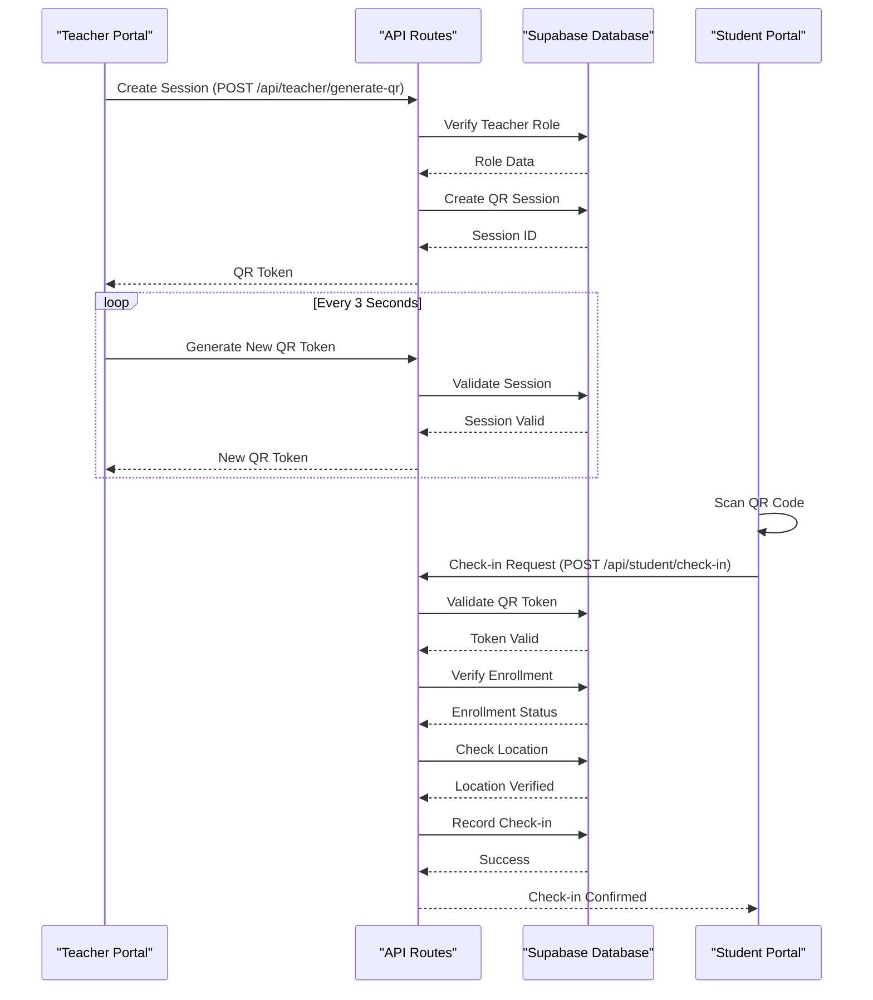
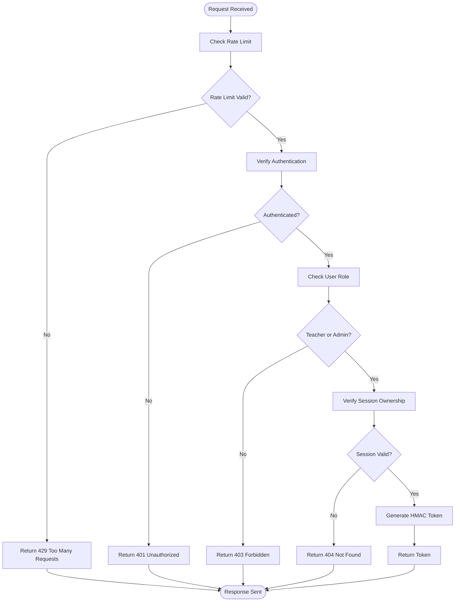
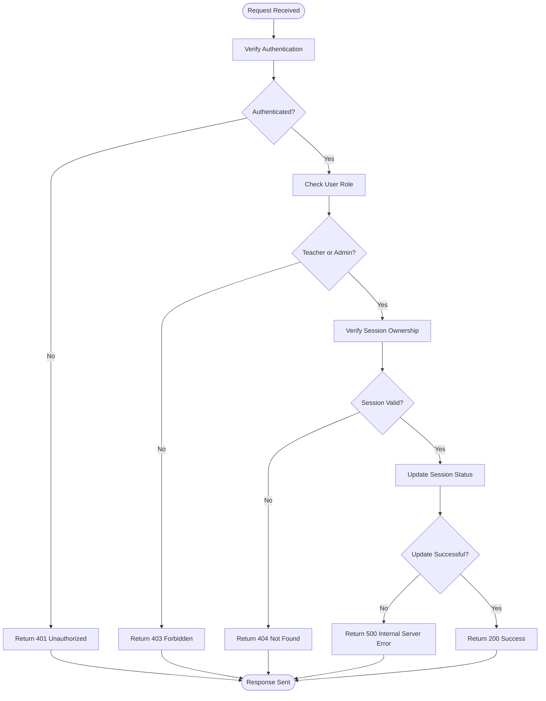
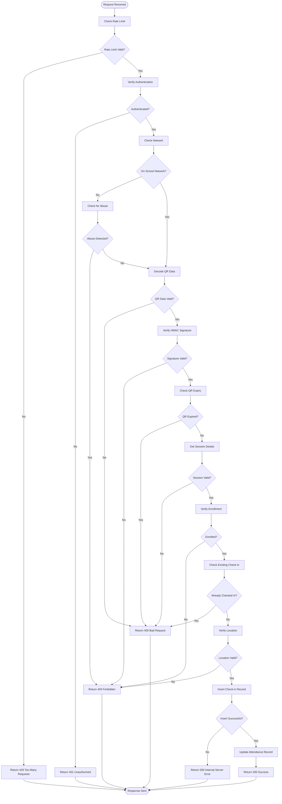
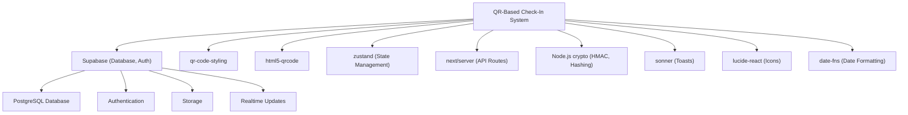

# QR-Based Check-In

<cite>
**Referenced Files in This Document**   
- [qr-attendance/page.tsx](file://app/teacher/qr-attendance/page.tsx)
- [qr-code-generator.tsx](file://components/qr-code-generator.tsx)
- [qr-scanner.tsx](file://components/qr-scanner.tsx)
- [generate-qr/route.ts](file://app/api/teacher/generate-qr/route.ts)
- [end-session/route.ts](file://app/api/teacher/end-session/route.ts)
- [check-in/route.ts](file://app/api/student/check-in/route.ts)
- [qr-attendance-store.ts](file://lib/qr-attendance-store.ts)
- [school-location-store.ts](file://lib/school-location-store.ts)
- [rate-limit.ts](file://lib/rate-limit.ts)
- [security.ts](file://lib/security.ts)
- [create_attendance_tables.sql](file://supabase/migrations/20251219043454_create_attendance_tables.sql)
- [student/qr-checkin/page.tsx](file://app/student/qr-checkin/page.tsx)
</cite>

## Table of Contents
1. [Introduction](#introduction)
2. [Project Structure](#project-structure)
3. [Core Components](#core-components)
4. [Architecture Overview](#architecture-overview)
5. [Detailed Component Analysis](#detailed-component-analysis)
6. [Dependency Analysis](#dependency-analysis)
7. [Performance Considerations](#performance-considerations)
8. [Troubleshooting Guide](#troubleshooting-guide)
9. [Conclusion](#conclusion)

## Introduction
The QR-Based Check-In system in the Teacher Portal enables secure, dynamic QR code generation for student attendance tracking. This system allows teachers to create attendance sessions with configurable parameters such as class, date, time, and location requirements. The QR code rotates every 3 seconds to prevent unauthorized sharing and ensure security. Integration with backend APIs facilitates time-limited token generation and session management. The system supports real-time updates, retry logic for failed operations, and accessibility features like screen reader support. This document details the implementation, usage scenarios, common issues, and performance considerations of the QR-based attendance system.

## Project Structure
The QR-Based Check-In system is organized within the Next.js application structure, with components, API routes, and utilities distributed across specific directories. The main entry point for teachers is located at `app/teacher/qr-attendance/page.tsx`, while students access the check-in functionality via `app/student/qr-checkin/page.tsx`. The system leverages API routes under `app/api/teacher/` and `app/api/student/` for session management and check-in processing. Reusable UI components are stored in the `components/` directory, and business logic is encapsulated in the `lib/` directory.

```mermaid
graph TB
subgraph "Teacher Portal"
TQRP[qr-attendance/page.tsx]
TQRG[qr-code-generator.tsx]
end
subgraph "Student Portal"
SQCP[qr-checkin/page.tsx]
QRS[qr-scanner.tsx]
end
subgraph "API Routes"
GQR[/api/teacher/generate-qr]
ES[/api/teacher/end-session]
CI[/api/student/check-in]
end
subgraph "Utilities"
QRS[qr-attendance-store.ts]
SLS[school-location-store.ts]
RL[rate-limit.ts]
SEC[security.ts]
end
TQRP --> GQR
TQRP --> ES
TQRP --> TQRG
SQCP --> QRS
SQCP --> CI
GQR --> RL
GQR --> SEC
CI --> RL
CI --> SEC
CI --> SLS
```

**Diagram sources**
- [qr-attendance/page.tsx](file://app/teacher/qr-attendance/page.tsx)
- [qr-checkin/page.tsx](file://app/student/qr-checkin/page.tsx)
- [generate-qr/route.ts](file://app/api/teacher/generate-qr/route.ts)
- [end-session/route.ts](file://app/api/teacher/end-session/route.ts)
- [check-in/route.ts](file://app/api/student/check-in/route.ts)
- [qr-attendance-store.ts](file://lib/qr-attendance-store.ts)
- [school-location-store.ts](file://lib/school-location-store.ts)
- [rate-limit.ts](file://lib/rate-limit.ts)
- [security.ts](file://lib/security.ts)

**Section sources**
- [qr-attendance/page.tsx](file://app/teacher/qr-attendance/page.tsx)
- [qr-checkin/page.tsx](file://app/student/qr-checkin/page.tsx)

## Core Components
The QR-Based Check-In system consists of several core components that work together to provide a secure and efficient attendance solution. The teacher interface allows for session creation with configurable parameters, while the student interface enables QR code scanning for check-in. The system uses dynamic QR code generation with rotation every 3 seconds for enhanced security. Backend API routes handle session management, token generation, and check-in validation. Utility components provide rate limiting, security checks, and location verification.

**Section sources**
- [qr-attendance/page.tsx](file://app/teacher/qr-attendance/page.tsx)
- [qr-checkin/page.tsx](file://app/student/qr-checkin/page.tsx)
- [generate-qr/route.ts](file://app/api/teacher/generate-qr/route.ts)
- [check-in/route.ts](file://app/api/student/check-in/route.ts)

## Architecture Overview
The QR-Based Check-In system follows a client-server architecture with React components on the frontend and API routes on the backend. The system uses Supabase for database operations and authentication. The architecture emphasizes security through rate limiting, IP address hashing, and origin validation. The QR code generation process uses HMAC signatures to ensure token integrity, while check-in validation includes location verification and enrollment checks.



**Diagram sources**
- [generate-qr/route.ts](file://app/api/teacher/generate-qr/route.ts)
- [check-in/route.ts](file://app/api/student/check-in/route.ts)
- [qr-attendance/page.tsx](file://app/teacher/qr-attendance/page.tsx)
- [qr-checkin/page.tsx](file://app/student/qr-checkin/page.tsx)

## Detailed Component Analysis

### Teacher QR Attendance Page
The teacher QR attendance page provides an interface for creating and managing attendance sessions. Teachers can configure session parameters including class, date, time, and location requirements. The page displays the current QR code, which rotates every 3 seconds for security. Real-time updates show the number of students who have checked in, and teachers can end active sessions at any time.

#### Component Implementation
```mermaid
classDiagram
class TeacherQRAttendancePage {
+sessions : QRSession[]
+open : boolean
+selectedSessionId : string | null
+loading : boolean
+currentTeacher : { id : string; name : string } | null
+teacherClasses : TeacherClass[]
+currentQRData : string
+qrError : string | null
+retryCount : number
+formData : { classId : string; date : string; startTime : string; endTime : string; requireLocation : boolean }
+rotationIntervalRef : NodeJS.Timeout | null
+maxRetries : number
+fetchData() : Promise~void~
+handleCreateSession(e : React.FormEvent) : Promise~void~
+handleEndSession(sessionId : string) : Promise~void~
+updateQRCode() : Promise~void~
}
class QRCodeGenerator {
+data : string
+size? : number
+ref : React.RefObject~HTMLDivElement~
+qrCodeRef : React.RefObject~QRCodeStyling | null~
}
TeacherQRAttendancePage --> QRCodeGenerator : "uses"
```

**Diagram sources**
- [qr-attendance/page.tsx](file://app/teacher/qr-attendance/page.tsx)
- [qr-code-generator.tsx](file://components/qr-code-generator.tsx)

**Section sources**
- [qr-attendance/page.tsx](file://app/teacher/qr-attendance/page.tsx)

### Student QR Check-in Page
The student QR check-in page allows students to scan QR codes to mark their attendance. The page includes a QR scanner component and displays the student's location status. Students must enable location services to check in when required by the teacher. The page shows recent check-in history and provides feedback on check-in attempts.

#### Component Implementation
```mermaid
classDiagram
class StudentQRCheckinPage {
+showScanner : boolean
+result : { success : boolean; message : string } | null
+userLocation : LocationState
+isInRange : boolean | null
+distance : number | null
+loading : boolean
+submitting : boolean
+currentStudent : { id : string; name : string } | null
+checkins : CheckinRecord[]
+fetchUser() : Promise~void~
+getUserLocation() : void
+handleScan(qrData : string) : Promise~void~
+formatDistance(meters : number) : string
}
class QRScanner {
+onScan : (data : string) => void
+onClose : () => void
+scannerRef : React.RefObject~HTMLDivElement~
+html5QrCodeRef : React.RefObject~any~
+isRunningRef : React.MutableRefObject~boolean~
+error : string | null
+scanning : boolean
+stopScanner() : Promise~void~
+handleScan(decodedText : string) : Promise~void~
+initScanner() : Promise~void~
+handleClose() : Promise~void~
+handleManualInput() : Promise~void~
}
StudentQRCheckinPage --> QRScanner : "uses"
```

**Diagram sources**
- [qr-checkin/page.tsx](file://app/student/qr-checkin/page.tsx)
- [qr-scanner.tsx](file://components/qr-scanner.tsx)

**Section sources**
- [qr-checkin/page.tsx](file://app/student/qr-checkin/page.tsx)

### API Route Analysis

#### Generate QR Route
The generate-qr API route creates time-limited tokens for attendance sessions. The route implements rate limiting to prevent abuse and uses HMAC signatures to ensure token integrity. Only teachers and administrators can generate QR codes, and the route verifies that the session belongs to the requesting teacher.



**Diagram sources**
- [generate-qr/route.ts](file://app/api/teacher/generate-qr/route.ts)

**Section sources**
- [generate-qr/route.ts](file://app/api/teacher/generate-qr/route.ts)

#### End Session Route
The end-session API route terminates active attendance sessions. The route verifies the user's authentication and role, and checks ownership of the session for teachers. Only administrators can end sessions owned by other teachers.



**Diagram sources**
- [end-session/route.ts](file://app/api/teacher/end-session/route.ts)

**Section sources**
- [end-session/route.ts](file://app/api/teacher/end-session/route.ts)

#### Student Check-in Route
The student check-in API route validates QR codes and records attendance. The route implements multiple security checks including rate limiting, network fencing, location verification, and enrollment validation. The route uses hashed IP addresses for privacy-preserving abuse detection.



**Diagram sources**
- [check-in/route.ts](file://app/api/student/check-in/route.ts)

**Section sources**
- [check-in/route.ts](file://app/api/student/check-in/route.ts)

## Dependency Analysis
The QR-Based Check-In system has several dependencies that ensure its functionality and security. The system relies on Supabase for database operations, authentication, and real-time updates. The QR code generation and scanning functionality depends on third-party libraries (qr-code-styling and html5-qrcode). Security features are implemented using Node.js crypto module for HMAC signatures and IP address hashing. The system uses zustand for state management and next/server for API route handling.



**Diagram sources**
- [package.json](file://package.json)

**Section sources**
- [package.json](file://package.json)

## Performance Considerations
The QR-Based Check-In system incorporates several performance optimizations to ensure a smooth user experience. The QR code generator component is lazily loaded to reduce initial bundle size. The system implements retry logic with exponential backoff for failed QR generation attempts. Rate limiting prevents abuse while allowing sufficient requests for legitimate use. The database schema is optimized with appropriate indexes for frequently queried fields. The system uses efficient algorithms for location distance calculation and avoids unnecessary re-renders through proper state management.

**Section sources**
- [qr-attendance/page.tsx](file://app/teacher/qr-attendance/page.tsx)
- [qr-checkin/page.tsx](file://app/student/qr-checkin/page.tsx)
- [generate-qr/route.ts](file://app/api/teacher/generate-qr/route.ts)
- [check-in/route.ts](file://app/api/student/check-in/route.ts)

## Troubleshooting Guide
This section addresses common issues that may occur with the QR-Based Check-In system and provides troubleshooting guidance.

### QR Generation Failures
If QR code generation fails, the system displays an error message and provides a retry button. Common causes include network connectivity issues, authentication problems, or server errors. The system implements retry logic with exponential backoff, attempting up to three times before showing a permanent error.

**Section sources**
- [qr-attendance/page.tsx](file://app/teacher/qr-attendance/page.tsx)

### Location Validation Errors
When location validation fails, students receive specific error messages explaining the issue. Common causes include:
- Location services disabled
- Device outside school geofence
- GPS spoofing detected
- Network not connected to school Wi-Fi (if required)

Students should ensure location services are enabled and they are within the school area. If using a virtual private network (VPN), it should be disabled.

**Section sources**
- [qr-checkin/page.tsx](file://app/student/qr-checkin/page.tsx)
- [check-in/route.ts](file://app/api/student/check-in/route.ts)

### Authentication Issues
Authentication issues can prevent both teachers and students from using the QR check-in system. Users should ensure they are logged in and their session is active. If authentication fails, users should log out and log back in to refresh their session.

**Section sources**
- [qr-attendance/page.tsx](file://app/teacher/qr-attendance/page.tsx)
- [qr-checkin/page.tsx](file://app/student/qr-checkin/page.tsx)

### Camera Access Problems
The QR scanner requires camera access, which may be blocked by browser settings. If the camera cannot be accessed, students receive an error message and can enter the code manually. Users should ensure camera permissions are granted for the application.

**Section sources**
- [qr-scanner.tsx](file://components/qr-scanner.tsx)

## Conclusion
The QR-Based Check-In system provides a secure and efficient solution for student attendance tracking in the Teacher Portal. By leveraging dynamic QR code generation with rotation every 3 seconds, the system prevents unauthorized sharing and ensures attendance integrity. The integration with backend APIs enables time-limited token generation and session management, while comprehensive security measures protect against abuse. The system supports real-time updates, retry logic for failed operations, and accessibility features like screen reader support. With proper configuration and usage, the QR-Based Check-In system enhances attendance tracking efficiency and accuracy.