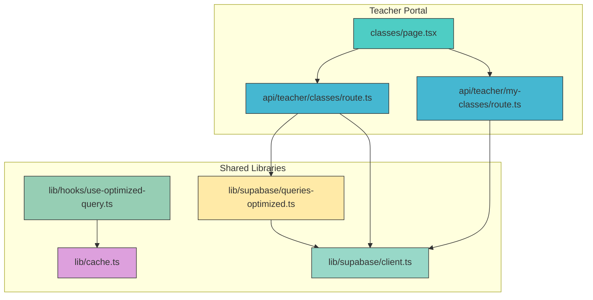
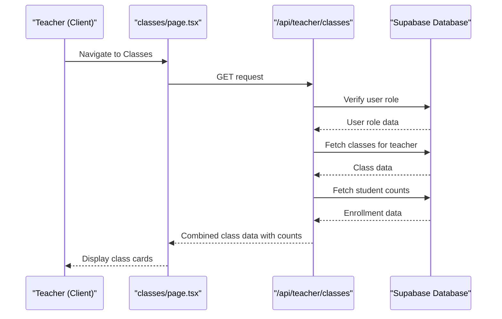
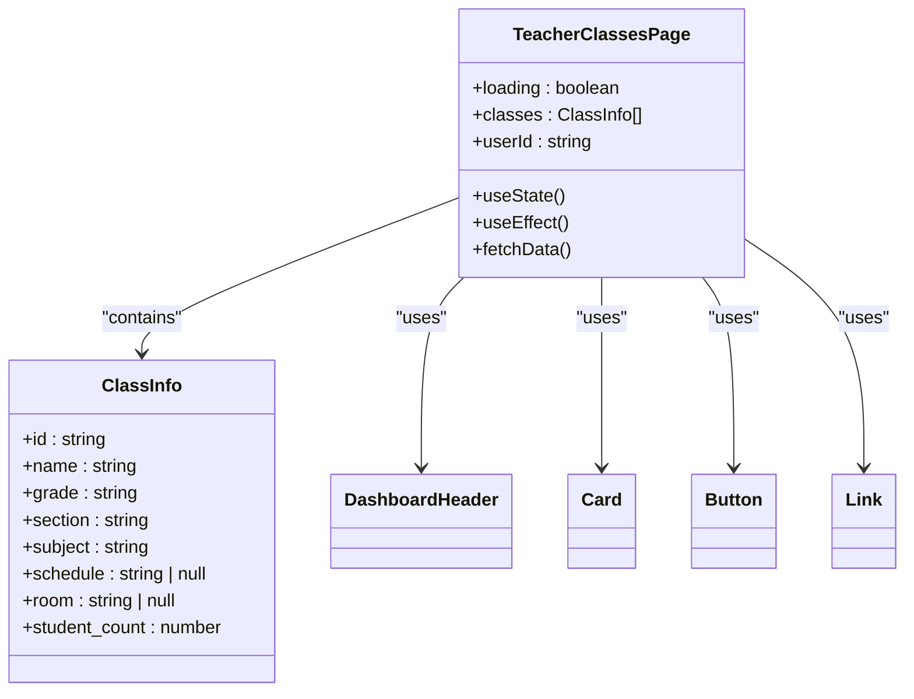
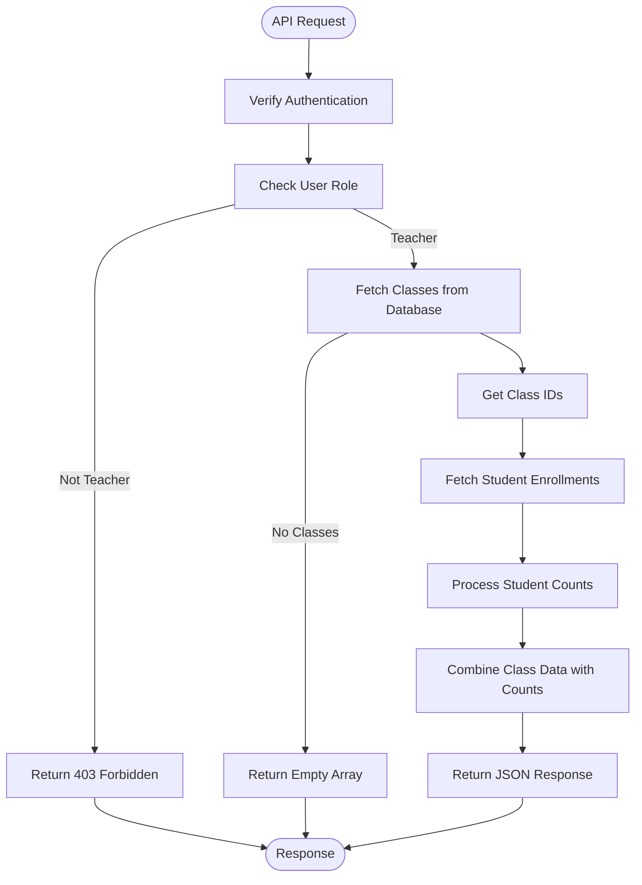

# Class Management

<cite>
**Referenced Files in This Document**   
- [classes/page.tsx](file://app/teacher/classes/page.tsx)
- [classes/route.ts](file://app/api/teacher/classes/route.ts)
- [my-classes/route.ts](file://app/api/teacher/my-classes/route.ts)
- [use-optimized-query.ts](file://lib/hooks/use-optimized-query.ts)
- [queries-optimized.ts](file://lib/supabase/queries-optimized.ts)
- [client.ts](file://lib/supabase/client.ts)
- [cache.ts](file://lib/cache.ts)
- [20251219043440_create_classes_table.sql](file://supabase/migrations/20251219043440_create_classes_table.sql)
- [20250226_secure_realtime_rls.sql](file://supabase/migrations/20250226_secure_realtime_rls.sql)
</cite>

## Table of Contents
1. [Introduction](#introduction)
2. [Project Structure](#project-structure)
3. [Core Components](#core-components)
4. [Architecture Overview](#architecture-overview)
5. [Detailed Component Analysis](#detailed-component-analysis)
6. [Dependency Analysis](#dependency-analysis)
7. [Performance Considerations](#performance-considerations)
8. [Troubleshooting Guide](#troubleshooting-guide)
9. [Conclusion](#conclusion)

## Introduction
The Class Management feature in the Teacher Portal enables educators to view their assigned classes, access detailed class information, and manage student rosters efficiently. This documentation details the implementation of the feature, focusing on the `classes/page.tsx` component and its integration with the `/api/teacher/classes` and `/api/teacher/my-classes` API endpoints. The system leverages optimized data fetching via the `use-optimized-query` hook for enhanced performance and implements real-time synchronization using Supabase subscriptions. Teachers can navigate between classes, view class summaries including student counts, schedules, and room assignments, and access student lists for roster management. The feature also includes robust error handling and troubleshooting mechanisms for common issues such as missing classes or API response errors.

## Project Structure
The Class Management feature is organized within the Next.js app directory structure, following a modular and scalable architecture. The core components are located in the `app/teacher/classes` directory, with API routes defined in `app/api/teacher`. The feature integrates with shared utilities in the `lib` directory for data fetching, caching, and Supabase interactions. The component structure follows a clear separation of concerns, with UI components in the `components/ui` directory and business logic encapsulated in hooks and API routes.



**Diagram sources**
- [classes/page.tsx](file://app/teacher/classes/page.tsx)
- [classes/route.ts](file://app/api/teacher/classes/route.ts)
- [my-classes/route.ts](file://app/api/teacher/my-classes/route.ts)
- [use-optimized-query.ts](file://lib/hooks/use-optimized-query.ts)
- [queries-optimized.ts](file://lib/supabase/queries-optimized.ts)
- [cache.ts](file://lib/cache.ts)
- [client.ts](file://lib/supabase/client.ts)

**Section sources**
- [classes/page.tsx](file://app/teacher/classes/page.tsx)
- [classes/route.ts](file://app/api/teacher/classes/route.ts)
- [my-classes/route.ts](file://app/api/teacher/my-classes/route.ts)

## Core Components
The Class Management feature consists of several core components that work together to provide a seamless experience for teachers. The primary component is `classes/page.tsx`, which serves as the main interface for viewing and managing classes. This component fetches class data from the `/api/teacher/classes` endpoint and displays it in a card-based layout. Each card shows essential class information such as name, grade, section, subject, student count, schedule, and room assignment. The component also handles loading states and empty states when no classes are assigned.

The backend API routes `/api/teacher/classes` and `/api/teacher/my-classes` provide the necessary data to the frontend. The `/api/teacher/classes` endpoint returns comprehensive class information including student counts, while `/api/teacher/my-classes` provides a simplified list of classes for navigation purposes. Both endpoints implement role-based access control to ensure that only authenticated teachers can access the data.

**Section sources**
- [classes/page.tsx](file://app/teacher/classes/page.tsx)
- [classes/route.ts](file://app/api/teacher/classes/route.ts)
- [my-classes/route.ts](file://app/api/teacher/my-classes/route.ts)

## Architecture Overview
The Class Management feature follows a client-server architecture with a React frontend and a Next.js API backend. The frontend component uses the `use-optimized-query` hook to fetch data from the API endpoints, which in turn query the Supabase database. The architecture incorporates caching at multiple levels to optimize performance and reduce database load.



**Diagram sources**
- [classes/page.tsx](file://app/teacher/classes/page.tsx)
- [classes/route.ts](file://app/api/teacher/classes/route.ts)

## Detailed Component Analysis

### Component A Analysis
The `classes/page.tsx` component is the primary interface for the Class Management feature. It uses React's useState and useEffect hooks to manage component state and side effects. The component fetches class data on mount and displays it in a responsive grid layout. Each class is represented as a card containing key information and action buttons for navigating to attendance and grades.



**Diagram sources**
- [classes/page.tsx](file://app/teacher/classes/page.tsx)

**Section sources**
- [classes/page.tsx](file://app/teacher/classes/page.tsx)

### API Endpoint Analysis
The `/api/teacher/classes` endpoint implements a two-step process to retrieve class data and student counts efficiently. First, it fetches all classes assigned to the teacher, then it queries the `class_students` table to count enrollments for each class. This approach avoids expensive JOIN operations while still providing accurate student counts.



**Diagram sources**
- [classes/route.ts](file://app/api/teacher/classes/route.ts)

**Section sources**
- [classes/route.ts](file://app/api/teacher/classes/route.ts)

## Dependency Analysis
The Class Management feature depends on several core libraries and services within the application. The component relies on Supabase for authentication and database operations, using the `createClient` function to establish a connection. Data fetching is enhanced by the `use-optimized-query` hook, which provides caching, deduplication, and retry logic. The feature also depends on the caching utilities in `lib/cache.ts` to minimize redundant API calls and improve performance.

```mermaid
graph LR
A[classes/page.tsx] --> B[/api/teacher/classes]
A --> C[use-optimized-query]
B --> D[Supabase]
C --> E[cache]
D --> F[Database Tables]
F --> Classes[classes]
F --> ClassStudents[class_students]
F --> Users[users]
style A fill:#4ECDC4,stroke:#333
style B fill:#45B7D1,stroke:#333
style C fill:#96CEB4,stroke:#333
style D fill:#98D8C8,stroke:#333
style E fill:#DDA0DD,stroke:#333
style F fill:#FFEAA7,stroke:#333
```

**Diagram sources**
- [classes/page.tsx](file://app/teacher/classes/page.tsx)
- [classes/route.ts](file://app/api/teacher/classes/route.ts)
- [use-optimized-query.ts](file://lib/hooks/use-optimized-query.ts)
- [cache.ts](file://lib/cache.ts)

**Section sources**
- [classes/page.tsx](file://app/teacher/classes/page.tsx)
- [classes/route.ts](file://app/api/teacher/classes/route.ts)
- [use-optimized-query.ts](file://lib/hooks/use-optimized-query.ts)
- [cache.ts](file://lib/cache.ts)

## Performance Considerations
The Class Management feature incorporates several performance optimizations to ensure a responsive user experience. The `use-optimized-query` hook implements client-side caching with a 30-second TTL, preventing duplicate API calls when the component re-renders. The hook also includes retry logic with exponential backoff for handling transient network errors.

Server-side, the API endpoints leverage Supabase's efficient querying capabilities and implement proper indexing on frequently queried columns. The separation of class data retrieval from student count calculation reduces query complexity and improves performance. Additionally, the system uses Next.js' `unstable_cache` for server-side caching of frequently accessed data, with appropriate revalidation intervals.

The database schema is optimized for the Class Management feature with proper foreign key relationships and indexes. The `classes` table has a foreign key to the `users` table for the teacher, and the `class_students` table has composite primary keys and foreign keys to both `classes` and `users` tables, ensuring data integrity and efficient joins.

**Section sources**
- [use-optimized-query.ts](file://lib/hooks/use-optimized-query.ts)
- [cache.ts](file://lib/cache.ts)
- [queries-optimized.ts](file://lib/supabase/queries-optimized.ts)

## Troubleshooting Guide
Common issues with the Class Management feature include missing classes, loading errors, and authentication problems. When a teacher cannot see their assigned classes, the first step is to verify their user role in the database. The system only displays classes for users with the "teacher" role, so incorrect role assignment will prevent class visibility.

Loading errors may occur due to network issues or API failures. The `use-optimized-query` hook includes built-in retry logic that automatically attempts to recover from transient network errors. If the issue persists, check the API endpoint response format to ensure it matches the expected structure with a `classes` array in the response.

Authentication issues can prevent access to the Class Management feature entirely. Ensure that the user is properly authenticated and that their session is valid. The API endpoints verify authentication through Supabase's auth system and return appropriate error codes (401 for unauthorized, 403 for forbidden) when access is denied.

For real-time synchronization issues, verify that the Supabase realtime publication is properly configured. The `supabase_realtime` publication must include the relevant tables and have RLS (Row Level Security) enabled to ensure that data changes are properly broadcast to authorized clients.

**Section sources**
- [classes/page.tsx](file://app/teacher/classes/page.tsx)
- [classes/route.ts](file://app/api/teacher/classes/route.ts)
- [use-optimized-query.ts](file://lib/hooks/use-optimized-query.ts)
- [20250226_secure_realtime_rls.sql](file://supabase/migrations/20250226_secure_realtime_rls.sql)

## Conclusion
The Class Management feature provides teachers with a comprehensive interface for viewing and managing their assigned classes. The implementation leverages modern React patterns, optimized data fetching, and real-time synchronization to deliver a responsive and reliable user experience. By following security best practices and performance optimizations, the feature ensures that teachers can efficiently access class information and student rosters. The modular architecture allows for easy maintenance and future enhancements, making it a robust component of the Teacher Portal.