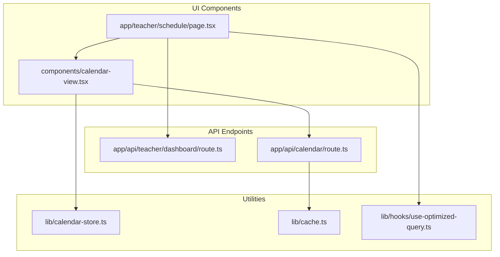
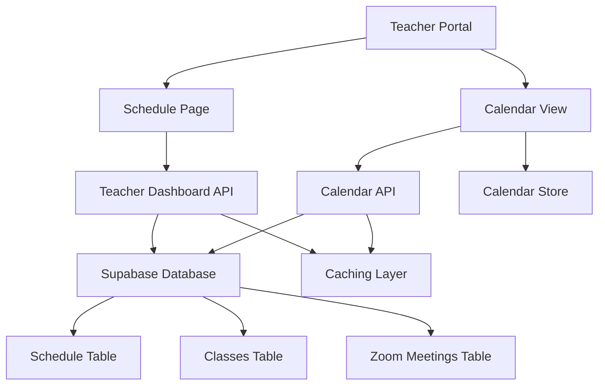
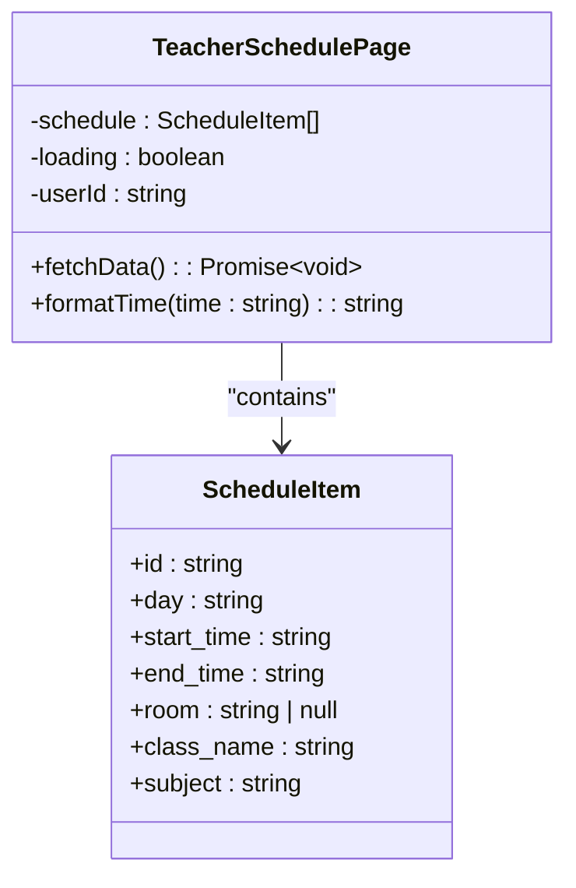
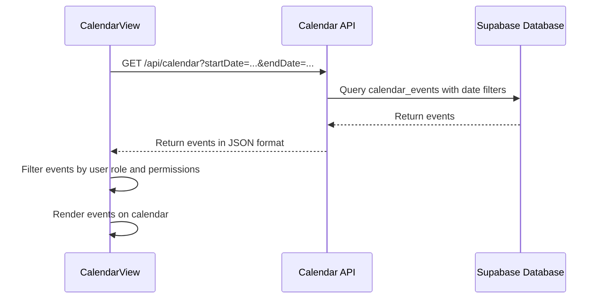
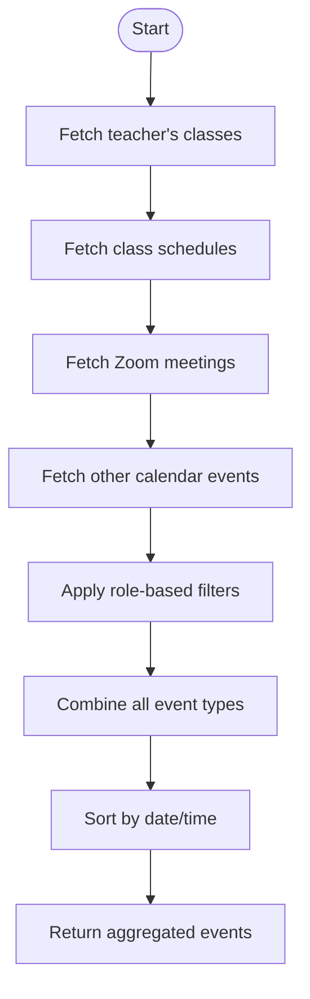
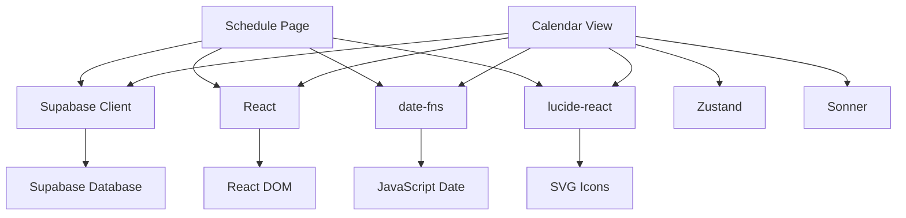

# Class Schedule Overview

<cite>
**Referenced Files in This Document**   
- [schedule/page.tsx](file://app/teacher/schedule/page.tsx)
- [calendar-view.tsx](file://components/calendar-view.tsx)
- [route.ts](file://app/api/teacher/dashboard/route.ts)
- [route.ts](file://app/api/calendar/route.ts)
- [calendar-store.ts](file://lib/calendar-store.ts)
- [cache.ts](file://lib/cache.ts)
- [use-optimized-query.ts](file://lib/hooks/use-optimized-query.ts)
</cite>

## Table of Contents
1. [Introduction](#introduction)
2. [Project Structure](#project-structure)
3. [Core Components](#core-components)
4. [Architecture Overview](#architecture-overview)
5. [Detailed Component Analysis](#detailed-component-analysis)
6. [Dependency Analysis](#dependency-analysis)
7. [Performance Considerations](#performance-considerations)
8. [Troubleshooting Guide](#troubleshooting-guide)
9. [Conclusion](#conclusion)

## Introduction
The Class Schedule Overview in the Teacher Portal provides educators with a comprehensive view of their teaching assignments through an intuitive calendar interface. This documentation details how teachers can access their daily and weekly schedules, view class details including room assignments, and manage their calendar events. The system integrates multiple data sources including class schedules and Zoom meetings, with features for data export and performance optimization through caching.

## Project Structure
The class schedule functionality is organized across several key directories in the application:
- `app/teacher/schedule/page.tsx`: Main schedule page for teachers
- `components/calendar-view.tsx`: Reusable calendar component with interactive features
- `app/api/teacher/dashboard/route.ts`: API endpoint for teacher dashboard data including today's schedule
- `app/api/calendar/route.ts`: Central API for calendar events across all user roles
- `lib/calendar-store.ts`: State management for calendar events
- `lib/cache.ts`: Caching utilities for performance optimization

The structure follows a feature-based organization with clear separation between UI components, API routes, and utility functions.

**Diagram sources**
- [page.tsx](file://app/teacher/schedule/page.tsx)
- [calendar-view.tsx](file://components/calendar-view.tsx)
- [route.ts](file://app/api/teacher/dashboard/route.ts)
- [route.ts](file://app/api/calendar/route.ts)

**Section sources**
- [page.tsx](file://app/teacher/schedule/page.tsx)
- [calendar-view.tsx](file://components/calendar-view.tsx)

## Core Components
The Class Schedule Overview consists of two primary components: the schedule page that displays the teacher's weekly schedule in a grid format, and the calendar view component that provides a monthly calendar interface with event details. The schedule page retrieves data from the teacher dashboard API, while the calendar view fetches events from the central calendar API, aggregating data from multiple sources including classes and Zoom meetings.

The implementation uses React Server Components for initial data loading and client-side components for interactive features. Data is formatted and displayed with appropriate styling for readability, including time formatting from 24-hour to 12-hour format.

**Section sources**
- [page.tsx](file://app/teacher/schedule/page.tsx#L1-L156)
- [calendar-view.tsx](file://components/calendar-view.tsx#L1-L497)

## Architecture Overview
The class schedule system follows a layered architecture with clear separation of concerns. The presentation layer consists of React components that render the schedule data. The business logic layer handles data transformation and formatting. The data access layer manages API calls and database interactions through Supabase. The system uses a centralized calendar store for state management and implements caching to optimize performance.

Data flows from the database through API endpoints to the client components, with appropriate filtering based on user roles and permissions. The calendar view component serves as a reusable component that can be integrated into various parts of the application.

**Diagram sources**
- [page.tsx](file://app/teacher/schedule/page.tsx)
- [calendar-view.tsx](file://components/calendar-view.tsx)
- [route.ts](file://app/api/teacher/dashboard/route.ts)
- [route.ts](file://app/api/calendar/route.ts)

## Detailed Component Analysis

### Schedule Page Analysis
The schedule page component displays the teacher's weekly schedule in a day-by-day grid format. It fetches schedule data from the database using Supabase client queries, filtering for classes taught by the current teacher. The data is organized by day of the week and displayed in time order.

The component includes a weekly summary section that calculates key metrics such as total classes per week, teaching hours, unique classes taught, and rooms used. This provides teachers with a quick overview of their teaching load.

#### For Object-Oriented Components:

**Diagram sources**
- [page.tsx](file://app/teacher/schedule/page.tsx#L20-L28)

### Calendar View Analysis
The calendar view component provides an interactive monthly calendar interface for viewing and managing events. It supports date navigation with previous/next month buttons and a "Today" shortcut. Users can click on dates to view detailed event information and create new events with a dialog form.

The component fetches events for a date range that extends one month before and after the current month to ensure smooth navigation without additional API calls. Events are color-coded by type (class, quiz, assignment, etc.) for easy visual identification.

#### For API/Service Components:

**Diagram sources**
- [calendar-view.tsx](file://components/calendar-view.tsx#L66-L86)
- [route.ts](file://app/api/calendar/route.ts#L5-L78)

### Data Aggregation Analysis
The schedule system aggregates data from multiple sources to provide a comprehensive view of the teacher's activities. Class schedules come from the schedules table, while Zoom meetings are stored in the zoom_meetings table. The calendar API combines these data sources along with other event types like quizzes and assignments.

The aggregation process applies role-based filtering to ensure users only see events they are authorized to view. For teachers, this includes their own classes, meetings they host, and other events marked for teacher visibility.

#### For Complex Logic Components:

**Diagram sources**
- [route.ts](file://app/api/calendar/route.ts#L27-L75)
- [route.ts](file://app/api/teacher/dashboard/route.ts#L90-L113)

**Section sources**
- [calendar-view.tsx](file://components/calendar-view.tsx#L1-L497)
- [route.ts](file://app/api/calendar/route.ts#L1-L133)

## Dependency Analysis
The class schedule components have dependencies on several key modules and libraries. The primary dependencies include:

- Supabase for database access and authentication
- React for component rendering and state management
- date-fns for date formatting and manipulation
- lucide-react for icons
- zustand for state management in the calendar store
- Sonner for toast notifications

The components are designed with loose coupling, allowing the calendar view to be reused in different contexts. The caching system reduces dependency on repeated API calls, improving performance and reducing server load.

**Diagram sources**
- [page.tsx](file://app/teacher/schedule/page.tsx)
- [calendar-view.tsx](file://components/calendar-view.tsx)
- [package.json](file://package.json)

**Section sources**
- [page.tsx](file://app/teacher/schedule/page.tsx)
- [calendar-view.tsx](file://components/calendar-view.tsx)

## Performance Considerations
The class schedule system implements several performance optimizations to ensure a responsive user experience. The primary optimization is data caching, which prevents duplicate API calls within a specified time-to-live (TTL) window. The caching system uses an in-memory Map with a 30-second TTL by default, automatically cleaning up old entries when the cache grows beyond 100 items.

The calendar view component uses React's useMemo and useCallback hooks to prevent unnecessary re-renders. It fetches a broader date range (one month before and after the current month) to enable smooth navigation without additional API calls when moving between months.

For large datasets, the system supports incremental loading through pagination and infinite scroll patterns, though this is not currently implemented in the schedule view. The API endpoints are optimized with appropriate database indexes to ensure fast query performance.

**Section sources**
- [cache.ts](file://lib/cache.ts#L1-L59)
- [use-optimized-query.ts](file://lib/hooks/use-optimized-query.ts#L1-L275)
- [calendar-view.tsx](file://components/calendar-view.tsx#L92-L98)

## Troubleshooting Guide
Common issues with the class schedule system and their solutions:

**Missing Events**: If events are not appearing in the calendar, verify that:
- The user has the correct role permissions
- The event dates fall within the visible range
- The event's target audience includes the user's role
- For class-related events, the user is assigned as the teacher

**Time Zone Mismatches**: Events may appear at incorrect times if the user's time zone setting doesn't match their local time. Ensure the application respects the user's browser time zone setting and converts times appropriately.

**Loading Issues**: If the schedule fails to load:
- Check network connectivity
- Verify authentication status
- Clear the cache using the invalidate function
- Check browser console for error messages

**Export Issues**: If iCal export fails:
- Verify that the event has valid date and time values
- Check that the browser supports the Blob and URL.createObjectURL APIs
- Ensure the download is not blocked by browser security settings

**Section sources**
- [calendar-view.tsx](file://components/calendar-view.tsx#L66-L85)
- [page.tsx](file://app/teacher/schedule/page.tsx#L78-L87)
- [route.ts](file://app/api/calendar/route.ts#L8-L11)

## Conclusion
The Class Schedule Overview in the Teacher Portal provides a comprehensive and user-friendly interface for teachers to manage their teaching schedules. By integrating class schedules, Zoom meetings, and other calendar events, the system offers a unified view of the teacher's professional activities. The implementation follows modern web development practices with a focus on performance, usability, and maintainability. Through features like data caching, role-based access control, and iCal export, the system meets the needs of educators while ensuring data security and reliability.