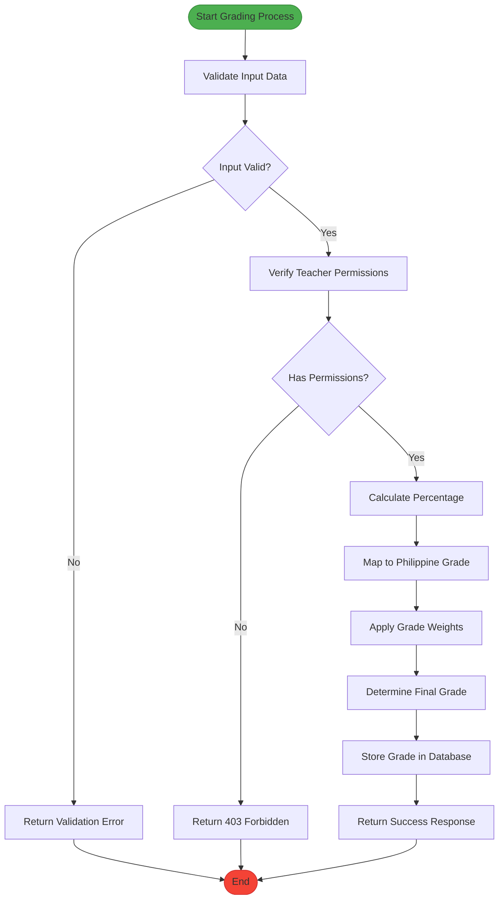

# Grade Management

<cite>
**Referenced Files in This Document**   
- [grades/page.tsx](file://app/teacher/grades/page.tsx)
- [api/teacher/grades/class/[id]/route.ts](file://app/api/teacher/grades/class/[id]/route.ts)
- [api/teacher/grades/create/route.ts](file://app/api/teacher/grades/create/route.ts)
- [api/teacher/grading/[attemptId]/route.ts](file://app/api/teacher/grading/[attemptId]/route.ts)
- [lib/grade-utils.ts](file://lib/grade-utils.ts)
- [lib/grade-weights-store.ts](file://lib/grade-weights-store.ts)
- [components/teacher-assignment-manager.tsx](file://components/teacher-assignment-manager.tsx)
- [lib/assignment-store.ts](file://lib/assignment-store.ts)
- [lib/supabase/queries-optimized.ts](file://lib/supabase/queries-optimized.ts)
</cite>

## Table of Contents
1. [Introduction](#introduction)
2. [Grade Entry and Management](#grade-entry-and-management)
3. [Core Components and Integration](#core-components-and-integration)
4. [Grade Calculation and Validation](#grade-calculation-and-validation)
5. [Usage Examples](#usage-examples)
6. [Common Issues and Resolution](#common-issues-and-resolution)
7. [Performance Considerations](#performance-considerations)
8. [Teacher Assignment Manager](#teacher-assignment-manager)

## Introduction
The Grade Management feature in the Teacher Portal enables educators to efficiently enter, edit, and manage student grades for assignments, quizzes, and other assessments. This system supports both individual and bulk grading operations, provides real-time feedback on grade calculations, and integrates with Supabase for secure data persistence and real-time updates. The implementation follows the Philippine Grading System and allows teachers to customize grade weights for different assessment types.

**Section sources**
- [grades/page.tsx](file://app/teacher/grades/page.tsx#L1-L539)

## Grade Entry and Management
Teachers can manage grades through the main grade management interface located at `grades/page.tsx`. The system provides two primary methods for entering grades: individual entry and bulk operations.

For individual grade entry, teachers can:
- Select a specific class from their teaching roster
- Choose a student from the class roster
- Select the assessment type (quiz, exam, assignment, project)
- Enter the raw score (0-100%)
- Save the grade, which automatically calculates the Philippine equivalent grade

The interface includes real-time validation and feedback, showing the computed Philippine grade and corresponding remarks as the teacher enters the score. Each grade entry includes metadata such as date and assessment type.

Bulk grading operations are supported through the system's API endpoints and optimized database operations. Teachers can efficiently process multiple grades at once, with the system handling rate limiting to prevent abuse.

**Diagram sources**
- [grades/page.tsx](file://app/teacher/grades/page.tsx#L169-L203)
- [api/teacher/grades/create/route.ts](file://app/api/teacher/grades/create/route.ts#L6-L105)

**Section sources**
- [grades/page.tsx](file://app/teacher/grades/page.tsx#L169-L203)
- [api/teacher/grades/create/route.ts](file://app/teacher/grades/create/route.ts#L6-L105)

## Core Components and Integration
The grade management system consists of several interconnected components that work together to provide a seamless grading experience.

The main interface component `grades/page.tsx` serves as the central hub for grade management. It integrates with three key API endpoints:
- `GET /api/teacher/grades/class/[id]`: Fetches all students and existing grades for a specific class
- `POST /api/teacher/grades/create`: Creates new grade entries
- `GET /api/teacher/grading/[attemptId]`: Retrieves quiz attempt details for grading

These components follow a secure architecture pattern where all data operations are performed through API routes rather than direct client-side database queries. This ensures proper authentication, authorization, and data validation.

**Diagram sources**
- [grades/page.tsx](file://app/teacher/grades/page.tsx#L91-L539)
- [api/teacher/grades/class/[id]/route.ts](file://app/api/teacher/grades/class/[id]/route.ts#L5-L101)
- [api/teacher/grades/create/route.ts](file://app/api/teacher/grades/create/route.ts#L6-L105)
- [api/teacher/grading/[attemptId]/route.ts](file://app/api/teacher/grading/[attemptId]/route.ts#L4-L86)
- [lib/grade-utils.ts](file://lib/grade-utils.ts#L1-L163)

**Section sources**
- [grades/page.tsx](file://app/teacher/grades/page.tsx#L91-L539)
- [api/teacher/grades/class/[id]/route.ts](file://app/api/teacher/grades/class/[id]/route.ts#L5-L101)
- [api/teacher/grades/create/route.ts](file://app/api/teacher/grades/create/route.ts#L6-L105)
- [api/teacher/grading/[attemptId]/route.ts](file://app/api/teacher/grading/[attemptId]/route.ts#L4-L86)

## Grade Calculation and Validation
The system uses the `grade-utils.ts` module to handle all grade calculations and validations. This ensures consistency across the application and adherence to the Philippine Grading System.

The grade calculation process follows these steps:
1. Convert the raw score to a percentage
2. Map the percentage to the Philippine grade scale
3. Apply weighted averages based on assessment type weights
4. Determine the final grade with appropriate remarks

The system implements several validation checks:
- Input validation for required fields
- Score range validation (cannot exceed maximum score)
- Teacher ownership verification (teachers can only grade their own classes)
- Student enrollment verification (students must be enrolled in the class)

**Diagram sources**
- [lib/grade-utils.ts](file://lib/grade-utils.ts#L1-L163)
- [api/teacher/grades/create/route.ts](file://app/api/teacher/grades/create/route.ts#L77-L98)

**Section sources**
- [lib/grade-utils.ts](file://lib/grade-utils.ts#L1-L163)
- [api/teacher/grades/create/route.ts](file://app/api/teacher/grades/create/route.ts#L77-L98)

## Usage Examples
### Bulk Grading
The system supports bulk grading operations through the `bulkInsertGrades` function in `queries-optimized.ts`. Teachers can process multiple grades simultaneously, which is particularly useful for large classes or when entering grades for multiple students at once.

**Diagram sources**
- [lib/supabase/queries-optimized.ts](file://lib/supabase/queries-optimized.ts#L297-L303)

### Entering Individual Scores
For individual grade entry, teachers use the modal interface in `grades/page.tsx`. The system provides immediate feedback on the calculated Philippine grade as the teacher enters the score.

### Viewing Grade Distributions
The grade management interface displays grade distributions for each student, showing all assessment scores and the calculated final grade. Teachers can quickly identify students who may need additional support based on their performance across different assessment types.

**Section sources**
- [lib/supabase/queries-optimized.ts](file://lib/supabase/queries-optimized.ts#L297-L303)
- [grades/page.tsx](file://app/teacher/grades/page.tsx#L360-L447)

## Common Issues and Resolution
### Submission Conflicts
Submission conflicts can occur when multiple teachers attempt to grade the same assessment simultaneously. The system prevents this through:
- Unique constraint enforcement in the database
- Optimistic locking patterns
- Real-time updates that refresh the interface when changes occur

Resolution steps:
1. Refresh the grade management page
2. Verify the latest grades are displayed
3. Re-enter any grades that were not saved

### Failed Grade Saves
Failed grade saves typically result from:
- Network connectivity issues
- Validation errors
- Permission restrictions
- Rate limiting

Resolution steps:
1. Check internet connection
2. Verify all required fields are filled correctly
3. Ensure the teacher has permission to grade the selected class
4. Wait if rate limit has been reached (20 grades per minute per teacher)

The system provides clear error messages to help teachers identify and resolve issues quickly.

**Section sources**
- [api/teacher/grades/create/route.ts](file://app/api/teacher/grades/create/route.ts#L16-L20)
- [api/teacher/grades/create/route.ts](file://app/api/teacher/grades/create/route.ts#L36-L50)

## Performance Considerations
The grade management system is designed to handle large class sizes efficiently through several optimization strategies:

### Large Class Handling
- Paginated data loading to prevent memory issues
- Optimized database queries with proper indexing
- Client-side caching of grade weights and class data
- Virtualized rendering for student lists

### Real-time Updates
The system uses Supabase subscriptions to provide real-time updates when grades are modified. This ensures all teachers viewing the same class see the latest information without manual refreshing.

The real-time functionality is implemented through:
- Supabase realtime subscriptions on the grades table
- Automatic UI updates when new grades are added
- Conflict resolution for concurrent edits
- Rate limiting to prevent abuse of the realtime system

**Diagram sources**
- [supabase/migrations/20260101070345_secure_realtime_rls.sql](file://supabase/migrations/20260101070345_secure_realtime_rls.sql#L1-L3)
- [lib/supabase/client.ts](file://lib/supabase/client.ts#L1-L9)

**Section sources**
- [supabase/migrations/20260101070345_secure_realtime_rls.sql](file://supabase/migrations/20260101070345_secure_realtime_rls.sql#L1-L3)
- [lib/supabase/client.ts](file://lib/supabase/client.ts#L1-L9)

## Teacher Assignment Manager
The `teacher-assignment-manager.tsx` component provides an integrated workflow for managing assignments and grading submissions. This component streamlines the grading process by combining assignment creation, submission tracking, and grade entry in a single interface.

Key features include:
- Assignment creation with customizable due dates and maximum scores
- Tracking of submission status (submitted, late, graded)
- Direct grading interface with feedback capabilities
- File attachment support for student submissions
- Progress tracking for grading completion

The assignment manager integrates with the grade management system by automatically creating grade records when assignments are graded, ensuring all assessment data is centralized.

**Diagram sources**
- [components/teacher-assignment-manager.tsx](file://components/teacher-assignment-manager.tsx#L52-L485)
- [lib/assignment-store.ts](file://lib/assignment-store.ts#L80-L174)

**Section sources**
- [components/teacher-assignment-manager.tsx](file://components/teacher-assignment-manager.tsx#L52-L485)
- [lib/assignment-store.ts](file://lib/assignment-store.ts#L80-L174)