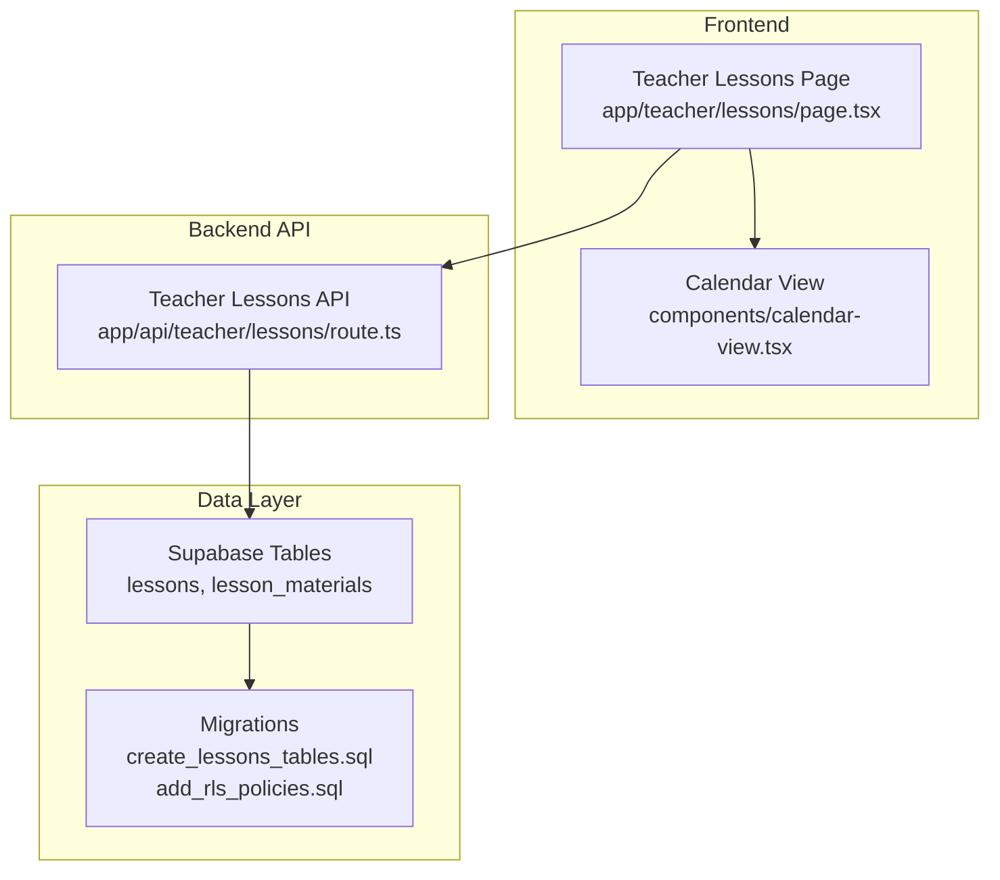
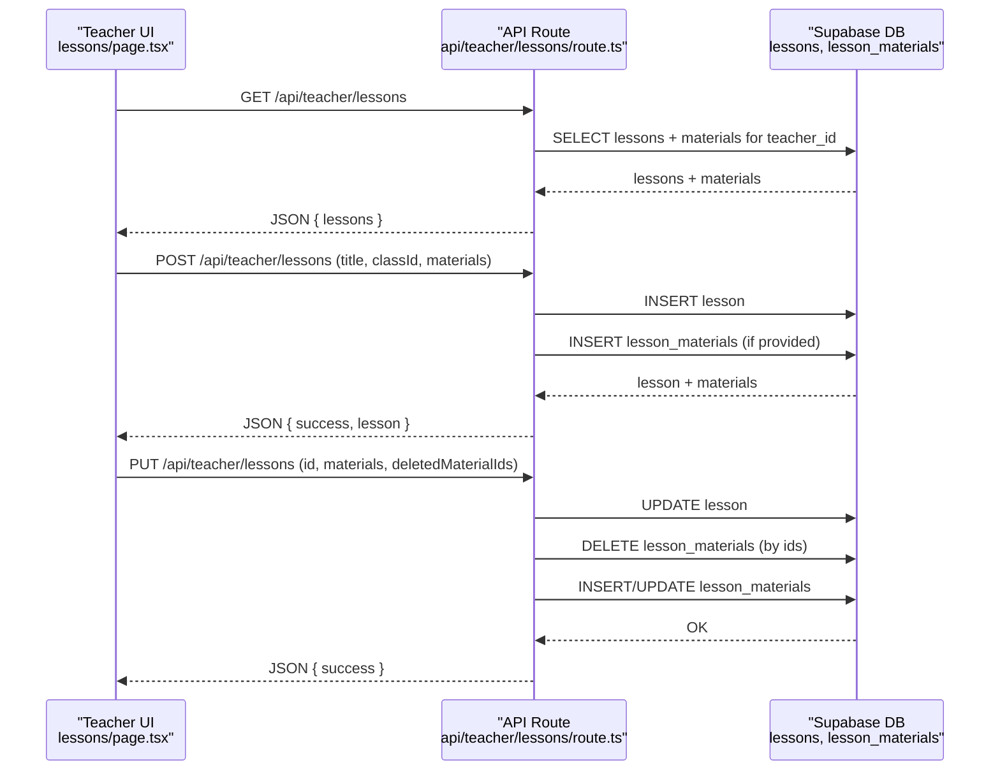
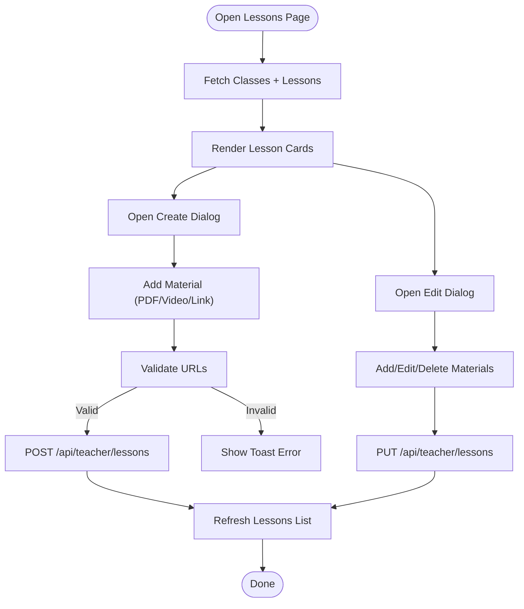
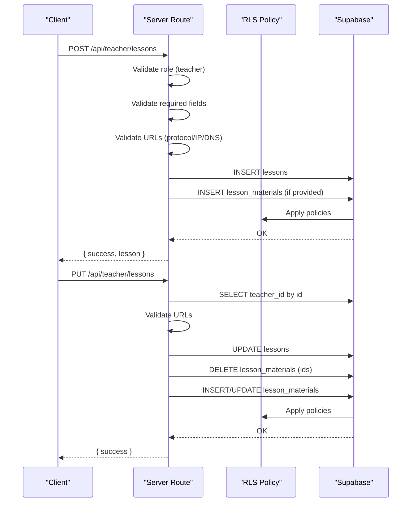
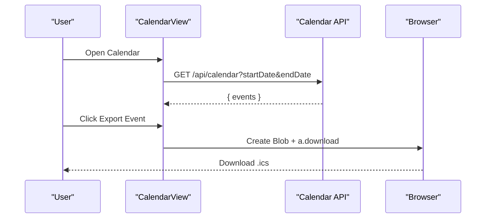
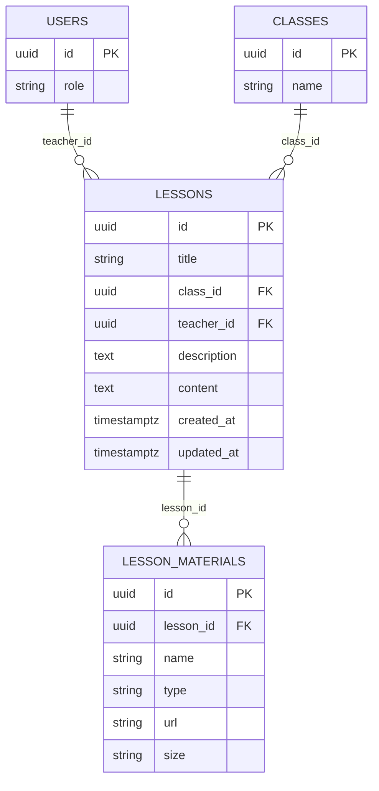
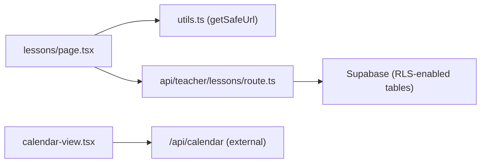

# Lesson Planning

<cite>
**Referenced Files in This Document**
- [page.tsx](file://app/teacher/lessons/page.tsx)
- [route.ts](file://app/api/teacher/lessons/route.ts)
- [calendar-view.tsx](file://components/calendar-view.tsx)
- [validation-schemas.ts](file://lib/validation-schemas.ts)
- [create_lessons_tables.sql](file://supabase/migrations/20251219043541_create_lessons_tables.sql)
- [add_rls_policies.sql](file://supabase/migrations/20251219044036_add_rls_policies.sql)
- [layout.tsx](file://app/teacher/layout.tsx)
- [utils.ts](file://lib/utils.ts)
</cite>

## Table of Contents
1. [Introduction](#introduction)
2. [Project Structure](#project-structure)
3. [Core Components](#core-components)
4. [Architecture Overview](#architecture-overview)
5. [Detailed Component Analysis](#detailed-component-analysis)
6. [Dependency Analysis](#dependency-analysis)
7. [Performance Considerations](#performance-considerations)
8. [Troubleshooting Guide](#troubleshooting-guide)
9. [Conclusion](#conclusion)

## Introduction
This document explains the Lesson Planning feature in the Teacher Portal. It covers how teachers create, schedule, and manage lessons aligned with their curriculum, integrates with the calendar view for visual scheduling and iCal export, and documents the backend API and data model in Supabase. It also includes usage examples, validation and error handling, and strategies for resolving common issues such as syncing conflicts or missing lessons.

## Project Structure
The Lesson Planning feature spans the frontend page, the teacher-only API, and the shared calendar component. The data model is defined in Supabase migrations.

**Diagram sources**
- [page.tsx](file://app/teacher/lessons/page.tsx#L1-L575)
- [route.ts](file://app/api/teacher/lessons/route.ts#L1-L253)
- [calendar-view.tsx](file://components/calendar-view.tsx#L1-L497)
- [create_lessons_tables.sql](file://supabase/migrations/20251219043541_create_lessons_tables.sql#L1-L23)
- [add_rls_policies.sql](file://supabase/migrations/20251219044036_add_rls_policies.sql#L1-L22)

**Section sources**
- [page.tsx](file://app/teacher/lessons/page.tsx#L1-L575)
- [route.ts](file://app/api/teacher/lessons/route.ts#L1-L253)
- [calendar-view.tsx](file://components/calendar-view.tsx#L1-L497)
- [create_lessons_tables.sql](file://supabase/migrations/20251219043541_create_lessons_tables.sql#L1-L23)
- [add_rls_policies.sql](file://supabase/migrations/20251219044036_add_rls_policies.sql#L1-L22)

## Core Components
- Teacher Lessons Page: Provides a UI for creating, editing, and viewing lessons, managing learning materials, and displaying a list of lessons per class.
- Teacher Lessons API: Handles GET, POST, and PUT requests for lessons, validates inputs, enforces ownership, and manages lesson materials.
- Calendar View: Renders a monthly calendar, displays events, and exports individual events to iCalendar format.
- Validation Schemas: Defines Zod schemas for lesson creation and updates to enforce constraints on length, types, and URLs.
- Supabase Data Model: Declares lessons and lesson_materials tables with row-level security enabled.

**Section sources**
- [page.tsx](file://app/teacher/lessons/page.tsx#L1-L575)
- [route.ts](file://app/api/teacher/lessons/route.ts#L1-L253)
- [calendar-view.tsx](file://components/calendar-view.tsx#L1-L497)
- [validation-schemas.ts](file://lib/validation-schemas.ts#L1-L45)
- [create_lessons_tables.sql](file://supabase/migrations/20251219043541_create_lessons_tables.sql#L1-L23)

## Architecture Overview
The teacher portal’s Lesson Planning feature follows a clear separation of concerns:
- Frontend page orchestrates lesson CRUD and material management.
- API enforces authorization, validates inputs, and persists data to Supabase.
- Calendar view provides a separate scheduling surface and iCal export capability.
- Supabase migrations define the schema and RLS policies.

**Diagram sources**
- [page.tsx](file://app/teacher/lessons/page.tsx#L80-L114)
- [route.ts](file://app/api/teacher/lessons/route.ts#L56-L108)
- [route.ts](file://app/api/teacher/lessons/route.ts#L110-L170)
- [route.ts](file://app/api/teacher/lessons/route.ts#L172-L253)

## Detailed Component Analysis

### Teacher Lessons Page (lessons/page.tsx)
Responsibilities:
- Fetches classes and lessons for the logged-in teacher.
- Presents forms to create and edit lessons with optional learning materials.
- Validates materials locally before submission.
- Displays lessons with class, description, materials count, and last updated date.
- Opens dialogs to view lesson details and edit materials.

Key behaviors:
- Fetches classes via a dedicated API endpoint and lessons via the lessons API.
- Local validation ensures URLs start with http:// or https://.
- Supports adding/removing materials and toggling material types (pdf, video, link, document).
- On successful create/update, refreshes the lessons list.

**Diagram sources**
- [page.tsx](file://app/teacher/lessons/page.tsx#L80-L114)
- [page.tsx](file://app/teacher/lessons/page.tsx#L153-L184)
- [page.tsx](file://app/teacher/lessons/page.tsx#L235-L266)

**Section sources**
- [page.tsx](file://app/teacher/lessons/page.tsx#L1-L575)

### Teacher Lessons API (api/teacher/lessons/route.ts)
Responsibilities:
- GET: Returns lessons for the authenticated teacher, including class and materials.
- POST: Creates a lesson and associated materials; validates URLs and ownership.
- PUT: Updates a lesson and its materials; deletes removed materials and inserts/updates existing ones; enforces ownership.

Security and validation:
- Enforces role checks (teacher/admin for GET).
- Validates required fields and URL safety using DNS resolution and private IP checks.
- Ensures deletion and updates apply only to the lesson owner by verifying teacher_id.
- Uses Supabase RLS to protect data.

**Diagram sources**
- [route.ts](file://app/api/teacher/lessons/route.ts#L56-L108)
- [route.ts](file://app/api/teacher/lessons/route.ts#L110-L170)
- [route.ts](file://app/api/teacher/lessons/route.ts#L172-L253)

**Section sources**
- [route.ts](file://app/api/teacher/lessons/route.ts#L1-L253)

### Calendar View Integration (components/calendar-view.tsx)
Responsibilities:
- Renders a month grid calendar and lists events for a selected date.
- Exports individual events to iCalendar (.ics) format for download.
- Fetches events from a calendar API endpoint and displays them with color-coded types.

Integration with Lesson Planning:
- While lessons and calendar events are separate entities, the calendar view supports exporting any event to iCal. Teachers can use this to share schedules externally.

**Diagram sources**
- [calendar-view.tsx](file://components/calendar-view.tsx#L66-L86)
- [calendar-view.tsx](file://components/calendar-view.tsx#L169-L203)

**Section sources**
- [calendar-view.tsx](file://components/calendar-view.tsx#L1-L497)

### Data Model and Access Controls (Supabase)
Tables:
- lessons: Stores lesson metadata and links to classes and teachers.
- lesson_materials: Stores associated materials (pdf, video, link, document) linked to lessons.

Row Level Security:
- Tables enable RLS; policies are defined in migrations to control access.

**Diagram sources**
- [create_lessons_tables.sql](file://supabase/migrations/20251219043541_create_lessons_tables.sql#L1-L23)
- [add_rls_policies.sql](file://supabase/migrations/20251219044036_add_rls_policies.sql#L1-L22)

**Section sources**
- [create_lessons_tables.sql](file://supabase/migrations/20251219043541_create_lessons_tables.sql#L1-L23)
- [add_rls_policies.sql](file://supabase/migrations/20251219044036_add_rls_policies.sql#L1-L22)

### Validation and Error Handling
- Client-side validation in the lessons page ensures URLs start with http:// or https:// and prevents invalid submissions.
- Server-side validation in the API route:
  - Role checks for teacher/admin on GET.
  - Required fields for POST.
  - URL validation using protocol checks, private IP filtering, and DNS resolution to prevent SSRF and local network access.
  - Ownership verification for PUT operations.
- Error responses return structured messages and appropriate HTTP status codes.
- The lessons page shows user-friendly toasts for failures.

**Section sources**
- [page.tsx](file://app/teacher/lessons/page.tsx#L143-L151)
- [route.ts](file://app/api/teacher/lessons/route.ts#L21-L54)
- [route.ts](file://app/api/teacher/lessons/route.ts#L110-L170)
- [route.ts](file://app/api/teacher/lessons/route.ts#L172-L253)

### Usage Examples
- Creating a new lesson:
  - Open the Create Lesson dialog, select a class, enter title and optional description/content, add materials (PDF, video, link), and submit.
  - The page validates URLs and shows a success toast; the list refreshes automatically.
- Setting objectives:
  - Enter objectives in the lesson content field; these appear when viewing lesson details.
- Linking to assignments or materials:
  - Add materials with names and URLs; the page opens external links safely and displays icons per material type.
- Scheduling and iCal export:
  - Use the calendar view to export events to iCal for sharing with students or external calendars.

**Section sources**
- [page.tsx](file://app/teacher/lessons/page.tsx#L153-L184)
- [page.tsx](file://app/teacher/lessons/page.tsx#L235-L266)
- [calendar-view.tsx](file://components/calendar-view.tsx#L169-L203)

## Dependency Analysis
- The lessons page depends on:
  - Supabase client for auth and data fetching.
  - Utility functions for URL safety.
  - The teacher lessons API for CRUD operations.
- The lessons API depends on:
  - Supabase server client for database access.
  - DNS resolution for URL validation.
  - Supabase RLS policies for access control.
- The calendar view depends on:
  - A calendar API endpoint for events.
  - iCalendar export helpers.

**Diagram sources**
- [page.tsx](file://app/teacher/lessons/page.tsx#L1-L575)
- [utils.ts](file://lib/utils.ts#L1-L107)
- [route.ts](file://app/api/teacher/lessons/route.ts#L1-L253)
- [calendar-view.tsx](file://components/calendar-view.tsx#L1-L497)

**Section sources**
- [page.tsx](file://app/teacher/lessons/page.tsx#L1-L575)
- [route.ts](file://app/api/teacher/lessons/route.ts#L1-L253)
- [calendar-view.tsx](file://components/calendar-view.tsx#L1-L497)
- [utils.ts](file://lib/utils.ts#L1-L107)

## Performance Considerations
- Minimize re-renders by consolidating state updates in the lessons page.
- Batch material operations (insert/update/delete) in a single PUT request to reduce round-trips.
- Use pagination or lazy loading for large lesson lists if needed.
- Cache calendar events for short periods to reduce API calls.

## Troubleshooting Guide
Common issues and resolutions:
- Syncing conflicts:
  - Cause: Concurrent edits by multiple users or rapid refresh cycles.
  - Resolution: Ensure the UI refreshes lessons after each operation and avoids manual polling; rely on the API responses to update state.
- Missing lessons:
  - Cause: Unauthorized or forbidden responses if the user role is not teacher/admin for GET.
  - Resolution: Verify authentication and role checks; ensure the teacher layout guards access.
- Invalid URL errors:
  - Cause: Non-http/https URLs or private/local network links.
  - Resolution: Use public URLs; the client and server validate URLs and reject unsafe links.
- Material deletion failures:
  - Cause: Attempting to delete materials not owned by the lesson.
  - Resolution: The API verifies ownership before deletions; ensure deletedMaterialIds correspond to the lesson’s materials.

**Section sources**
- [route.ts](file://app/api/teacher/lessons/route.ts#L56-L108)
- [route.ts](file://app/api/teacher/lessons/route.ts#L172-L253)
- [page.tsx](file://app/teacher/lessons/page.tsx#L143-L151)
- [layout.tsx](file://app/teacher/layout.tsx#L1-L60)

## Conclusion
The Lesson Planning feature provides a robust, secure, and user-friendly way for teachers to create, manage, and visualize lessons. The frontend integrates seamlessly with the teacher-only lessons API, which enforces strict validation and access control. The calendar view complements scheduling and export capabilities. By following the documented usage patterns and troubleshooting steps, teachers can efficiently align their lesson plans with curriculum and share schedules via iCal.