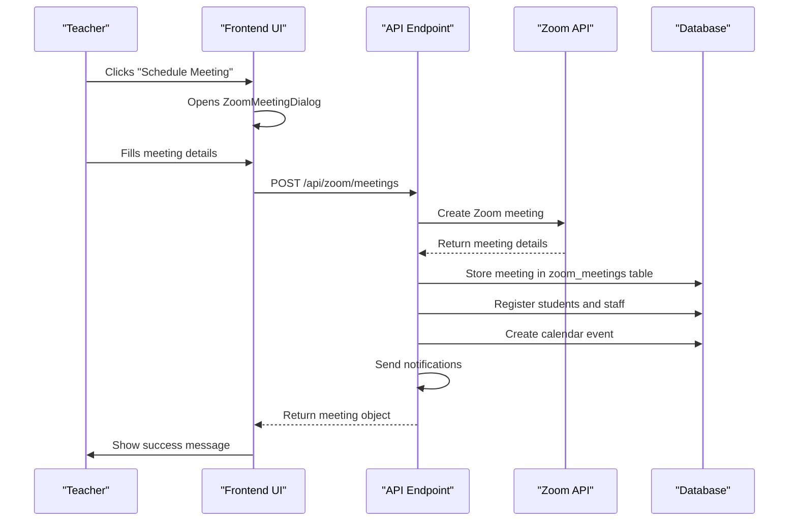
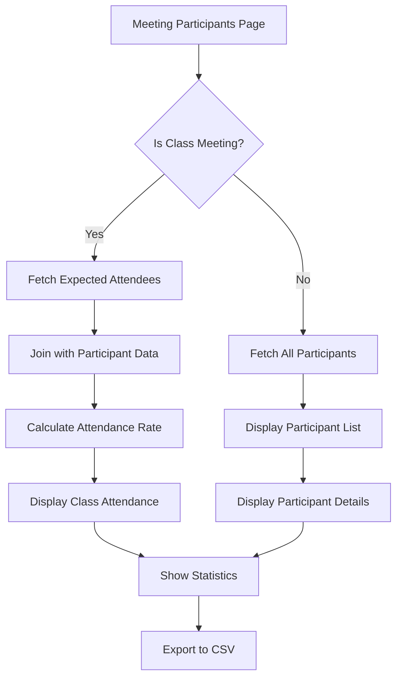
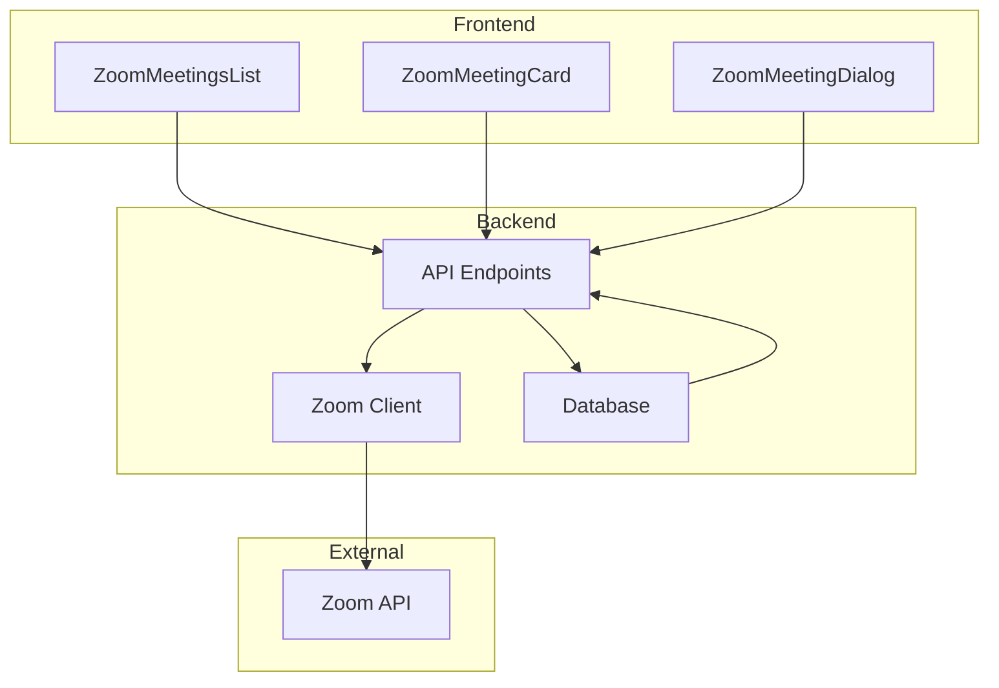
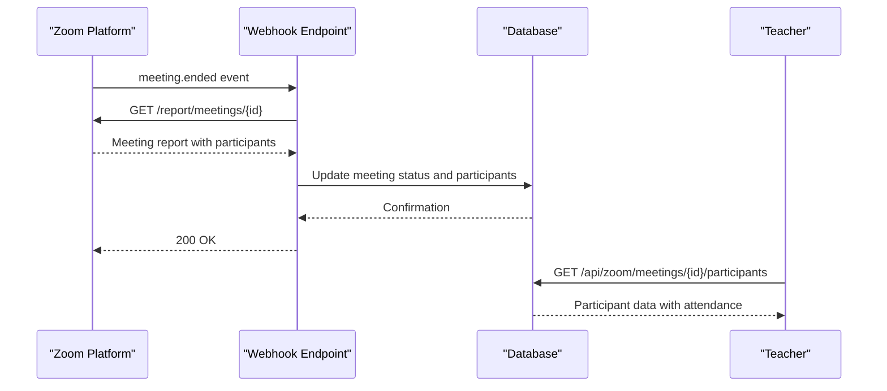

# Meeting Scheduling and Zoom Integration

<cite>
**Referenced Files in This Document**   
- [app/teacher/meetings/page.tsx](file://app/teacher/meetings/page.tsx)
- [app/teacher/meetings/[id]/participants/page.tsx](file://app/teacher/meetings/[id]/participants/page.tsx)
- [app/admin/meetings/page.tsx](file://app/admin/meetings/page.tsx)
- [app/admin/meetings/[id]/participants/page.tsx](file://app/admin/meetings/[id]/participants/page.tsx)
- [app/api/zoom/meetings/route.ts](file://app/api/zoom/meetings/route.ts)
- [app/api/zoom/meetings/[id]/route.ts](file://app/api/zoom/meetings/[id]/route.ts)
- [app/api/zoom/meetings/[id]/participants/route.ts](file://app/api/zoom/meetings/[id]/participants/route.ts)
- [lib/zoom/client.ts](file://lib/zoom/client.ts)
- [lib/zoom/types.ts](file://lib/zoom/types.ts)
- [components/zoom-meeting-card.tsx](file://components/zoom-meeting-card.tsx)
- [components/zoom-meetings-list.tsx](file://components/zoom-meetings-list.tsx)
- [components/zoom-meeting-dialog.tsx](file://components/zoom-meeting-dialog.tsx)
- [components/zoom-participants-section.tsx](file://components/zoom-participants-section.tsx)
</cite>

## Table of Contents
1. [Introduction](#introduction)
2. [Core Components](#core-components)
3. [Meeting Scheduling Workflow](#meeting-scheduling-workflow)
4. [Participants Management](#participants-management)
5. [API Integration](#api-integration)
6. [Security Considerations](#security-considerations)
7. [Troubleshooting Guide](#troubleshooting-guide)
8. [Real-time Attendance Tracking](#real-time-attendance-tracking)

## Introduction
The Meeting Scheduling and Zoom Integration feature enables teachers to seamlessly create, manage, and conduct virtual classes within the Teacher Portal. This comprehensive system integrates with Zoom's API to provide a complete virtual classroom experience, including meeting scheduling, participant management, attendance tracking, and secure authentication. Teachers can schedule meetings, invite students, monitor attendance in real-time, and access detailed reports, all within the school's secure environment.

**Section sources**
- [app/teacher/meetings/page.tsx](file://app/teacher/meetings/page.tsx#L1-L53)

## Core Components

The Meeting Scheduling and Zoom Integration system consists of several key components that work together to provide a seamless virtual classroom experience. The primary interface is the `ZoomMeetingsList` component, which displays all scheduled and past meetings in a tabbed interface. Teachers can view upcoming meetings, create new ones, and manage existing meetings through this central hub.

The `ZoomMeetingCard` component provides a visual representation of each meeting, displaying essential information such as the meeting title, start time, duration, host, and current status. Each card includes action buttons for joining, editing, or deleting meetings, with appropriate permissions checks to ensure only authorized users can perform these actions.

When creating or editing a meeting, the `ZoomMeetingDialog` component provides a form interface with fields for meeting title, description, date, time, duration, associated class, target audience, and various meeting settings such as video preferences and waiting room configuration.

**Section sources**
- [components/zoom-meetings-list.tsx](file://components/zoom-meetings-list.tsx#L1-L246)
- [components/zoom-meeting-card.tsx](file://components/zoom-meeting-card.tsx#L1-L274)
- [components/zoom-meeting-dialog.tsx](file://components/zoom-meeting-dialog.tsx#L1-L326)

## Meeting Scheduling Workflow

The meeting scheduling process begins when a teacher clicks the "Schedule Meeting" button on the meetings page, which opens the `ZoomMeetingDialog` form. The form is pre-populated with default values, including the current date and time (set to one hour from now), a duration of 60 minutes, and the "Class members only" audience setting.

When the teacher submits the form, the system creates a Zoom meeting through the Zoom API using Server-to-Server OAuth authentication. The meeting is configured with specific settings to enhance security and classroom management, including:
- Waiting room enabled (with registered users bypassing it)
- Participants muted upon entry
- Host and participant video enabled by default

For class-linked meetings, the system automatically registers all enrolled students with valid DepEd email addresses, allowing them to bypass the waiting room when joining. Additionally, all teachers and administrators are registered for the meeting, enabling them to join without waiting.

After creating the meeting in Zoom, the system stores the meeting details in the database, including the Zoom meeting ID, join URL, start URL, password, and other metadata. A calendar event is also created to ensure the meeting appears in the school's calendar system.

**Diagram sources **
- [app/api/zoom/meetings/route.ts](file://app/api/zoom/meetings/route.ts#L54-L168)
- [components/zoom-meeting-dialog.tsx](file://components/zoom-meeting-dialog.tsx#L107-L147)

**Section sources**
- [app/api/zoom/meetings/route.ts](file://app/api/zoom/meetings/route.ts#L54-L168)
- [components/zoom-meeting-dialog.tsx](file://components/zoom-meeting-dialog.tsx#L1-L326)

## Participants Management

The participants management system provides comprehensive tools for tracking attendance and engagement during virtual classes. The `ZoomParticipantsSection` component displays a collapsible summary of participants directly on the meeting card, showing the number of attendees and attendance rate for class meetings.

For detailed analysis, teachers can navigate to the participants page for a specific meeting, which provides a comprehensive view of attendance data. This page displays two types of information depending on whether the meeting is linked to a class:

For class meetings, the system shows a list of all expected attendees (enrolled students) with their attendance status (present or absent), join time, leave time, and duration. This allows teachers to quickly identify which students attended and for how long.

For non-class meetings, the system displays all participants who joined the meeting, including their name, role, join time, leave time, and duration. This is useful for meetings with mixed audiences or administrative sessions.

The participants page also includes statistical summaries such as the number of attendees, attendance rate, average duration, and total meeting time. Teachers can export this data to CSV format for further analysis or record-keeping.

**Diagram sources **
- [app/teacher/meetings/[id]/participants/page.tsx](file://app/teacher/meetings/[id]/participants/page.tsx#L1-L422)
- [app/api/zoom/meetings/[id]/participants/route.ts](file://app/api/zoom/meetings/[id]/participants/route.ts#L8-L133)

**Section sources**
- [app/teacher/meetings/[id]/participants/page.tsx](file://app/teacher/meetings/[id]/participants/page.tsx#L1-L422)
- [components/zoom-participants-section.tsx](file://components/zoom-participants-section.tsx#L1-L265)

## API Integration

The system integrates with Zoom's API through a secure server-side client implemented in `lib/zoom/client.ts`. This client uses Zoom's Server-to-Server OAuth authentication method, which provides enhanced security by keeping credentials on the server and eliminating the need for user-level OAuth flows.

The integration follows a layered architecture with distinct responsibilities:
- **API Endpoints**: Handle HTTP requests from the frontend and coordinate between components
- **Zoom Client**: Manages authentication, token caching, and direct communication with Zoom's API
- **Database Layer**: Stores meeting metadata, participant information, and registration details

Key API endpoints include:
- `GET /api/zoom/meetings`: Retrieves a list of meetings with filtering options
- `POST /api/zoom/meetings`: Creates a new meeting in Zoom and stores it in the database
- `PATCH /api/zoom/meetings/[id]`: Updates an existing meeting
- `DELETE /api/zoom/meetings/[id]`: Deletes a meeting from both Zoom and the database
- `GET /api/zoom/meetings/[id]/participants`: Retrieves participant data for a specific meeting

The Zoom client implements several important features:
- Token caching with automatic refresh before expiration
- Error handling and retry logic
- Large integer preservation (meeting IDs) through JSON text manipulation
- Batch processing for registrant creation to respect rate limits

**Diagram sources **
- [app/api/zoom/meetings/route.ts](file://app/api/zoom/meetings/route.ts#L6-L52)
- [lib/zoom/client.ts](file://lib/zoom/client.ts#L1-L334)

**Section sources**
- [app/api/zoom/meetings/route.ts](file://app/api/zoom/meetings/route.ts#L6-L345)
- [lib/zoom/client.ts](file://lib/zoom/client.ts#L1-L334)

## Security Considerations

The system implements multiple layers of security to protect Zoom meetings and participant data. Authentication is handled through Zoom's Server-to-Server OAuth, which uses environment variables (`ZOOM_ACCOUNT_ID`, `ZOOM_CLIENT_ID`, `ZOOM_CLIENT_SECRET`) that are never exposed to the client-side code.

Meeting security is enhanced through several mechanisms:
- Waiting rooms are always enabled for scheduled meetings
- Registered users (students, teachers, admins) bypass the waiting room
- Participants are muted upon entry by default
- Meeting passwords are automatically generated and stored securely

Access control is enforced at multiple levels:
- Only teachers and administrators can create meetings
- Meeting owners and administrators can edit or delete meetings
- Teachers can view participants for meetings they host or for classes they teach
- Students can only join meetings they are authorized for

The system also implements proper error handling that avoids exposing sensitive information in error messages, and all API endpoints validate user authentication before processing requests.

**Section sources**
- [lib/zoom/client.ts](file://lib/zoom/client.ts#L1-L334)
- [app/api/zoom/meetings/route.ts](file://app/api/zoom/meetings/route.ts#L56-L65)
- [app/api/zoom/meetings/[id]/route.ts](file://app/api/zoom/meetings/[id]/route.ts#L44-L75)

## Troubleshooting Guide

Common issues and their solutions:

**Authentication Failures**
- **Symptom**: "Zoom is not configured" error
- **Cause**: Missing or incorrect Zoom API credentials in environment variables
- **Solution**: Verify that `ZOOM_ACCOUNT_ID`, `ZOOM_CLIENT_ID`, and `ZOOM_CLIENT_SECRET` are correctly set in the environment

**Meeting Creation Errors**
- **Symptom**: "Failed to create meeting" error
- **Cause**: Invalid meeting parameters or Zoom API rate limiting
- **Solution**: Check that title, start time, and duration are provided; wait a few minutes and retry if rate limited

**Participant Registration Issues**
- **Symptom**: Students cannot bypass waiting room
- **Cause**: Student email not in allowed domain or registration failed
- **Solution**: Verify student has valid @r1.deped.gov.ph email; check server logs for registration errors

**Joining Problems**
- **Symptom**: "Failed to get join info" error
- **Cause**: Meeting not found or user not authorized
- **Solution**: Verify meeting exists and user has permission to join

**General Troubleshooting Steps**
1. Check browser console for JavaScript errors
2. Verify network requests in browser developer tools
3. Check server logs for API errors
4. Ensure Zoom API credentials are correct
5. Confirm user has appropriate role (teacher/admin)

**Section sources**
- [lib/zoom/client.ts](file://lib/zoom/client.ts#L20-L54)
- [app/api/zoom/meetings/route.ts](file://app/api/zoom/meetings/route.ts#L162-L168)
- [components/zoom-meeting-card.tsx](file://components/zoom-meeting-card.tsx#L71-L96)

## Real-time Attendance Tracking

The system provides real-time attendance tracking through integration with Zoom's reporting API and webhook system. When a meeting ends, Zoom automatically sends a webhook notification to the system, triggering an update of the meeting status and participant data.

The attendance tracking process works as follows:
1. When a participant joins a meeting, Zoom records their join time
2. When a participant leaves, Zoom records their leave time
3. After the meeting ends, Zoom calculates the duration for each participant
4. The system retrieves this data through the Zoom API and stores it in the database
5. Teachers can view detailed attendance reports showing who attended, when they joined and left, and how long they stayed

For class meetings, the system compares the list of participants against the expected attendees (enrolled students) to calculate attendance rates automatically. This allows teachers to quickly identify absent students and follow up as needed.

The real-time nature of this system ensures that attendance data is available immediately after a meeting concludes, without requiring manual data entry or processing.

**Diagram sources **
- [app/api/zoom/meetings/[id]/participants/route.ts](file://app/api/zoom/meetings/[id]/participants/route.ts#L8-L133)
- [lib/zoom/client.ts](file://lib/zoom/client.ts#L187-L192)

**Section sources**
- [app/api/zoom/meetings/[id]/participants/route.ts](file://app/api/zoom/meetings/[id]/participants/route.ts#L8-L133)
- [lib/zoom/client.ts](file://lib/zoom/client.ts#L184-L193)