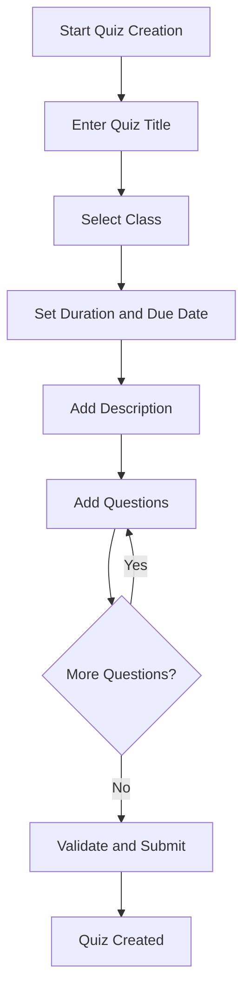
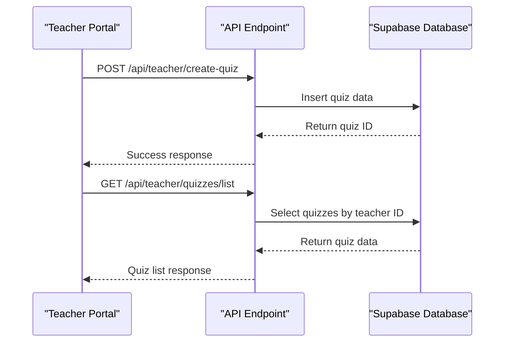
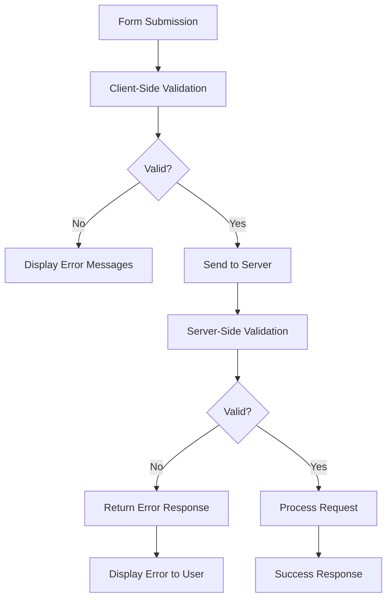
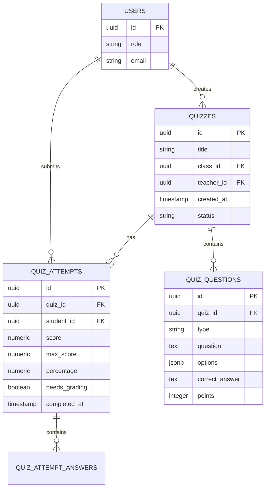

# Quiz Creation and Management

<cite>
**Referenced Files in This Document**   
- [quizzes/page.tsx](file://app/teacher/quizzes/page.tsx)
- [create-quiz/route.ts](file://app/api/teacher/create-quiz/route.ts)
- [list/route.ts](file://app/api/teacher/quizzes/list/route.ts)
- [teacher-assignment-manager.tsx](file://components/teacher-assignment-manager.tsx)
- [validation-schemas.ts](file://lib/validation-schemas.ts)
- [20251219043525_create_quizzes_tables.sql](file://supabase/migrations/20251219043525_create_quizzes_tables.sql)
- [20260101070324_secure_quiz_questions.sql](file://supabase/migrations/20260101070324_secure_quiz_questions.sql)
- [20251219112310_create_quiz_activity_logs.sql](file://supabase/migrations/20251219112310_create_quiz_activity_logs.sql)
- [start-quiz/route.ts](file://app/api/student/start-quiz/route.ts)
- [grading/[attemptId]/route.ts](file://app/api/teacher/grading/[attemptId]/route.ts)
</cite>

## Table of Contents
1. [Introduction](#introduction)
2. [Quiz Creation Workflow](#quiz-creation-workflow)
3. [Quiz Management Interface](#quiz-management-interface)
4. [API Integration](#api-integration)
5. [Data Validation and Error Handling](#data-validation-and-error-handling)
6. [Security Implementation](#security-implementation)
7. [Teacher Assignment Manager Integration](#teacher-assignment-manager-integration)
8. [Usage Examples](#usage-examples)
9. [Common Issues and Troubleshooting](#common-issues-and-troubleshooting)
10. [Conclusion](#conclusion)

## Introduction

The Quiz Creation and Management feature in the Teacher Portal provides educators with a comprehensive toolset for creating, editing, and managing quizzes with multiple question types. This system enables teachers to design assessments with various question formats including multiple-choice, true/false, identification, and essay questions. The feature integrates with Supabase for data storage and implements robust security measures through Row Level Security (RLS) policies to protect quiz content before release. Teachers can publish quizzes to students, track submissions, grade responses, and reopen quizzes for individual students when necessary. The system also includes anti-cheating measures that monitor student activity during quiz attempts.

**Section sources**
- [quizzes/page.tsx](file://app/teacher/quizzes/page.tsx#L1-L800)

## Quiz Creation Workflow

The quiz creation process begins with teachers accessing the quiz management interface through the Teacher Portal. Teachers can create a new quiz by clicking the "Create Quiz" button, which opens a dialog for quiz configuration. The workflow includes setting the quiz title, selecting the target class, specifying the duration, setting a due date, and adding a description. Teachers can then add questions of various types, including multiple-choice, true/false, identification, and essay questions. Each question can be assigned a point value, and for multiple-choice questions, teachers can define answer options and specify the correct answer. The interface provides real-time feedback and validation to ensure all required fields are completed before submission.

**Diagram sources**
- [quizzes/page.tsx](file://app/teacher/quizzes/page.tsx#L489-L613)

## Quiz Management Interface

The quiz management interface provides teachers with a comprehensive view of all their created quizzes. The interface displays key information for each quiz including the title, associated class, number of questions, submission statistics, and average scores. Teachers can view detailed results for each quiz, including individual student submissions and performance metrics. The interface also supports grading functionality for quizzes with essay questions or when manual grading is required. Teachers can reopen quizzes for individual students who may have encountered technical issues or require additional time. The interface includes visual indicators for quiz status, submission deadlines, and grading requirements, allowing teachers to efficiently manage their assessment workflow.

**Section sources**
- [quizzes/page.tsx](file://app/teacher/quizzes/page.tsx#L480-L800)

## API Integration

The Quiz Creation and Management feature integrates with several API endpoints to facilitate data exchange between the frontend interface and the backend database. The primary integration points include the `/api/teacher/create-quiz` endpoint for creating new quizzes and the `/api/teacher/quizzes/list` endpoint for retrieving existing quizzes. When a teacher creates a new quiz, the frontend sends a POST request to the create-quiz endpoint with the quiz data, including title, class ID, description, duration, due date, and questions. The list endpoint is used to fetch all quizzes created by the teacher, along with associated data such as class information, questions, and student reopens. These API integrations use Supabase for database operations and implement proper authentication and authorization checks.

**Diagram sources**
- [create-quiz/route.ts](file://app/api/teacher/create-quiz/route.ts#L1-L124)
- [list/route.ts](file://app/api/teacher/quizzes/list/route.ts#L1-L59)

## Data Validation and Error Handling

The system implements comprehensive data validation using Zod schemas to ensure data integrity and prevent injection attacks. The validation schema for quiz creation requires a title with at least 3 characters, a valid class ID, and at least one question. Each question must have a question text and a point value between 1 and 100. The system validates that multiple-choice questions have answer options and that the correct answer index is valid. Error handling is implemented at multiple levels, with specific error messages returned for different validation failures. The frontend displays these error messages to guide teachers in correcting their input. The system also implements rate limiting to prevent abuse, allowing a maximum of 5 quiz creations per minute from the same IP address.

**Diagram sources**
- [create-quiz/route.ts](file://app/api/teacher/create-quiz/route.ts#L7-L24)
- [quizzes/page.tsx](file://app/teacher/quizzes/page.tsx#L297-L319)

## Security Implementation

The system implements robust security measures to protect quiz content and prevent unauthorized access. Row Level Security (RLS) policies in Supabase ensure that only authorized users can access quiz data. Teachers can only access quizzes they have created, and students cannot view quiz questions until they begin the quiz. The RLS policy for quiz questions specifically prevents students from directly querying the quiz_questions table, even if they know the quiz ID. When a student starts a quiz, the system verifies their enrollment in the associated class before allowing access to the questions. The system also implements rate limiting to prevent abuse of the quiz creation and start endpoints. Additionally, the system uses the Supabase service role key to securely fetch quiz questions, preventing potential bypass of RLS policies.

**Diagram sources**
- [20260101070324_secure_quiz_questions.sql](file://supabase/migrations/20260101070324_secure_quiz_questions.sql#L1-L23)
- [start-quiz/route.ts](file://app/api/student/start-quiz/route.ts#L1-L122)

## Teacher Assignment Manager Integration

The teacher-assignment-manager.tsx component supports quiz workflow management by providing a unified interface for teachers to manage both assignments and quizzes. This component allows teachers to organize their assessment activities by class, view pending grading tasks, and track student submissions. The integration enables teachers to switch between managing quizzes and other assignments within the same workflow, improving efficiency and reducing context switching. The component displays key metrics such as the number of pending submissions, average scores, and grading status, allowing teachers to prioritize their grading tasks. It also supports the publication workflow, allowing teachers to create quizzes as drafts and publish them when ready, ensuring that students only see finalized assessments.

**Section sources**
- [teacher-assignment-manager.tsx](file://components/teacher-assignment-manager.tsx#L1-L485)

## Usage Examples

### Creating a New Quiz
To create a new quiz, teachers navigate to the Quizzes section of the Teacher Portal and click the "Create Quiz" button. They enter a title such as "Chapter 5 Biology Quiz" and select the appropriate class from the dropdown menu. They set the duration to 30 minutes and specify a due date. In the description field, they add instructions for students. They then add questions, starting with a multiple-choice question about cell structure with four options, marking the correct answer. They add a true/false question about photosynthesis, an identification question about organelles, and an essay question about cellular respiration. After reviewing all questions, they click "Create Quiz" to publish it to their students.

### Adding Questions to a Quiz
When adding questions to a quiz, teachers select the question type from the dropdown menu before clicking "Add" to include it in the quiz. For multiple-choice questions, they enter the question text and up to four answer options, selecting the correct answer from the radio buttons. For true/false questions, the system automatically provides "True" and "False" options. For identification questions, they enter the question and the correct answer, with an option to make the answer case-sensitive. For essay questions, they enter the prompt and assign points, noting that these questions will require manual grading. Teachers can reorder questions by dragging and dropping or adjust point values as needed.

### Publishing a Quiz to Students
When a teacher creates a quiz with the status set to "published", the system automatically notifies enrolled students through the notification system. Students see the new quiz in their Quizzes section with a "Start Quiz" button. The quiz appears with basic information including title, class name, duration, and due date, but questions are hidden until the student begins the quiz. When a student clicks "Start Quiz", the system verifies their enrollment in the class and creates a quiz attempt record. The questions are then loaded from the database and displayed to the student with a countdown timer. The quiz interface prevents navigation away from the page and tracks any attempts to switch tabs or copy content.

**Section sources**
- [quizzes/page.tsx](file://app/teacher/quizzes/page.tsx#L285-L322)
- [create-quiz/route.ts](file://app/api/teacher/create-quiz/route.ts#L79-L118)

## Common Issues and Troubleshooting

### Failed Quiz Creation
If a quiz fails to create, the most common causes are missing required fields or validation errors. Teachers should ensure they have entered a title with at least 3 characters, selected a class, and added at least one question. Each question must have text and a point value between 1 and 100. If the error persists, it may be due to rate limiting, in which case the teacher should wait a few minutes before trying again. Network issues can also cause creation failures, so teachers should check their internet connection. The system provides specific error messages to help identify the exact issue, such as "Title must be at least 3 characters" or "At least one question is required."

### Missing Questions
If questions are missing from a quiz, teachers should verify that they were properly added and saved before creating the quiz. In the creation dialog, the question count should be greater than zero. If questions were added but are not appearing, it may indicate a synchronization issue between the frontend and backend. Teachers should try refreshing the page and recreating the quiz. For students unable to see questions, the issue may be related to enrollment verification. The system checks that students are enrolled in the class before allowing access to quiz questions. Teachers can verify student enrollment in the class management section and ensure the quiz is published to the correct class.

### Debugging Steps
When encountering issues with quiz creation or management, teachers should follow these debugging steps: First, check that all required fields are filled and validation criteria are met. Second, verify internet connectivity and try refreshing the page. Third, check the browser console for any error messages that may provide additional details. Fourth, ensure they are using a supported browser and that JavaScript is enabled. Fifth, if the issue persists, try creating a simple quiz with minimal content to isolate the problem. Finally, if none of these steps resolve the issue, contact system administrators with details of the problem, including screenshots and the exact error message displayed.

**Section sources**
- [create-quiz/route.ts](file://app/api/teacher/create-quiz/route.ts#L57-L62)
- [quizzes/page.tsx](file://app/teacher/quizzes/page.tsx#L297-L319)
- [start-quiz/route.ts](file://app/api/student/start-quiz/route.ts#L42-L53)

## Conclusion

The Quiz Creation and Management feature provides teachers with a powerful and secure tool for creating and managing assessments in the digital classroom. By combining an intuitive user interface with robust backend validation and security measures, the system enables efficient quiz creation while protecting academic integrity. The integration with Supabase and implementation of RLS policies ensure that quiz content remains secure until publication, preventing unauthorized access. The comprehensive management interface allows teachers to track student progress, grade submissions, and adapt assessments as needed. With support for multiple question types and flexible grading options, the system accommodates various assessment styles and educational needs. The feature represents a significant enhancement to the teaching workflow, streamlining assessment creation and management while maintaining the highest standards of security and data integrity.