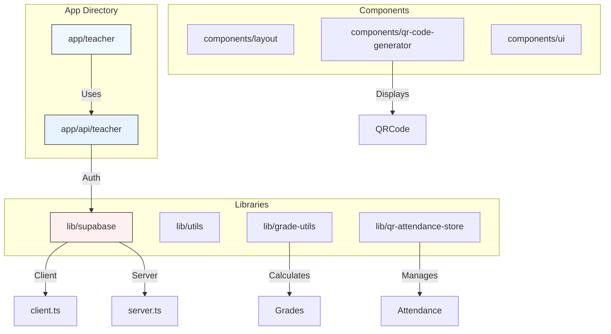
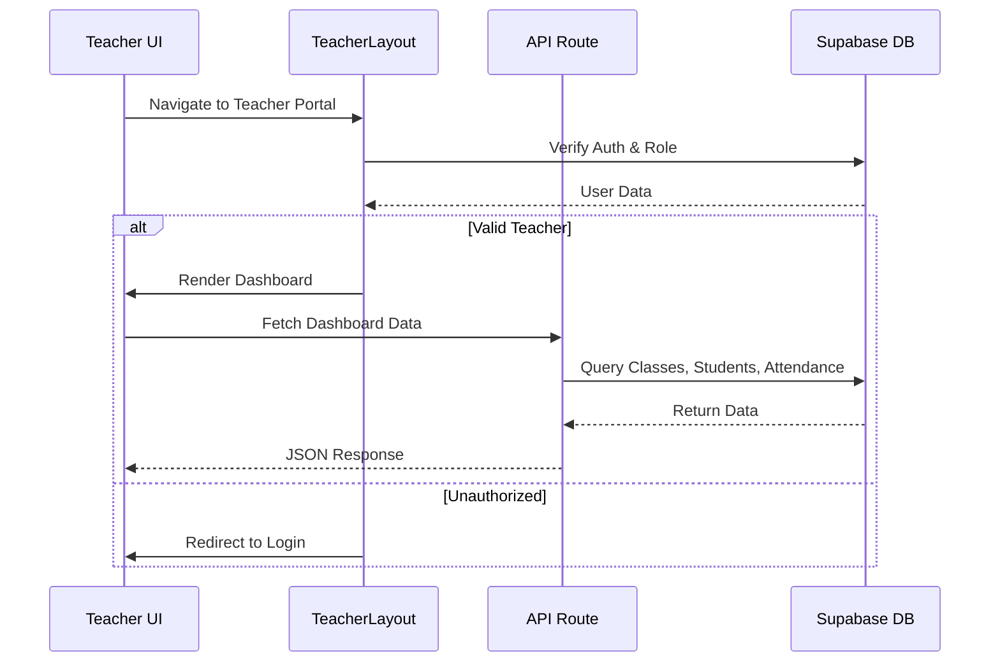
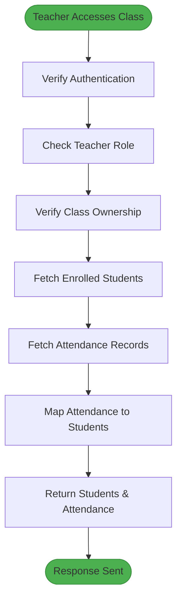
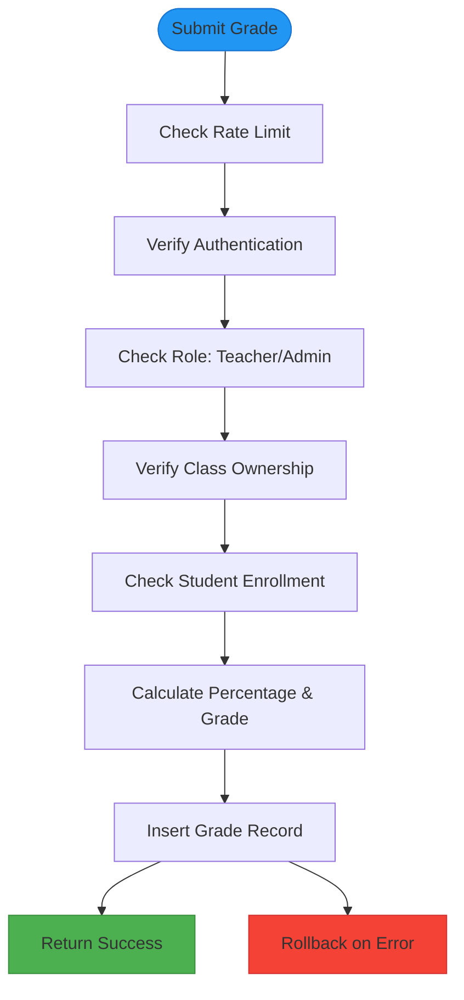
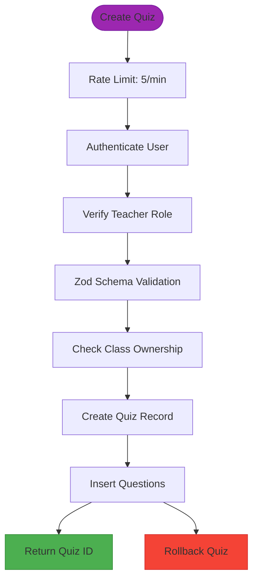
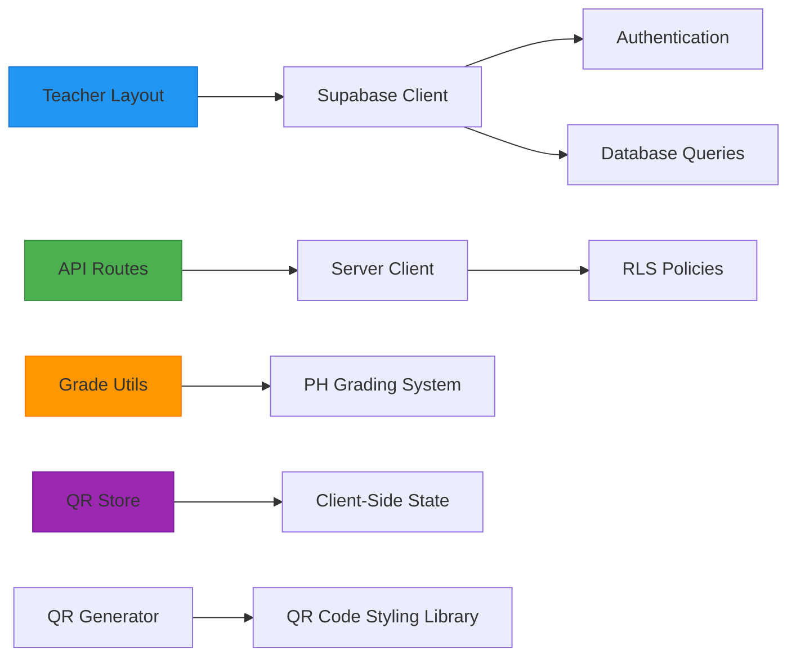

# Teacher Portal

<cite>
**Referenced Files in This Document**   
- [layout.tsx](file://app/teacher/layout.tsx)
- [page.tsx](file://app/teacher/page.tsx)
- [save/route.ts](file://app/api/teacher/attendance/save/route.ts)
- [create/route.ts](file://app/api/teacher/grades/create/route.ts)
- [my-classes/route.ts](file://app/api/teacher/my-classes/route.ts)
- [class/[id]/route.ts](file://app/api/teacher/grades/class/[id]/route.ts)
- [client.ts](file://lib/supabase/client.ts)
- [server.ts](file://lib/supabase/server.ts)
- [class-data/route.ts](file://app/api/teacher/attendance/class-data/route.ts)
- [create-quiz/route.ts](file://app/api/teacher/create-quiz/route.ts)
- [grade-utils.ts](file://lib/grade-utils.ts)
- [qr-attendance-store.ts](file://lib/qr-attendance-store.ts)
- [qr-code-generator.tsx](file://components/qr-code-generator.tsx)
</cite>

## Table of Contents
1. [Introduction](#introduction)
2. [Project Structure](#project-structure)
3. [Core Components](#core-components)
4. [Architecture Overview](#architecture-overview)
5. [Detailed Component Analysis](#detailed-component-analysis)
6. [Dependency Analysis](#dependency-analysis)
7. [Performance Considerations](#performance-considerations)
8. [Troubleshooting Guide](#troubleshooting-guide)
9. [Conclusion](#conclusion)

## Introduction
The Teacher Portal serves as the primary interface for educators to manage their classes, students, and academic activities. This documentation provides a comprehensive overview of its functionality, including class management, attendance tracking via QR codes, grade entry, quiz creation, lesson planning, and meeting scheduling. The system is built on a secure Next.js architecture with Supabase integration for real-time data synchronization and optimized queries. The portal ensures role-based access control, rate limiting, and robust error handling to support efficient classroom operations.

## Project Structure

**Diagram sources**
- [layout.tsx](file://app/teacher/layout.tsx)
- [server.ts](file://lib/supabase/server.ts)
- [qr-code-generator.tsx](file://components/qr-code-generator.tsx)

**Section sources**
- [layout.tsx](file://app/teacher/layout.tsx)
- [page.tsx](file://app/teacher/page.tsx)

## Core Components

The Teacher Portal's core functionality revolves around five key areas: class management, attendance, grading, quizzes, and scheduling. Each component is implemented using role-specific pages under the `app/teacher/` directory, with API routes in `app/api/teacher/` handling data operations. The layout enforces authentication and role validation before rendering any content. Real-time updates are achieved through Supabase subscriptions, while performance is optimized using server-side data fetching and caching strategies.

**Section sources**
- [page.tsx](file://app/teacher/page.tsx)
- [layout.tsx](file://app/teacher/layout.tsx)
- [dashboard](file://app/api/teacher/dashboard)

## Architecture Overview

**Diagram sources**
- [layout.tsx](file://app/teacher/layout.tsx)
- [page.tsx](file://app/teacher/page.tsx)
- [dashboard/route.ts](file://app/api/teacher/dashboard/route.ts)

## Detailed Component Analysis

### Class Management and Attendance System

#### Class Data Retrieval Flow

**Diagram sources**
- [class-data/route.ts](file://app/api/teacher/attendance/class-data/route.ts)
- [my-classes/route.ts](file://app/api/teacher/my-classes/route.ts)

**Section sources**
- [class-data/route.ts](file://app/api/teacher/attendance/class-data/route.ts)
- [my-classes/route.ts](file://app/api/teacher/my-classes/route.ts)

### Grade Management System

#### Grade Creation and Validation Process

**Diagram sources**
- [create/route.ts](file://app/api/teacher/grades/create/route.ts)
- [grade-utils.ts](file://lib/grade-utils.ts)

**Section sources**
- [create/route.ts](file://app/api/teacher/grades/create/route.ts)
- [grade-utils.ts](file://lib/grade-utils.ts)

### Quiz Creation System

#### Secure Quiz Creation Workflow

**Diagram sources**
- [create-quiz/route.ts](file://app/api/teacher/create-quiz/route.ts)
- [quizzes table](file://supabase/migrations/20251219043525_create_quizzes_tables.sql)

**Section sources**
- [create-quiz/route.ts](file://app/api/teacher/create-quiz/route.ts)

## Dependency Analysis

**Diagram sources**
- [client.ts](file://lib/supabase/client.ts)
- [server.ts](file://lib/supabase/server.ts)
- [grade-utils.ts](file://lib/grade-utils.ts)
- [qr-attendance-store.ts](file://lib/qr-attendance-store.ts)

**Section sources**
- [client.ts](file://lib/supabase/client.ts)
- [server.ts](file://lib/supabase/server.ts)

## Performance Considerations

The Teacher Portal implements several performance optimization techniques:
- **Optimized Queries**: API routes use targeted SELECT statements instead of broad queries
- **Rate Limiting**: Prevents abuse and ensures system stability (20 grades/minute, 5 quizzes/minute)
- **Client-Side Caching**: Zustand store manages QR attendance sessions
- **Real-Time Subscriptions**: Supabase listeners update data without polling
- **Batch Operations**: Attendance records are processed in batches with upsert operations
- **Server-Side Calculation**: Grade calculations occur server-side to ensure consistency

Grade calculations use weighted averages based on assessment types (quizzes 30%, exams 35%, assignments 20%, projects 15%) with normalization for incomplete data sets. The system converts raw percentages to the Philippine grading scale (75-100) using a defined lookup table.

**Section sources**
- [grade-utils.ts](file://lib/grade-utils.ts)
- [use-optimized-query.ts](file://lib/hooks/use-optimized-query.ts)

## Troubleshooting Guide

Common issues and resolution steps:

**Failed Grade Submissions**
- **Cause**: Invalid score values or missing fields
- **Solution**: Ensure all required fields are filled and score ≤ maxScore
- **Source**: [create/route.ts](file://app/api/teacher/grades/create/route.ts#L37-L50)

**Attendance Sync Problems**
- **Cause**: Class ownership verification failure
- **Solution**: Verify the teacher is assigned as instructor for the class
- **Source**: [save/route.ts](file://app/api/teacher/attendance/save/route.ts#L30-L45)

**Quiz Creation Failures**
- **Cause**: Zod validation errors
- **Solution**: Check question format and ensure at least one question exists
- **Source**: [create-quiz/route.ts](file://app/api/teacher/create-quiz/route.ts#L57-L62)

**Authentication Issues**
- **Cause**: Session expiration or role mismatch
- **Solution**: Re-login and verify account has 'teacher' role
- **Source**: [layout.tsx](file://app/teacher/layout.tsx#L15-L34)

**QR Code Not Scanning**
- **Cause**: Expired session or network issues
- **Solution**: Refresh QR code and check internet connection
- **Source**: [qr-attendance-store.ts](file://lib/qr-attendance-store.ts#L58-L59)

**Section sources**
- [create/route.ts](file://app/api/teacher/grades/create/route.ts)
- [save/route.ts](file://app/api/teacher/attendance/save/route.ts)
- [create-quiz/route.ts](file://app/api/teacher/create-quiz/route.ts)
- [layout.tsx](file://app/teacher/layout.tsx)
- [qr-attendance-store.ts](file://lib/qr-attendance-store.ts)

## Conclusion

The Teacher Portal provides a comprehensive, secure, and efficient interface for educators to manage their academic responsibilities. Its architecture leverages Next.js and Supabase to deliver real-time data synchronization, role-based access control, and optimized performance. Key features like QR-based attendance, automated grade calculations, and secure quiz creation streamline classroom operations while maintaining data integrity. The system's robust error handling and rate limiting ensure reliability even under heavy usage. Future enhancements could include advanced analytics, parent communication tools, and mobile app integration to further extend its capabilities.