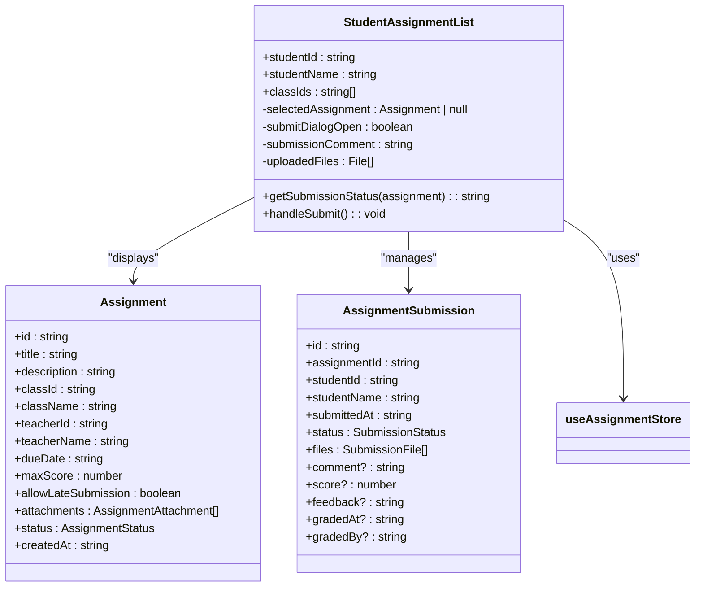
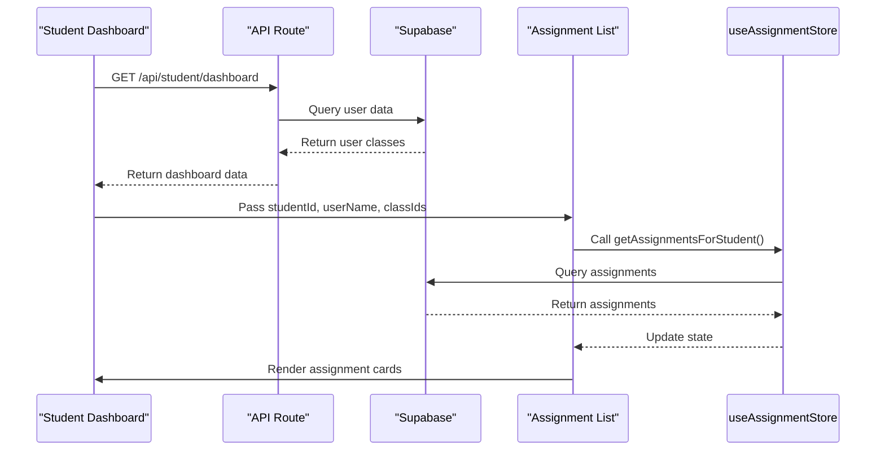
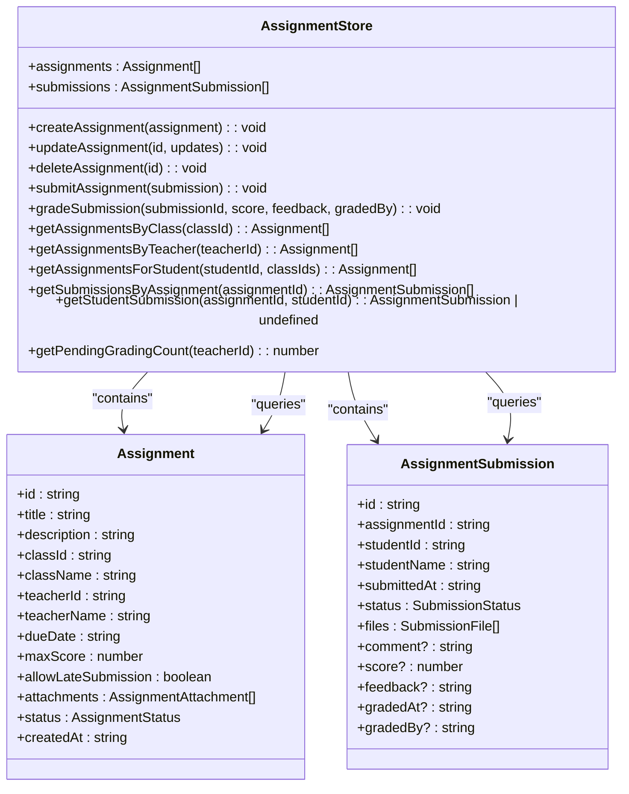
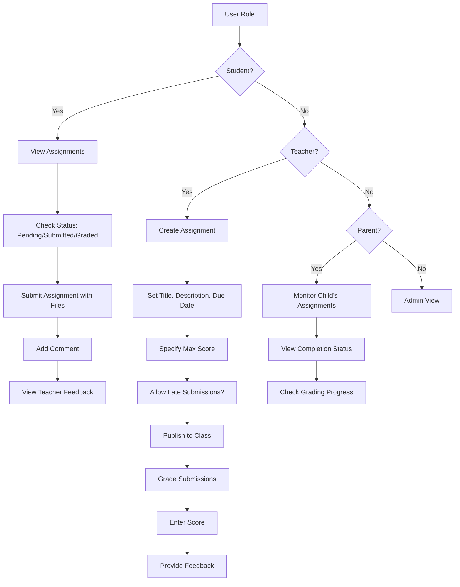
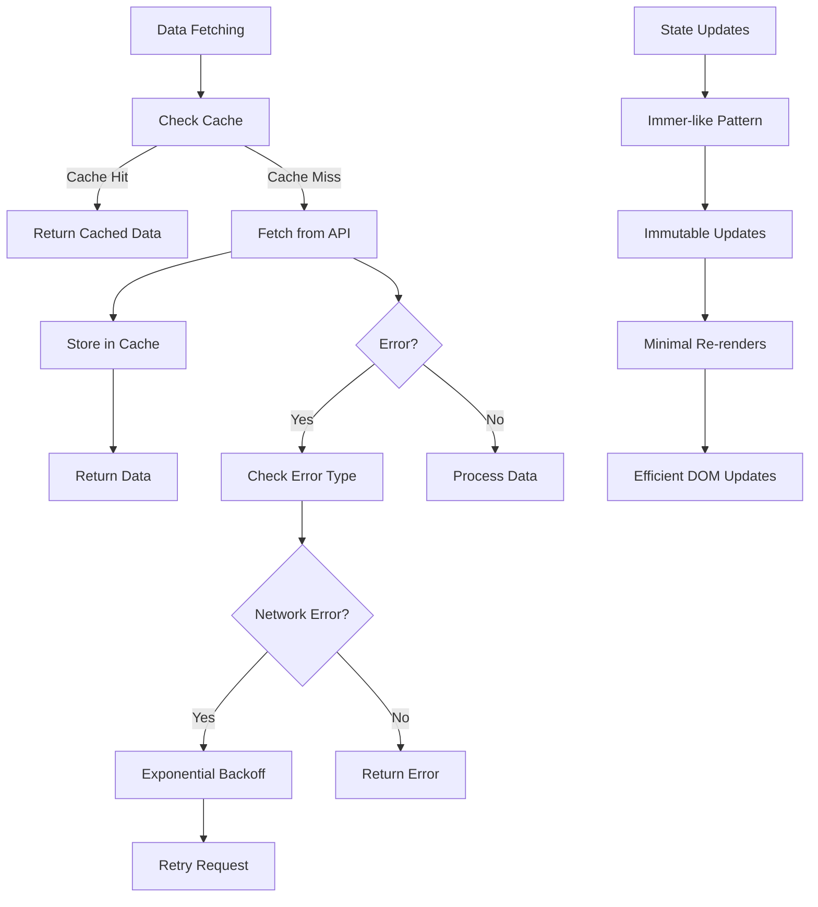

# Assignment List

<cite>
**Referenced Files in This Document**   
- [assignment-list.tsx](file://components/assignment-list.tsx)
- [assignment-store.ts](file://lib/assignment-store.ts)
- [route.ts](file://app/api/assignments/route.ts)
- [student/assignments/page.tsx](file://app/student/assignments/page.tsx)
- [teacher/assignments/page.tsx](file://app/teacher/assignments/page.tsx)
- [teacher-assignment-manager.tsx](file://components/teacher-assignment-manager.tsx)
- [types.ts](file://lib/types.ts)
- [use-optimized-query.ts](file://lib/hooks/use-optimized-query.ts)
</cite>

## Table of Contents
1. [Introduction](#introduction)
2. [Core Components](#core-components)
3. [Data Fetching and API Integration](#data-fetching-and-api-integration)
4. [Zustand Store Implementation](#zustand-store-implementation)
5. [Usage Examples](#usage-examples)
6. [Responsive Design and Accessibility](#responsive-design-and-accessibility)
7. [Performance Optimizations](#performance-optimizations)
8. [Error Handling and State Management](#error-handling-and-state-management)
9. [Prop Usage and Event Handling](#prop-usage-and-event-handling)

## Introduction
The Assignment List component is a central feature in the school management system, providing a unified interface for students, teachers, and parents to manage academic assignments. This component displays assignments with their status, deadlines, and grading information, enabling users to submit work, view feedback, and track progress. The implementation leverages client-side state management with Zustand for real-time updates and offline capabilities, while integrating with API routes for persistent data storage. The component is designed to be responsive and accessible, with performance optimizations for handling large lists of assignments.

**Section sources**
- [assignment-list.tsx](file://components/assignment-list.tsx#L1-L271)
- [assignment-store.ts](file://lib/assignment-store.ts#L1-L174)

## Core Components
The Assignment List component is implemented as a React client component with distinct functionality for different user roles. The core implementation resides in `assignment-list.tsx`, which exports the `StudentAssignmentList` component. This component renders a list of assignment cards, each displaying the assignment title, description, due date, status badge, and relevant actions based on the submission status. For students, the component provides a submission dialog that allows uploading files and adding comments. For teachers and parents, the component displays grading information and feedback when available. The UI uses Card components from the UI library with consistent styling and responsive layout.

**Diagram sources**
- [assignment-list.tsx](file://components/assignment-list.tsx#L34-L271)
- [assignment-store.ts](file://lib/assignment-store.ts#L9-L46)

**Section sources**
- [assignment-list.tsx](file://components/assignment-list.tsx#L1-L271)

## Data Fetching and API Integration
The Assignment List component integrates with the backend through API routes that handle CRUD operations for assignments. The primary API endpoint at `app/api/assignments/route.ts` supports GET and POST methods for fetching and creating assignments. The GET method retrieves assignments with filtering based on user role and class ID, while the POST method creates new assignments with validation using Zod schema. The API implements role-based access control, ensuring that teachers can only access their own assignments while students see only published assignments. Data fetching occurs through the student and teacher dashboard pages, which retrieve user-specific data from `/api/student/dashboard` and `/api/teacher/my-classes` endpoints before passing it to the Assignment List component.

**Diagram sources**
- [route.ts](file://app/api/assignments/route.ts#L1-L134)
- [student/assignments/page.tsx](file://app/student/assignments/page.tsx#L1-L68)
- [assignment-store.ts](file://lib/assignment-store.ts#L74-L76)

**Section sources**
- [route.ts](file://app/api/assignments/route.ts#L1-L134)
- [student/assignments/page.tsx](file://app/student/assignments/page.tsx#L1-L68)
- [teacher/assignments/page.tsx](file://app/teacher/assignments/page.tsx#L1-L73)

## Zustand Store Implementation
The Assignment List component uses a Zustand store for state management, providing real-time updates and offline capabilities. The store, defined in `assignment-store.ts`, maintains two primary state arrays: assignments and submissions. It exposes actions for creating, updating, and deleting assignments, as well as submitting and grading assignments. The store also provides query methods for filtering assignments by class, teacher, or student. The implementation uses immer-like patterns with the `set` function to update state immutably. When a student submits an assignment, the store automatically determines if it's late based on the current date and due date, setting the appropriate status. The store is designed to be persistent, with data eventually synchronized with the backend database.

**Diagram sources**
- [assignment-store.ts](file://lib/assignment-store.ts#L58-L173)

**Section sources**
- [assignment-store.ts](file://lib/assignment-store.ts#L1-L174)

## Usage Examples
The Assignment List component is used differently across user roles, providing tailored experiences for students, teachers, and parents. Students use the component to view pending assignments, submit work before deadlines, and check graded submissions with feedback. Teachers use a related component, `TeacherAssignmentManager`, to create assignments, publish them to classes, and grade student submissions. Parents can monitor their children's assignment completion status through a parent dashboard. The component adapts its interface based on the user's role, showing submission buttons for students, grading actions for teachers, and read-only status for parents. Each user type sees only relevant assignments based on their enrolled classes or teaching responsibilities.

**Diagram sources**
- [assignment-list.tsx](file://components/assignment-list.tsx#L40-L271)
- [teacher-assignment-manager.tsx](file://components/teacher-assignment-manager.tsx#L52-L485)
- [student/assignments/page.tsx](file://app/student/assignments/page.tsx#L9-L68)
- [teacher/assignments/page.tsx](file://app/teacher/assignments/page.tsx#L9-L73)

**Section sources**
- [assignment-list.tsx](file://components/assignment-list.tsx#L34-L38)
- [teacher-assignment-manager.tsx](file://components/teacher-assignment-manager.tsx#L46-L51)
- [student/assignments/page.tsx](file://app/student/assignments/page.tsx#L59-L63)
- [teacher/assignments/page.tsx](file://app/teacher/assignments/page.tsx#L64-L68)

## Responsive Design and Accessibility
The Assignment List component implements responsive design patterns to ensure usability across devices. The layout uses a card-based design that stacks vertically on mobile devices and can display multiple cards per row on larger screens. Each assignment card includes accessibility features such as proper ARIA labels, keyboard navigation support, and sufficient color contrast. The submission dialog is implemented as a modal with proper focus trapping and close functionality. Icons are accompanied by text labels to ensure clarity, and interactive elements have appropriate hover and focus states. The component uses the UI library's accessible components like Button, Input, and Dialog to maintain consistency and accessibility standards.

**Section sources**
- [assignment-list.tsx](file://components/assignment-list.tsx#L89-L269)
- [components/ui](file://components/ui)

## Performance Optimizations
The Assignment List component includes several performance optimizations for rendering large lists of assignments. The implementation uses React's useState and useEffect hooks efficiently, minimizing re-renders through proper state management. The component leverages the `useOptimizedQuery` hook from `use-optimized-query.ts`, which provides caching, deduplication, and retry logic for data fetching. This hook implements exponential backoff for retrying failed requests and maintains a cache with configurable TTL. For large datasets, the system could implement virtualization or infinite scrolling, though the current implementation loads all assignments at once for simplicity. The Zustand store provides efficient state updates with minimal re-renders by only updating components that depend on changed state.

**Diagram sources**
- [use-optimized-query.ts](file://lib/hooks/use-optimized-query.ts#L28-L275)
- [assignment-store.ts](file://lib/assignment-store.ts#L80-L173)

**Section sources**
- [use-optimized-query.ts](file://lib/hooks/use-optimized-query.ts#L1-L275)
- [assignment-store.ts](file://lib/assignment-store.ts#L80-L173)

## Error Handling and State Management
The Assignment List component implements comprehensive error handling and state management strategies. The `useOptimizedQuery` hook provides built-in error handling with retry logic for transient network failures, automatically retrying requests with exponential backoff. The component displays appropriate loading states during data fetching and error messages when requests fail. The Zustand store maintains a consistent state, with actions that handle edge cases like submitting to non-existent assignments or grading non-submitted work. The submission dialog includes validation to ensure required fields are filled before submission. The component also handles stale data by providing mechanisms to invalidate the cache and refetch data when necessary, such as after submitting an assignment or grading a submission.

**Section sources**
- [use-optimized-query.ts](file://lib/hooks/use-optimized-query.ts#L49-L92)
- [assignment-store.ts](file://lib/assignment-store.ts#L110-L123)
- [assignment-list.tsx](file://components/assignment-list.tsx#L58-L79)

## Prop Usage and Event Handling
The Assignment List component accepts several props to customize its behavior: `studentId`, `studentName`, and `classIds`. These props are used to filter assignments relevant to the specific student and to populate submission metadata. Event handling is implemented through React's event system, with handlers for dialog opening/closing, file selection, comment input, and form submission. The `handleSubmit` function processes the submission by calling the store's `submitAssignment` action with the appropriate data. Event handlers are properly bound using arrow functions to maintain the correct `this` context. The component uses controlled components for form inputs, with state variables managing the dialog state, submission comment, and uploaded files.

**Section sources**
- [assignment-list.tsx](file://components/assignment-list.tsx#L34-L38)
- [assignment-list.tsx](file://components/assignment-list.tsx#L41-L44)
- [assignment-list.tsx](file://components/assignment-list.tsx#L58-L79)