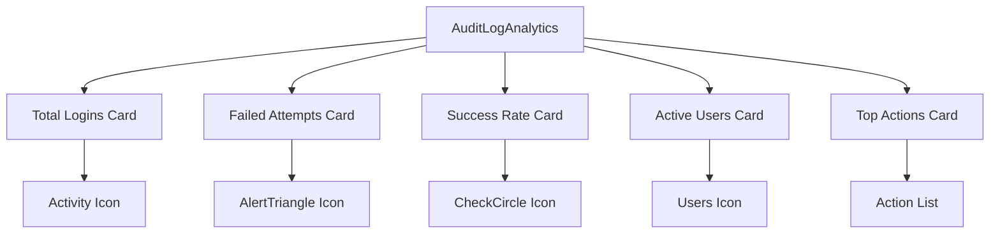
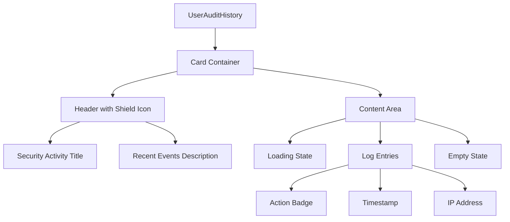
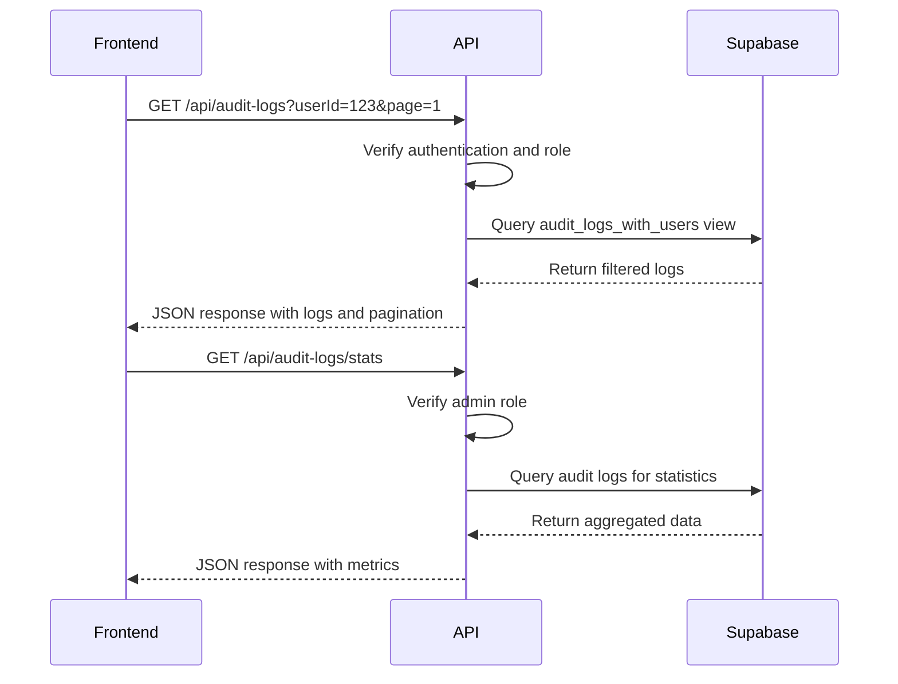
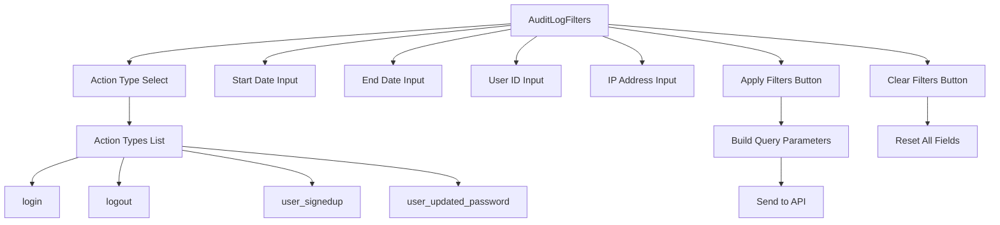
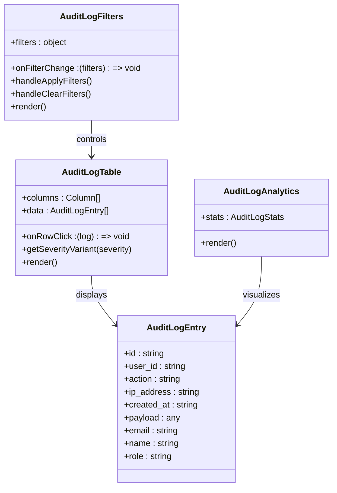
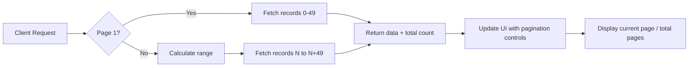
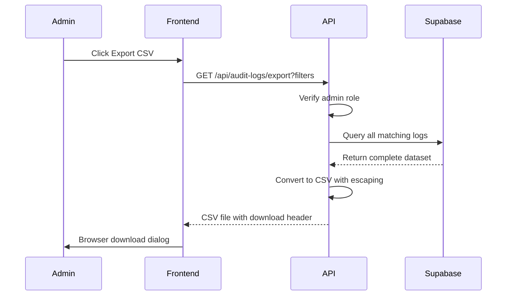
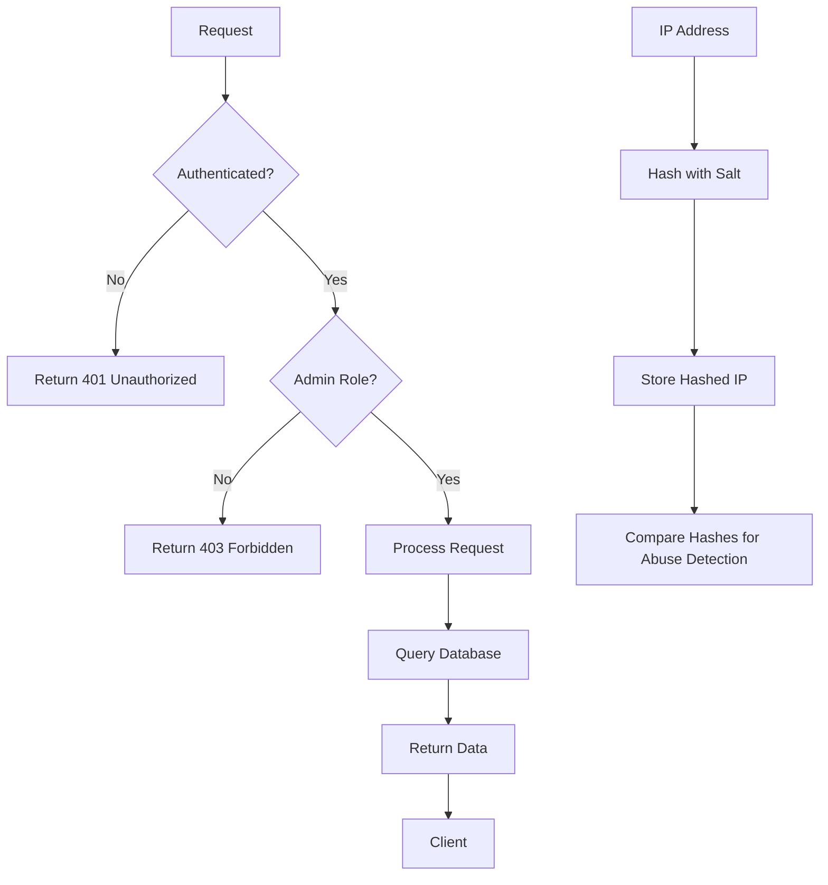
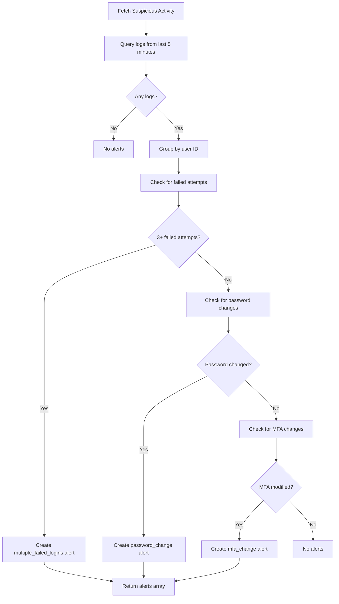
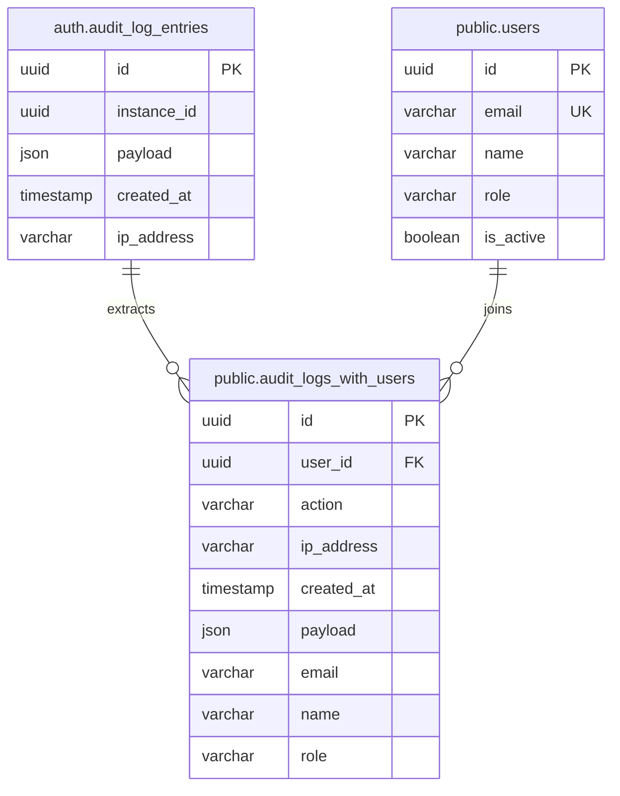

# Audit Log Components

<cite>
**Referenced Files in This Document**   
- [audit-logs/page.tsx](file://app/admin/audit-logs/page.tsx)
- [audit-log-analytics.tsx](file://components/audit-log-analytics.tsx)
- [user-audit-history.tsx](file://components/user-audit-history.tsx)
- [audit-log-filters.tsx](file://components/audit-log-filters.tsx)
- [audit-log-table.tsx](file://components/audit-log-table.tsx)
- [route.ts](file://app/api/audit-logs/route.ts)
- [export/route.ts](file://app/api/audit-logs/export/route.ts)
- [stats/route.ts](file://app/api/audit-logs/stats/route.ts)
- [audit-logs.ts](file://lib/supabase/audit-logs.ts)
- [20260108_audit_logs_indexes.sql](file://supabase/migrations/20260108_audit_logs_indexes.sql)
- [security.ts](file://lib/security.ts)
- [session-security.ts](file://lib/session-security.ts)
- [SECURITY.md](file://SECURITY.md)
</cite>

## Table of Contents
1. [Introduction](#introduction)
2. [Audit Log Analytics Dashboard](#audit-log-analytics-dashboard)
3. [User Audit History Component](#user-audit-history-component)
4. [Data Fetching and API Integration](#data-fetching-and-api-integration)
5. [Filtering and Search Functionality](#filtering-and-search-functionality)
6. [Data Transformation and Visualization](#data-transformation-and-visualization)
7. [Performance Optimization and Pagination](#performance-optimization-and-pagination)
8. [Export Functionality](#export-functionality)
9. [Security Considerations](#security-considerations)
10. [Suspicious Activity Detection](#suspicious-activity-detection)
11. [Database Schema and Indexing](#database-schema-and-indexing)

## Introduction

The Audit Log Components in the School Management System provide comprehensive monitoring and analysis of system activity, focusing on authentication events and security-related actions. These components enable administrators to track user behavior, identify potential security threats, and maintain compliance with security policies. The system consists of two primary components: the Audit Log Analytics dashboard for administrators and the User Audit History component for individual account monitoring. The implementation leverages Supabase for data storage and retrieval, with React components for presentation and interaction. The architecture follows a client-server model where the frontend components fetch data from API routes that query the Supabase database.

**Section sources**
- [audit-logs/page.tsx](file://app/admin/audit-logs/page.tsx)
- [SECURITY.md](file://SECURITY.md)

## Audit Log Analytics Dashboard

The Audit Log Analytics dashboard provides administrators with a comprehensive overview of system authentication activity. This component displays key metrics such as total logins, failed attempts, success rate, and active users through a series of visual cards. The dashboard also shows the top actions performed in the system, allowing administrators to quickly identify the most common activities. The analytics are updated in real-time as filters are applied, providing immediate feedback on the impact of different filter criteria. The component is designed to be responsive, adapting its layout to different screen sizes by arranging the metric cards in a grid that adjusts from four columns on large screens to a single column on mobile devices. The dashboard is integrated with the main audit logs page and automatically updates when the underlying data changes.

**Diagram sources**
- [audit-log-analytics.tsx](file://components/audit-log-analytics.tsx)

**Section sources**
- [audit-log-analytics.tsx](file://components/audit-log-analytics.tsx)
- [audit-logs/page.tsx](file://app/admin/audit-logs/page.tsx)

## User Audit History Component

The User Audit History component displays recent security-related activities for an individual user account. This component is typically used on user profile pages to provide account owners with visibility into their own authentication history. It shows a chronological list of security events such as logins, logouts, password changes, and MFA modifications. Each entry includes the action type, timestamp, and IP address, with visual indicators for the severity of the action. High-severity actions like password changes or account deletions are highlighted with destructive badges, while medium and low-severity actions use default and secondary variants respectively. The component includes a loading state with a spinner animation and handles empty states by displaying a message when no activity has been recorded. It fetches data using the `getUserAuditLogs` function from the Supabase utilities, which retrieves the most recent logs for the specified user ID.

**Diagram sources**
- [user-audit-history.tsx](file://components/user-audit-history.tsx)

**Section sources**
- [user-audit-history.tsx](file://components/user-audit-history.tsx)
- [audit-logs.ts](file://lib/supabase/audit-logs.ts)

## Data Fetching and API Integration

The audit log components retrieve data through a series of API routes that serve as intermediaries between the frontend components and the Supabase database. The primary route at `/api/audit-logs` handles GET requests to fetch audit log entries with support for various filtering parameters including user ID, action type, date range, and IP address. This route implements role-based access control, ensuring that only administrators can view all logs while regular users can only access their own logs. The API also includes specialized routes for retrieving statistics (`/api/audit-logs/stats`) and exporting data (`/api/audit-logs/export`). All API routes perform authentication checks using Supabase's built-in authentication system and validate user roles before processing requests. The client-side components use the Fetch API to make requests to these endpoints, passing filter parameters as query string parameters and handling the responses to update component state.

**Diagram sources**
- [route.ts](file://app/api/audit-logs/route.ts)
- [stats/route.ts](file://app/api/audit-logs/stats/route.ts)
- [audit-logs/page.tsx](file://app/admin/audit-logs/page.tsx)

**Section sources**
- [route.ts](file://app/api/audit-logs/route.ts)
- [stats/route.ts](file://app/api/audit-logs/stats/route.ts)
- [export/route.ts](file://app/api/audit-logs/export/route.ts)
- [audit-logs/page.tsx](file://app/admin/audit-logs/page.tsx)

## Filtering and Search Functionality

The audit log system provides comprehensive filtering capabilities through the AuditLogFilters component, which allows users to narrow down log entries based on multiple criteria. The filter interface includes fields for action type, date range, user ID, and IP address, with a clean and intuitive layout that adapts to different screen sizes. Users can select from a predefined list of action types including login, logout, password changes, and user modifications. Date filters use HTML5 date input controls for precise selection of start and end dates. The component maintains its state internally and only applies filters when the user clicks the "Apply Filters" button, preventing unnecessary API calls during input. A clear filters button is provided to reset all filter fields to their default values. The filtering logic on the server side translates these parameters into appropriate database queries, using exact matches for user ID and IP address, and range queries for dates.

**Diagram sources**
- [audit-log-filters.tsx](file://components/audit-log-filters.tsx)

**Section sources**
- [audit-log-filters.tsx](file://components/audit-log-filters.tsx)
- [route.ts](file://app/api/audit-logs/route.ts)

## Data Transformation and Visualization

The audit log data is transformed and visualized through a combination of React components and utility functions that enhance the raw data for presentation. The AuditLogTable component renders log entries in a tabular format with specialized rendering for different data types. Date and time values are formatted for readability, displaying the date in one line and time in a smaller font below. User information is presented with the name in bold and email in a lighter color beneath. Action types are displayed as colored badges, with the color determined by the action's severity level as calculated by the `getActionSeverity` function. The `getActionDisplayName` utility transforms technical action codes into user-friendly labels, such as converting "user_updated_password" to "Password Changed". IP addresses are displayed in a monospace font to distinguish them from other text. The table supports row click events, allowing users to view detailed information about a specific log entry in a modal dialog.

**Diagram sources**
- [audit-log-table.tsx](file://components/audit-log-table.tsx)
- [audit-log-analytics.tsx](file://components/audit-log-analytics.tsx)
- [audit-log-filters.tsx](file://components/audit-log-filters.tsx)

**Section sources**
- [audit-log-table.tsx](file://components/audit-log-table.tsx)
- [audit-log-analytics.tsx](file://components/audit-log-analytics.tsx)
- [audit-logs.ts](file://lib/supabase/audit-logs.ts)

## Performance Optimization and Pagination

The audit log system implements several performance optimizations to handle potentially large datasets efficiently. The primary mechanism is server-side pagination, which limits the number of records returned in each API response to 50 by default. The pagination controls in the UI allow users to navigate between pages, with previous and next buttons that are disabled when at the beginning or end of the dataset. The total number of pages and current position are displayed to provide context. The database queries use range-based pagination with the `range()` method, which is more efficient than offset-based pagination for large datasets. Database indexes have been created on frequently queried columns such as user_id, action, and created_at to improve query performance. The audit_logs_with_users view includes a count parameter to efficiently retrieve the total number of matching records without loading all data into memory.

**Diagram sources**
- [audit-logs.ts](file://lib/supabase/audit-logs.ts)
- [audit-logs/page.tsx](file://app/admin/audit-logs/page.tsx)

**Section sources**
- [audit-logs.ts](file://lib/supabase/audit-logs.ts)
- [audit-logs/page.tsx](file://app/admin/audit-logs/page.tsx)
- [20260108_performance_indexes.sql](file://supabase/migrations/20260108_performance_indexes.sql)

## Export Functionality

The audit log system includes export functionality that allows administrators to download log data in CSV format for offline analysis or compliance reporting. The export feature is accessible via a dedicated "Export CSV" button in the audit logs interface, which triggers a request to the `/api/audit-logs/export` endpoint. Unlike the paginated main API, the export endpoint retrieves all matching records without pagination limits, with a large page size of 10,000 records to accommodate extensive datasets. The server-side implementation converts the audit log entries to CSV format using the `exportAuditLogsToCSV` utility function, which properly escapes cell values to prevent formula injection attacks in spreadsheet applications. The CSV includes columns for date, user, email, role, action, and IP address, with appropriate formatting for each data type. The response is sent with a content disposition header that prompts the browser to download the file with a timestamped filename.

**Diagram sources**
- [export/route.ts](file://app/api/audit-logs/export/route.ts)
- [audit-logs.ts](file://lib/supabase/audit-logs.ts)

**Section sources**
- [export/route.ts](file://app/api/audit-logs/export/route.ts)
- [audit-logs.ts](file://lib/supabase/audit-logs.ts)

## Security Considerations

The audit log system incorporates multiple security measures to protect sensitive log data and prevent unauthorized access. Access control is enforced at both the application and database levels, with only users having the "admin" role permitted to view the audit logs dashboard or export data. The API routes validate user roles by querying the users table to confirm the requesting user's role before processing any requests. Sensitive operations like data export are restricted to administrators only. The system implements proper authentication checks using Supabase's built-in authentication to ensure that only authenticated users can access the audit log endpoints. The SECURITY.md document outlines additional security features including rate limiting, input validation with Zod schemas, and origin/referer validation for CSRF protection. IP addresses in the logs are hashed using SHA-256 with a salt to preserve user privacy while still allowing abuse detection through hash comparison.

**Diagram sources**
- [route.ts](file://app/api/audit-logs/route.ts)
- [security.ts](file://lib/security.ts)
- [SECURITY.md](file://SECURITY.md)

**Section sources**
- [route.ts](file://app/api/audit-logs/route.ts)
- [security.ts](file://lib/security.ts)
- [SECURITY.md](file://SECURITY.md)

## Suspicious Activity Detection

The system includes proactive suspicious activity detection that identifies potential security threats in real-time. The detection mechanism is triggered by adding the `detectSuspicious=true` parameter to the audit logs API request, which causes the server to analyze recent authentication events for patterns indicative of abuse. The detection algorithm looks for multiple failed login attempts within a short time window (5 minutes), which may indicate a brute force attack. It also flags important security events such as password changes and MFA configuration modifications, which could indicate account takeover attempts. When suspicious activity is detected, the system returns an array of alerts that are displayed prominently in the UI with a warning banner. Each alert includes a descriptive message and the count of occurrences, allowing administrators to quickly assess the severity of the situation. The detection runs automatically when the audit logs page loads, providing immediate visibility into potential security issues.

**Diagram sources**
- [route.ts](file://app/api/audit-logs/route.ts)
- [audit-logs.ts](file://lib/supabase/audit-logs.ts)

**Section sources**
- [audit-logs.ts](file://lib/supabase/audit-logs.ts)
- [audit-logs/page.tsx](file://app/admin/audit-logs/page.tsx)

## Database Schema and Indexing

The audit log system relies on a database schema that combines Supabase's built-in authentication audit logs with custom views and indexes for efficient querying. The core data is stored in the `auth.audit_log_entries` table, which is automatically maintained by Supabase and contains raw authentication events with JSON payloads. To make this data more accessible, a view called `audit_logs_with_users` has been created that extracts relevant fields from the JSON payload and joins them with user information from the users table. This view includes the user ID, action type, IP address, timestamp, and associated user details such as email, name, and role. Database indexes have been created on frequently queried columns to optimize performance, including indexes on user_id, action, and created_at. The view is granted SELECT permission to authenticated users, enabling secure access to the audit data while maintaining proper access controls.

**Diagram sources**
- [20260108_audit_logs_indexes.sql](file://supabase/migrations/20260108_audit_logs_indexes.sql)
- [audit-logs.ts](file://lib/supabase/audit-logs.ts)

**Section sources**
- [20260108_audit_logs_indexes.sql](file://supabase/migrations/20260108_audit_logs_indexes.sql)
- [audit-logs.ts](file://lib/supabase/audit-logs.ts)