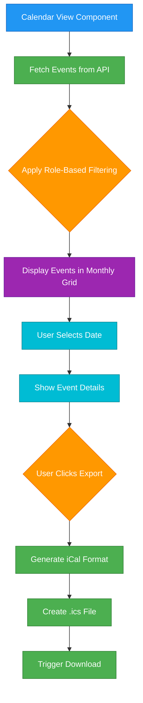
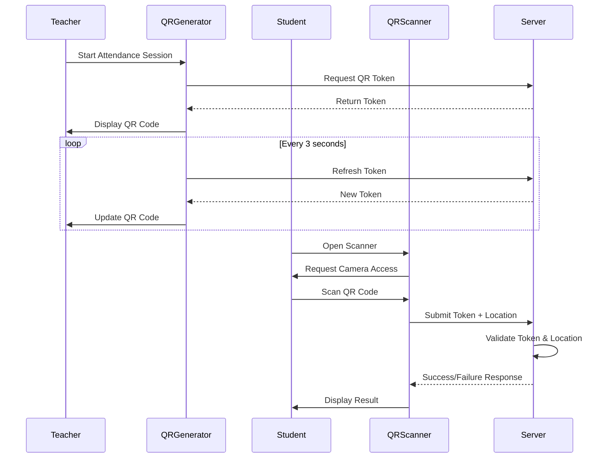
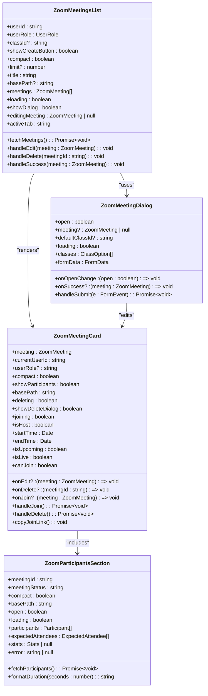

# Business Components

<cite>
**Referenced Files in This Document**   
- [teacher-assignment-manager.tsx](file://components/teacher-assignment-manager.tsx)
- [calendar-view.tsx](file://components/calendar-view.tsx)
- [qr-code-generator.tsx](file://components/qr-code-generator.tsx)
- [qr-scanner.tsx](file://components/qr-scanner.tsx)
- [zoom-meetings-list.tsx](file://components/zoom-meetings-list.tsx)
- [zoom-participants-section.tsx](file://components/zoom-participants-section.tsx)
- [assignment-store.ts](file://lib/assignment-store.ts)
- [qr-attendance-store.ts](file://lib/qr-attendance-store.ts)
- [types.ts](file://lib/types.ts)
- [route.ts](file://app/api/calendar/route.ts)
- [route.ts](file://app/api/zoom/meetings/route.ts)
- [page.tsx](file://app/teacher/qr-attendance/page.tsx)
- [page.tsx](file://app/student/qr-checkin/page.tsx)
</cite>

## Table of Contents
1. [Introduction](#introduction)
2. [Teacher Assignment Manager](#teacher-assignment-manager)
3. [Calendar View with iCal Export](#calendar-view-with-ical-export)
4. [QR Code Generator and Scanner](#qr-code-generator-and-scanner)
5. [Zoom Meetings List and Participants Section](#zoom-meetings-list-and-participants-section)
6. [Data Flow and State Management](#data-flow-and-state-management)
7. [Component Composition and Reuse](#component-composition-and-reuse)
8. [Performance Considerations](#performance-considerations)
9. [Conclusion](#conclusion)

## Introduction
This document provides comprehensive documentation for the business-specific components in the School Management System that encapsulate domain logic for educational workflows. The components covered include the teacher-assignment-manager for quiz and assignment workflows, calendar-view with iCal export functionality, qr-code-generator for attendance check-in, qr-scanner for student use, zoom-meetings-list, and participants-section for virtual classroom management. The documentation details the integration with API routes, state management patterns, error handling, component composition, and performance considerations for real-time updates and large data sets.

## Teacher Assignment Manager

The Teacher Assignment Manager component provides a comprehensive interface for teachers to create, manage, and grade assignments for their classes. It features a tabbed interface that separates published assignments from submissions pending grading, streamlining the workflow for educators.

The component allows teachers to create new assignments with various configuration options including title, description, due date, maximum score, late submission allowance, and status (draft or published). Assignments can be filtered by class, and the interface displays key metrics such as the number of submissions graded versus pending. When creating an assignment, teachers can set it as a draft to review before publishing it to students.

For grading, the component provides a dedicated dialog that displays the student's submission including any submitted files and comments. Teachers can enter a score (capped at the assignment's maximum score) and provide feedback before saving the grade. The interface clearly indicates assignments with pending grading through visual badges.

The component integrates with the assignment store for state management and uses API routes for persistence. It follows a client-side rendering approach with appropriate loading states and error handling through toast notifications.

**Section sources**
- [teacher-assignment-manager.tsx](file://components/teacher-assignment-manager.tsx#L1-L485)
- [assignment-store.ts](file://lib/assignment-store.ts#L1-L174)

## Calendar View with iCal Export

The Calendar View component provides a monthly calendar interface for users to view and manage events across different roles (admin, teacher, student). It features a responsive design with a month view on the left and event details on the right when a date is selected.

The component supports creating new events with various types (class, quiz, assignment, exam, holiday, meeting, other) and target audiences (personal, all, students, teachers). Events are color-coded by type for easy visual identification. The interface includes navigation controls for moving between months and a "Today" button to quickly return to the current month.

A key feature is the iCal export functionality, which allows users to export individual events to their personal calendars. When a user clicks the download icon on an event, the component generates a properly formatted iCalendar (.ics) file with all relevant event details including UID, timestamps, summary, description, and location. This enables seamless integration with external calendar applications.

The component fetches events from the API with date range filtering and applies role-based visibility rules. Students see events for classes they're enrolled in, teachers see events for their classes, and admins see all events. The implementation uses efficient date manipulation with date-fns and includes loading states and error handling.

**Diagram sources**
- [calendar-view.tsx](file://components/calendar-view.tsx#L1-L497)
- [route.ts](file://app/api/calendar/route.ts#L1-L133)

**Section sources**
- [calendar-view.tsx](file://components/calendar-view.tsx#L1-L497)
- [route.ts](file://app/api/calendar/route.ts#L1-L133)

## QR Code Generator and Scanner

The QR code system consists of two complementary components: QRCodeGenerator for creating dynamic QR codes and QRScanner for reading them. This system enables secure attendance check-in by generating time-sensitive QR codes that rotate every 3 seconds to prevent sharing.

The QRCodeGenerator component uses the qr-code-styling library to create visually appealing QR codes with custom styling including rounded dots, extra-rounded corners, and brand colors. The component is designed to be accessible, with appropriate ARIA labels describing its purpose for screen readers. It updates the QR code content whenever the data prop changes, making it suitable for dynamic scenarios.

The QRScanner component provides a full-screen interface for scanning QR codes using the device's camera. It handles various error states including camera permission denial, no camera found, and network errors. The component uses lazy loading for the HTML5 QR code library to optimize bundle size. It includes a fallback manual input option for users who cannot scan the code, enhancing accessibility.

In the attendance workflow, teachers generate a QR code for an active session, which students scan to check in. The system verifies the student's location (if required) and validates the QR code token against the server. The implementation includes retry logic and error handling to ensure reliability in various network conditions.

**Diagram sources**
- [qr-code-generator.tsx](file://components/qr-code-generator.tsx#L1-L66)
- [qr-scanner.tsx](file://components/qr-scanner.tsx#L1-L161)
- [page.tsx](file://app/teacher/qr-attendance/page.tsx#L1-L579)
- [page.tsx](file://app/student/qr-checkin/page.tsx#L1-L309)

**Section sources**
- [qr-code-generator.tsx](file://components/qr-code-generator.tsx#L1-L66)
- [qr-scanner.tsx](file://components/qr-scanner.tsx#L1-L161)
- [page.tsx](file://app/teacher/qr-attendance/page.tsx#L1-L579)
- [page.tsx](file://app/student/qr-checkin/page.tsx#L1-L309)

## Zoom Meetings List and Participants Section

The Zoom integration consists of multiple components that provide a comprehensive virtual classroom management system. The ZoomMeetingsList component displays a list of scheduled meetings with filtering by upcoming and past meetings. It supports both compact mode (for dashboard widgets) and full mode with detailed information.

The component allows authorized users (teachers and admins) to create, edit, and delete meetings. When creating a meeting, users can specify the title, description, date, time, duration, associated class, target audience, and meeting settings (waiting room, mute upon entry, etc.). The implementation integrates with the Zoom API to create meetings and stores meeting details in the database.

The ZoomParticipantsSection component provides detailed information about meeting participants, including attendance statistics, join/leave times, and duration. It displays a collapsible section that can be expanded to show participant details. For class-linked meetings, it shows expected attendees and their attendance status. The component includes a link to a full participant report page for more detailed analysis.

The ZoomMeetingCard component renders individual meeting cards with key information including title, status, start time, duration, host, and class association. It provides action buttons for joining, copying the join link, and managing the meeting (edit/delete for hosts). The card displays participant statistics and includes the participants section when expanded.

**Diagram sources**
- [zoom-meetings-list.tsx](file://components/zoom-meetings-list.tsx#L1-L246)
- [zoom-meeting-card.tsx](file://components/zoom-meeting-card.tsx#L1-L274)
- [zoom-participants-section.tsx](file://components/zoom-participants-section.tsx#L1-L265)
- [zoom-meeting-dialog.tsx](file://components/zoom-meeting-dialog.tsx#L1-L326)
- [route.ts](file://app/api/zoom/meetings/route.ts#L1-L345)

**Section sources**
- [zoom-meetings-list.tsx](file://components/zoom-meetings-list.tsx#L1-L246)
- [zoom-meeting-card.tsx](file://components/zoom-meeting-card.tsx#L1-L274)
- [zoom-participants-section.tsx](file://components/zoom-participants-section.tsx#L1-L265)
- [zoom-meeting-dialog.tsx](file://components/zoom-meeting-dialog.tsx#L1-L326)
- [route.ts](file://app/api/zoom/meetings/route.ts#L1-L345)

## Data Flow and State Management

The application employs a combination of client-side state management and server-side data persistence to handle business logic efficiently. The primary state management pattern uses Zustand stores for client-side state, which are then synchronized with the server through API routes.

The assignment system uses the useAssignmentStore for managing assignment and submission state. This store provides actions for creating, updating, and grading assignments, as well as queries for retrieving assignments by class, teacher, or student. The store maintains collections of assignments and submissions in memory, providing immediate UI feedback while asynchronously persisting changes to the server.

For QR-based attendance, the useQRAttendanceStore manages attendance sessions, including creating new sessions, checking in students, and ending sessions. The store maintains active sessions and tracks checked-in students, providing real-time updates to the UI. The implementation includes security features such as rotating QR codes and location verification.

API routes follow a consistent pattern with authentication, role verification, input validation, and database operations. Routes validate user permissions before processing requests and use Zod for strict input validation. Error handling is comprehensive, with appropriate HTTP status codes and error messages returned to the client.

The data flow follows a unidirectional pattern: user interactions trigger state updates in the client store, which then make API calls to persist data. The server processes requests, updates the database, and returns responses that may trigger additional state updates in the client.

**Diagram sources**
- [assignment-store.ts](file://lib/assignment-store.ts#L1-L174)
- [qr-attendance-store.ts](file://lib/qr-attendance-store.ts#L1-L100)
- [route.ts](file://app/api/zoom/meetings/route.ts#L1-L345)
- [types.ts](file://lib/types.ts#L1-L28)

**Section sources**
- [assignment-store.ts](file://lib/assignment-store.ts#L1-L174)
- [qr-attendance-store.ts](file://lib/qr-attendance-store.ts#L1-L100)
- [route.ts](file://app/api/zoom/meetings/route.ts#L1-L345)
- [types.ts](file://lib/types.ts#L1-L28)

## Component Composition and Reuse

The components are designed with reusability and composition in mind, following the principles of modular design. Each component has a single responsibility and can be used in multiple contexts throughout the application.

The teacher-assignment-manager is composed of smaller UI components from the design system including Card, Button, Badge, Input, Select, Tabs, and Dialog. This composition allows for consistent styling and behavior across the application. The component can be reused in different teacher contexts by passing appropriate props for classes and teacher information.

The calendar-view component is designed to be role-agnostic, adapting its behavior based on the userRole prop. It can be used by admins, teachers, and students with appropriate permission checks. The component's modular design allows it to be embedded in different pages while maintaining consistent functionality.

The QR code components follow a producer-consumer pattern where the QRCodeGenerator produces codes and the QRScanner consumes them. This pattern enables reuse across different workflows beyond attendance, such as document verification or secure login. Both components are designed to be accessible and work on various device sizes.

The Zoom meeting components demonstrate hierarchical composition, with ZoomMeetingsList containing ZoomMeetingCard instances, which in turn include the ZoomParticipantsSection. This composition allows for flexible layouts and consistent behavior across different views. The components support different modes (compact vs. full) to adapt to various layout requirements.

## Performance Considerations

The components implement several performance optimizations to ensure smooth operation, especially for real-time updates and large data sets. For data fetching, the components use efficient API calls with appropriate filtering and pagination to minimize payload size.

The calendar-view implements date range filtering to load only events for the current and adjacent months, reducing the initial data load. The component uses useMemo to memoize the calendar days array, preventing unnecessary recalculations during rendering.

For the Zoom meetings list, the component supports a limit parameter to restrict the number of meetings fetched, which is particularly useful for dashboard widgets. The implementation uses useCallback to memoize the fetchMeetings function, preventing unnecessary re-renders.

The QR code system implements lazy loading for the QR scanner library to reduce the initial bundle size. The QR code generator updates only when the data prop changes, avoiding unnecessary re-renders. The attendance system uses token rotation rather than continuous polling, reducing server load.

State management is optimized by using Zustand's selective subscription feature, allowing components to subscribe only to the specific state they need. This prevents unnecessary re-renders when unrelated state changes occur.

## Conclusion

The business components in the School Management System provide robust functionality for educational workflows with a focus on usability, security, and performance. The teacher-assignment-manager streamlines assignment creation and grading, the calendar-view with iCal export enables seamless scheduling integration, and the QR code system provides secure attendance tracking. The Zoom meeting components offer comprehensive virtual classroom management with detailed participant tracking.

These components follow consistent design patterns with proper state management, error handling, and API integration. They are designed for reusability across different roles and contexts, with adaptive interfaces that respond to user permissions and device characteristics. The implementation includes performance optimizations for real-time updates and efficient data handling, ensuring a smooth user experience even with large data sets.

The modular architecture allows for future enhancements and additional use cases while maintaining code quality and consistency across the application.