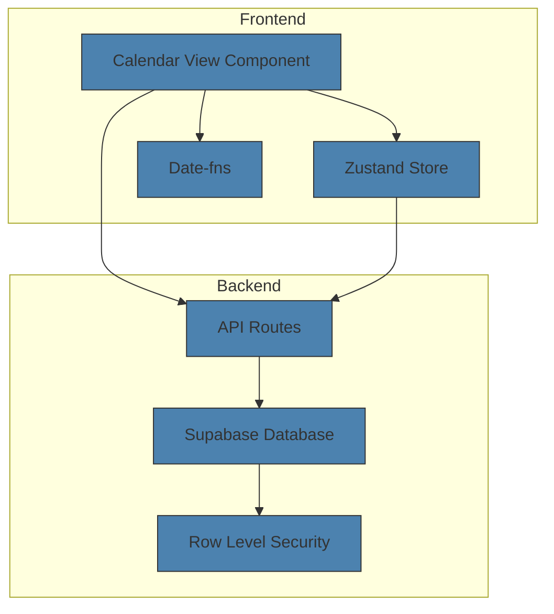
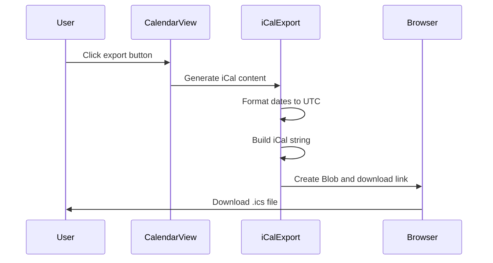
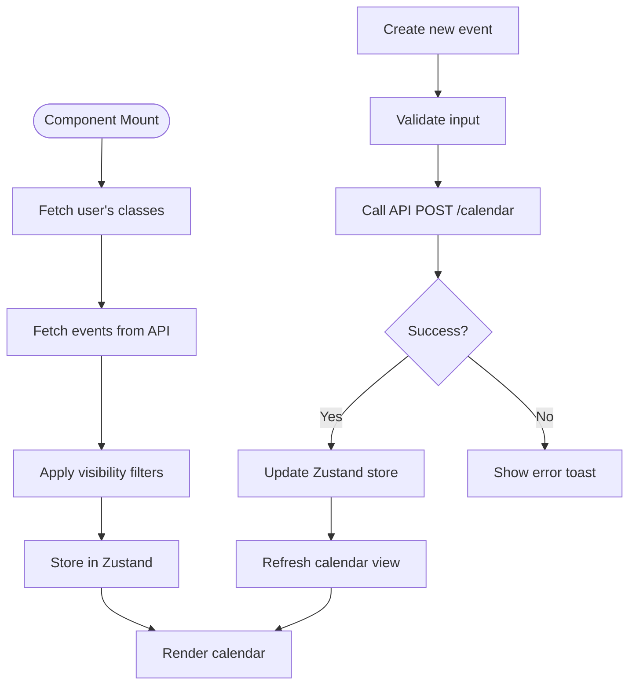

# Calendar View

<cite>
**Referenced Files in This Document**   
- [calendar-view.tsx](file://components/calendar-view.tsx)
- [calendar-store.ts](file://lib/calendar-store.ts)
- [route.ts](file://app/api/calendar/route.ts)
- [create_calendar_events_table.sql](file://supabase/migrations/20260105000002_create_calendar_events_table.sql)
- [database.types.ts](file://lib/database.types.ts)
- [admin/calendar/page.tsx](file://app/admin/calendar/page.tsx)
- [teacher/calendar/page.tsx](file://app/teacher/calendar/page.tsx)
- [student/calendar/page.tsx](file://app/student/calendar/page.tsx)
</cite>

## Table of Contents
1. [Introduction](#introduction)
2. [Core Components](#core-components)
3. [Architecture Overview](#architecture-overview)
4. [Event Management and iCal Export](#event-management-and-ical-export)
5. [Data Flow and API Integration](#data-flow-and-api-integration)
6. [User Role-Based Event Rendering](#user-role-based-event-rendering)
7. [Performance and Mobile Considerations](#performance-and-mobile-considerations)
8. [Troubleshooting Guide](#troubleshooting-guide)

## Introduction
The Calendar View component provides a comprehensive interface for managing academic schedules, events, and deadlines across different user roles in the school management system. This documentation details the implementation of the calendar functionality, including event creation, recurrence handling, iCal export, and real-time data synchronization. The component leverages date-fns for date manipulation, Zustand for state management, and Supabase for persistent storage and real-time updates.

**Section sources**
- [calendar-view.tsx](file://components/calendar-view.tsx#L1-L497)

## Core Components

The Calendar View is implemented as a React component that renders a monthly calendar with event visualization and management capabilities. It uses a two-pane layout with the calendar grid on the left and event details on the right. The component supports event creation through a dialog interface with fields for title, type, date, time, location, and audience targeting.

Event types are color-coded for easy identification, with distinct colors for classes, quizzes, assignments, exams, holidays, meetings, and other events. The calendar displays events in a compact format on the grid, showing up to two events per day with a "+N more" indicator for additional events. When a date is selected, detailed event information is displayed in the right panel.

The component handles user interactions including date selection, event creation, and iCal export. It provides visual feedback for the current date and selected date, with appropriate styling for events that span multiple days or occur on weekends.

**Section sources**
- [calendar-view.tsx](file://components/calendar-view.tsx#L46-L496)
- [calendar-store.ts](file://lib/calendar-store.ts#L5-L24)

## Architecture Overview

**Diagram sources**
- [calendar-view.tsx](file://components/calendar-view.tsx#L1-L497)
- [calendar-store.ts](file://lib/calendar-store.ts#L1-L161)
- [route.ts](file://app/api/calendar/route.ts#L1-L133)

## Event Management and iCal Export

The Calendar View component implements comprehensive event management functionality with support for iCal export. Events can be created, viewed, and exported to iCalendar format for integration with external calendar applications. The iCal export functionality generates valid .ics files that can be imported into popular calendar services like Google Calendar, Outlook, and Apple Calendar.

When exporting an event, the system formats dates according to the iCalendar specification (RFC 5545), converting local dates and times to UTC format. The exported file includes essential event properties such as UID, DTSTAMP (timestamp), DTSTART (start date/time), DTEND (end date/time), SUMMARY (title), DESCRIPTION, and LOCATION. The component handles both all-day events and time-specific events, properly formatting the iCal content accordingly.

Event creation is restricted by user role and permissions. Administrators and teachers can create events for various audiences (personal, all users, students, teachers, or specific classes), while students can only create personal events. The form interface provides appropriate options based on the user's role, ensuring proper access control.

**Diagram sources**
- [calendar-view.tsx](file://components/calendar-view.tsx#L160-L202)
- [calendar-store.ts](file://lib/calendar-store.ts#L124-L161)

**Section sources**
- [calendar-view.tsx](file://components/calendar-view.tsx#L160-L202)
- [calendar-store.ts](file://lib/calendar-store.ts#L124-L161)

## Data Flow and API Integration

The Calendar View component follows a structured data flow pattern for fetching and managing calendar events. Events are retrieved from the backend API using date range parameters that span the current month plus one month before and after, ensuring smooth navigation between months without additional API calls.

The API integration uses Supabase as the backend service, with Row Level Security (RLS) policies enforcing data access rules. When fetching events, the system first retrieves the user's role and class enrollments, then applies visibility rules to filter events based on the target audience. Events can be targeted to "all" users, "students", "teachers", "class" (specific class members), or "personal" (creator only).

The database schema includes proper indexing on key fields such as start_date, class_id, created_by, and target_audience to optimize query performance. The calendar_events table supports various event types with fields for title, description, date/time ranges, location, and audience targeting. The component uses optimistic updates with Zustand store, providing immediate feedback to users while synchronizing with the backend.

**Diagram sources**
- [route.ts](file://app/api/calendar/route.ts#L5-L78)
- [create_calendar_events_table.sql](file://supabase/migrations/20260105000002_create_calendar_events_table.sql#L1-L57)
- [calendar-store.ts](file://lib/calendar-store.ts#L43-L87)

**Section sources**
- [route.ts](file://app/api/calendar/route.ts#L5-L78)
- [create_calendar_events_table.sql](file://supabase/migrations/20260105000002_create_calendar_events_table.sql#L1-L57)

## User Role-Based Event Rendering

The Calendar View component implements role-based access control for event creation and visibility. Different user roles have varying capabilities when interacting with the calendar:

- **Administrators**: Can create events for all audiences (everyone, teachers, students, specific classes, or personal) and view all events in the system.
- **Teachers**: Can create events for their classes, all students, or personal use, and view events relevant to their teaching responsibilities.
- **Students**: Can only create personal events and view events targeted to students or their enrolled classes.

The component dynamically adjusts the event creation form based on the user's role, showing only relevant audience options. For example, students do not see options to create events for teachers or all users, while administrators have access to all audience targeting options.

Event rendering also considers the user's role and class enrollments. The system fetches the user's class IDs and uses them to filter class-specific events. This ensures that users only see events relevant to their academic context, maintaining data privacy and reducing information overload.

**Section sources**
- [calendar-view.tsx](file://components/calendar-view.tsx#L272-L277)
- [route.ts](file://app/api/calendar/route.ts#L67-L75)
- [admin/calendar/page.tsx](file://app/admin/calendar/page.tsx#L46-L50)
- [teacher/calendar/page.tsx](file://app/teacher/calendar/page.tsx#L57-L62)
- [student/calendar/page.tsx](file://app/student/calendar/page.tsx#L57-L62)

## Performance and Mobile Considerations

The Calendar View component is optimized for performance when handling large event datasets. The implementation uses React's useMemo and useCallback hooks to prevent unnecessary re-renders and computations. The calendar grid is generated once per month change, and event filtering is performed efficiently using indexed database queries.

For mobile responsiveness, the component uses a responsive grid layout that adapts to different screen sizes. On smaller screens, the two-pane layout collapses to a single column, prioritizing the calendar view. Touch interactions are supported with appropriately sized tap targets for date selection and event actions.

The component implements lazy loading of event data, fetching only the necessary date range around the current month. This reduces initial load time and bandwidth usage, especially important for mobile users. Skeleton loading states provide visual feedback during data retrieval, enhancing perceived performance.

Accessibility features include proper ARIA labels, keyboard navigation support, and sufficient color contrast. The calendar grid is implemented as a table with appropriate semantic HTML, ensuring compatibility with screen readers and other assistive technologies.

**Section sources**
- [calendar-view.tsx](file://components/calendar-view.tsx#L92-L98)
- [calendar-view.tsx](file://components/calendar-view.tsx#L206-L212)

## Troubleshooting Guide

Common issues with the Calendar View component typically relate to data synchronization, time zone handling, and permission errors:

1. **Events not appearing**: Verify that the user has the appropriate role and audience permissions for the events. Check that class enrollments are properly configured for class-specific events.

2. **Time synchronization issues**: Ensure that date and time values are properly formatted and converted to UTC when necessary. The system uses local time zones for display but stores times in the database without time zone information.

3. **iCal export failures**: Verify that the browser supports the Blob and URL.createObjectURL APIs. Check that event dates are valid and properly formatted according to the iCalendar specification.

4. **Permission errors**: Confirm that Supabase RLS policies are correctly configured and that users have the appropriate roles. The system uses Row Level Security to enforce data access rules at the database level.

5. **Performance issues with large datasets**: Ensure that database indexes are properly created on frequently queried fields (start_date, class_id, created_by, target_audience). Consider implementing pagination or virtual scrolling for extremely large event sets.

**Section sources**
- [calendar-view.tsx](file://components/calendar-view.tsx#L77-L83)
- [route.ts](file://app/api/calendar/route.ts#L62-L64)
- [route.ts](file://app/api/calendar/route.ts#L127-L129)