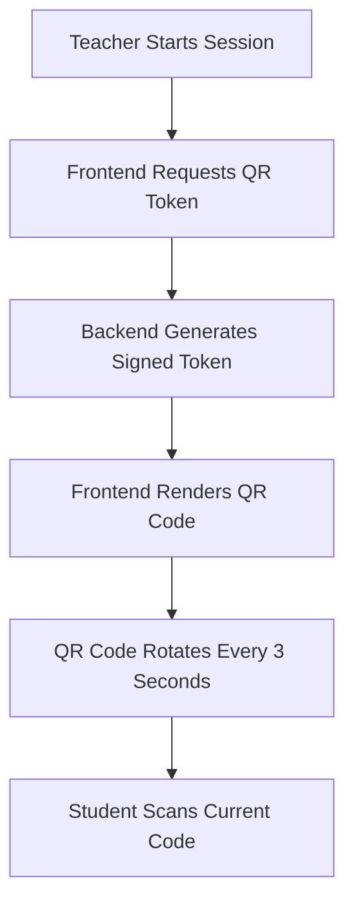
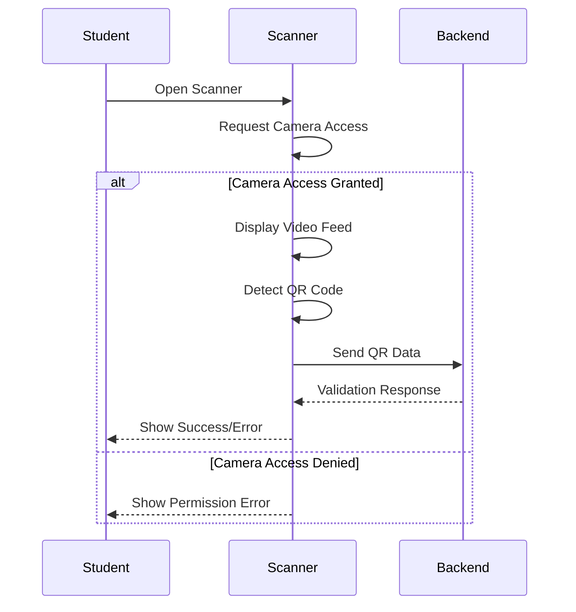
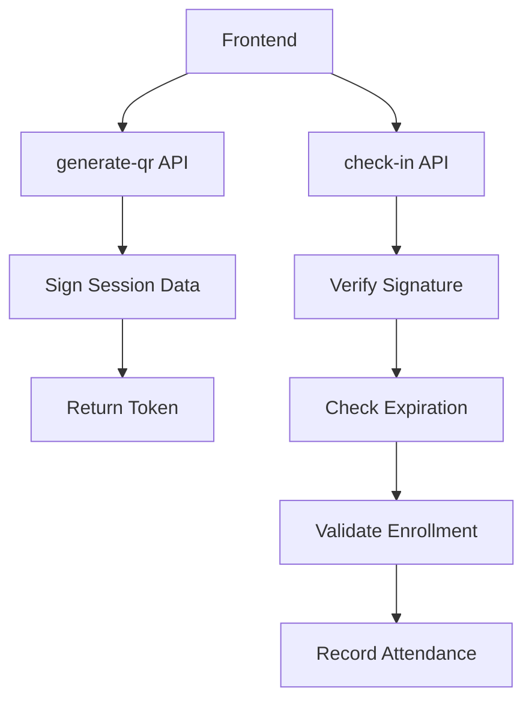
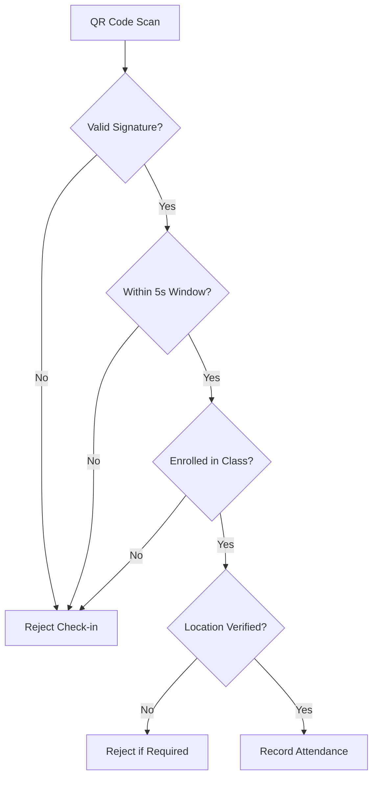

# QR Code Components

<cite>
**Referenced Files in This Document**   
- [qr-code-generator.tsx](file://components/qr-code-generator.tsx)
- [qr-scanner.tsx](file://components/qr-scanner.tsx)
- [generate-qr/route.ts](file://app/api/teacher/generate-qr/route.ts)
- [check-in/route.ts](file://app/api/student/check-in/route.ts)
- [qr-attendance-store.ts](file://lib/qr-attendance-store.ts)
- [school-location-store.ts](file://lib/school-location-store.ts)
- [security.ts](file://lib/security.ts)
- [rate-limit.ts](file://lib/rate-limit.ts)
- [qr-attendance/page.tsx](file://app/teacher/qr-attendance/page.tsx)
- [qr-checkin/page.tsx](file://app/student/qr-checkin/page.tsx)
- [20251219043454_create_attendance_tables.sql](file://supabase/migrations/20251219043454_create_attendance_tables.sql)
</cite>

## Table of Contents
1. [Introduction](#introduction)
2. [QR Code Generator](#qr-code-generator)
3. [QR Code Scanner](#qr-code-scanner)
4. [Backend API Integration](#backend-api-integration)
5. [Security and Validation](#security-and-validation)
6. [Usage Scenarios](#usage-scenarios)
7. [Performance and Accessibility](#performance-and-accessibility)
8. [Conclusion](#conclusion)

## Introduction
The QR Code Generator and Scanner components enable secure, time-limited attendance check-in for classroom sessions. Teachers generate rotating QR codes that students scan to mark their presence. The system incorporates cryptographic signing, expiration logic, and location verification to prevent unauthorized access and replay attacks. This document details the implementation of both components, their integration with backend APIs, and the security measures in place to ensure reliable attendance tracking.

## QR Code Generator

The QR Code Generator component creates dynamic, time-limited QR codes for classroom attendance. It is used by teachers to initiate check-in sessions, with the QR code automatically rotating every 3 seconds for enhanced security. The generator uses the `qr-code-styling` library to render visually consistent QR codes with custom styling, including teal-colored rounded dots and green corner squares.

When a teacher starts an attendance session, the frontend requests a new QR code token from the backend API. This token contains a cryptographically signed payload with the session ID and timestamp. The QR code data is updated in real-time, ensuring that only the current code can be used for check-in. The component is designed with accessibility in mind, providing ARIA labels and fallback loading states.

**Diagram sources**
- [qr-code-generator.tsx](file://components/qr-code-generator.tsx)
- [generate-qr/route.ts](file://app/api/teacher/generate-qr/route.ts)

**Section sources**
- [qr-code-generator.tsx](file://components/qr-code-generator.tsx)
- [qr-attendance/page.tsx](file://app/teacher/qr-attendance/page.tsx)

## QR Code Scanner

The QR Code Scanner component enables students to scan attendance QR codes using their device's camera. It leverages the `html5-qrcode` library to access the camera and decode QR codes in real-time. The scanner runs in a modal overlay with a dedicated video feed, allowing students to position the QR code within the frame for scanning.

Upon successful scan, the decoded data is sent to the backend for validation. The component includes error handling for common issues such as camera permission denial or device incompatibility. A manual input fallback allows students to enter the code if scanning fails. The scanner is optimized for mobile devices, with responsive design and touch-friendly controls.

**Diagram sources**
- [qr-scanner.tsx](file://components/qr-scanner.tsx)
- [check-in/route.ts](file://app/api/student/check-in/route.ts)

**Section sources**
- [qr-scanner.tsx](file://components/qr-scanner.tsx)
- [qr-checkin/page.tsx](file://app/student/qr-checkin/page.tsx)

## Backend API Integration

The QR attendance system relies on two primary API endpoints: one for generating QR codes and another for processing check-ins. The `generate-qr` endpoint creates a cryptographically signed token containing the session ID and timestamp, while the `check-in` endpoint validates this token and records attendance.

The generation process involves HMAC-SHA256 signing of the session data using a server-side secret. This ensures that only the server can generate valid tokens. The check-in process verifies the signature, checks the token's expiration (5-second window), and validates the student's enrollment in the class. Both endpoints enforce rate limiting to prevent abuse, with the check-in endpoint also implementing network-based restrictions.

**Diagram sources**
- [generate-qr/route.ts](file://app/api/teacher/generate-qr/route.ts)
- [check-in/route.ts](file://app/student/check-in/route.ts)

**Section sources**
- [generate-qr/route.ts](file://app/api/teacher/generate-qr/route.ts)
- [check-in/route.ts](file://app/api/student/check-in/route.ts)

## Security and Validation

The QR attendance system implements multiple layers of security to prevent unauthorized access and ensure data integrity. Cryptographic signing prevents token tampering, while the 5-second expiration window mitigates replay attacks. Location verification, when enabled, ensures students are physically present within the school's geofence.

Network-based security measures include IP address hashing for privacy-preserving abuse detection and optional school network enforcement. The system also prevents multiple students from checking in from the same remote IP address. Rate limiting protects against brute force attacks, with stricter limits applied for non-school network access.

**Diagram sources**
- [check-in/route.ts](file://app/api/student/check-in/route.ts)
- [security.ts](file://lib/security.ts)

**Section sources**
- [check-in/route.ts](file://app/api/student/check-in/route.ts)
- [security.ts](file://lib/security.ts)

## Usage Scenarios

The QR attendance system supports two primary usage scenarios: teacher-led sessions and student self-check-in. In teacher-led sessions, the instructor generates a QR code at the start of class, which students scan to mark their presence. The teacher can monitor real-time attendance and end the session when check-ins are complete.

For student self-check-in, learners access their personal check-in page, enable location services, and scan the QR code displayed by the teacher. The system validates their location and enrollment before recording attendance. Both scenarios are supported by fallback mechanisms, including manual code entry and retry logic for transient failures.

**Section sources**
- [qr-attendance/page.tsx](file://app/teacher/qr-attendance/page.tsx)
- [qr-checkin/page.tsx](file://app/student/qr-checkin/page.tsx)

## Performance and Accessibility

The QR attendance components are optimized for performance and accessibility. The generator uses lazy loading and suspense fallbacks to minimize initial bundle size, while the scanner implements efficient camera access with error recovery. Both components are responsive and mobile-friendly, with touch targets sized for easy interaction.

Accessibility features include ARIA labels, screen reader support, and keyboard navigation. The scanner provides clear instructions and error messages, while the generator includes visual indicators for QR code rotation. Fallback mechanisms ensure functionality even in suboptimal conditions, such as poor lighting or camera issues.

**Section sources**
- [qr-code-generator.tsx](file://components/qr-code-generator.tsx)
- [qr-scanner.tsx](file://components/qr-scanner.tsx)

## Conclusion

The QR Code Generator and Scanner components provide a secure, efficient solution for classroom attendance tracking. By combining cryptographic validation, time-limited tokens, and location verification, the system ensures accurate and tamper-proof attendance records. The integration of frontend and backend components creates a seamless user experience for both teachers and students, while robust security measures protect against common attack vectors. This implementation demonstrates a comprehensive approach to digital attendance that balances usability with security.