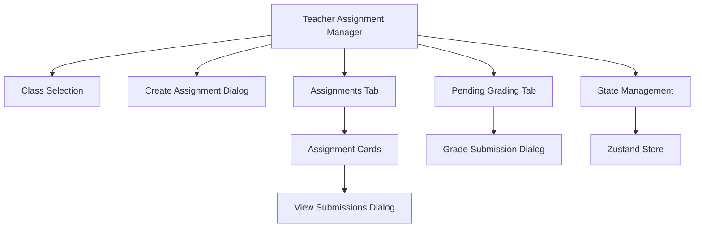
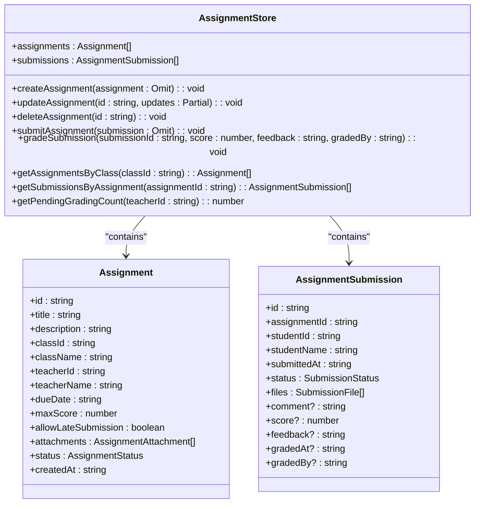
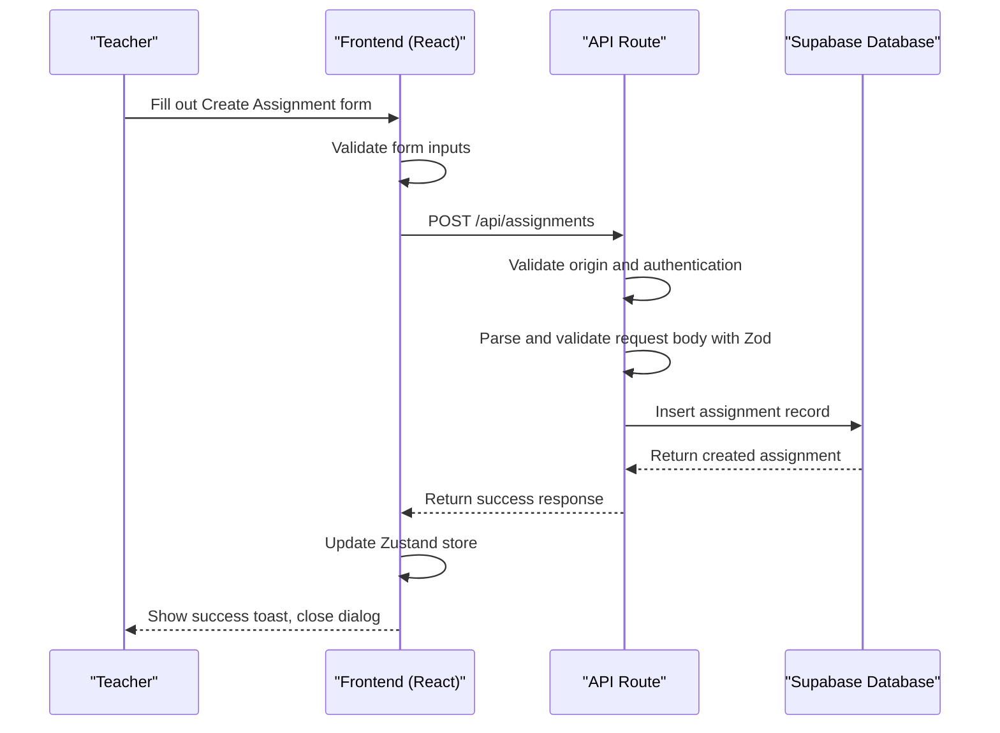
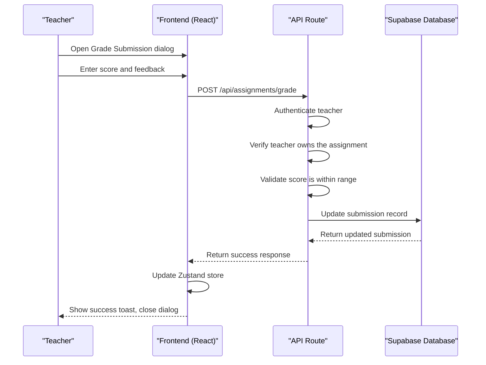
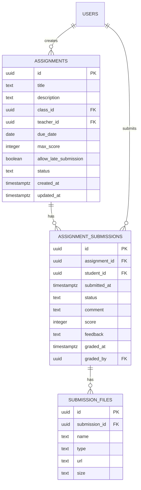
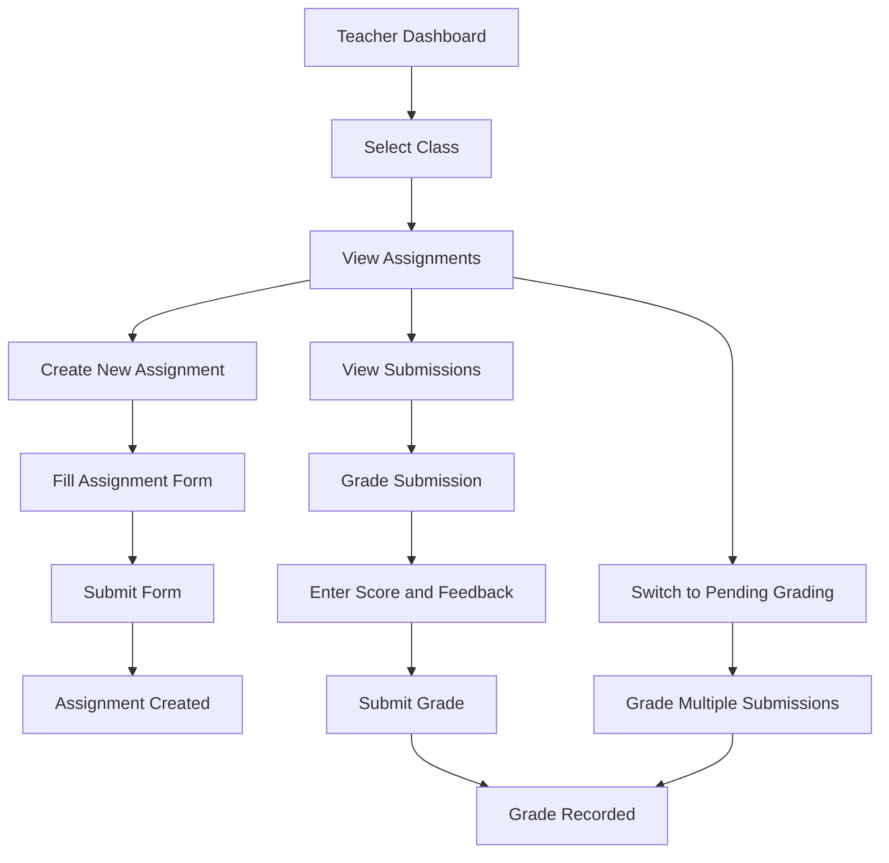

# Teacher Assignment Manager

<cite>
**Referenced Files in This Document**   
- [teacher-assignment-manager.tsx](file://components/teacher-assignment-manager.tsx)
- [assignment-store.ts](file://lib/assignment-store.ts)
- [route.ts](file://app/api/assignments/route.ts)
- [submit/route.ts](file://app/api/assignments/submit/route.ts)
- [grade/route.ts](file://app/api/assignments/grade/route.ts)
- [types.ts](file://lib/types.ts)
- [page.tsx](file://app/teacher/assignments/page.tsx)
- [database.types.ts](file://lib/database.types.ts)
- [create_assignments_table.sql](file://supabase/migrations/20260105000001_create_assignments_table.sql)
</cite>

## Table of Contents
1. [Introduction](#introduction)
2. [Core Components](#core-components)
3. [State Management with Zustand](#state-management-with-zustand)
4. [API Integration and Data Flow](#api-integration-and-data-flow)
5. [UI/UX Patterns](#uiux-patterns)
6. [Error Handling](#error-handling)
7. [Performance Considerations](#performance-considerations)
8. [Accessibility Compliance](#accessibility-compliance)
9. [Security Implementation](#security-implementation)

## Introduction

The Teacher Assignment Manager is a comprehensive component that orchestrates quiz and assignment workflows for teachers within the School Management System. This component provides teachers with a complete interface to create, manage, and grade assignments across their classes. The system integrates seamlessly with backend API routes for creating quizzes, managing submissions, and grading, while utilizing Zustand stores for real-time state management.

The component follows a structured workflow that begins with assignment creation, progresses through student submission, and concludes with teacher grading and feedback. It supports multiple classes and provides real-time updates through its state management system. The interface is designed to be intuitive, allowing teachers to efficiently manage their assignments and track student progress.

**Section sources**
- [teacher-assignment-manager.tsx](file://components/teacher-assignment-manager.tsx#L1-L485)

## Core Components

The Teacher Assignment Manager consists of several interconnected components that work together to provide a complete assignment management solution. The main component, `TeacherAssignmentManager`, serves as the orchestrator, coordinating between UI elements, state management, and API interactions.

The component provides two primary views through a tabbed interface: "Assignments" and "Pending Grading". The "Assignments" tab displays all assignments for the selected class, showing their status, due dates, and grading progress. The "Pending Grading" tab highlights submissions that require grading, providing quick access to the grading interface.

Key features include:
- Class selection dropdown for managing assignments across multiple classes
- Create Assignment dialog with form validation
- Assignment cards displaying title, description, due date, and submission statistics
- View Submissions dialog showing all student submissions for an assignment
- Grade Submission dialog for providing scores and feedback

The component uses React's useState hook for managing local state, including selected class, dialog states, and form inputs. It integrates with the `useAssignmentStore` hook to access and modify the global assignment state.

**Diagram sources **
- [teacher-assignment-manager.tsx](file://components/teacher-assignment-manager.tsx#L52-L485)

**Section sources**
- [teacher-assignment-manager.tsx](file://components/teacher-assignment-manager.tsx#L52-L485)

## State Management with Zustand

The Teacher Assignment Manager utilizes Zustand for state management, providing a centralized store for assignment data and operations. The `useAssignmentStore` hook exposes a comprehensive API for managing assignments and submissions, ensuring consistent state across the application.

The store maintains two primary data collections:
- `assignments`: Array of Assignment objects representing all assignments in the system
- `submissions`: Array of AssignmentSubmission objects representing all student submissions

The store provides several key actions for modifying state:

**Diagram sources **
- [assignment-store.ts](file://lib/assignment-store.ts#L9-L174)

**Section sources**
- [assignment-store.ts](file://lib/assignment-store.ts#L9-L174)

## API Integration and Data Flow

The Teacher Assignment Manager integrates with several API routes to persist data to the Supabase backend. The data flow follows a client-server pattern where the frontend manages state locally and synchronizes with the backend through API calls.

### Assignment Creation Flow

**Diagram sources **
- [route.ts](file://app/api/assignments/route.ts#L68-L133)
- [teacher-assignment-manager.tsx](file://components/teacher-assignment-manager.tsx#L82-L109)

### Submission Grading Flow

**Diagram sources **
- [grade/route.ts](file://app/api/assignments/grade/route.ts#L5-L75)
- [teacher-assignment-manager.tsx](file://components/teacher-assignment-manager.tsx#L111-L123)

### Data Model

The assignment system is backed by a relational database model with the following tables:

**Diagram sources **
- [create_assignments_table.sql](file://supabase/migrations/20260105000001_create_assignments_table.sql#L2-L122)

**Section sources**
- [route.ts](file://app/api/assignments/route.ts#L1-L134)
- [submit/route.ts](file://app/api/assignments/submit/route.ts#L1-L143)
- [grade/route.ts](file://app/api/assignments/grade/route.ts#L1-L75)
- [create_assignments_table.sql](file://supabase/migrations/20260105000001_create_assignments_table.sql#L1-L122)

## UI/UX Patterns

The Teacher Assignment Manager implements several UI/UX patterns to enhance usability and provide a consistent experience for teachers managing assignments.

### Assignment Creation Interface

The assignment creation interface follows a modal dialog pattern, accessible via a "Create Assignment" button. The form includes:

- Title field with character validation
- Description textarea for assignment instructions
- Due date picker with date validation
- Max score input with range validation (1-1000)
- Toggle for allowing late submissions
- Status selection (draft or published)

The form provides real-time validation feedback and prevents submission of incomplete forms.

### Assignment Listing

Assignments are displayed as cards in a list format, with each card showing:

- Assignment status badge (draft, published)
- Pending submissions badge when applicable
- Assignment title and description
- Due date with clock icon
- Grading progress (graded/total submissions)

The listing supports class filtering through a dropdown selector, allowing teachers to manage assignments across multiple classes.

### Submission Management

The component provides two views for managing submissions:

1. **Assignment-level view**: Accessible via "View Submissions" button on each assignment card, showing all submissions for that assignment with student names, submission times, and current status.

2. **Pending grading view**: A dedicated tab showing all ungraded submissions across all assignments, allowing teachers to quickly identify and grade pending work.

### Grading Interface

The grading interface is a modal dialog that displays:

- Student name and assignment title
- Submitted files with download options
- Student comment (if provided)
- Score input with validation against the maximum score
- Feedback textarea for teacher comments

The interface provides a clean, focused experience for grading, minimizing distractions and streamlining the feedback process.

**Diagram sources **
- [teacher-assignment-manager.tsx](file://components/teacher-assignment-manager.tsx#L131-L485)

**Section sources**
- [teacher-assignment-manager.tsx](file://components/teacher-assignment-manager.tsx#L131-L485)

## Error Handling

The Teacher Assignment Manager implements comprehensive error handling at both the frontend and backend levels to ensure a robust user experience.

### Frontend Error Handling

The component uses the `sonner` library to display toast notifications for various operations:

- Success messages for completed actions (e.g., "Assignment created successfully")
- Error messages for failed operations
- Loading states during API calls with spinner indicators

Form validation prevents submission of incomplete or invalid data:
- Title and due date are required fields
- Max score must be a positive number
- Date format is validated automatically by the browser

### Backend Error Handling

The API routes implement several layers of error handling:

1. **Authentication validation**: All routes verify user authentication and role permissions
2. **Input validation**: Zod schemas validate request bodies and return descriptive error messages
3. **Business logic validation**: 
   - Teachers can only grade assignments they own
   - Scores must be within the valid range (0 to max_score)
   - Students can only submit to published assignments in classes they're enrolled in
   - Late submissions are only accepted if allowed by the assignment settings

4. **Database error handling**: Database errors are caught and returned with appropriate HTTP status codes

The `ApiErrors` utility provides standardized error responses for common scenarios like unauthorized access, forbidden actions, and not found resources.

**Section sources**
- [route.ts](file://app/api/assignments/route.ts#L1-L134)
- [submit/route.ts](file://app/api/assignments/submit/route.ts#L1-L143)
- [grade/route.ts](file://app/api/assignments/grade/route.ts#L1-L75)
- [api-errors.ts](file://lib/api-errors.ts)

## Performance Considerations

The Teacher Assignment Manager is designed to handle large class sizes and multiple assignments efficiently through several performance optimizations.

### Client-Side Performance

The component implements several optimizations to maintain responsiveness:

- **State colocation**: Local state is managed within the component, reducing unnecessary re-renders
- **Memoized selectors**: The Zustand store provides optimized selectors like `getAssignmentsByClass` and `getSubmissionsByAssignment` that only recompute when relevant data changes
- **Conditional rendering**: Empty states are displayed when no assignments exist, reducing DOM complexity
- **Virtualization considerations**: While not currently implemented, the component structure supports future virtualization for very large assignment lists

### Server-Side Performance

The database schema includes several performance optimizations:

- **Indexes**: Database indexes on frequently queried columns:
  - `idx_assignments_class_id` on assignments(class_id)
  - `idx_assignments_teacher_id` on assignments(teacher_id) 
  - `idx_assignment_submissions_assignment_id` on assignment_submissions(assignment_id)
  - `idx_assignment_submissions_student_id` on assignment_submissions(student_id)

- **Efficient queries**: API routes use targeted SELECT statements with only the required fields
- **Batch operations**: The database schema supports efficient batch operations for grading multiple submissions

### Scalability Considerations

For very large class sizes, the following optimizations could be implemented:

- **Pagination**: Add pagination to assignment and submission lists
- **Infinite scrolling**: Implement infinite scrolling for large submission lists
- **Web Workers**: Offload data processing to web workers for complex operations
- **Caching**: Implement client-side caching strategies for frequently accessed data

The current implementation efficiently handles typical class sizes while providing a foundation for scaling to larger datasets.

**Section sources**
- [assignment-store.ts](file://lib/assignment-store.ts#L1-L174)
- [create_assignments_table.sql](file://supabase/migrations/20260105000001_create_assignments_table.sql#L119-L122)

## Accessibility Compliance

The Teacher Assignment Manager follows accessibility best practices to ensure the interface is usable by all teachers, including those with disabilities.

### Semantic HTML

The component uses semantic HTML elements:
- Proper heading hierarchy (h3 for assignment titles)
- Label elements associated with form controls
- ARIA attributes for interactive elements
- Semantic elements like `<section>` and `<article>` where appropriate

### Keyboard Navigation

The interface supports full keyboard navigation:
- Tab navigation through form fields and buttons
- Enter key to submit forms
- Escape key to close dialogs
- Arrow keys to navigate dropdown menus

### Visual Design

Accessibility considerations in the visual design include:
- Sufficient color contrast between text and background
- Visible focus indicators for interactive elements
- Icons paired with text labels for clarity
- Responsive design that works across device sizes
- Clear visual hierarchy with appropriate spacing

### Assistive Technology Support

The component supports screen readers through:
- Descriptive labels and instructions
- ARIA roles and properties
- Meaningful link and button text
- Proper form field labeling

The use of standard UI components from the component library ensures consistent accessibility patterns across the application.

**Section sources**
- [teacher-assignment-manager.tsx](file://components/teacher-assignment-manager.tsx#L1-L485)

## Security Implementation

The Teacher Assignment Manager implements multiple security layers to protect assignment data and ensure appropriate access controls.

### Authentication and Authorization

The system enforces strict role-based access control:
- Only teachers and administrators can create assignments
- Teachers can only manage assignments they created
- Students can only submit to published assignments
- Grade submission requires teacher authentication and ownership verification

Authentication is handled through Supabase Auth, with role information stored in the users table.

### Input Validation

Multiple layers of input validation protect against common vulnerabilities:
- **Zod schemas**: Validate request bodies on API routes
- **CSRF protection**: Origin validation on POST requests
- **Type checking**: TypeScript interfaces ensure data consistency
- **Database constraints**: Check constraints enforce valid status values

### Data Validation

Specific validation rules include:
- Assignment title: 1-200 characters
- Description: up to 5000 characters
- Max score: 1-1000
- Status: restricted to "draft" or "published"
- File URLs: restricted to Supabase storage domains

### Database Security

The database implements Row Level Security (RLS) policies:
- Teachers can only read/write their own assignments
- Students can only submit to assignments in their enrolled classes
- Submissions can only be graded by the assignment's teacher
- File uploads are restricted to the submitting student

The migration files show the implementation of these security policies, including proper foreign key constraints and check constraints on status fields.

**Section sources**
- [route.ts](file://app/api/assignments/route.ts#L1-L134)
- [submit/route.ts](file://app/api/assignments/submit/route.ts#L1-L143)
- [grade/route.ts](file://app/api/assignments/grade/route.ts#L1-L75)
- [create_assignments_table.sql](file://supabase/migrations/20260105000001_create_assignments_table.sql#L1-L122)