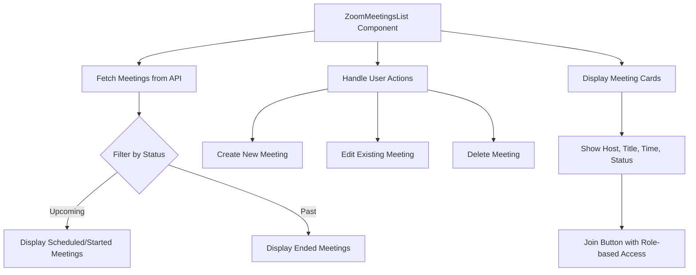
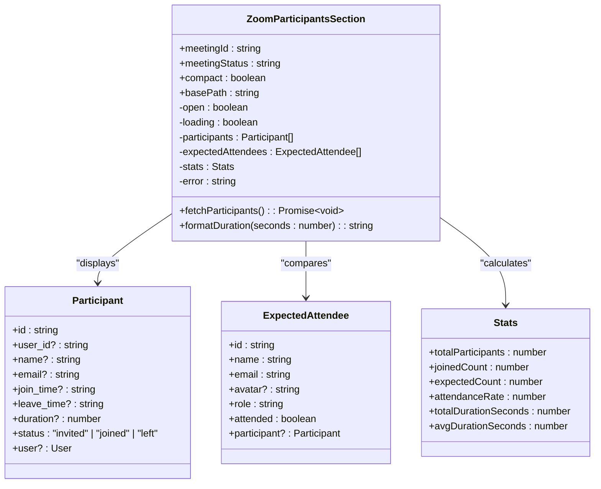
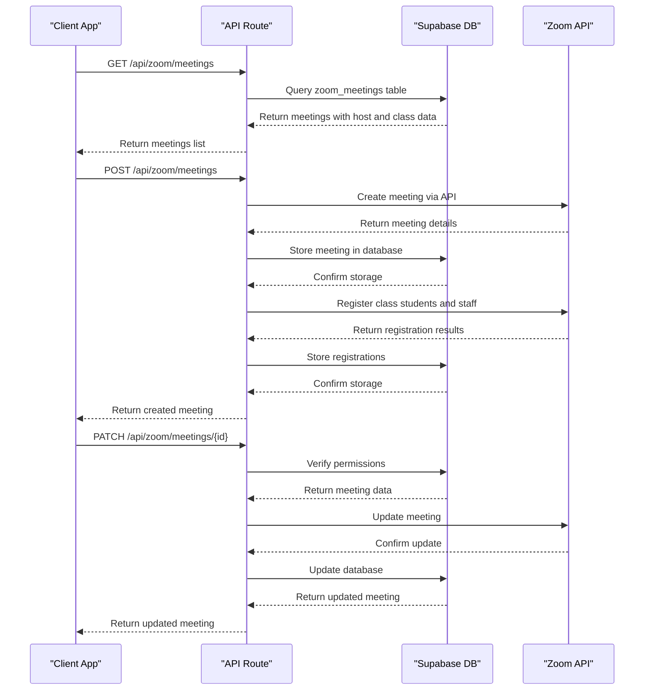
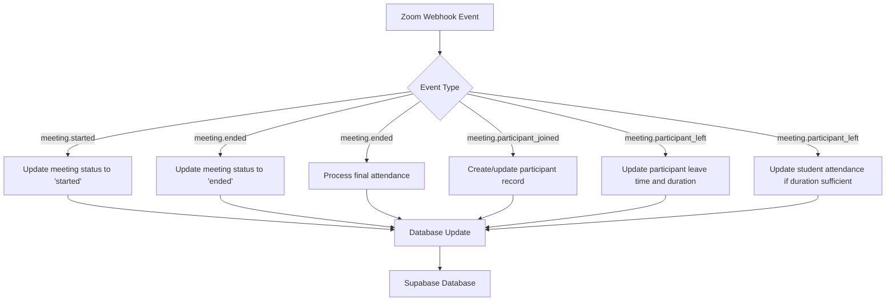
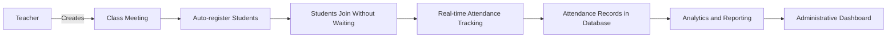
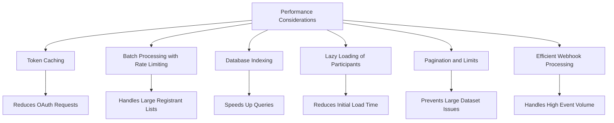
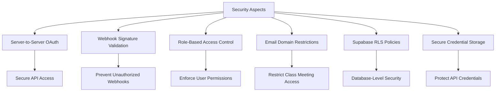

# Zoom Integration Components

<cite>
**Referenced Files in This Document**   
- [zoom-meetings-list.tsx](file://components/zoom-meetings-list.tsx)
- [zoom-participants-section.tsx](file://components/zoom-participants-section.tsx)
- [zoom-meeting-room.tsx](file://components/zoom-meeting-room.tsx)
- [route.ts](file://app/api/zoom/meetings/route.ts)
- [route.ts](file://app/api/zoom/meetings/[id]/route.ts)
- [route.ts](file://app/api/zoom/meetings/[id]/participants/route.ts)
- [route.ts](file://app/api/zoom/webhook/route.ts)
- [client.ts](file://lib/zoom/client.ts)
- [types.ts](file://lib/zoom/types.ts)
- [constants.ts](file://lib/zoom/constants.ts)
- [create_zoom_meetings_table.sql](file://supabase/migrations/20260110000001_create_zoom_meetings_table.sql)
- [create_meeting_registrants_table.sql](file://supabase/migrations/20260110000002_create_meeting_registrants_table.sql)
</cite>

## Table of Contents
1. [Introduction](#introduction)
2. [Zoom Meetings List Component](#zoom-meetings-list-component)
3. [Participants Section Implementation](#participants-section-implementation)
4. [Server-Side Integration with Zoom API](#server-side-integration-with-zoom-api)
5. [Real-Time Updates via Webhooks](#real-time-updates-via-webhooks)
6. [Usage Examples](#usage-examples)
7. [Performance Considerations](#performance-considerations)
8. [Security Aspects](#security-aspects)
9. [Troubleshooting Guide](#troubleshooting-guide)
10. [Conclusion](#conclusion)

## Introduction
The Zoom Integration Components in the School Management System provide a comprehensive solution for managing virtual classroom experiences. This documentation details the implementation of meetings list and participants section components that enable teachers and administrators to schedule, monitor, and analyze virtual classes through Zoom. The system integrates with Zoom's API to provide real-time status updates, secure meeting access, and detailed attendance tracking. The components support various user roles including teachers, students, parents, and administrators, with appropriate access controls and permissions.

## Zoom Meetings List Component

The Zoom Meetings List component provides a user interface for viewing and managing scheduled meetings. It supports both compact and full views, with filtering options for upcoming and past meetings. The component fetches meeting data from the server-side API and displays it in a structured format with real-time status indicators.

**Diagram sources**
- [zoom-meetings-list.tsx](file://components/zoom-meetings-list.tsx#L25-L246)

**Section sources**
- [zoom-meetings-list.tsx](file://components/zoom-meetings-list.tsx#L1-L246)
- [route.ts](file://app/api/zoom/meetings/route.ts#L7-L52)

## Participants Section Implementation

The Participants Section component displays detailed information about meeting attendees, including attendance status, connection duration, and role information. It provides both compact and expanded views, with collapsible sections for detailed participant data. For class-linked meetings, it compares actual attendance against expected attendees and calculates attendance rates.

**Diagram sources**
- [zoom-participants-section.tsx](file://components/zoom-participants-section.tsx#L57-L265)

**Section sources**
- [zoom-participants-section.tsx](file://components/zoom-participants-section.tsx#L1-L265)
- [route.ts](file://app/api/zoom/meetings/[id]/participants/route.ts#L9-L133)

## Server-Side Integration with Zoom API

The server-side integration with Zoom API handles all meeting lifecycle operations including creation, retrieval, updating, and deletion. The implementation uses Zoom's Server-to-Server OAuth authentication for secure backend operations. Meetings are stored in the database with comprehensive metadata, and the system manages registration for authorized participants to bypass waiting rooms.

**Diagram sources**
- [route.ts](file://app/api/zoom/meetings/route.ts#L7-L168)
- [route.ts](file://app/api/zoom/meetings/[id]/route.ts#L9-L124)
- [client.ts](file://lib/zoom/client.ts#L92-L131)

**Section sources**
- [route.ts](file://app/api/zoom/meetings/route.ts#L7-L168)
- [route.ts](file://app/api/zoom/meetings/[id]/route.ts#L9-L124)
- [client.ts](file://lib/zoom/client.ts#L1-L334)

## Real-Time Updates via Webhooks

The system uses Zoom webhooks to receive real-time updates about meeting events including start, end, participant join, and participant leave. These events trigger updates to the database, including meeting status changes and participant attendance records. The webhook handler verifies signatures for security and processes events to maintain accurate attendance data.

**Diagram sources**
- [route.ts](file://app/api/zoom/webhook/route.ts#L17-L247)

**Section sources**
- [route.ts](file://app/api/zoom/webhook/route.ts#L1-L342)
- [create_zoom_meetings_table.sql](file://supabase/migrations/20260110000001_create_zoom_meetings_table.sql#L2-L113)

## Usage Examples

### Teacher-Led Classes
Teachers can schedule meetings for their classes through the teacher dashboard. When creating a class meeting, enrolled students with valid @r1.deped.gov.ph emails are automatically registered, allowing them to bypass the waiting room. The teacher can monitor attendance in real-time through the participants section, which shows who has joined, their connection duration, and calculates the class attendance rate.

### Administrative Monitoring
Administrators have access to all meetings across the institution. They can view meeting lists, monitor ongoing sessions, and review attendance reports for any class. The system provides analytics on meeting participation, average attendance duration, and overall engagement metrics that help administrators assess the effectiveness of virtual learning.

**Diagram sources**
- [route.ts](file://app/api/zoom/meetings/route.ts#L78-L168)
- [route.ts](file://app/api/zoom/webhook/route.ts#L83-L129)

**Section sources**
- [route.ts](file://app/api/zoom/meetings/route.ts#L78-L168)
- [route.ts](file://app/api/zoom/webhook/route.ts#L83-L129)

## Performance Considerations

The system implements several performance optimizations to handle large meetings efficiently. The Zoom API client includes token caching to minimize authentication requests, and batch processing with rate limiting for registrant operations. Database queries are optimized with appropriate indexes on frequently accessed columns such as meeting start time and status.

For large meetings, the participants section uses lazy loading, only fetching participant data when the section is expanded. The system also implements pagination and limits on meeting lists to prevent performance degradation with large datasets. The webhook processing is designed to handle high volumes of events efficiently, with minimal database operations for each event.

**Diagram sources**
- [client.ts](file://lib/zoom/client.ts#L14-L54)
- [client.ts](file://lib/zoom/client.ts#L280-L308)
- [create_zoom_meetings_table.sql](file://supabase/migrations/20260110000001_create_zoom_meetings_table.sql#L40-L45)

**Section sources**
- [client.ts](file://lib/zoom/client.ts#L14-L54)
- [client.ts](file://lib/zoom/client.ts#L280-L308)
- [create_zoom_meetings_table.sql](file://supabase/migrations/20260110000001_create_zoom_meetings_table.sql#L40-L45)

## Security Aspects

The system implements multiple security measures to protect Zoom integration. Server-to-Server OAuth is used for backend API access, with credentials stored securely in environment variables. Webhook requests are validated with cryptographic signatures to prevent unauthorized access. Role-based access control ensures that users can only access meetings they are authorized to view or manage.

Meeting registration is restricted to users with @r1.deped.gov.ph emails for class meetings, preventing unauthorized access. The system uses Supabase Row Level Security (RLS) policies to enforce data access controls at the database level, ensuring that users can only access data appropriate to their role and permissions.

**Diagram sources**
- [client.ts](file://lib/zoom/client.ts#L20-L54)
- [route.ts](file://app/api/zoom/webhook/route.ts#L47-L62)
- [create_zoom_meetings_table.sql](file://supabase/migrations/20260110000001_create_zoom_meetings_table.sql#L52-L92)

**Section sources**
- [client.ts](file://lib/zoom/client.ts#L20-L54)
- [route.ts](file://app/api/zoom/webhook/route.ts#L47-L62)
- [create_zoom_meetings_table.sql](file://supabase/migrations/20260110000001_create_zoom_meetings_table.sql#L52-L92)
- [constants.ts](file://lib/zoom/constants.ts#L11-L14)

## Troubleshooting Guide

### Common Zoom Integration Issues
- **Meeting creation fails**: Verify that Zoom API credentials are correctly configured in environment variables (ZOOM_ACCOUNT_ID, ZOOM_CLIENT_ID, ZOOM_CLIENT_SECRET).
- **Participants cannot join**: Ensure that participants have @r1.deped.gov.ph emails for class meetings, or that they have been properly registered.
- **Webhook events not received**: Verify that the webhook URL is correctly configured in the Zoom account settings and that the endpoint URL validation is working.

### Rate Limiting Scenarios
The Zoom API has rate limits that may affect operations:
- **Meeting creation**: Limited to a certain number per minute. Implement retry logic with exponential backoff for failed requests.
- **Registrant operations**: Batch processing with 10 registrants at a time and 100ms delays between batches helps avoid rate limits.
- **Webhook processing**: Ensure webhook endpoints respond quickly (within 10 seconds) to avoid retries from Zoom.

When encountering rate limiting issues, monitor the application logs for "Rate Limit Exceeded" errors and adjust the batch sizes and delays accordingly. The system should implement proper error handling and user feedback when operations fail due to rate limits.

**Section sources**
- [client.ts](file://lib/zoom/client.ts#L280-L308)
- [route.ts](file://app/api/zoom/webhook/route.ts#L47-L62)
- [route.ts](file://app/api/zoom/meetings/route.ts#L162-L168)

## Conclusion
The Zoom Integration Components provide a robust solution for managing virtual classroom experiences in the School Management System. By combining server-side API integration with real-time webhook updates and comprehensive client-side components, the system enables effective virtual teaching and learning. The implementation prioritizes security, performance, and usability, with appropriate access controls and optimizations for large-scale usage. The components support various educational scenarios from teacher-led classes to administrative monitoring, providing valuable tools for modern education.