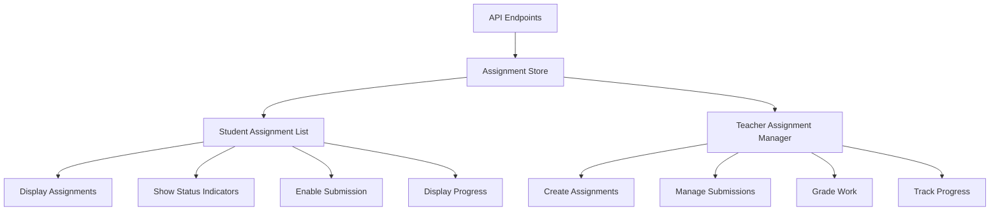
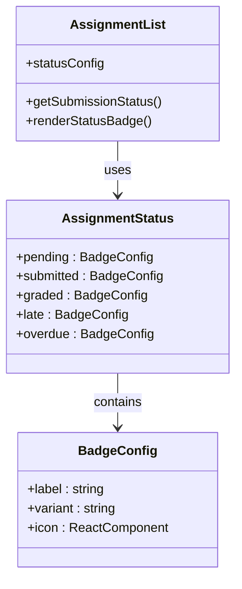
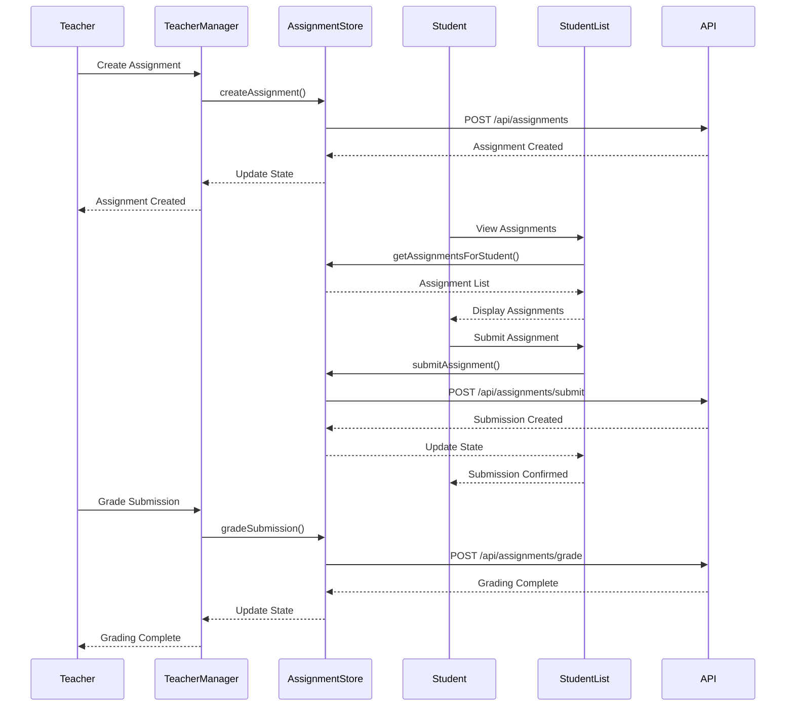
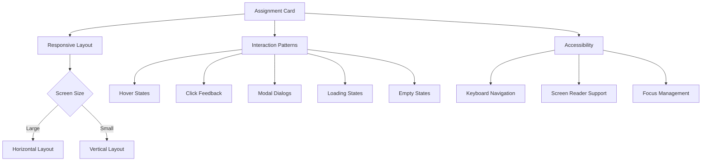
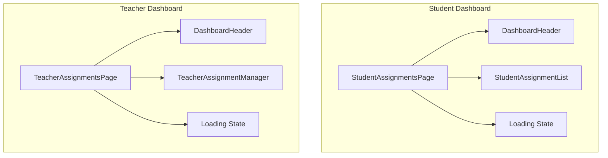

# Assignment Display Components

<cite>
**Referenced Files in This Document**   
- [assignment-list.tsx](file://components/assignment-list.tsx)
- [assignment-store.ts](file://lib/assignment-store.ts)
- [page.tsx](file://app/student/assignments/page.tsx)
- [page.tsx](file://app/teacher/assignments/page.tsx)
- [teacher-assignment-manager.tsx](file://components/teacher-assignment-manager.tsx)
- [types.ts](file://lib/types.ts)
- [database-helpers.ts](file://lib/database-helpers.ts)
- [route.ts](file://app/api/assignments/route.ts)
- [submit/route.ts](file://app/api/assignments/submit/route.ts)
- [grade/route.ts](file://app/api/assignments/grade/route.ts)
</cite>

## Table of Contents
1. [Introduction](#introduction)
2. [Core Components](#core-components)
3. [Assignment Status Visual Design](#assignment-status-visual-design)
4. [Workflow Integration](#workflow-integration)
5. [Responsive Layout and Interaction Patterns](#responsive-layout-and-interaction-patterns)
6. [Dashboard Implementations](#dashboard-implementations)
7. [Accessibility Features](#accessibility-features)
8. [Performance Considerations](#performance-considerations)

## Introduction
The assignment display components in the School Management System provide a comprehensive interface for both students and teachers to manage academic assignments. The system features a student-facing assignment list that displays all available assignments with status indicators, due dates, and submission capabilities, while teachers have access to an assignment manager that enables creation, grading, and monitoring of submissions. This documentation details the implementation of these components, focusing on the visual design, workflow integration, and user experience across different roles.

## Core Components

The assignment display system is built around several key components that work together to provide a seamless experience for both students and teachers. The primary component is the `StudentAssignmentList` which renders assignments with all necessary metadata and interactive elements. This component leverages the `useAssignmentStore` hook to access assignment data and perform submission actions. The component displays each assignment with its title, description, due date, and status indicator, while also providing appropriate actions based on the assignment state.

For teachers, the `TeacherAssignmentManager` component provides a comprehensive interface for creating, publishing, and grading assignments. This component includes a tabbed interface that separates assignment management from grading workflows, allowing teachers to efficiently manage their responsibilities. Both components follow a consistent design language and interaction pattern, ensuring a cohesive user experience across the platform.

**Diagram sources**
- [assignment-list.tsx](file://components/assignment-list.tsx)
- [teacher-assignment-manager.tsx](file://components/teacher-assignment-manager.tsx)
- [assignment-store.ts](file://lib/assignment-store.ts)

**Section sources**
- [assignment-list.tsx](file://components/assignment-list.tsx#L1-L271)
- [teacher-assignment-manager.tsx](file://components/teacher-assignment-manager.tsx#L1-L485)

## Assignment Status Visual Design

The assignment display components implement a comprehensive visual system for communicating assignment status to users. The system uses color-coded badges with appropriate icons to clearly indicate the current state of each assignment. For students, the status indicators include "Not Submitted" (pending), "Submitted", "Graded", "Late", and "Overdue" states, each with distinct visual treatments.

The visual design follows a consistent pattern across the application, using the Badge component with different variants to convey status. Pending assignments use an outline variant with a clock icon, submitted assignments use a secondary variant with a checkmark icon, graded assignments use the default (primary) variant with a checkmark icon, and overdue/late assignments use a destructive variant with an alert icon. This consistent visual language helps users quickly understand the status of their assignments at a glance.

**Diagram sources**
- [assignment-list.tsx](file://components/assignment-list.tsx#L81-L87)
- [ui/badge.tsx](file://components/ui/badge.tsx)

**Section sources**
- [assignment-list.tsx](file://components/assignment-list.tsx#L50-L87)
- [types.ts](file://lib/types.ts#L9-L11)

## Workflow Integration

The assignment display components are tightly integrated with the submission and grading workflows, providing a seamless experience from assignment creation to feedback. The system follows a well-defined workflow that begins with teachers creating assignments through the `TeacherAssignmentManager`, which then become visible to students in their assignment lists. Students can then submit their work through a dialog interface that allows file uploads and optional comments.

Once submitted, assignments transition through different states in the system, with submissions being marked as "submitted" or "late" based on the due date and submission time. Teachers can then grade these submissions through the grading interface, which provides access to submitted files and allows for score entry and feedback. The system ensures data consistency through the `useAssignmentStore` which maintains the state of assignments and submissions across components.

**Diagram sources**
- [assignment-store.ts](file://lib/assignment-store.ts#L68-L77)
- [route.ts](file://app/api/assignments/route.ts)
- [submit/route.ts](file://app/api/assignments/submit/route.ts)
- [grade/route.ts](file://app/api/assignments/grade/route.ts)

**Section sources**
- [assignment-store.ts](file://lib/assignment-store.ts#L63-L77)
- [submit/route.ts](file://app/api/assignments/submit/route.ts#L40-L143)
- [grade/route.ts](file://app/api/assignments/grade/route.ts#L5-L75)

## Responsive Layout and Interaction Patterns

The assignment display components implement responsive layouts that adapt to different screen sizes and device types. The design follows a card-based layout where each assignment is presented as a self-contained card with all relevant information and actions. On larger screens, the layout uses horizontal space efficiently by placing status information and actions on the right side of the card, while on smaller screens the layout stacks elements vertically for better readability.

Interaction patterns are designed to be intuitive and consistent across the application. Clickable elements such as buttons and links have appropriate hover states and visual feedback. The components use progressive disclosure to manage complexity, with detailed submission and grading interfaces presented in modal dialogs rather than navigating to separate pages. This approach maintains context and reduces cognitive load for users.

The components also implement loading states and empty states to provide feedback during data loading and when no assignments are available. These states use appropriate visual elements such as skeletons and placeholder content to indicate that data is being loaded, or descriptive messages and icons when no data is available.

**Diagram sources**
- [assignment-list.tsx](file://components/assignment-list.tsx)
- [teacher-assignment-manager.tsx](file://components/teacher-assignment-manager.tsx)

**Section sources**
- [assignment-list.tsx](file://components/assignment-list.tsx#L89-L269)
- [teacher-assignment-manager.tsx](file://components/teacher-assignment-manager.tsx#L131-L484)

## Dashboard Implementations

The assignment display components are integrated into both student and teacher dashboards, providing role-specific views of assignment information. For students, the `StudentAssignmentsPage` component renders the `StudentAssignmentList` with assignments filtered for the logged-in student's classes. The page fetches the student's class enrollments and user information to properly configure the assignment list component.

For teachers, the `TeacherAssignmentsPage` component renders the `TeacherAssignmentManager` with the teacher's classes and personal information. The component provides a tabbed interface that separates assignment creation and management from grading workflows. The "Assignments" tab shows all assignments for the selected class, including draft and published assignments, while the "Pending Grading" tab highlights submissions that require grading.

Both dashboard implementations follow a consistent layout pattern with a header component that displays the page title and subtitle, followed by the main content area with appropriate padding. The components handle loading states gracefully, displaying a loading spinner while data is being fetched, and error states with appropriate messaging.

**Diagram sources**
- [page.tsx](file://app/student/assignments/page.tsx)
- [page.tsx](file://app/teacher/assignments/page.tsx)

**Section sources**
- [page.tsx](file://app/student/assignments/page.tsx#L1-L68)
- [page.tsx](file://app/teacher/assignments/page.tsx#L1-L73)

## Accessibility Features

The assignment display components incorporate several accessibility features to ensure the interface is usable by all students and teachers, including those with disabilities. The components follow semantic HTML principles, using appropriate heading levels, labels, and ARIA attributes to provide structure and context for screen readers.

Keyboard navigation is fully supported, allowing users to navigate through assignments and interact with controls using only the keyboard. Focus management is implemented to ensure that focus is properly maintained when modal dialogs are opened and closed. The components also provide sufficient color contrast and support for high-contrast modes to accommodate users with visual impairments.

Interactive elements include appropriate labels and tooltips to provide context for users. Error states and validation messages are announced to screen readers, and form controls are properly labeled to ensure they can be understood and operated by assistive technologies. The components also support dynamic text resizing and responsive layouts to accommodate users who need larger text or have limited screen space.

**Section sources**
- [assignment-list.tsx](file://components/assignment-list.tsx)
- [teacher-assignment-manager.tsx](file://components/teacher-assignment-manager.tsx)
- [ui/badge.tsx](file://components/ui/badge.tsx)
- [ui/button.tsx](file://components/ui/button.tsx)

## Performance Considerations

The assignment display components are designed with performance in mind, implementing several optimizations to ensure smooth rendering and interaction. The components use client-side state management through the `useAssignmentStore` to minimize API calls and reduce latency. The store maintains a cache of assignments and submissions, allowing for immediate rendering and updates without waiting for network requests.

Data fetching is optimized to retrieve only the necessary information, with API endpoints returning assignments with related class and teacher information in a single query. The components implement efficient rendering patterns, using React's memoization features to prevent unnecessary re-renders when data hasn't changed.

For large lists of assignments or submissions, the components could be enhanced with virtualization to improve scroll performance, though this is not currently implemented. The current implementation is optimized for typical class sizes and assignment loads, with performance monitoring in place to identify potential bottlenecks as usage grows.

The components also implement lazy loading for images and other media, though this is primarily relevant for submitted files rather than the assignment list itself. Error boundaries are in place to prevent component failures from affecting the entire application, and comprehensive error handling ensures that issues are gracefully managed and reported.

**Section sources**
- [assignment-store.ts](file://lib/assignment-store.ts)
- [assignment-list.tsx](file://components/assignment-list.tsx)
- [teacher-assignment-manager.tsx](file://components/teacher-assignment-manager.tsx)
- [database-helpers.ts](file://lib/database-helpers.ts)