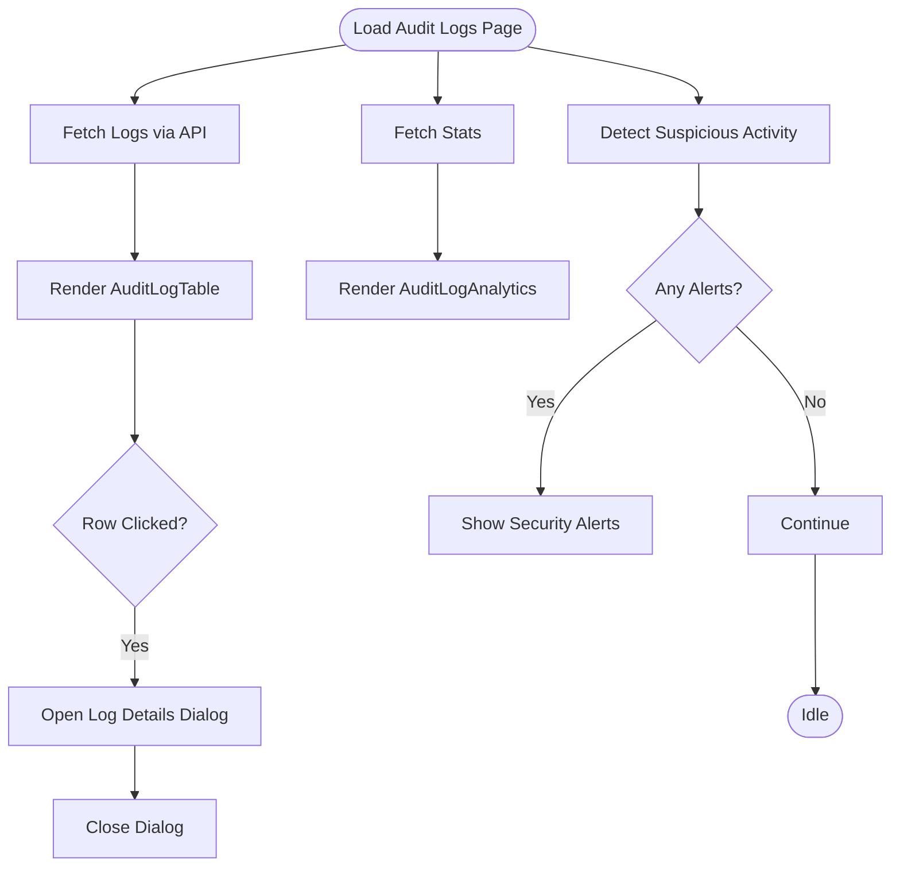

# Audit Log Display Components

<cite>
**Referenced Files in This Document**
- [audit-log-table.tsx](file://components/audit-log-table.tsx)
- [data-table.tsx](file://components/data-table.tsx)
- [audit-logs.ts](file://lib/supabase/audit-logs.ts)
- [page.tsx](file://app/admin/audit-logs/page.tsx)
- [route.ts](file://app/api/audit-logs/route.ts)
- [audit-log-filters.tsx](file://components/audit-log-filters.tsx)
- [audit-log-analytics.tsx](file://components/audit-log-analytics.tsx)
- [user-audit-history.tsx](file://components/user-audit-history.tsx)
- [audit_logs_view_v2.sql](file://supabase/migrations/20260108132041_audit_logs_view_v2.sql)
- [audit_logs_indexes.sql](file://supabase/migrations/20260108_audit_logs_indexes.sql)
- [badge.tsx](file://components/ui/badge.tsx)
</cite>

## Table of Contents
1. [Introduction](#introduction)
2. [Project Structure](#project-structure)
3. [Core Components](#core-components)
4. [Architecture Overview](#architecture-overview)
5. [Detailed Component Analysis](#detailed-component-analysis)
6. [Dependency Analysis](#dependency-analysis)
7. [Performance Considerations](#performance-considerations)
8. [Accessibility Features](#accessibility-features)
9. [Responsive Design](#responsive-design)
10. [Troubleshooting Guide](#troubleshooting-guide)
11. [Conclusion](#conclusion)

## Introduction
This document explains the audit log display components used for security monitoring in the admin dashboard. It focuses on the AuditLogTable component that extends a reusable DataTable, detailing specialized columns for date/time, user information, role badges, action severity badges, and IP addresses. It documents the integration with audit-logs utility functions for action display names and severity levels, the styling of different severity levels, date formatting and user information display patterns, and practical usage in the admin dashboard. Accessibility and responsive design considerations are also covered.

## Project Structure
The audit log display is composed of:
- A reusable DataTable component that renders tabular data with customizable columns and optional row click handlers.
- An AuditLogTable component that specializes DataTable for audit entries, rendering date/time, user, role, action severity, and IP address.
- Utility functions for fetching audit logs, computing statistics, detecting suspicious activity, and mapping actions to display names and severity levels.
- An admin page that orchestrates filtering, pagination, analytics, and exporting audit logs.
- Supporting components for filters, analytics, and per-user audit history.

**Diagram sources**
- [page.tsx](file://app/admin/audit-logs/page.tsx#L1-L336)
- [audit-log-filters.tsx](file://components/audit-log-filters.tsx#L1-L154)
- [audit-log-analytics.tsx](file://components/audit-log-analytics.tsx#L1-L78)
- [audit-log-table.tsx](file://components/audit-log-table.tsx#L1-L84)
- [data-table.tsx](file://components/data-table.tsx#L1-L60)
- [audit-logs.ts](file://lib/supabase/audit-logs.ts#L1-L321)
- [route.ts](file://app/api/audit-logs/route.ts#L1-L65)
- [audit_logs_view_v2.sql](file://supabase/migrations/20260108132041_audit_logs_view_v2.sql#L1-L21)
- [audit_logs_indexes.sql](file://supabase/migrations/20260108_audit_logs_indexes.sql#L1-L26)
- [badge.tsx](file://components/ui/badge.tsx#L1-L47)

**Section sources**
- [audit-log-table.tsx](file://components/audit-log-table.tsx#L1-L84)
- [data-table.tsx](file://components/data-table.tsx#L1-L60)
- [audit-logs.ts](file://lib/supabase/audit-logs.ts#L1-L321)
- [page.tsx](file://app/admin/audit-logs/page.tsx#L1-L336)
- [route.ts](file://app/api/audit-logs/route.ts#L1-L65)
- [audit-log-filters.tsx](file://components/audit-log-filters.tsx#L1-L154)
- [audit-log-analytics.tsx](file://components/audit-log-analytics.tsx#L1-L78)
- [user-audit-history.tsx](file://components/user-audit-history.tsx#L1-L99)
- [audit_logs_view_v2.sql](file://supabase/migrations/20260108132041_audit_logs_view_v2.sql#L1-L21)
- [audit_logs_indexes.sql](file://supabase/migrations/20260108_audit_logs_indexes.sql#L1-L26)
- [badge.tsx](file://components/ui/badge.tsx#L1-L47)

## Core Components
- AuditLogTable: Specialized table for audit logs with columns for date/time, user, role, action severity, and IP address. Uses utility functions to map actions to display names and severity levels and applies badge variants accordingly.
- DataTable: Generic table renderer that accepts columns and data, supports custom renderers, and optional row click handlers.
- Audit Logs Utilities: Provides typed log entries, filters, statistics computation, suspicious activity detection, CSV export, and mapping of actions to display names and severity levels.
- Admin Page: Orchestrates fetching logs, applying filters, pagination, analytics, and exporting. Integrates a dialog to show detailed log information.
- Supporting Components: Filters, analytics cards, and per-user audit history.

**Section sources**
- [audit-log-table.tsx](file://components/audit-log-table.tsx#L1-L84)
- [data-table.tsx](file://components/data-table.tsx#L1-L60)
- [audit-logs.ts](file://lib/supabase/audit-logs.ts#L1-L321)
- [page.tsx](file://app/admin/audit-logs/page.tsx#L1-L336)

## Architecture Overview
The admin dashboard integrates with the backend via a Next.js API route that validates the user’s role and delegates to audit-logs utilities. The utilities query a Supabase view that joins audit log entries with user information. The UI composes filters, analytics, and the audit log table, with a details dialog for individual entries.

**Diagram sources**
- [page.tsx](file://app/admin/audit-logs/page.tsx#L1-L336)
- [route.ts](file://app/api/audit-logs/route.ts#L1-L65)
- [audit-logs.ts](file://lib/supabase/audit-logs.ts#L1-L321)
- [audit_logs_view_v2.sql](file://supabase/migrations/20260108132041_audit_logs_view_v2.sql#L1-L21)

## Detailed Component Analysis

### AuditLogTable Component
- Purpose: Render audit logs in a table with specialized columns for readability and security signal.
- Columns:
  - Date & Time: Renders date on one line and time on another for clarity.
  - User: Displays user name and email; falls back to placeholders when missing.
  - Role: Displays role as an outlined badge with lowercase capitalization.
  - Action: Maps action to a display name and severity, then renders a badge with a variant chosen by severity.
  - IP Address: Displays IP address monospaced; shows N/A when empty.
- Severity mapping:
  - High severity actions use a destructive badge variant.
  - Medium severity actions use the default badge variant.
  - Low severity actions use the secondary badge variant.
- Integration:
  - Uses getActionDisplayName and getActionSeverity from audit-logs utilities.
  - Extends DataTable with custom renderers and passes onRowClick to support row selection.

**Diagram sources**
- [audit-log-table.tsx](file://components/audit-log-table.tsx#L1-L84)
- [data-table.tsx](file://components/data-table.tsx#L1-L60)
- [audit-logs.ts](file://lib/supabase/audit-logs.ts#L1-L321)

**Section sources**
- [audit-log-table.tsx](file://components/audit-log-table.tsx#L1-L84)
- [audit-logs.ts](file://lib/supabase/audit-logs.ts#L263-L321)
- [badge.tsx](file://components/ui/badge.tsx#L1-L47)

### DataTable Component
- Purpose: Generic table renderer with customizable columns and optional row click behavior.
- Features:
  - Accepts a Column<T> array with key, header, optional render, and optional className.
  - Renders headers either as static text or via a function.
  - Renders cells using either a custom renderer or a default string fallback.
  - Adds hover and cursor pointer styles when onRowClick is provided.
  - Wraps content in a bordered card-like container with horizontal scrolling for small screens.

**Section sources**
- [data-table.tsx](file://components/data-table.tsx#L1-L60)

### Audit Logs Utilities
- Data model: AuditLogEntry with id, user_id, action, ip_address, created_at, payload, and optional user fields.
- Filtering and pagination: getAuditLogs supports userId, action, date range, IP address, page, and pageSize.
- Statistics: getAuditLogStats computes totals, failed attempts, success rate, unique users, and top actions.
- Suspicious activity: detectSuspiciousActivity groups recent logs and raises alerts for repeated failed logins, password changes, and MFA changes.
- Action mapping: getActionDisplayName maps internal action strings to user-friendly labels; getActionSeverity classifies actions as low/medium/high.
- CSV export: exportAuditLogsToCSV produces a CSV with sanitized cells to prevent formula injection.

**Section sources**
- [audit-logs.ts](file://lib/supabase/audit-logs.ts#L1-L321)

### Admin Page (Security Monitoring)
- Responsibilities:
  - Fetches logs, stats, and suspicious activity alerts.
  - Applies filters and pagination.
  - Renders analytics cards and the audit log table.
  - Provides export to CSV and refresh controls.
  - Opens a dialog to show detailed information for a selected log.
- Authorization:
  - Only admins can view all logs; regular users can only view their own logs.
  - The API route verifies user role and enforces access control.

**Diagram sources**
- [page.tsx](file://app/admin/audit-logs/page.tsx#L1-L336)
- [route.ts](file://app/api/audit-logs/route.ts#L1-L65)

**Section sources**
- [page.tsx](file://app/admin/audit-logs/page.tsx#L1-L336)
- [route.ts](file://app/api/audit-logs/route.ts#L1-L65)

### Supporting Components
- AuditLogFilters: Provides a form with action type, date range, user ID, and IP address filters, plus apply/clear controls.
- AuditLogAnalytics: Displays summary metrics including total logins, failed attempts, success rate, unique users, and top actions.
- UserAuditHistory: Shows recent authentication events for a given user, mirroring the severity and display name logic.

**Section sources**
- [audit-log-filters.tsx](file://components/audit-log-filters.tsx#L1-L154)
- [audit-log-analytics.tsx](file://components/audit-log-analytics.tsx#L1-L78)
- [user-audit-history.tsx](file://components/user-audit-history.tsx#L1-L99)

## Dependency Analysis
- AuditLogTable depends on:
  - DataTable for rendering.
  - Badge for severity indicators.
  - Audit logs utilities for action display names and severity classification.
- Admin page depends on:
  - AuditLogFilters, AuditLogAnalytics, and AuditLogTable.
  - Next API route for data and authorization.
  - Audit logs utilities for stats and suspicious activity detection.
- Backend depends on:
  - Supabase view audit_logs_with_users to join audit log entries with user information.
  - Indexes and view creation to optimize queries.

**Diagram sources**
- [audit-log-table.tsx](file://components/audit-log-table.tsx#L1-L84)
- [data-table.tsx](file://components/data-table.tsx#L1-L60)
- [audit-logs.ts](file://lib/supabase/audit-logs.ts#L1-L321)
- [page.tsx](file://app/admin/audit-logs/page.tsx#L1-L336)
- [route.ts](file://app/api/audit-logs/route.ts#L1-L65)
- [audit_logs_view_v2.sql](file://supabase/migrations/20260108132041_audit_logs_view_v2.sql#L1-L21)

**Section sources**
- [audit-log-table.tsx](file://components/audit-log-table.tsx#L1-L84)
- [audit-logs.ts](file://lib/supabase/audit-logs.ts#L1-L321)
- [page.tsx](file://app/admin/audit-logs/page.tsx#L1-L336)
- [route.ts](file://app/api/audit-logs/route.ts#L1-L65)
- [audit_logs_view_v2.sql](file://supabase/migrations/20260108132041_audit_logs_view_v2.sql#L1-L21)

## Performance Considerations
- Pagination: The API and utilities support pagination to limit payload sizes and improve responsiveness.
- View usage: The audit_logs_with_users view simplifies joins and improves query performance.
- Rendering: AuditLogTable uses minimal DOM nesting and relies on Badge variants for lightweight visuals.
- Export: CSV export is computed client-side for a single page of logs; consider server-side export for large datasets.

[No sources needed since this section provides general guidance]

## Accessibility Features
- Keyboard focus and focus-visible rings are handled by the Badge component, ensuring visible focus states.
- DataTable uses semantic table markup and hover/click affordances for keyboard users.
- Dialog components provide focus trapping and clear titles/descriptions for assistive technologies.
- Color contrast: Severity variants (destructive, default, secondary) should meet contrast guidelines; Badge component manages default contrast.

**Section sources**
- [badge.tsx](file://components/ui/badge.tsx#L1-L47)
- [data-table.tsx](file://components/data-table.tsx#L1-L60)
- [page.tsx](file://app/admin/audit-logs/page.tsx#L280-L333)

## Responsive Design
- Horizontal scrolling: DataTable wraps the table in a container with horizontal scrolling to preserve usability on narrow screens.
- Grid layouts: Analytics cards use responsive grid classes to stack on smaller screens.
- Typography: Date/time and user/email are stacked for readability; IP addresses use a monospace font for legibility.
- Dialogs: The details dialog is modal and scales content appropriately for mobile.

**Section sources**
- [data-table.tsx](file://components/data-table.tsx#L1-L60)
- [audit-log-analytics.tsx](file://components/audit-log-analytics.tsx#L1-L78)
- [page.tsx](file://app/admin/audit-logs/page.tsx#L200-L277)

## Troubleshooting Guide
- Database migration missing:
  - Symptoms: Empty logs and a setup notice prompting to run migrations.
  - Resolution: Apply the audit logs view and indexes migrations.
- Unauthorized or forbidden:
  - Symptoms: API returns unauthorized or forbidden errors.
  - Resolution: Ensure the user is authenticated and has admin privileges when viewing all logs.
- No data despite valid credentials:
  - Symptoms: Empty logs with pagination counts.
  - Resolution: Verify the audit_logs_with_users view exists and grants SELECT access; confirm that audit log entries exist in the Supabase auth audit log entries table.
- CSV export issues:
  - Symptoms: Unexpected characters or formula injection warnings in spreadsheets.
  - Resolution: Use the built-in CSV export which escapes dangerous prefixes and quotes.

**Section sources**
- [page.tsx](file://app/admin/audit-logs/page.tsx#L160-L177)
- [route.ts](file://app/api/audit-logs/route.ts#L1-L65)
- [audit_logs_view_v2.sql](file://supabase/migrations/20260108132041_audit_logs_view_v2.sql#L1-L21)
- [audit_logs_indexes.sql](file://supabase/migrations/20260108_audit_logs_indexes.sql#L1-L26)
- [audit-logs.ts](file://lib/supabase/audit-logs.ts#L241-L261)

## Conclusion
The audit log display components provide a robust, accessible, and responsive foundation for security monitoring in the admin dashboard. AuditLogTable leverages a reusable DataTable with specialized columns and severity-aware badges, integrating tightly with audit-logs utilities for display names and severity classification. The admin page coordinates filtering, analytics, pagination, and exporting, while the backend ensures proper authorization and efficient querying via a dedicated view. Together, these components enable administrators to track authentication events, identify suspicious activity, and maintain oversight of system security.