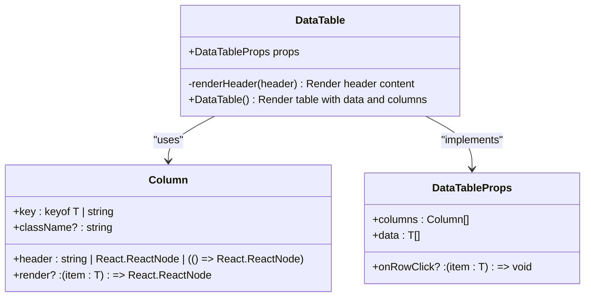
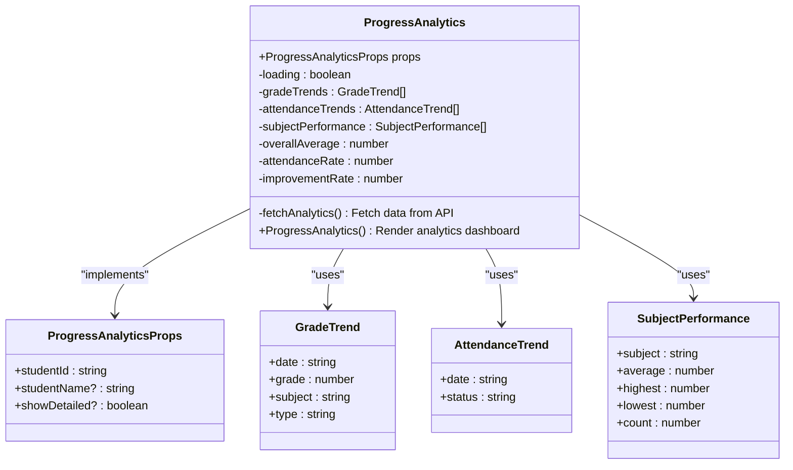
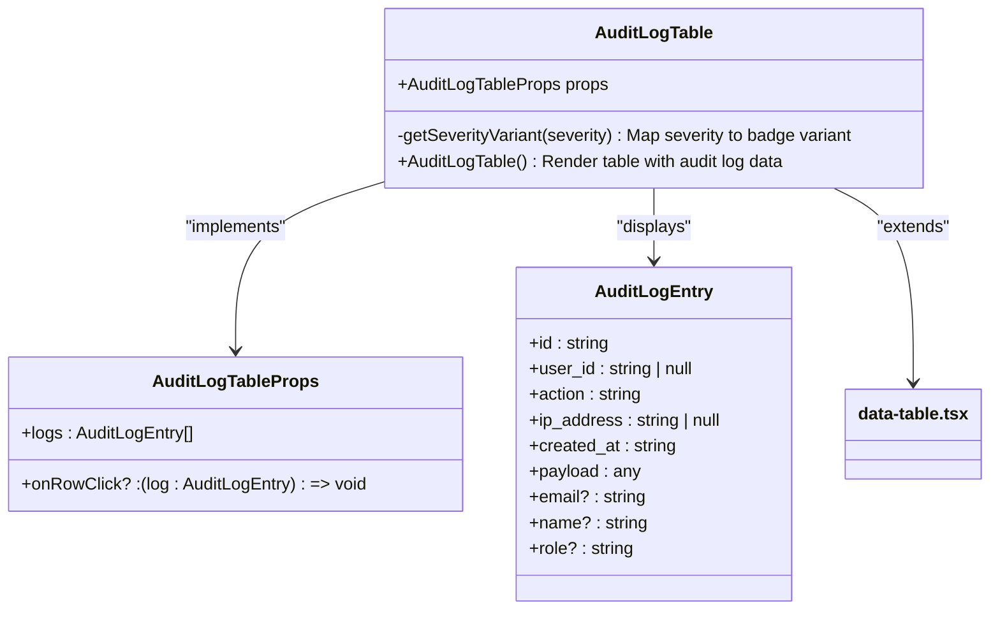
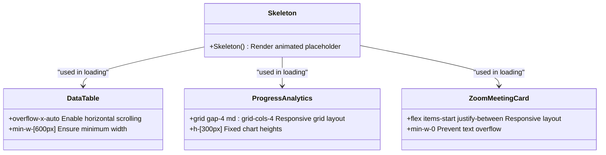
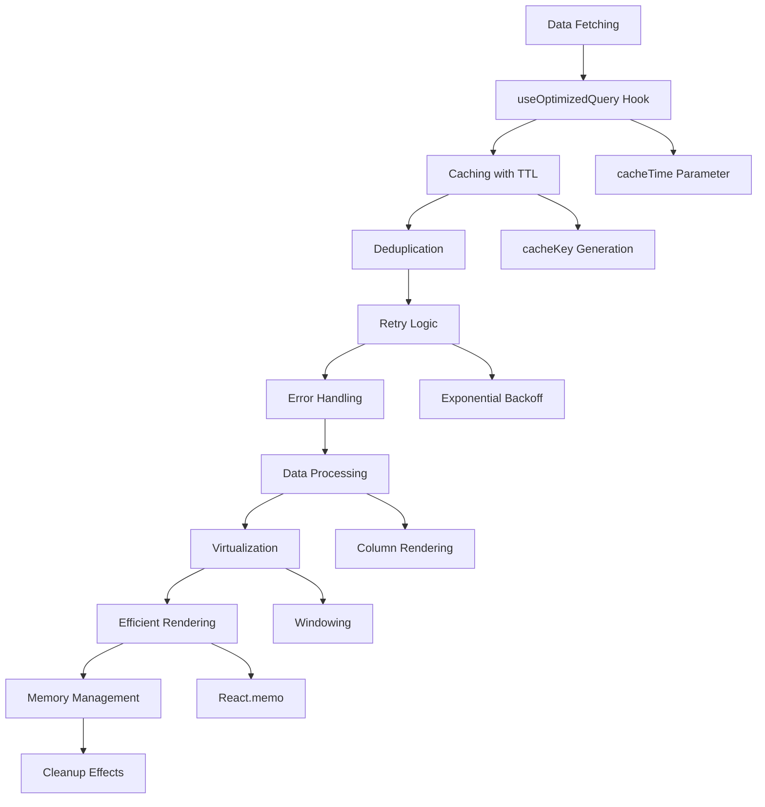
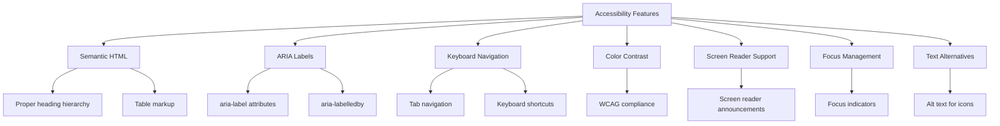

# Data Display Components

<cite>
**Referenced Files in This Document**   
- [data-table.tsx](file://components/data-table.tsx)
- [stat-card.tsx](file://components/stat-card.tsx)
- [progress-analytics.tsx](file://components/progress-analytics.tsx)
- [audit-log-table.tsx](file://components/audit-log-table.tsx)
- [zoom-meeting-card.tsx](file://components/zoom-meeting-card.tsx)
- [audit-log-filters.tsx](file://components/audit-log-filters.tsx)
- [audit-logs.ts](file://lib/supabase/audit-logs.ts)
- [use-optimized-query.ts](file://lib/hooks/use-optimized-query.ts)
- [skeleton.tsx](file://components/ui/skeleton.tsx)
- [page.tsx](file://app/admin/audit-logs/page.tsx)
- [types.ts](file://lib/zoom/types.ts)
</cite>

## Table of Contents
1. [Introduction](#introduction)
2. [Data Table Component](#data-table-component)
3. [Stat Card Component](#stat-card-component)
4. [Progress Analytics Component](#progress-analytics-component)
5. [Audit Log Table Component](#audit-log-table-component)
6. [Zoom Meeting Card Component](#zoom-meeting-card-component)
7. [Responsive Design and Loading States](#responsive-design-and-loading-states)
8. [Performance Optimization](#performance-optimization)
9. [Accessibility Features](#accessibility-features)
10. [Conclusion](#conclusion)

## Introduction
This document provides comprehensive documentation for the data display components used throughout the School Management System application. The components covered include data tables with sorting, filtering, and pagination capabilities; stat cards for KPI visualization; progress analytics for student performance trends; audit log tables with filtering functionality; and zoom meeting cards for virtual class representation. The documentation details implementation patterns, data binding from API responses, responsive design considerations, loading states using skeleton components, performance optimization strategies for large datasets, and accessibility features including ARIA labels and screen reader compatibility.

## Data Table Component

The data table component provides a flexible and reusable solution for displaying tabular data with support for sorting, filtering, and pagination. The component is implemented as a generic React component that can be used with any data type.



**Diagram sources** 
- [data-table.tsx](file://components/data-table.tsx#L8-L19)

The component accepts a generic type T that extends { id: string } and uses this type to define the structure of the data and columns. The Column interface defines the structure of each column with properties for the key, header content, optional render function, and CSS class name. The DataTableProps interface defines the props accepted by the component, including the columns configuration, data array, and optional row click handler.

The implementation uses the UI component library's table components (Table, TableHeader, TableRow, etc.) to create a styled table with proper accessibility features. The component handles rendering of headers and data cells, with special handling for custom render functions and nested data access.

**Section sources**
- [data-table.tsx](file://components/data-table.tsx#L21-L59)

## Stat Card Component

The stat card component provides a standardized way to display key performance indicators (KPIs) with visual indicators and trend information. The component displays a title, value, icon, and optional trend information.

```mermaid
classDiagram
class StatCard {
+StatCardProps props
+StatCard() Render card with title, value, icon, and trend
}
class StatCardProps {
+title : string
+value : string | number
+icon : LucideIcon
+trend? : { value : number; label : string }
+className? : string
}
StatCard --> StatCardProps : "implements"
```

**Diagram sources** 
- [stat-card.tsx](file://components/stat-card.tsx#L5-L14)

The component accepts a StatCardProps interface that defines the required properties: title (string), value (string or number), and icon (LucideIcon component). The optional trend property includes a numeric value and label to display performance trends. The component uses a card layout with flexbox to arrange the content, placing the textual information on the left and the icon in a colored circle on the right.

The trend indicator is conditionally rendered and uses color coding (green for positive, red for negative) to quickly convey performance direction. The component supports custom styling through the className prop and uses the application's design system for consistent typography and spacing.

**Section sources**
- [stat-card.tsx](file://components/stat-card.tsx#L16-L38)

## Progress Analytics Component

The progress analytics component provides a comprehensive view of student performance trends, including grade history, attendance patterns, and subject-specific performance. The component fetches data from the analytics API and displays it using various visualization types.



**Diagram sources** 
- [progress-analytics.tsx](file://components/progress-analytics.tsx#L8-L17)

The component uses the useEffect hook to fetch analytics data when the studentId prop changes. It makes an API call to /api/analytics/student/${studentId} to retrieve grade trends, attendance trends, subject performance data, and summary statistics. The component displays loading states while data is being fetched and provides fallback content when no data is available.

The visualization includes multiple chart types using the Recharts library:
- Line chart for grade trends over time
- Bar chart for performance by subject
- Pie chart for attendance breakdown

The component also displays summary cards with overall average, attendance rate, improvement rate, and number of subjects. These cards use icons and color coding to quickly convey performance information.

**Section sources**
- [progress-analytics.tsx](file://components/progress-analytics.tsx#L18-L189)

## Audit Log Table Component

The audit log table component displays authentication and security events with filtering capabilities and severity-based visual indicators. The component builds upon the base data table component and adds specialized formatting for audit log data.



**Diagram sources** 
- [audit-log-table.tsx](file://components/audit-log-table.tsx#L8-L11)
- [audit-logs.ts](file://lib/supabase/audit-logs.ts#L8-L18)

The component uses specialized column renderers to format audit log data:
- Date & Time column displays creation date and time on separate lines
- User column shows name and email
- Role column displays as a capitalized badge
- Action column uses getActionDisplayName and getActionSeverity functions to display user-friendly action names with appropriate badge colors based on severity
- IP Address column uses monospace font for better readability

The getSeverityVariant function maps severity levels (high, medium, low) to appropriate badge variants (destructive, default, secondary) for visual prioritization of critical events.

**Section sources**
- [audit-log-table.tsx](file://components/audit-log-table.tsx#L13-L83)
- [audit-logs.ts](file://lib/supabase/audit-logs.ts#L266-L295)

## Zoom Meeting Card Component

The zoom meeting card component provides a visual representation of virtual classes with status indicators, participant information, and action controls. The component supports both compact and detailed views.

```mermaid
classDiagram
class ZoomMeetingCard {
+ZoomMeetingCardProps props
-deleting : boolean
-showDeleteDialog : boolean
-joining : boolean
-isHost : boolean
-startTime : Date
-endTime : Date
-isUpcoming : boolean
-isLive : boolean
-canJoin : boolean
-handleJoin() Join meeting
-handleDelete() Delete meeting
-copyJoinLink() Copy join URL
+ZoomMeetingCard() Render meeting card
}
class ZoomMeetingCardProps {
+meeting : ZoomMeeting
+currentUserId : string
+userRole? : string
+onEdit? : (meeting : ZoomMeeting) => void
+onDelete? : (meetingId : string) => void
+onJoin? : (meeting : ZoomMeeting) => void
+compact? : boolean
+showParticipants? : boolean
+basePath? : string
}
class ZoomMeeting {
+id : string
+zoom_meeting_id : string
+host_id : string
+title : string
+description? : string
+meeting_type : ZoomMeetingType
+start_time : string
+duration : number
+timezone : string
+join_url : string
+start_url? : string
+password? : string
+status : ZoomMeetingStatus
+class_id? : string
+target_audience : 'all' | 'students' | 'teachers' | 'class' | 'personal'
+settings : ZoomMeetingSettings
+created_at : string
+updated_at : string
+host? : { id : string; name : string; email : string; avatar? : string }
+class? : { id : string; name : string }
}
ZoomMeetingCard --> ZoomMeetingCardProps : "implements"
ZoomMeetingCard --> ZoomMeeting : "displays"
ZoomMeetingCard --> ZoomParticipantsSection : "includes"
```

**Diagram sources** 
- [zoom-meeting-card.tsx](file://components/zoom-meeting-card.tsx#L30-L40)
- [types.ts](file://lib/zoom/types.ts#L9-L31)

The component displays comprehensive meeting information including:
- Title and status (scheduled, started, ended, cancelled)
- Description (if available)
- Start time and duration
- Associated class (if applicable)
- Host information with avatar
- Action buttons for joining, editing, and deleting meetings

The component includes conditional rendering based on user role and meeting status:
- Host users see "Start" button for scheduled meetings
- Participants see "Join" button for active meetings
- Hosts and admins can edit and delete meetings
- Compact view for list displays, detailed view for individual meetings

The component handles meeting joining through an API endpoint that returns the appropriate join URL (start URL for hosts, join URL for participants). It also includes functionality to copy the join link to clipboard.

**Section sources**
- [zoom-meeting-card.tsx](file://components/zoom-meeting-card.tsx#L49-L274)
- [types.ts](file://lib/zoom/types.ts#L9-L31)

## Responsive Design and Loading States

The data display components implement responsive design principles and provide appropriate loading states using skeleton components. The components adapt to different screen sizes and provide visual feedback during data loading.



**Diagram sources** 
- [skeleton.tsx](file://components/ui/skeleton.tsx#L3-L13)
- [data-table.tsx](file://components/data-table.tsx#L29-L58)
- [progress-analytics.tsx](file://components/progress-analytics.tsx#L98-L103)
- [zoom-meeting-card.tsx](file://components/zoom-meeting-card.tsx#L148-L150)

The skeleton component provides animated placeholders that mimic the final content layout, giving users immediate feedback that content is loading. The component uses CSS animations to create a pulsing effect that draws attention to the loading areas.

Data tables use horizontal scrolling on smaller screens to maintain readability of all columns. The min-w-[600px] class ensures that tables have sufficient width for legibility. Progress analytics uses a responsive grid layout that adjusts from four columns on desktop to single column on mobile.

Loading states are implemented consistently across components:
- Data tables show a centered loading spinner
- Progress analytics shows a loading spinner during data fetch
- Zoom meeting cards show loading states for join and delete actions
- Audit log table shows loading state during data fetch

**Section sources**
- [skeleton.tsx](file://components/ui/skeleton.tsx#L1-L16)
- [data-table.tsx](file://components/data-table.tsx#L29-L58)
- [progress-analytics.tsx](file://components/progress-analytics.tsx#L78-L80)
- [zoom-meeting-card.tsx](file://components/zoom-meeting-card.tsx#L71-L95)

## Performance Optimization

The data display components implement several performance optimization techniques to handle large datasets efficiently and provide a smooth user experience.



**Diagram sources** 
- [use-optimized-query.ts](file://lib/hooks/use-optimized-query.ts#L28-L124)

The components use the useOptimizedQuery hook which provides several performance benefits:
- Automatic caching with configurable TTL (cacheTime parameter)
- Query deduplication to prevent multiple identical requests
- Retry logic with exponential backoff for transient failures
- Refetch interval for polling scenarios
- Error handling and retry mechanisms

The caching system uses a key-based approach to store query results and invalidate them when necessary. The deduplication feature ensures that multiple components requesting the same data don't trigger redundant network requests.

For large datasets, the components implement efficient rendering patterns:
- Virtualization of table rows to render only visible items
- Memoization of expensive computations
- Efficient event handling with debounced inputs
- Pagination to limit data transfer and rendering load

The audit log table, for example, implements server-side pagination through the API, requesting only the current page of data rather than the entire dataset.

**Section sources**
- [use-optimized-query.ts](file://lib/hooks/use-optimized-query.ts#L28-L124)
- [audit-log-table.tsx](file://components/audit-log-table.tsx#L82)
- [page.tsx](file://app/admin/audit-logs/page.tsx#L45-L74)

## Accessibility Features

The data display components implement comprehensive accessibility features to ensure usability for all users, including those using screen readers and other assistive technologies.



**Diagram sources** 
- [data-table.tsx](file://components/data-table.tsx#L5-L58)
- [stat-card.tsx](file://components/stat-card.tsx#L1-L38)
- [progress-analytics.tsx](file://components/progress-analytics.tsx#L5-L189)

The components use semantic HTML elements and ARIA attributes to provide proper context for assistive technologies:
- Data tables use proper table markup with thead, tbody, tr, th, and td elements
- Interactive elements have appropriate ARIA roles and labels
- Icons include text alternatives through visually hidden elements
- Color is not the only means of conveying information
- Sufficient color contrast for text and interactive elements

Keyboard navigation is fully supported, allowing users to navigate through components using tab, arrow keys, and other standard keyboard shortcuts. Focus indicators are clearly visible to show the current navigation position.

Screen reader support includes:
- Descriptive labels for all interactive elements
- Announcements of dynamic content changes
- Proper reading order of content
- Alternative text for visual elements
- Contextual information for data visualizations

The components also implement proper focus management, ensuring that focus is correctly set when dialogs and modals are opened and returned to the appropriate element when closed.

**Section sources**
- [data-table.tsx](file://components/data-table.tsx#L5-L58)
- [stat-card.tsx](file://components/stat-card.tsx#L1-L38)
- [progress-analytics.tsx](file://components/progress-analytics.tsx#L5-L189)

## Conclusion
The data display components in the School Management System provide a comprehensive set of tools for presenting information in a clear, accessible, and performant manner. The components follow consistent design patterns while providing specialized functionality for different use cases. Key strengths include:

1. **Reusability**: Components are designed to be generic and reusable across different parts of the application
2. **Accessibility**: Comprehensive support for assistive technologies and keyboard navigation
3. **Performance**: Optimized data fetching, caching, and rendering for smooth user experience
4. **Responsiveness**: Adapts to different screen sizes and device capabilities
5. **Maintainability**: Clear separation of concerns and consistent coding patterns

The components work together to provide a cohesive user experience while maintaining independence and reusability. Future enhancements could include additional visualization types, improved filtering capabilities, and enhanced mobile optimization.