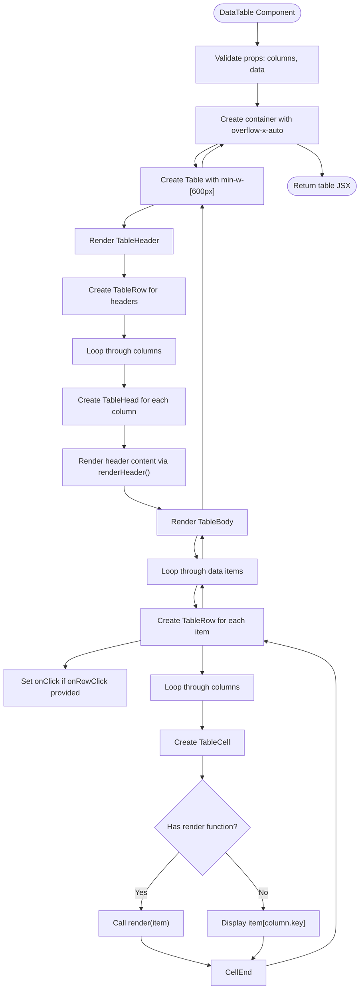
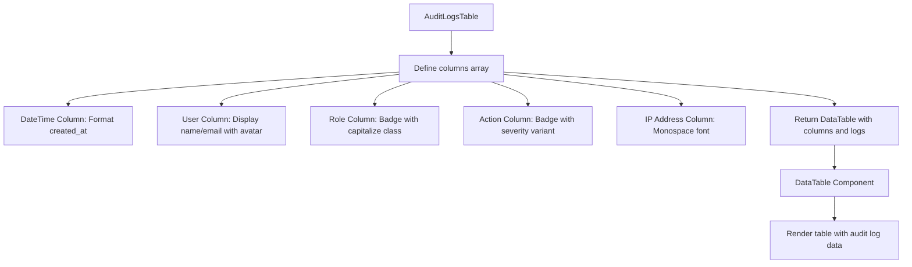

# Data Table

<cite>
**Referenced Files in This Document**   
- [data-table.tsx](file://components/data-table.tsx)
- [audit-log-table.tsx](file://components/audit-log-table.tsx)
- [ui/table.tsx](file://components/ui/table.tsx)
- [students/page.tsx](file://app/admin/students/page.tsx)
- [teachers/page.tsx](file://app/admin/teachers/page.tsx)
- [audit-logs/page.tsx](file://app/admin/audit-logs/page.tsx)
- [attendance/page.tsx](file://app/admin/attendance/page.tsx)
- [grades/page.tsx](file://app/admin/grades/page.tsx)
- [users/page.tsx](file://app/admin/users/page.tsx)
- [audit-logs.ts](file://lib/supabase/audit-logs.ts)
</cite>

## Table of Contents
1. [Introduction](#introduction)
2. [Core Component Analysis](#core-component-analysis)
3. [Column Interface Definition](#column-interface-definition)
4. [DataTableProps Interface](#datatableprops-interface)
5. [Implementation Details](#implementation-details)
6. [Usage Examples](#usage-examples)
7. [Responsive Design and Accessibility](#responsive-design-and-accessibility)
8. [Performance Considerations](#performance-considerations)
9. [Integration with Filtering and Sorting](#integration-with-filtering-and-sorting)
10. [Conclusion](#conclusion)

## Introduction
The DataTable component is a reusable, generic table implementation used throughout the school management system for displaying tabular data. It provides a flexible interface for rendering dynamic columns, handling row interactions, and supporting various data types across different administrative views including student records, teacher information, audit logs, attendance, and grades.

## Core Component Analysis

The DataTable component is implemented as a generic React component that accepts a flexible column configuration and data array. It leverages the UI library's table components while adding enhanced functionality for dynamic rendering and interactivity.

**Section sources**
- [data-table.tsx](file://components/data-table.tsx#L1-L59)

## Column Interface Definition

The `Column<T>` interface defines the structure for each column in the data table:

- **key**: The property key from the data object to display, typed as `keyof T | string` to support both type-safe and dynamic property access
- **header**: The column header content which can be a string, React node, or function returning a React node
- **render**: An optional function that takes a data item and returns custom React content for the cell
- **className**: Optional CSS classes to apply to the table header and cells for styling

This interface enables flexible column configurations where some columns can display raw data values while others use custom rendering functions for complex content like badges, avatars, or formatted dates.

**Section sources**
- [data-table.tsx](file://components/data-table.tsx#L8-L13)

## DataTableProps Interface

The `DataTableProps<T>` interface defines the component's input properties:

- **columns**: An array of `Column<T>` objects that define the table's structure and rendering behavior
- **data**: An array of data objects of type `T` to be displayed in the table
- **onRowClick**: An optional callback function that fires when a row is clicked, receiving the corresponding data item

The component uses a generic type constraint `T extends { id: string }` requiring all data items to have an `id` property, which is used for React keys and row identification.

**Section sources**
- [data-table.tsx](file://components/data-table.tsx#L15-L19)

## Implementation Details

The DataTable implementation wraps the UI library's table components with additional functionality:

- The table container has `overflow-x-auto` to enable horizontal scrolling on smaller screens
- A minimum width of 600px ensures content readability
- Header cells use the `text-muted-foreground` class for subdued text color
- Row hover states are enabled with `hover:bg-muted/50` when an `onRowClick` handler is provided
- The component handles both simple value display and custom rendering through the `render` function
- For non-rendered columns, it safely accesses properties using `item[column.key as keyof T] ?? ""`

The implementation also includes a `renderHeader` helper function that handles both static header content and header functions, providing flexibility in header definition.

**Diagram sources**
- [data-table.tsx](file://components/data-table.tsx#L21-L59)

**Section sources**
- [data-table.tsx](file://components/data-table.tsx#L21-L59)

## Usage Examples

### Audit Logs Table
The audit log implementation demonstrates complex column rendering with date formatting, badges, and severity-based styling:

- Date/Time column renders formatted dates with separate date and time lines
- User column displays name and email with avatar
- Role column uses Badge components with capitalized text
- Action column applies severity-based badge variants (destructive for high severity)
- IP Address column uses monospace font for technical data

**Diagram sources**
- [audit-log-table.tsx](file://components/audit-log-table.tsx#L25-L80)

**Section sources**
- [audit-log-table.tsx](file://components/audit-log-table.tsx#L13-L83)

### Students Table
The students table in the admin interface showcases avatar integration and multi-line content:

- Student column combines avatar, name, and email in a flex layout
- LRN (Learner Reference Number) column uses monospace font for identifier display
- Grade column displays both grade level and section in a Badge component
- Parent/Guardian column shows both name and phone number
- Actions column contains interactive buttons for viewing details

### Teachers Table
The teachers table demonstrates subject specialization display:

- Teacher column includes avatar, name, and email
- Subject column uses Badge components to highlight teaching specialties
- Department column displays department affiliation
- Contact column shows phone number
- Join Date column formats date values
- Actions column provides view, edit, and link account functionality

**Section sources**
- [students/page.tsx](file://app/admin/students/page.tsx#L154-L216)
- [teachers/page.tsx](file://app/admin/teachers/page.tsx#L303-L372)

## Responsive Design and Accessibility

The DataTable component implements responsive design through:

- Horizontal scrolling container (`overflow-x-auto`) that enables viewing wide tables on mobile devices
- Minimum table width (600px) to prevent content compression
- Whitespace control with `whitespace-nowrap` on table cells to prevent text wrapping
- Relative sizing that adapts to container dimensions

For accessibility, the component leverages the underlying UI table components which include:

- Proper table semantics (table, thead, tbody, tr, th, td elements)
- ARIA attributes for screen reader compatibility
- Keyboard navigation support through standard table navigation
- Sufficient color contrast between text and background
- Hover and focus states for interactive elements
- Semantic HTML structure that maintains data relationships

The component also supports accessibility through:
- Descriptive header text that clearly identifies column content
- Consistent interaction patterns (clickable rows when onRowClick is provided)
- Visual feedback for hover states
- Proper labeling of interactive elements

**Section sources**
- [ui/table.tsx](file://components/ui/table.tsx#L7-L116)
- [data-table.tsx](file://components/data-table.tsx#L30-L59)

## Performance Considerations

The DataTable component is designed with performance in mind for large datasets:

- Uses React keys effectively with the data item's `id` property
- Implements efficient rendering through React's reconciliation process
- Avoids unnecessary re-renders by using stable component references
- Supports integration with pagination to limit the number of rendered rows

In parent components, the DataTable is often combined with performance optimizations:

- Debounced search functionality to reduce filtering operations
- Memoized filtering calculations using `useMemo` to prevent recalculation on every render
- Server-side pagination to limit data transfer and rendering load
- Lazy loading patterns for large datasets

The component performs efficiently with typical administrative data sets (hundreds of rows) but should be used with pagination for datasets exceeding 1,000 records to maintain optimal performance.

**Section sources**
- [students/page.tsx](file://app/admin/students/page.tsx#L101-L120)
- [data-table.tsx](file://components/data-table.tsx#L21-L59)

## Integration with Filtering and Sorting

The DataTable component is designed to work seamlessly with filtering and sorting functionality implemented in parent components:

- **Filtering**: Parent components manage filter state and pass filtered data to the DataTable. Examples include:
  - Search functionality across multiple fields (name, email, LRN)
  - Grade-level filtering with dropdown selectors
  - Department filtering for staff listings
  - Date range filtering for audit logs
  - Status filtering for attendance records

- **Sorting**: While the DataTable itself doesn't handle sorting, it integrates with parent-managed sorting through:
  - Column header click handlers in parent components
  - Sort direction indicators maintained in parent state
  - Pre-sorted data passed from parent to DataTable

The separation of concerns allows the DataTable to focus on presentation while parent components manage data manipulation logic. This pattern enables consistent filtering and sorting UI across different table instances while maintaining the DataTable's simplicity and reusability.

**Section sources**
- [students/page.tsx](file://app/admin/students/page.tsx#L46-L48)
- [audit-logs/page.tsx](file://app/admin/audit-logs/page.tsx#L37-L38)
- [attendance/page.tsx](file://app/admin/attendance/page.tsx#L45-L46)

## Conclusion
The DataTable component serves as a versatile and reusable solution for displaying tabular data throughout the school management system. Its generic implementation with support for dynamic columns, custom rendering, and row interactions makes it suitable for various use cases from student records to audit logs. The component's responsive design ensures usability across device sizes, while its integration with filtering and sorting functionality from parent components provides a comprehensive data display solution. By leveraging TypeScript generics and a well-defined interface, the component maintains type safety while offering flexibility in data presentation.