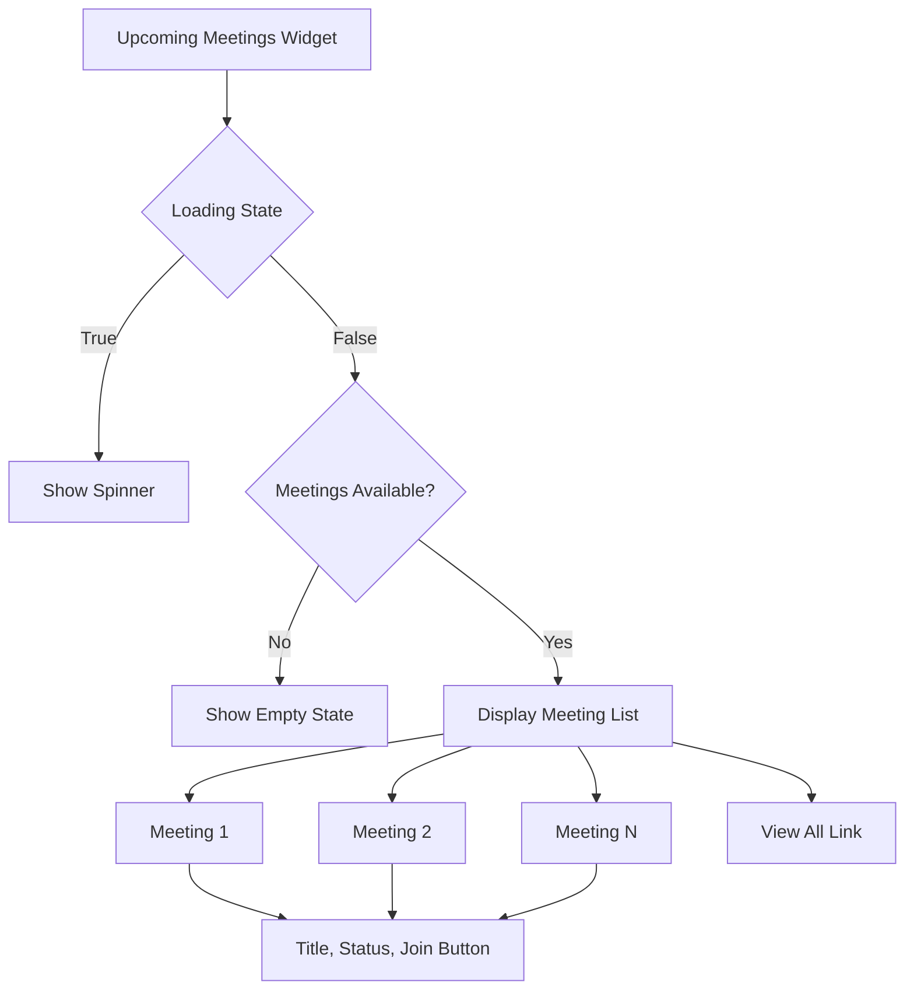
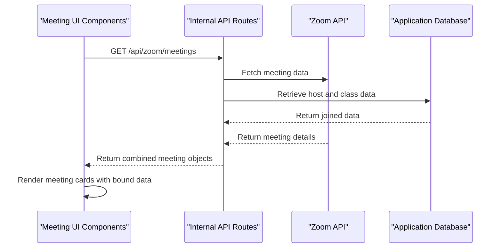
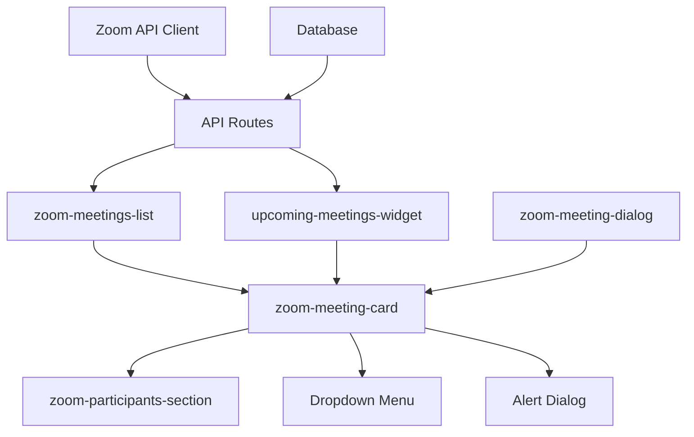

# Meeting Display Components

<cite>
**Referenced Files in This Document**   
- [zoom-meeting-card.tsx](file://components/zoom-meeting-card.tsx)
- [upcoming-meetings-widget.tsx](file://components/upcoming-meetings-widget.tsx)
- [types.ts](file://lib/zoom/types.ts)
- [client.ts](file://lib/zoom/client.ts)
- [route.ts](file://app/api/zoom/meetings/route.ts)
- [register-student/route.ts](file://app/api/zoom/meetings/register-student/route.ts)
- [constants.ts](file://lib/zoom/constants.ts)
- [zoom-participants-section.tsx](file://components/zoom-participants-section.tsx)
- [zoom-meetings-list.tsx](file://components/zoom-meetings-list.tsx)
</cite>

## Table of Contents
1. [Introduction](#introduction)
2. [Zoom Meeting Card Component](#zoom-meeting-card-component)
3. [Upcoming Meetings Widget](#upcoming-meetings-widget)
4. [Status Badge Implementation](#status-badge-implementation)
5. [Data Binding and Zoom API Integration](#data-binding-and-zoom-api-integration)
6. [Meeting Registration Functionality](#meeting-registration-functionality)
7. [Responsive Design and Interaction Patterns](#responsive-design-and-interaction-patterns)
8. [Accessibility Considerations](#accessibility-considerations)
9. [Performance Optimization](#performance-optimization)
10. [Component Architecture](#component-architecture)

## Introduction

The meeting display components in the School Management System provide a comprehensive interface for visualizing and interacting with Zoom meetings. These components are designed to support various user roles including administrators, teachers, parents, and students, offering tailored views of meeting information. The system integrates with the Zoom API to provide real-time meeting data, status updates, and participant information. This documentation details the implementation of the `zoom-meeting-card` and `upcoming-meetings-widget` components, covering their visual representation, interaction patterns, data binding mechanisms, and integration with the Zoom API.

**Section sources**
- [zoom-meeting-card.tsx](file://components/zoom-meeting-card.tsx#L1-L274)
- [upcoming-meetings-widget.tsx](file://components/upcoming-meetings-widget.tsx#L1-L127)

## Zoom Meeting Card Component

The `zoom-meeting-card` component provides a detailed visual representation of individual Zoom meetings, displaying essential information such as title, date/time, status indicators, and participant counts. The component supports both standard and compact display modes, adapting its layout based on the context in which it is used.

The card displays the meeting title prominently, accompanied by a status badge that indicates the current state of the meeting (scheduled, started, ended, or cancelled). Below the title, the component shows the meeting date and time using a human-readable format that adapts based on whether the meeting is upcoming or in the past. For upcoming meetings, it displays the relative time until the meeting starts (e.g., "Starts in 2 hours"), while past meetings show the absolute date and time.

Additional meeting details include the duration in minutes, host information with avatar, and class association when applicable. The component includes interactive elements such as a "Join" button that changes to "Start" when the current user is the host, and a dropdown menu with options to copy the join link, edit, or delete the meeting (for hosts and administrators).

**Section sources**
- [zoom-meeting-card.tsx](file://components/zoom-meeting-card.tsx#L49-L274)
- [types.ts](file://lib/zoom/types.ts#L9-L31)

## Upcoming Meetings Widget

The `upcoming-meetings-widget` component is designed for dashboard displays, providing a concise overview of upcoming meetings with limited listing and navigation capabilities. This widget is typically used in user dashboards to give quick access to imminent meetings without overwhelming the interface with too much information.

The widget displays a list of upcoming meetings in a compact format, showing each meeting's title, status, and a "Join" or "Start" button. For live meetings, it displays a "Live now" badge with green coloring to draw attention. The component includes a "View all" link that navigates to the full meetings page, allowing users to access a comprehensive list of all meetings.

When no upcoming meetings are available, the widget displays a friendly message with a calendar icon to maintain visual consistency. During data loading, it shows a spinner animation to indicate that content is being retrieved. The component is optimized for performance by limiting the number of displayed meetings and using efficient data fetching patterns.

**Diagram sources**
- [upcoming-meetings-widget.tsx](file://components/upcoming-meetings-widget.tsx#L19-L127)
- [zoom-meeting-card.tsx](file://components/zoom-meeting-card.tsx#L121-L141)

## Status Badge Implementation

The status badge system in the meeting components provides visual indicators of meeting states using color-coded badges. The implementation defines specific colors for each meeting status to ensure clear visual differentiation and intuitive understanding of the meeting's current state.

The status colors are defined in a mapping object that associates each status with corresponding CSS classes for background and text colors:
- **Scheduled**: Blue color scheme (`bg-blue-500/10 text-blue-500`) for upcoming meetings
- **Started/Live**: Green color scheme (`bg-green-500/10 text-green-500`) for active meetings
- **Ended**: Gray color scheme (`bg-gray-500/10 text-gray-500`) for completed meetings
- **Cancelled**: Red color scheme (`bg-red-500/10 text-red-500`) for cancelled meetings

For live meetings, the component dynamically updates the status display to show "Live" instead of "started" and uses the green color scheme to emphasize the active state. This visual treatment helps users quickly identify which meetings are currently in progress and require immediate attention.

The badge implementation also considers the meeting's temporal context. For example, a meeting that is technically "scheduled" but has already started based on its start time and duration will be displayed as "Live" with the appropriate green styling, ensuring that the visual representation matches the actual meeting state.

**Section sources**
- [zoom-meeting-card.tsx](file://components/zoom-meeting-card.tsx#L42-L47)
- [zoom-meeting-card.tsx](file://components/zoom-meeting-card.tsx#L156-L158)

## Data Binding and Zoom API Integration

The meeting display components integrate with the Zoom API through a structured data binding process that transforms API responses into display-ready meeting objects. The system uses TypeScript interfaces to define the structure of meeting data, ensuring type safety and consistency across the application.

The `ZoomMeeting` interface in `types.ts` defines the complete structure of a meeting object, including properties such as:
- Basic meeting information (id, title, description, start_time, duration)
- Status and type indicators (status, meeting_type)
- Connection details (join_url, start_url, password)
- Associated entities (host_id, class_id)
- Metadata (created_at, updated_at)

The API integration follows a server-side pattern where the client components fetch meeting data from internal API routes rather than directly from Zoom. The `/api/zoom/meetings` endpoint serves as a proxy, retrieving data from Zoom's API and combining it with additional information from the application's database, such as host details and class associations.

When displaying meeting information, the components bind directly to these structured data objects, using property access to populate the visual elements. For example, the meeting title is bound to the `meeting.title` property, while the start time is formatted using the `date-fns` library to provide a user-friendly representation.

**Diagram sources**
- [types.ts](file://lib/zoom/types.ts#L9-L31)
- [route.ts](file://app/api/zoom/meetings/route.ts#L7-L52)
- [client.ts](file://lib/zoom/client.ts#L136-L138)

## Meeting Registration Functionality

The meeting registration system enables authorized users to register for Zoom meetings, with special handling for class-related meetings to ensure only students with valid institutional email addresses can participate. The registration process is integrated with both the Zoom API and the application's database to maintain consistency across systems.

For class meetings, the system automatically registers enrolled students who have valid @r1.deped.gov.ph email addresses, allowing them to bypass Zoom's waiting room. This registration occurs when a meeting is created or when a student is enrolled in a class. The `register-student` API endpoint handles the registration of individual students for all upcoming meetings in a class, checking email domain validity before proceeding.

The registration process involves several steps:
1. Validation of the user's email domain against the allowed institutional domain
2. Creation of a registration record in the application database
3. Registration with Zoom's API to obtain a unique join URL
4. Storage of the Zoom registrant ID and join URL for future reference

The system also registers teachers and administrators for class meetings, allowing them to bypass the waiting room and join meetings seamlessly. This ensures that instructional staff can access class meetings without delay while maintaining security for student participants.

**Section sources**
- [register-student/route.ts](file://app/api/zoom/meetings/register-student/route.ts#L9-L115)
- [constants.ts](file://lib/zoom/constants.ts#L5-L22)
- [route.ts](file://app/api/zoom/meetings/route.ts#L228-L344)

## Responsive Design and Interaction Patterns

The meeting display components implement responsive design patterns to ensure optimal viewing across different device sizes and screen resolutions. The components use CSS flexbox and grid layouts with responsive breakpoints to adapt their appearance based on the available space.

The `zoom-meeting-card` component supports a compact mode that displays essential information in a condensed format suitable for dashboard widgets or list views. In compact mode, the card shows only the meeting title, status, and a join button, minimizing visual clutter while maintaining functionality.

Interaction patterns are designed to be intuitive and accessible:
- Hover effects provide visual feedback on interactive elements
- Loading states display spinners during asynchronous operations
- Confirmation dialogs prevent accidental deletion of meetings
- Dropdown menus organize secondary actions to reduce interface complexity

The components handle various user interactions, including joining meetings, copying join links, editing meeting details, and deleting meetings. Each interaction includes appropriate loading states and error handling to provide feedback to users. For example, when joining a meeting, the component displays a loading spinner on the button and shows toast notifications for success or error states.

**Section sources**
- [zoom-meeting-card.tsx](file://components/zoom-meeting-card.tsx#L121-L141)
- [upcoming-meetings-widget.tsx](file://components/upcoming-meetings-widget.tsx#L88-L119)
- [zoom-meeting-card.tsx](file://components/zoom-meeting-card.tsx#L71-L96)

## Accessibility Considerations

The meeting display components incorporate several accessibility features to ensure usability for all users, including those with disabilities. The components use semantic HTML elements and ARIA attributes to provide proper context for screen readers and other assistive technologies.

Key accessibility features include:
- Proper heading hierarchy (h3 for meeting titles) to support document navigation
- Descriptive labels for interactive elements (buttons, dropdowns)
- Sufficient color contrast for text and status indicators
- Keyboard navigation support for all interactive components
- Focus indicators for interactive elements
- Alternative text for icons through visually hidden text or aria-labels

The components also consider cognitive accessibility by using clear, concise language and consistent visual patterns. Status indicators use both color and text to convey information, ensuring that users who cannot distinguish colors can still understand the meeting state. Time information is presented in multiple formats (relative and absolute) to accommodate different user preferences and comprehension levels.

While specific ARIA attributes are not extensively used in the meeting components themselves, the underlying UI components (buttons, cards, dropdowns) inherit accessibility features from the component library, ensuring a baseline level of accessibility compliance.

**Section sources**
- [zoom-meeting-card.tsx](file://components/zoom-meeting-card.tsx#L155-L158)
- [upcoming-meetings-widget.tsx](file://components/upcoming-meetings-widget.tsx#L59-L61)

## Performance Optimization

The meeting display components implement several performance optimization strategies to ensure efficient rendering, especially when displaying multiple meeting cards. The components use React's useState and useEffect hooks judiciously to minimize unnecessary re-renders and optimize data fetching.

Key performance optimizations include:
- Conditional rendering of participant sections based on user role and meeting status
- Efficient data fetching with appropriate caching strategies
- Use of React's useCallback to memoize event handlers
- Limiting the number of meetings fetched and displayed in list views
- Skeleton loading states to improve perceived performance

The components avoid expensive operations in the render cycle, delegating complex calculations to useMemo hooks or performing them in event handlers. For example, date formatting and status determination are performed efficiently using the date-fns library, which is optimized for performance.

When rendering multiple meeting cards, the system uses React's key prop with stable meeting IDs to enable efficient reconciliation. The components also implement virtualization patterns indirectly through the use of container components that limit the number of simultaneously displayed items, preventing performance degradation with large meeting lists.

**Section sources**
- [zoom-meeting-card.tsx](file://components/zoom-meeting-card.tsx#L60-L69)
- [upcoming-meetings-widget.tsx](file://components/upcoming-meetings-widget.tsx#L21-L38)
- [zoom-meetings-list.tsx](file://components/zoom-meetings-list.tsx#L43-L62)

## Component Architecture

The meeting display components are part of a larger architectural ecosystem that includes API routes, data models, and supporting utilities. The architecture follows a modular pattern with clear separation of concerns between presentation, data access, and business logic.

The component hierarchy shows how the various meeting-related components are organized:
- `zoom-meeting-card`: Primary component for displaying individual meetings
- `upcoming-meetings-widget`: Dashboard component for showing upcoming meetings
- `zoom-participants-section`: Reusable component for displaying participant information
- `zoom-meetings-list`: Container component for managing multiple meeting cards
- `zoom-meeting-dialog`: Modal component for creating and editing meetings

The data flow follows a unidirectional pattern, with data moving from API routes to components through props. State management is localized to individual components, with parent components managing shared state when necessary. The architecture enables reuse of components across different parts of the application while maintaining consistency in appearance and behavior.

**Diagram sources**
- [zoom-meeting-card.tsx](file://components/zoom-meeting-card.tsx)
- [upcoming-meetings-widget.tsx](file://components/upcoming-meetings-widget.tsx)
- [zoom-participants-section.tsx](file://components/zoom-participants-section.tsx)
- [zoom-meetings-list.tsx](file://components/zoom-meetings-list.tsx)