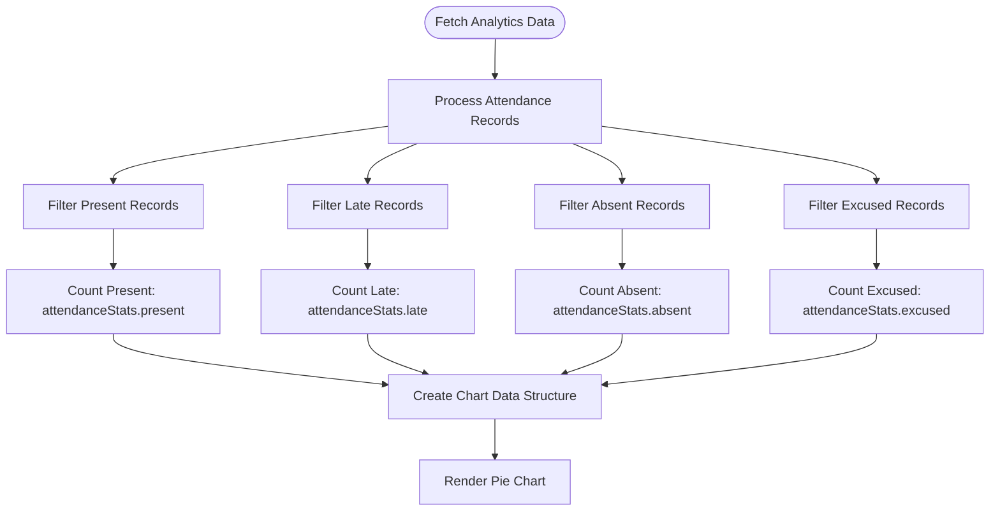
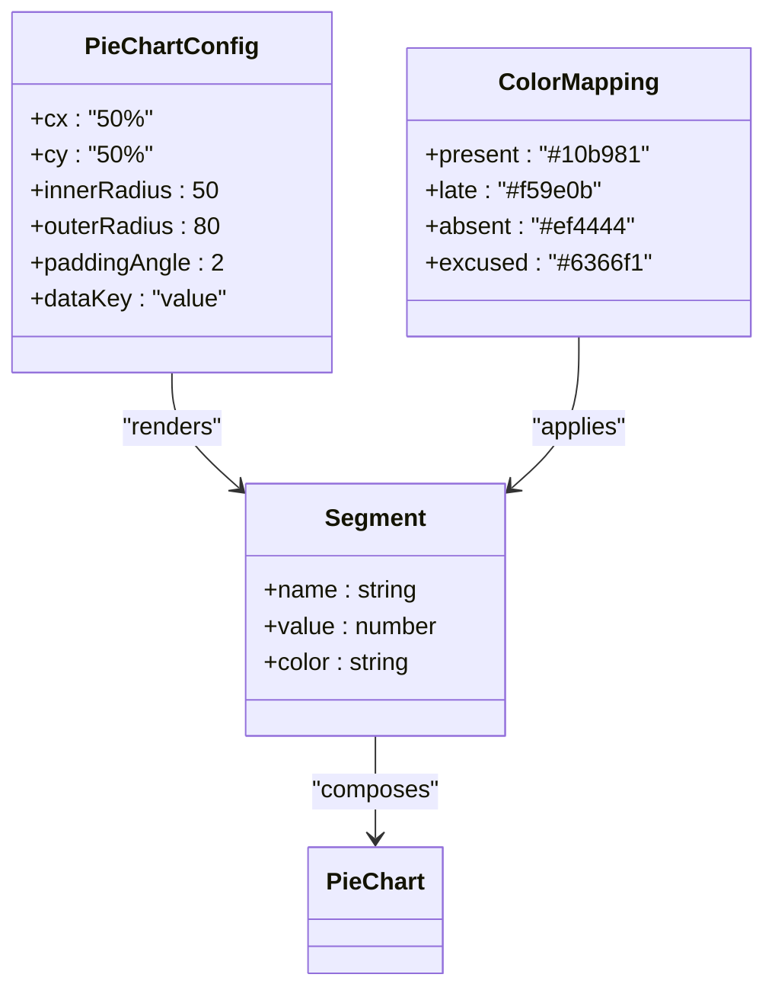
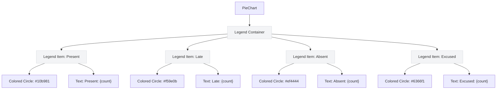
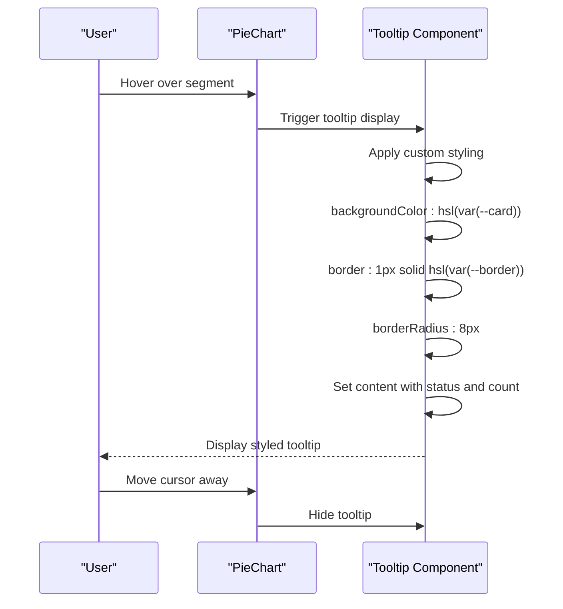

# Attendance Breakdown Chart

<cite>
**Referenced Files in This Document**   
- [progress-analytics.tsx](file://components/progress-analytics.tsx)
- [attendance-utils.ts](file://lib/attendance-utils.ts)
- [types.ts](file://lib/types.ts)
- [route.ts](file://app/api/analytics/student/[id]/route.ts)
- [parent/attendance/page.tsx](file://app/parent/attendance/page.tsx)
</cite>

## Table of Contents
1. [Introduction](#introduction)
2. [Data Processing Logic](#data-processing-logic)
3. [Pie Chart Configuration](#pie-chart-configuration)
4. [Legend Implementation](#legend-implementation)
5. [Responsive Design and Tooltip Customization](#responsive-design-and-tooltip-customization)
6. [Use Cases](#use-cases)
7. [Accessibility Features](#accessibility-features)
8. [Troubleshooting Guide](#troubleshooting-guide)

## Introduction
The Attendance Breakdown Chart is a visual component within the ProgressAnalytics dashboard that displays student attendance patterns using a Recharts PieChart. This chart categorizes attendance records into four distinct status types: present, late, absent, and excused. The implementation provides administrators, teachers, and parents with an intuitive visualization of attendance data, enabling them to quickly assess student participation patterns and identify potential issues such as chronic absenteeism.

**Section sources**
- [progress-analytics.tsx](file://components/progress-analytics.tsx#L1-L189)

## Data Processing Logic
The attendance data processing begins with retrieving attendance trends from the analytics API endpoint. The system categorizes attendance records by filtering the attendanceTrends array based on status values. The processing logic counts occurrences of each status type: present, late, absent, and excused. These counts are then used to create the data structure for the pie chart visualization. The data processing occurs within the ProgressAnalytics component where the attendanceTrends array is transformed into categorized statistics through filter operations for each status type.

The system also utilizes a dedicated utility function `calculateAttendanceStats` that processes attendance records and returns comprehensive statistics including counts for each status type and overall attendance rate. This function employs a reduce operation to aggregate counts across all status types while validating that only recognized status values are counted. The attendance rate is calculated as the percentage of total attendance (present + late) divided by the total number of records.

**Diagram sources**
- [progress-analytics.tsx](file://components/progress-analytics.tsx#L64-L76)
- [attendance-utils.ts](file://lib/attendance-utils.ts#L17-L41)

**Section sources**
- [progress-analytics.tsx](file://components/progress-analytics.tsx#L64-L76)
- [attendance-utils.ts](file://lib/attendance-utils.ts#L17-L41)
- [route.ts](file://app/api/analytics/student/[id]/route.ts#L85-L105)

## Pie Chart Configuration
The Attendance Breakdown Chart is implemented using Recharts PieChart with specific configuration parameters for optimal visualization. The pie chart is configured with an inner radius of 50 and an outer radius of 80, creating a donut-like appearance that enhances visual appeal and readability. The paddingAngle is set to 2 degrees, providing subtle separation between adjacent segments to improve distinction between different attendance categories.

The chart utilizes a ResponsiveContainer component to ensure proper scaling across different screen sizes and device types. The dataKey is set to "value" which corresponds to the count of attendance records for each status type. Each segment of the pie chart is rendered with a Cell component that applies the appropriate color based on the status type. The color mapping follows a consistent scheme: green (#10b981) for present, amber (#f59e0b) for late, red (#ef4444) for absent, and indigo (#6366f1) for excused.

**Diagram sources**
- [progress-analytics.tsx](file://components/progress-analytics.tsx#L164-L167)

**Section sources**
- [progress-analytics.tsx](file://components/progress-analytics.tsx#L164-L167)

## Legend Implementation
The legend for the Attendance Breakdown Chart is implemented as a series of colored indicators with corresponding count labels displayed below the pie chart. Each legend item consists of a small colored circle (3x3 pixels) with a border-radius of 50% to create a perfect circle, followed by a text label showing the status type and count. The colored circles use inline styles to apply the same color mapping as the pie chart segments, ensuring visual consistency between the chart and legend.

The legend items are arranged in a flex container with wrap behavior, allowing them to reflow on smaller screens. Each item is separated by a gap of 4 units for proper spacing. The text labels are styled with a muted foreground color to maintain visual hierarchy while remaining readable. The legend only displays categories that have non-zero values, as the chart data is filtered to exclude zero-value segments before rendering.

**Diagram sources**
- [progress-analytics.tsx](file://components/progress-analytics.tsx#L173-L178)

**Section sources**
- [progress-analytics.tsx](file://components/progress-analytics.tsx#L173-L178)

## Responsive Design and Tooltip Customization
The Attendance Breakdown Chart implements responsive design principles to ensure optimal display across various screen sizes and device types. The chart is wrapped in a ResponsiveContainer component that automatically adjusts the dimensions based on the parent container, maintaining proper aspect ratio and preventing overflow. The chart height is fixed at 200 pixels, while the width is set to 100% to maximize available horizontal space.

Tooltip customization enhances data clarity by providing a clean, styled tooltip when users hover over chart segments. The tooltip is configured with a custom content style that matches the application's design system, featuring a card-like background (hsl(var(--card))), border (1px solid hsl(var(--border)))), and rounded corners (border-radius: 8px). The tooltip displays the status type and count information in a readable format, improving data interpretation without cluttering the chart visualization.

**Diagram sources**
- [progress-analytics.tsx](file://components/progress-analytics.tsx#L168-L169)

**Section sources**
- [progress-analytics.tsx](file://components/progress-analytics.tsx#L162-L170)

## Use Cases
The Attendance Breakdown Chart serves multiple user roles with distinct use cases. Parents utilize this visualization to monitor their child's attendance trends over time, identifying patterns of tardiness or absences that may require intervention. The clear color-coding allows parents to quickly assess their child's attendance status without needing to interpret complex data.

Administrators leverage the chart to identify chronic absenteeism across the student population. By examining the proportion of absent and excused records, administrators can flag students who may need additional support or intervention. The visual representation makes it easier to spot outliers and trends that might be missed in tabular data. School counselors and attendance officers use the chart to track the effectiveness of attendance improvement initiatives by comparing historical data over time.

**Section sources**
- [progress-analytics.tsx](file://components/progress-analytics.tsx#L158-L182)
- [parent/attendance/page.tsx](file://app/parent/attendance/page.tsx#L78-L175)

## Accessibility Features
The Attendance Breakdown Chart incorporates several accessibility features to ensure usability for all users, including those with disabilities. While the current implementation does not explicitly include ARIA labels for screen readers, the visual design follows accessibility best practices with sufficient color contrast between segments and the background. The color palette uses distinct hues that remain distinguishable for users with common forms of color vision deficiency.

Keyboard navigation between segments is supported through the Recharts library's built-in accessibility features, allowing users to navigate the chart using keyboard controls. The tooltip functionality provides additional context when activated, enhancing information accessibility. The legend's text labels provide redundant information to the color coding, ensuring that users who cannot distinguish colors can still interpret the data.

Future enhancements could include explicit ARIA labels for each chart segment, announcing the status type and count to screen reader users, and ensuring that all interactive elements have proper focus indicators for keyboard navigation.

**Section sources**
- [progress-analytics.tsx](file://components/progress-analytics.tsx#L164-L182)

## Troubleshooting Guide
The Attendance Breakdown Chart includes several safeguards for edge cases. When there are zero attendance records for a student, the chart data is filtered to exclude zero-value segments, preventing rendering issues. The component checks for empty data and displays a message "No analytics data available for this student" when appropriate.

Color contrast issues are mitigated by using a carefully selected color palette with sufficient contrast against the background. The green (#10b981), amber (#f59e0b), red (#ef4444), and indigo (#6366f1) colors provide good differentiation while maintaining accessibility standards. Inaccurate percentage calculations are prevented by the data processing logic, which ensures that only valid status values are counted and the attendance rate is calculated correctly as (present + late) / total.

If the chart fails to display, verify that the student has attendance records in the database and that the API endpoint is returning valid data. Check the browser console for any JavaScript errors that might prevent the chart from rendering. Ensure that the Recharts library is properly imported and that there are no version conflicts in the package dependencies.

**Section sources**
- [progress-analytics.tsx](file://components/progress-analytics.tsx#L82-L89)
- [attendance-utils.ts](file://lib/attendance-utils.ts#L33-L35)
- [types.ts](file://lib/types.ts#L7-L7)