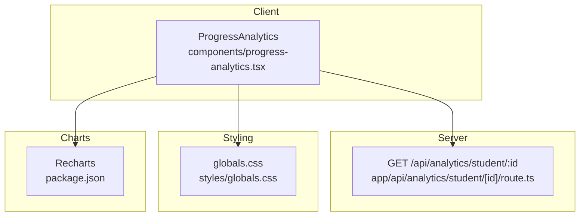
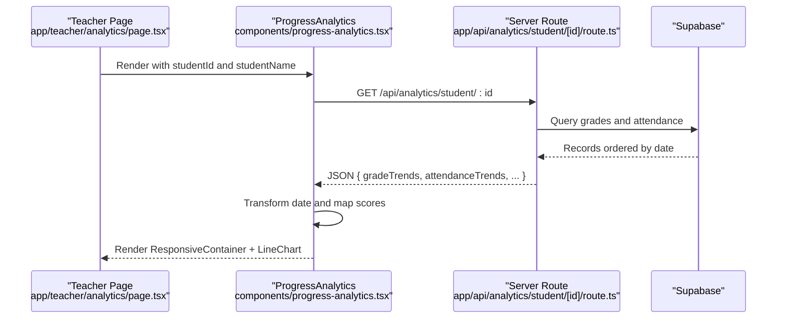
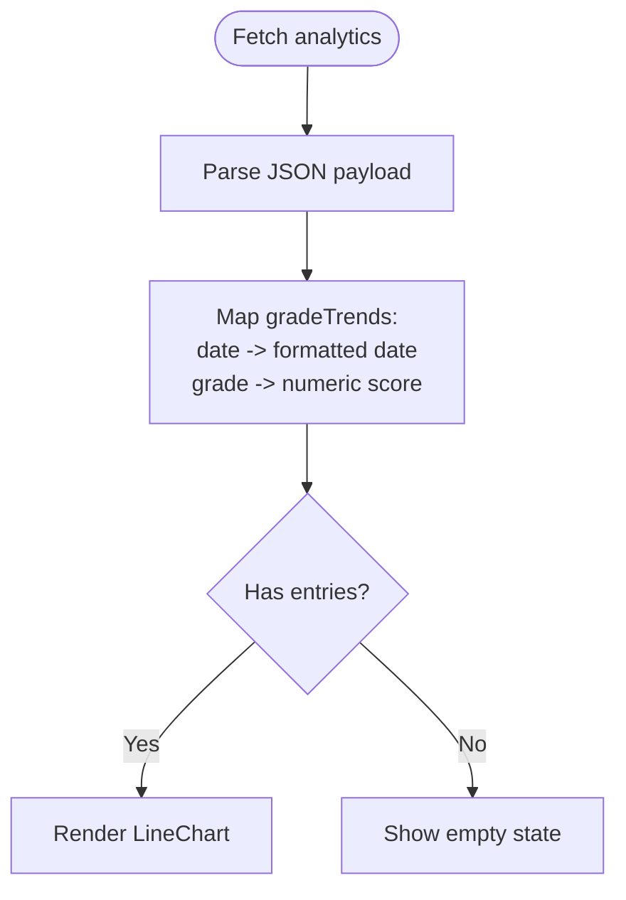
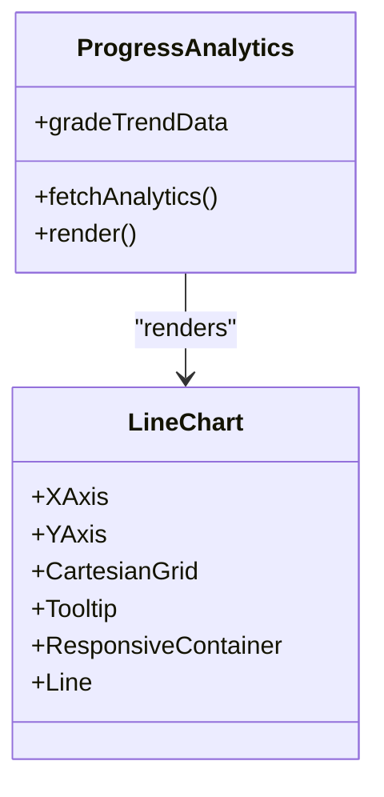
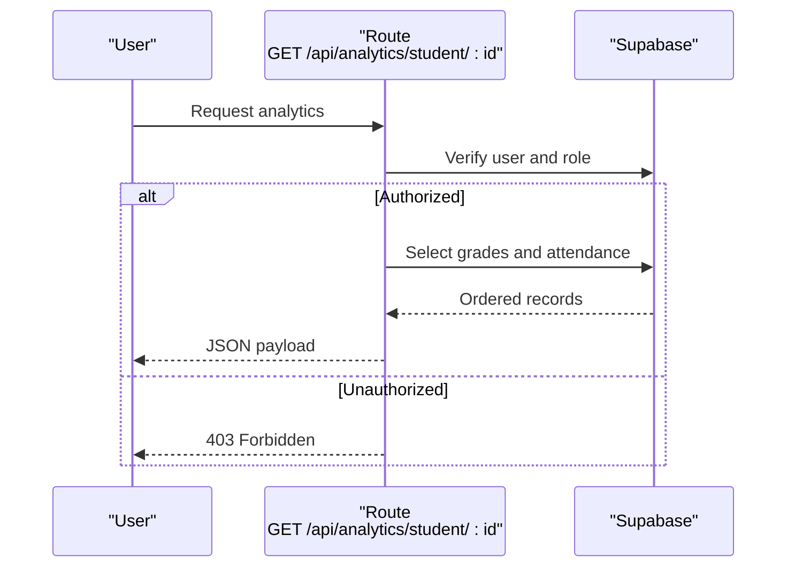
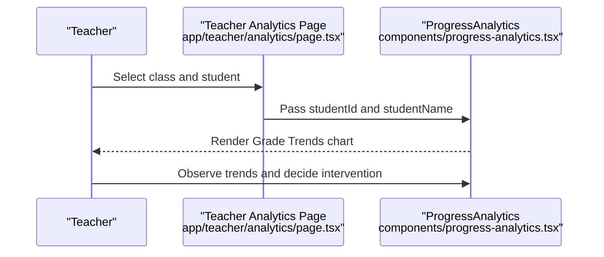
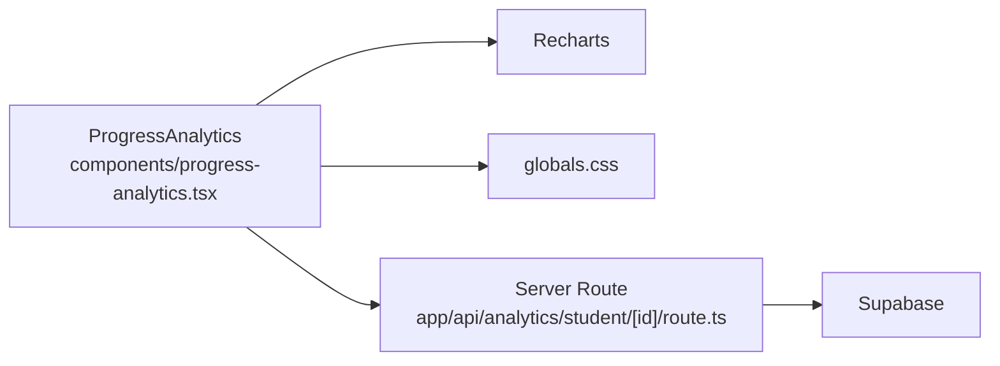

# Grade Trends Chart

<cite>
**Referenced Files in This Document**
- [progress-analytics.tsx](file://components/progress-analytics.tsx)
- [route.ts](file://app/api/analytics/student/[id]/route.ts)
- [page.tsx](file://app/teacher/analytics/page.tsx)
- [globals.css](file://styles/globals.css)
- [package.json](file://package.json)
</cite>

## Table of Contents
1. [Introduction](#introduction)
2. [Project Structure](#project-structure)
3. [Core Components](#core-components)
4. [Architecture Overview](#architecture-overview)
5. [Detailed Component Analysis](#detailed-component-analysis)
6. [Dependency Analysis](#dependency-analysis)
7. [Performance Considerations](#performance-considerations)
8. [Troubleshooting Guide](#troubleshooting-guide)
9. [Conclusion](#conclusion)

## Introduction
This document explains the implementation of the Grade Trends Chart within the ProgressAnalytics component. It focuses on how the chart renders student grade progression over time using Recharts LineChart, how raw API data is transformed into chart-ready format, and how axes, styling, responsiveness, and tooltips are configured. It also covers usage scenarios for teachers, accessibility considerations, and troubleshooting tips for common issues.

## Project Structure
The Grade Trends Chart lives inside the ProgressAnalytics component and is rendered conditionally when grade data is available. The component fetches analytics data from a server-side API route, transforms it, and renders a responsive LineChart with customized axes and tooltip.

**Diagram sources**
- [progress-analytics.tsx](file://components/progress-analytics.tsx#L1-L189)
- [route.ts](file://app/api/analytics/student/[id]/route.ts#L1-L163)
- [globals.css](file://styles/globals.css#L1-L126)
- [package.json](file://package.json#L1-L200)

**Section sources**
- [progress-analytics.tsx](file://components/progress-analytics.tsx#L1-L189)
- [route.ts](file://app/api/analytics/student/[id]/route.ts#L1-L163)
- [globals.css](file://styles/globals.css#L1-L126)
- [package.json](file://package.json#L1-L200)

## Core Components
- ProgressAnalytics component: orchestrates data fetching, transforms grade trends, and renders the Grade Trends chart.
- Server API route: authenticates users, enforces authorization, and returns structured analytics data including grade trends.
- Recharts: renders the LineChart with XAxis, YAxis, CartesianGrid, Tooltip, and ResponsiveContainer.
- Tailwind/CSS variables: apply theme-aware colors and typography to chart elements.

Key responsibilities:
- Data fetching and caching: client-side fetch and state updates.
- Data transformation: converting raw dates and scores into chart-friendly fields.
- Rendering: responsive container, axis configuration, and tooltip customization.
- Styling: stroke color via CSS variables, dot indicators, and grid lines.

**Section sources**
- [progress-analytics.tsx](file://components/progress-analytics.tsx#L1-L189)
- [route.ts](file://app/api/analytics/student/[id]/route.ts#L1-L163)

## Architecture Overview
The Grade Trends Chart follows a straightforward client-server architecture:
- The client component requests analytics for a given student ID.
- The server validates the requester’s role and permission to access the student’s data.
- The server aggregates grade records and attendance, computes derived metrics, and returns JSON.
- The client transforms the dataset and renders the chart.

**Diagram sources**
- [page.tsx](file://app/teacher/analytics/page.tsx#L240-L265)
- [progress-analytics.tsx](file://components/progress-analytics.tsx#L1-L189)
- [route.ts](file://app/api/analytics/student/[id]/route.ts#L1-L163)

## Detailed Component Analysis

### Data Transformation Pipeline
The client transforms raw API data into chart-ready entries:
- Date formatting: converts ISO date strings to localized short month/day labels.
- Score mapping: preserves numeric scores for the Y-axis.
- Additional fields: retains subject and type for potential future use.

**Diagram sources**
- [progress-analytics.tsx](file://components/progress-analytics.tsx#L31-L60)

**Section sources**
- [progress-analytics.tsx](file://components/progress-analytics.tsx#L31-L60)

### Chart Configuration and Styling
- Container: ResponsiveContainer ensures the chart resizes with its parent while maintaining aspect ratio.
- Axes:
  - XAxis: dataKey "date" with small text and muted foreground color.
  - YAxis: domain constrained to [60, 100] to reflect a passing-grade-focused scale.
- Grid: CartesianGrid with dashed stroke for readability.
- Line: monotone interpolation, stroke color from CSS variables, and dot indicators styled consistently.
- Tooltip: content and label colors adapt to theme via CSS variables.

**Diagram sources**
- [progress-analytics.tsx](file://components/progress-analytics.tsx#L105-L124)

**Section sources**
- [progress-analytics.tsx](file://components/progress-analytics.tsx#L105-L124)
- [globals.css](file://styles/globals.css#L1-L126)

### API Data Contract and Authorization
The server route returns:
- gradeTrends: array of { date, grade, subject, type }.
- attendanceTrends: array of { date, status }.
- subjectPerformance: array of { subject, average, highest, lowest, count }.
- overallAverage, attendanceRate, improvementRate.

Authorization:
- Students can only access their own data.
- Teachers can access students they teach.
- Parents can access their children.
- Admins have broad access.

**Diagram sources**
- [route.ts](file://app/api/analytics/student/[id]/route.ts#L1-L163)

**Section sources**
- [route.ts](file://app/api/analytics/student/[id]/route.ts#L1-L163)

### Usage Scenarios for Teachers
- Class-level monitoring: teacher analytics page allows selecting a class and student to view individual progress.
- Pattern recognition: the chart helps identify downward trends, plateaus, or improvements across time.
- Intervention triggers: declining grades (e.g., below 70) prompt targeted support, tutoring, or remediation.

**Diagram sources**
- [page.tsx](file://app/teacher/analytics/page.tsx#L240-L265)
- [progress-analytics.tsx](file://components/progress-analytics.tsx#L1-L189)

**Section sources**
- [page.tsx](file://app/teacher/analytics/page.tsx#L240-L265)

### Accessibility Considerations
- ARIA labels and roles: The component does not currently define explicit ARIA attributes for the chart. To improve accessibility:
  - Add aria-labelledby referencing the chart header.
  - Provide aria-describedby for chart summaries.
  - Ensure keyboard navigation support by enabling focusable tooltips and interactive elements.
- Color contrast: The stroke and dot colors derive from CSS variables; verify sufficient contrast in both light and dark themes.
- Screen reader announcements: Consider adding live regions to announce chart updates when data changes.

[No sources needed since this section provides general guidance]

### Responsive Behavior and Tooltip Customization
- ResponsiveContainer: Ensures the chart fills its container while preserving aspect ratio.
- Tooltip: Styled with theme-aware background, border, and text color to match the card theme.

**Section sources**
- [progress-analytics.tsx](file://components/progress-analytics.tsx#L111-L120)
- [globals.css](file://styles/globals.css#L1-L126)

## Dependency Analysis
- Recharts: peer dependency declared in package.json; used for LineChart, XAxis, YAxis, CartesianGrid, Tooltip, and ResponsiveContainer.
- Tailwind/CSS variables: theme colors are consumed via CSS variables for stroke, dots, grid, and tooltip styling.
- Supabase: server route queries grades and attendance tables, orders by date, and computes derived metrics.

**Diagram sources**
- [progress-analytics.tsx](file://components/progress-analytics.tsx#L1-L189)
- [route.ts](file://app/api/analytics/student/[id]/route.ts#L1-L163)
- [globals.css](file://styles/globals.css#L1-L126)
- [package.json](file://package.json#L1-L200)

**Section sources**
- [package.json](file://package.json#L1-L200)
- [progress-analytics.tsx](file://components/progress-analytics.tsx#L1-L189)
- [route.ts](file://app/api/analytics/student/[id]/route.ts#L1-L163)

## Performance Considerations
- Dataset size: For large histories, consider:
  - Sampling or aggregating points to reduce DOM nodes.
  - Virtualizing long lists if displaying additional tables.
  - Memoizing transformations to avoid repeated computations.
- Rendering cost: Monotone interpolation is efficient; avoid excessive re-renders by stabilizing props and keys.
- Network latency: Implement optimistic loading and skeleton states; cache recent analytics to minimize repeated fetches.

[No sources needed since this section provides general guidance]

## Troubleshooting Guide
Common issues and resolutions:
- Empty datasets:
  - Symptom: No chart appears.
  - Cause: gradeTrends is empty.
  - Resolution: Ensure the API returns data; verify studentId and authorization.
- Date parsing errors:
  - Symptom: Incorrect or missing X-axis labels.
  - Cause: Unexpected date formats.
  - Resolution: Confirm backend returns valid ISO date strings; the client formats them to short month/day.
- Rendering performance with large datasets:
  - Symptom: Slow chart rendering.
  - Cause: Excessive data points.
  - Resolution: Downsample data or aggregate weekly/monthly averages; memoize transformations.
- Tooltip or axis colors not matching theme:
  - Symptom: Tooltip or axis text appears unreadable.
  - Cause: CSS variable mismatch or theme not applied.
  - Resolution: Verify globals.css is included and theme classes are active.

**Section sources**
- [progress-analytics.tsx](file://components/progress-analytics.tsx#L31-L60)
- [route.ts](file://app/api/analytics/student/[id]/route.ts#L72-L162)
- [globals.css](file://styles/globals.css#L1-L126)

## Conclusion
The Grade Trends Chart in ProgressAnalytics provides a clear, theme-aware visualization of student grade progression over time. It leverages Recharts for robust rendering, Tailwind/CSS variables for consistent theming, and a well-defined data transformation pipeline. By following the usage scenarios and troubleshooting steps outlined here, educators can effectively monitor performance patterns and take timely interventions.