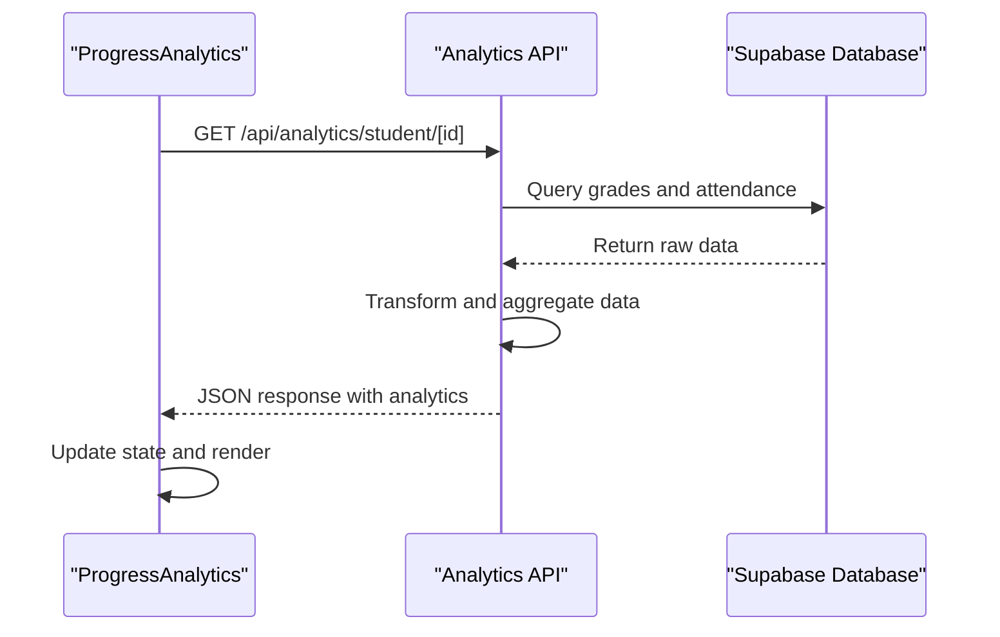
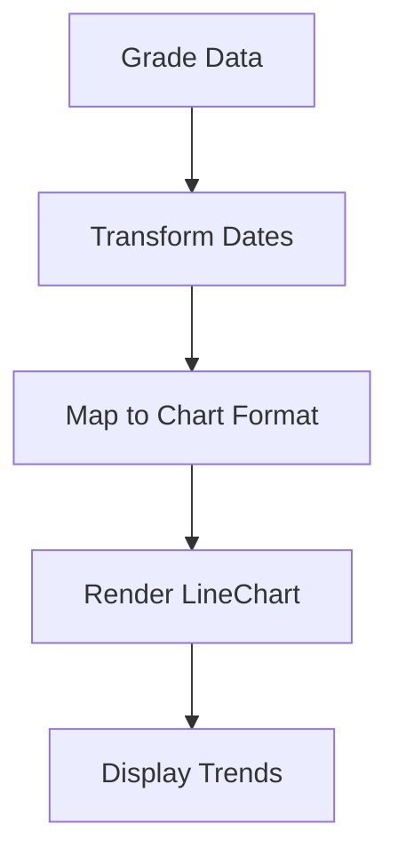
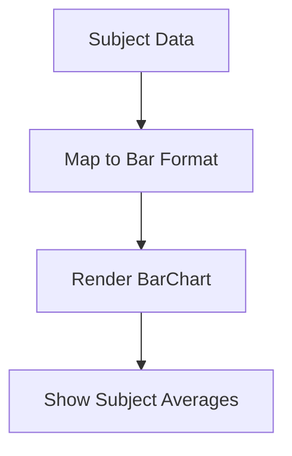
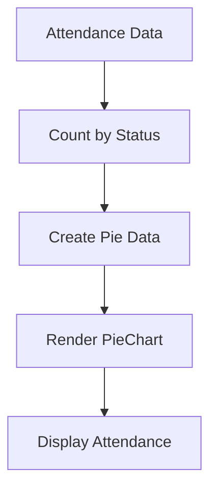
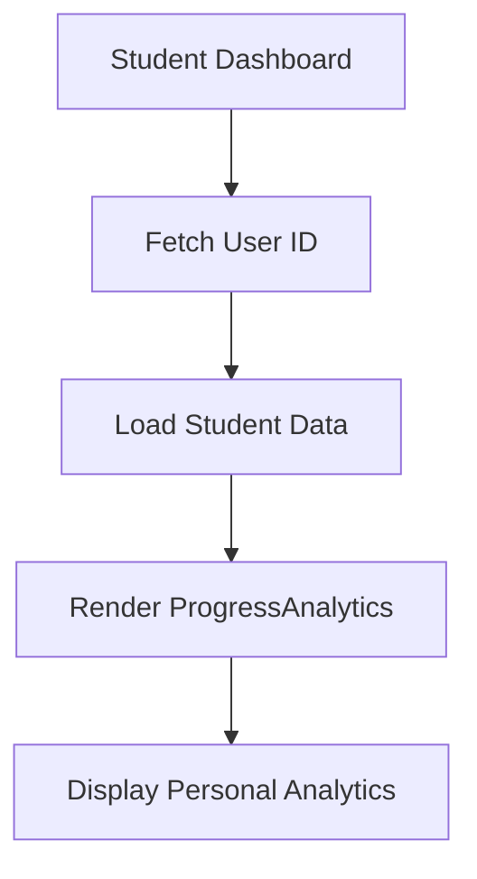
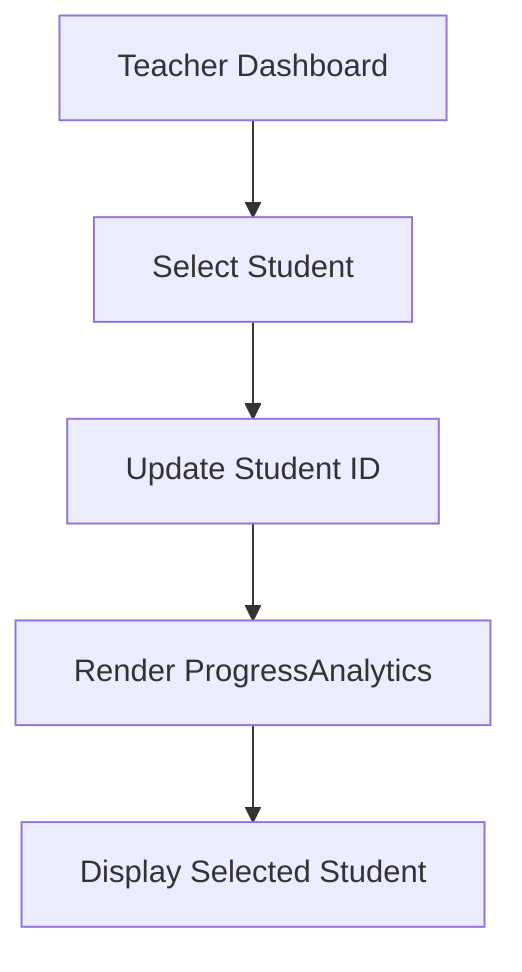

# ProgressAnalytics Component

<cite>
**Referenced Files in This Document**   
- [progress-analytics.tsx](file://components/progress-analytics.tsx)
- [route.ts](file://app/api/analytics/student/[id]/route.ts)
- [page.tsx](file://app/student/analytics/page.tsx)
- [page.tsx](file://app/teacher/analytics/page.tsx)
- [20251219043454_create_attendance_tables.sql](file://supabase/migrations/20251219043454_create_attendance_tables.sql)
- [20251219043509_create_grades_tables.sql](file://supabase/migrations/20251219043509_create_grades_tables.sql)
</cite>

## Table of Contents
1. [Introduction](#introduction)
2. [Component Props](#component-props)
3. [Client-Side Implementation](#client-side-implementation)
4. [State Management](#state-management)
5. [API Integration](#api-integration)
6. [Data Transformation](#data-transformation)
7. [Chart Implementation](#chart-implementation)
8. [Responsive Design](#responsive-design)
9. [Usage in Dashboards](#usage-in-dashboards)
10. [Accessibility Features](#accessibility-features)
11. [Performance Considerations](#performance-considerations)
12. [Troubleshooting Guide](#troubleshooting-guide)

## Introduction
The ProgressAnalytics component is a comprehensive student performance visualization tool that displays academic progress and attendance patterns. This client-side React component leverages Recharts to present data through interactive visualizations, enabling educators and students to monitor educational progress effectively. The component integrates with the school's analytics API to fetch student data and transform it into meaningful visual representations.

**Section sources**
- [progress-analytics.tsx](file://components/progress-analytics.tsx#L1-L189)

## Component Props
The ProgressAnalytics component accepts three props that control its behavior and display:

- **studentId** (required string): The unique identifier for the student whose analytics are being displayed. This prop is essential for data fetching and cannot be omitted.
- **studentName** (optional string): The display name of the student, used as a header in the component. When provided, it enhances the user experience by personalizing the analytics view.
- **showDetailed** (boolean): A flag that controls the UI density and information display. When set to true, the component renders detailed charts and metrics; when false, only summary information is displayed.

These props enable flexible integration across different user interfaces while maintaining a consistent data visualization approach.

**Section sources**
- [progress-analytics.tsx](file://components/progress-analytics.tsx#L8-L12)

## Client-Side Implementation
The ProgressAnalytics component is implemented as a client-side React component using the "use client" directive, enabling interactive features and state management. It utilizes React's useState and useEffect hooks to manage component state and side effects. The component is designed to be reusable across different user roles (students, teachers, parents) while maintaining performance and responsiveness.

The implementation follows React best practices with proper dependency arrays in useEffect hooks to prevent unnecessary re-renders. The component is self-contained and handles all data fetching, state management, and rendering logic internally, making it easy to integrate into various dashboard layouts.

**Section sources**
- [progress-analytics.tsx](file://components/progress-analytics.tsx#L1-L3)

## State Management
The component maintains several state variables to manage the analytics data and loading states:

- **loading**: Controls the loading state during data fetching operations
- **gradeTrends**: Stores time-series grade data for trend visualization
- **attendanceTrends**: Contains attendance records over time
- **subjectPerformance**: Holds subject-specific performance metrics
- **overallAverage**: Stores the student's overall grade average
- **attendanceRate**: Contains the calculated attendance percentage
- **improvementRate**: Tracks the student's academic improvement trend

These state variables are initialized with appropriate default values and updated through the data fetching process, ensuring consistent UI behavior even when data is not immediately available.

**Section sources**
- [progress-analytics.tsx](file://components/progress-analytics.tsx#L19-L26)

## API Integration
The component integrates with the backend analytics API through a well-defined endpoint pattern. It consumes the `/api/analytics/student/[id]` endpoint using the fetch API to retrieve student analytics data. The integration includes comprehensive error handling and loading state management to provide a smooth user experience.

The API endpoint implements role-based access control, ensuring that only authorized users (students, teachers, parents, or administrators) can access the analytics data. The component handles HTTP responses appropriately, parsing JSON data on success and logging errors without exposing sensitive information to the user interface.

**Diagram sources**
- [progress-analytics.tsx](file://components/progress-analytics.tsx#L31-L48)
- [route.ts](file://app/api/analytics/student/[id]/route.ts#L5-L162)

## Data Transformation
The component performs several data transformation operations to convert raw API responses into Recharts-compatible formats:

- **Date formatting**: Converts ISO date strings to localized short date formats for display in charts
- **Statistical aggregation**: Calculates averages, highest, and lowest scores for subject performance
- **Attendance categorization**: Groups attendance records by status (present, late, absent, excused)
- **Improvement calculation**: Computes the improvement rate by comparing recent and previous grade averages

The transformation process ensures that data is properly formatted for visualization while maintaining accuracy and relevance. Empty datasets are handled gracefully, with appropriate fallback states to maintain UI consistency.

**Section sources**
- [progress-analytics.tsx](file://components/progress-analytics.tsx#L51-L76)

## Chart Implementation
The component implements three distinct chart types to visualize different aspects of student performance:

### Grade Trends LineChart
The LineChart displays grade trends over time, showing academic progress through a time-series visualization. It uses the gradeTrendData transformation to plot scores against dates, with configurable axes and tooltips for detailed information.

**Diagram sources**
- [progress-analytics.tsx](file://components/progress-analytics.tsx#L113-L119)

### Subject Performance BarChart
The BarChart provides a comparative view of performance across different subjects, allowing users to identify strengths and areas for improvement. It displays average scores for each subject with additional context showing highest and lowest scores.

**Diagram sources**
- [progress-analytics.tsx](file://components/progress-analytics.tsx#L133-L139)

### Attendance Breakdown PieChart
The PieChart visualizes attendance patterns by breaking down attendance records into categories (present, late, absent, excused). Each segment is color-coded and includes a legend for easy interpretation.

**Diagram sources**
- [progress-analytics.tsx](file://components/progress-analytics.tsx#L164-L169)

## Responsive Design
The component implements a responsive container setup that adapts to different screen sizes and viewport dimensions. The ResponsiveContainer from Recharts ensures that charts maintain proper aspect ratios and are fully visible on various devices.

The layout uses a flexible grid system that adjusts the number of columns based on screen width, providing an optimal viewing experience on both desktop and mobile devices. Chart configurations include responsive styling that aligns with the application's theme, with proper spacing and typography for readability.

**Section sources**
- [progress-analytics.tsx](file://components/progress-analytics.tsx#L112-L113)

## Usage in Dashboards
The ProgressAnalytics component is integrated into multiple dashboard interfaces across the school management system:

### Student Dashboard
In the student analytics page, the component is used to display the logged-in student's own performance data. It is configured with the student's ID and name, providing a personalized view of academic progress.

**Diagram sources**
- [page.tsx](file://app/student/analytics/page.tsx#L57-L61)

### Teacher Dashboard
Teachers use the component to monitor individual student performance within their classes. The teacher analytics page allows selection of specific students, dynamically updating the ProgressAnalytics component with the selected student's data.

**Diagram sources**
- [page.tsx](file://app/teacher/analytics/page.tsx#L256-L260)

## Accessibility Features
The component incorporates several accessibility features to ensure usability for all users:

- **ARIA labels**: Charts include appropriate ARIA labels and roles for screen reader compatibility
- **Keyboard navigation**: Interactive elements are accessible via keyboard navigation
- **Color contrast**: Uses sufficient color contrast for readability
- **Focus management**: Maintains proper focus states for interactive elements
- **Semantic HTML**: Uses appropriate HTML elements for content structure

These features ensure that the analytics visualizations are accessible to users with various disabilities, complying with web accessibility standards.

**Section sources**
- [progress-analytics.tsx](file://components/progress-analytics.tsx#L117-L118)

## Performance Considerations
The component implements several performance optimizations to ensure efficient operation:

- **Conditional rendering**: Detailed sections are only rendered when showDetailed is true
- **Efficient re-rendering**: Uses React's state management to minimize unnecessary re-renders
- **Data fetching optimization**: Implements loading states and error handling to prevent UI blocking
- **Memory management**: Properly cleans up resources and event listeners

The component avoids performance pitfalls by using memoization patterns where appropriate and ensuring that data transformations are performed efficiently.

**Section sources**
- [progress-analytics.tsx](file://components/progress-analytics.tsx#L105-L106)

## Troubleshooting Guide
Common issues with the ProgressAnalytics component and their solutions:

### Empty Datasets
When no analytics data is available, the component displays a friendly message indicating that no data is available for the student. This occurs when a student has no recorded grades or attendance.

**Solution**: Ensure that grades and attendance records have been entered for the student in the system.

### API Errors
If the API request fails, the component logs the error to the console but displays a graceful fallback state without disrupting the user interface.

**Solution**: Check network connectivity and verify that the API endpoint is accessible. Review server logs for specific error details.

### Loading States
The component shows a loading spinner during data fetching operations. If the loading state persists indefinitely, it may indicate a network or API issue.

**Solution**: Verify that the student ID is correct and that the user has appropriate permissions to access the data.

**Section sources**
- [progress-analytics.tsx](file://components/progress-analytics.tsx#L78-L89)
- [route.ts](file://app/api/analytics/student/[id]/route.ts#L159-L161)