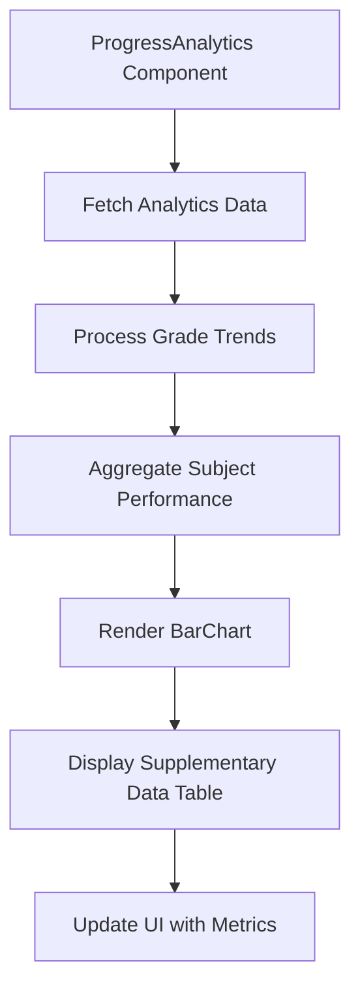
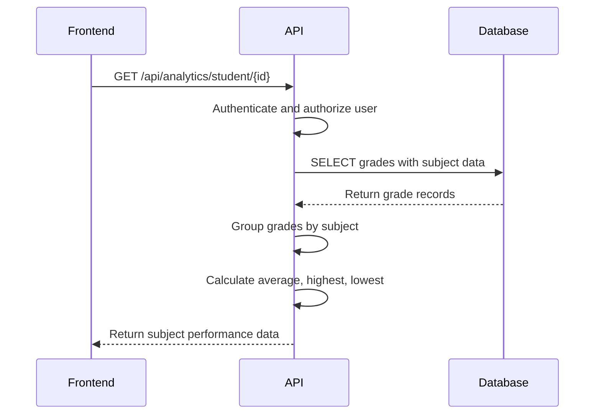

# Subject Performance Chart

<cite>
**Referenced Files in This Document**   
- [progress-analytics.tsx](file://components/progress-analytics.tsx)
- [route.ts](file://app/api/analytics/student/[id]/route.ts)
- [grade-utils.ts](file://lib/grade-utils.ts)
- [queries.ts](file://lib/supabase/queries.ts)
- [20251219043509_create_grades_tables.sql](file://supabase/migrations/20251219043509_create_grades_tables.sql)
</cite>

## Table of Contents
1. [Introduction](#introduction)
2. [Core Implementation](#core-implementation)
3. [Backend Data Aggregation](#backend-data-aggregation)
4. [Visual Design and Layout](#visual-design-and-layout)
5. [Supplementary Data Table](#supplementary-data-table)
6. [Usage Examples](#usage-examples)
7. [Accessibility Considerations](#accessibility-considerations)
8. [Troubleshooting Guide](#troubleshooting-guide)

## Introduction
The Subject Performance Chart is a key component of the ProgressAnalytics system in the School Management System, designed to visualize student performance across different subjects. This chart enables administrators, teachers, and parents to quickly assess academic strengths and weaknesses, identify trends, and make data-driven decisions about curriculum effectiveness and student interventions. Built using Recharts BarChart, the component provides a clear, intuitive visualization of subject-specific performance metrics including average, highest, and lowest scores.

## Core Implementation

The Subject Performance Chart is implemented within the ProgressAnalytics component as a vertical bar chart that compares student performance across subjects. The implementation leverages Recharts to create an accessible, responsive visualization that integrates seamlessly with the application's analytics API.

The chart is part of a larger analytics dashboard that includes multiple visualizations, with the subject performance section specifically focusing on comparative subject analysis. The component accepts student identification and display parameters, fetching comprehensive analytics data from the backend API to populate the chart and associated metrics.



**Diagram sources**
- [progress-analytics.tsx](file://components/progress-analytics.tsx#L18-L188)

**Section sources**
- [progress-analytics.tsx](file://components/progress-analytics.tsx#L18-L188)

## Backend Data Aggregation

The backend API responsible for providing subject performance data implements comprehensive data aggregation logic to group grades by subject and calculate key metrics. The API endpoint at `/api/analytics/student/[id]` handles authentication and authorization before querying the database for relevant grade records.

The data aggregation process begins by retrieving all grades for the specified student, including the score, date, assessment type, and associated class information. The system then groups these grades by subject, extracting the subject name from the class relationship in the database. For each subject group, the system calculates three primary metrics: average score, highest score, and lowest score.

The aggregation algorithm uses a Map data structure to efficiently group scores by subject, iterating through the grade records and accumulating scores for each subject. The average is calculated by summing all scores in a subject group and dividing by the count, with the result rounded to the nearest whole number. The highest and lowest scores are determined using Math.max() and Math.min() functions applied to the array of scores for each subject.



**Diagram sources**
- [route.ts](file://app/api/analytics/student/[id]/route.ts#L74-L122)

**Section sources**
- [route.ts](file://app/api/analytics/student/[id]/route.ts#L74-L162)

## Visual Design and Layout

The Subject Performance Chart employs a vertical bar layout with a carefully designed visual hierarchy to enhance data comprehension. The chart uses the Recharts BarChart component with the layout attribute set to "vertical" to create horizontal bars that extend from left to right, allowing for easy comparison of performance levels across subjects.

The XAxis is configured with a domain from 0 to 100, representing the percentage scale used for grading in the system. This consistent scale allows users to quickly interpret performance levels, with the 75% threshold for passing clearly visible. The YAxis maps to subject names as categories, with each subject occupying a row in the chart. The YAxis is configured with a fixed width of 100 pixels to ensure subject names are fully visible without truncation.

Visual styling includes a primary color fill for the bars, consistent with the application's design system, and a subtle border grid to aid in reading values. The bars feature rounded corners with a radius applied only to the right side (radius={[0, 4, 4, 0]}), creating a clean, modern appearance. The chart is wrapped in a ResponsiveContainer to ensure proper rendering across different screen sizes and device orientations.

```mermaid
flowchart TD
A[XAxis Configuration] --> B[Type: number]
A --> C[Domain: 0-100]
A --> D[Tick styling]
E[YAxis Configuration] --> F[Type: category]
E --> G[DataKey: name]
E --> H[Fixed width: 100px]
I[Bar Configuration] --> J[Fill: primary color]
I --> K[Radius: [0,4,4,0]]
I --> L[Vertical layout]
```

**Diagram sources**
- [progress-analytics.tsx](file://components/progress-analytics.tsx#L133-L139)

**Section sources**
- [progress-analytics.tsx](file://components/progress-analytics.tsx#L133-L153)

## Supplementary Data Table

Below the Subject Performance Chart, a supplementary data table provides detailed metrics for each subject, enhancing the analytical capabilities of the component. This table displays the subject name alongside its average, highest, and lowest scores, offering a comprehensive view of performance that complements the visual representation.

The table is implemented as a series of flex containers within the CardContent, with each subject represented as a row containing the subject name on the left and performance metrics on the right. The metrics are organized with the lowest score on the left, the average in the center (displayed prominently), and the highest score on the right, creating a logical flow that mirrors the bar chart's left-to-right progression.

The visual design of the table uses a clean, minimalist approach with muted text for the lowest and highest scores and bold formatting for the average score, which serves as the primary metric of interest. The layout is responsive, stacking elements appropriately on smaller screens to maintain readability. This supplementary information allows users to obtain precise values without needing to interpret the chart alone, supporting both quick overviews and detailed analysis.

**Section sources**
- [progress-analytics.tsx](file://components/progress-analytics.tsx#L143-L153)

## Usage Examples

The Subject Performance Chart serves multiple stakeholders with different analytical needs. For administrators analyzing curriculum effectiveness, the chart provides a macro-level view of subject performance across the student population. By comparing average scores between subjects, administrators can identify areas of strength and weakness in the curriculum, allocate resources appropriately, and evaluate the impact of instructional changes over time.

For teachers identifying subjects needing intervention, the chart offers a diagnostic tool to pinpoint specific areas where students are struggling. A teacher might notice that mathematics has a significantly lower average compared to other subjects, prompting a review of teaching methods, curriculum materials, or assessment strategies. The presence of a wide gap between highest and lowest scores in a subject may indicate that differentiated instruction is needed to address varying student abilities.

Parents can use the chart to understand their child's academic profile, celebrating strengths in subjects with high performance while identifying opportunities for additional support in weaker areas. The visual nature of the chart makes it accessible to users without statistical expertise, enabling meaningful conversations about academic progress between parents, teachers, and students.

**Section sources**
- [progress-analytics.tsx](file://components/progress-analytics.tsx#L127-L153)
- [teacher/analytics/page.tsx](file://app/teacher/analytics/page.tsx#L256-L260)

## Accessibility Considerations

The Subject Performance Chart incorporates several accessibility features to ensure it is usable by all users, including those with disabilities. The implementation follows Web Content Accessibility Guidelines (WCAG) to provide an inclusive experience.

For screen reader support, the chart includes appropriate ARIA attributes and semantic HTML structure. The ResponsiveContainer ensures that the chart is properly announced by assistive technologies, while the Tooltip component provides detailed information about data points when accessed via keyboard navigation. The supplementary data table provides a text-based alternative to the visual chart, ensuring that all information is available to users who cannot perceive the graphical representation.

Color contrast has been carefully considered in the design, with the primary bar color providing sufficient contrast against the background to meet WCAG AA standards for normal text. The application's theme system ensures consistent color usage across light and dark modes, maintaining readability in different viewing conditions. For users with color vision deficiencies, the combination of color, position, and the supplementary data table ensures that information can be interpreted through multiple channels.

Keyboard navigation is supported through the interactive elements of the dashboard, allowing users to access the chart and its associated data without requiring a mouse. Focus indicators are visible and clear, helping users track their position within the interface. The responsive design ensures that the chart remains usable on various devices and screen sizes, accommodating users with different physical abilities and technological constraints.

**Section sources**
- [progress-analytics.tsx](file://components/progress-analytics.tsx#L133-L153)
- [globals.css](file://app/globals.css#L38-L80)

## Troubleshooting Guide

When encountering issues with the Subject Performance Chart, several common problems and their solutions should be considered. For missing subject data, verify that the student has recorded grades in the relevant subjects and that the class-subject relationships are properly configured in the database. Check the API response to confirm that subject names are being correctly extracted from the class data, as null or undefined subject values will be grouped as "Unknown."

Incorrect averages may result from data type issues or calculation errors. Ensure that all grade scores are stored as numeric values and that the aggregation logic correctly handles edge cases such as empty grade arrays. The system should return 0 for averages when no grades are available, but unexpected values may indicate issues with data retrieval or processing.

Layout overflow in responsive views can occur when subject names are too long for the allocated YAxis width. The current implementation uses a fixed width of 100 pixels, which may need adjustment based on typical subject name lengths. Consider implementing text truncation with tooltips for long subject names or dynamically adjusting the width based on content. Test the component on various screen sizes to ensure the chart and supplementary table remain readable and properly aligned.

Performance issues may arise when processing large numbers of grade records. The current implementation processes all grades for a student in memory, which could become problematic for students with extensive academic histories. Consider implementing pagination or time-based filtering for the grade data to improve loading times and memory usage.

**Section sources**
- [progress-analytics.tsx](file://components/progress-analytics.tsx#L133-L153)
- [route.ts](file://app/api/analytics/student/[id]/route.ts#L74-L162)