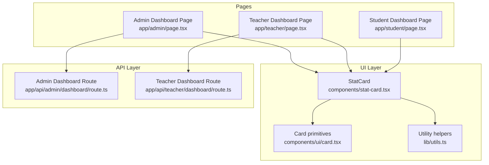
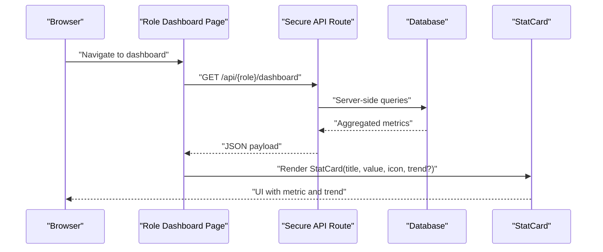
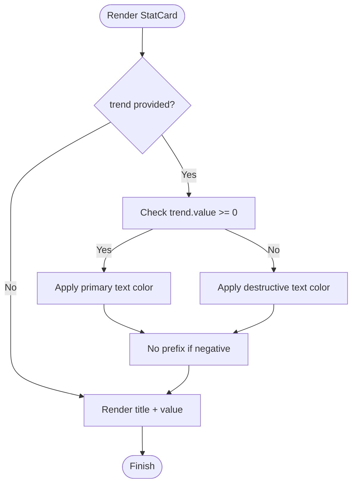
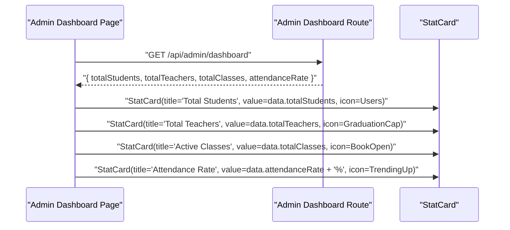
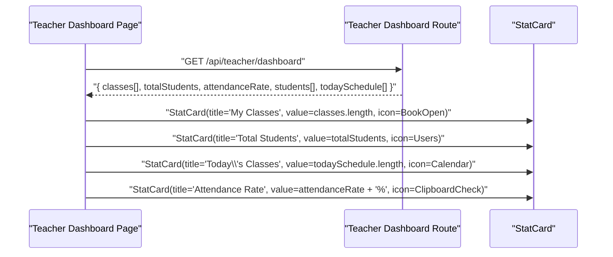
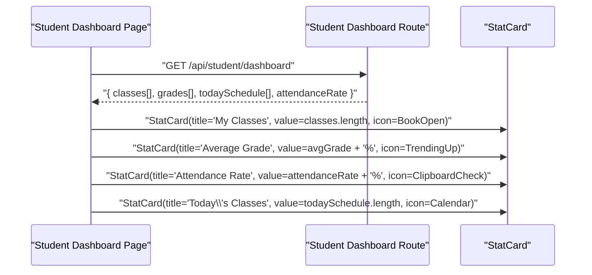
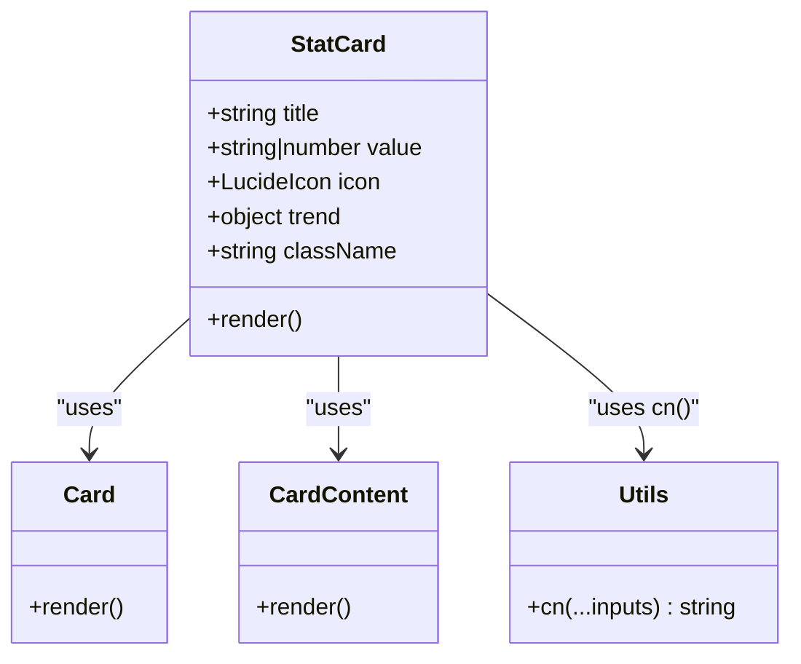

# StatCard Component

<cite>
**Referenced Files in This Document**
- [stat-card.tsx](file://components/stat-card.tsx)
- [card.tsx](file://components/ui/card.tsx)
- [utils.ts](file://lib/utils.ts)
- [admin-dashboard-route.ts](file://app/api/admin/dashboard/route.ts)
- [teacher-dashboard-route.ts](file://app/api/teacher/dashboard/route.ts)
- [admin-dashboard-page.tsx](file://app/admin/page.tsx)
- [teacher-dashboard-page.tsx](file://app/teacher/page.tsx)
- [student-dashboard-page.tsx](file://app/student/page.tsx)
</cite>

## Table of Contents
1. [Introduction](#introduction)
2. [Project Structure](#project-structure)
3. [Core Components](#core-components)
4. [Architecture Overview](#architecture-overview)
5. [Detailed Component Analysis](#detailed-component-analysis)
6. [Dependency Analysis](#dependency-analysis)
7. [Performance Considerations](#performance-considerations)
8. [Troubleshooting Guide](#troubleshooting-guide)
9. [Conclusion](#conclusion)
10. [Appendices](#appendices)

## Introduction
This document provides comprehensive guidance for the StatCard component used to display key performance indicators across the school management system. It covers props, visual design, conditional rendering of trend indicators, icon container styling, practical usage in admin and teacher dashboards, integration with dynamic API data, accessibility considerations, performance optimization, and theme integration via CSS variables and Tailwind utilities.

## Project Structure
StatCard is a reusable UI component built on shadcn/ui primitives and styled with Tailwind utility classes. It is consumed by role-specific dashboards that fetch metrics from secure API routes.

**Diagram sources**
- [stat-card.tsx](file://components/stat-card.tsx#L1-L38)
- [card.tsx](file://components/ui/card.tsx#L1-L92)
- [utils.ts](file://lib/utils.ts#L1-L6)
- [admin-dashboard-page.tsx](file://app/admin/page.tsx#L1-L200)
- [teacher-dashboard-page.tsx](file://app/teacher/page.tsx#L1-L206)
- [student-dashboard-page.tsx](file://app/student/page.tsx#L1-L202)
- [admin-dashboard-route.ts](file://app/api/admin/dashboard/route.ts#L1-L125)
- [teacher-dashboard-route.ts](file://app/api/teacher/dashboard/route.ts#L1-L128)

**Section sources**
- [stat-card.tsx](file://components/stat-card.tsx#L1-L38)
- [card.tsx](file://components/ui/card.tsx#L1-L92)
- [utils.ts](file://lib/utils.ts#L1-L6)
- [admin-dashboard-page.tsx](file://app/admin/page.tsx#L1-L200)
- [teacher-dashboard-page.tsx](file://app/teacher/page.tsx#L1-L206)
- [student-dashboard-page.tsx](file://app/student/page.tsx#L1-L202)
- [admin-dashboard-route.ts](file://app/api/admin/dashboard/route.ts#L1-L125)
- [teacher-dashboard-route.ts](file://app/api/teacher/dashboard/route.ts#L1-L128)

## Core Components
- StatCard: Lightweight functional component rendering a metric with title, value, icon, and optional trend indicator inside a shadcn/ui Card.
- Card primitives: Reusable Card, CardContent, and related slots used by StatCard.
- Utility helpers: cn helper merges Tailwind classes safely.

Key characteristics:
- Props include title (string), value (string | number), icon (LucideIcon), optional trend (with value and label), and optional className.
- Uses shadcn/ui Card with responsive padding and typography classes.
- Conditional rendering of trend indicator with color coding based on sign.
- Icon container with background opacity and consistent icon sizing.

**Section sources**
- [stat-card.tsx](file://components/stat-card.tsx#L1-L38)
- [card.tsx](file://components/ui/card.tsx#L1-L92)
- [utils.ts](file://lib/utils.ts#L1-L6)

## Architecture Overview
The StatCard component is rendered within role-specific dashboards. These dashboards fetch metrics from secure API routes and pass them to StatCard instances. The API routes perform server-side authentication, role verification, and data aggregation.

**Diagram sources**
- [admin-dashboard-page.tsx](file://app/admin/page.tsx#L1-L200)
- [teacher-dashboard-page.tsx](file://app/teacher/page.tsx#L1-L206)
- [student-dashboard-page.tsx](file://app/student/page.tsx#L1-L202)
- [admin-dashboard-route.ts](file://app/api/admin/dashboard/route.ts#L1-L125)
- [teacher-dashboard-route.ts](file://app/api/teacher/dashboard/route.ts#L1-L128)
- [stat-card.tsx](file://components/stat-card.tsx#L1-L38)

## Detailed Component Analysis

### Props and Rendering Logic
- title: Displays a small, muted label above the metric.
- value: Large bold value rendered with card foreground color.
- icon: LucideIcon passed as a component; rendered inside a rounded container with primary opacity background and primary text color.
- trend: Optional object with value (number) and label (string). When present:
  - Positive values render in primary color.
  - Negative values render in destructive color.
  - A plus sign is shown for positive values.
- className: Optional Tailwind class string merged via cn helper.

Layout and responsiveness:
- Card padding is set via CardContent’s px-6 class.
- Flex layout aligns title/value column with icon container on the right.
- Typography classes provide consistent hierarchy and color semantics.

Accessibility:
- The component renders semantic paragraphs for title and value.
- No explicit aria-label or role attributes are present in the component itself; rely on semantic HTML and screen reader-friendly text content.

Performance:
- Stateless functional component with minimal DOM nodes.
- Uses cn for efficient class merging.
- No heavy computations; rendering cost is proportional to prop updates.

Integration with theme:
- Uses Tailwind utilities bound to CSS variables from the theme (e.g., bg-card, text-card-foreground, text-muted-foreground, text-primary, text-destructive).
- Icon container uses bg-primary/10 and text-primary for consistent theming.

**Section sources**
- [stat-card.tsx](file://components/stat-card.tsx#L1-L38)
- [card.tsx](file://components/ui/card.tsx#L1-L92)
- [utils.ts](file://lib/utils.ts#L1-L6)

### Conditional Trend Indicator Flow

**Diagram sources**
- [stat-card.tsx](file://components/stat-card.tsx#L1-L38)

### Icon Container Styling
- Background: rounded-lg with bg-primary/10 for subtle opacity.
- Icon size: h-6 w-6 for consistent sizing.
- Text color: text-primary for icon tint.

**Section sources**
- [stat-card.tsx](file://components/stat-card.tsx#L1-L38)

### Practical Usage Examples

#### Admin Dashboard
- Metrics displayed include total students, total teachers, active classes, and attendance rate.
- Data is fetched from a secure API route and passed to StatCard instances.

**Diagram sources**
- [admin-dashboard-page.tsx](file://app/admin/page.tsx#L1-L200)
- [admin-dashboard-route.ts](file://app/api/admin/dashboard/route.ts#L1-L125)
- [stat-card.tsx](file://components/stat-card.tsx#L1-L38)

**Section sources**
- [admin-dashboard-page.tsx](file://app/admin/page.tsx#L1-L200)
- [admin-dashboard-route.ts](file://app/api/admin/dashboard/route.ts#L1-L125)

#### Teacher Dashboard
- Metrics include number of classes, total students across classes, today’s classes, and attendance rate.
- Data is fetched from a secure API route and passed to StatCard instances.

**Diagram sources**
- [teacher-dashboard-page.tsx](file://app/teacher/page.tsx#L1-L206)
- [teacher-dashboard-route.ts](file://app/api/teacher/dashboard/route.ts#L1-L128)
- [stat-card.tsx](file://components/stat-card.tsx#L1-L38)

**Section sources**
- [teacher-dashboard-page.tsx](file://app/teacher/page.tsx#L1-L206)
- [teacher-dashboard-route.ts](file://app/api/teacher/dashboard/route.ts#L1-L128)

#### Student Dashboard
- Metrics include number of classes, average grade, attendance rate, and today’s classes.
- Data is fetched from a secure API route and passed to StatCard instances.

**Diagram sources**
- [student-dashboard-page.tsx](file://app/student/page.tsx#L1-L202)
- [stat-card.tsx](file://components/stat-card.tsx#L1-L38)

**Section sources**
- [student-dashboard-page.tsx](file://app/student/page.tsx#L1-L202)

### Class Diagram

**Diagram sources**
- [stat-card.tsx](file://components/stat-card.tsx#L1-L38)
- [card.tsx](file://components/ui/card.tsx#L1-L92)
- [utils.ts](file://lib/utils.ts#L1-L6)

## Dependency Analysis
- Internal dependencies:
  - StatCard depends on Card and CardContent from shadcn/ui.
  - Uses cn helper from lib/utils for class merging.
- External dependencies:
  - LucideIcon type for icon prop.
  - Tailwind utilities for styling and theme variables.
- Runtime dependencies:
  - Pages pass props derived from API responses to StatCard.

Potential circular dependencies:
- None observed between StatCard and its consumers.

Integration points:
- Secure API routes supply metrics to dashboards.
- Theme system provides CSS variables for colors.

**Section sources**
- [stat-card.tsx](file://components/stat-card.tsx#L1-L38)
- [card.tsx](file://components/ui/card.tsx#L1-L92)
- [utils.ts](file://lib/utils.ts#L1-L6)
- [admin-dashboard-page.tsx](file://app/admin/page.tsx#L1-L200)
- [teacher-dashboard-page.tsx](file://app/teacher/page.tsx#L1-L206)
- [student-dashboard-page.tsx](file://app/student/page.tsx#L1-L202)
- [admin-dashboard-route.ts](file://app/api/admin/dashboard/route.ts#L1-L125)
- [teacher-dashboard-route.ts](file://app/api/teacher/dashboard/route.ts#L1-L128)

## Performance Considerations
- Lightweight rendering: Minimal DOM nodes and no heavy computations.
- Memoization opportunities:
  - Wrap StatCard with memoization if props are static or computed once per render.
  - Use stable references for icon components to prevent unnecessary re-renders.
- Avoid re-computation:
  - Pre-format values (e.g., percentage strings) in parent components before passing to StatCard.
- CSS variables:
  - Using theme-bound Tailwind utilities ensures efficient rendering and avoids runtime style calculations.

[No sources needed since this section provides general guidance]

## Troubleshooting Guide
Common issues and resolutions:
- Incorrect trend color:
  - Ensure trend.value is a number and trend.label is a string. Non-numeric values may lead to unexpected behavior.
- Icon sizing mismatch:
  - Confirm icon component receives h-6 w-6 via className. Adjust container padding if icons appear clipped.
- Theme color mismatches:
  - Verify that bg-card, text-card-foreground, text-muted-foreground, text-primary, and text-destructive are available in the current theme.
- Accessibility concerns:
  - Add aria-label to the outer Card element if the metric requires additional context for assistive technologies.
  - Ensure the title and value are meaningful and concise for screen readers.

**Section sources**
- [stat-card.tsx](file://components/stat-card.tsx#L1-L38)
- [card.tsx](file://components/ui/card.tsx#L1-L92)

## Conclusion
StatCard is a focused, theme-aware component designed for consistent metric display across roles. Its simplicity enables fast rendering and easy integration with dynamic data from secure API routes. By following the usage patterns outlined here, developers can reliably present KPIs with clear visual hierarchy, responsive layout, and accessible semantics.

[No sources needed since this section summarizes without analyzing specific files]

## Appendices

### Props Reference
- title: string
- value: string | number
- icon: LucideIcon
- trend?: { value: number; label: string }
- className?: string

**Section sources**
- [stat-card.tsx](file://components/stat-card.tsx#L1-L38)

### Integration Snippet Paths
- Admin dashboard usage: [admin-dashboard-page.tsx](file://app/admin/page.tsx#L70-L78)
- Teacher dashboard usage: [teacher-dashboard-page.tsx](file://app/teacher/page.tsx#L110-L115)
- Student dashboard usage: [student-dashboard-page.tsx](file://app/student/page.tsx#L107-L112)
- Admin API route: [admin-dashboard-route.ts](file://app/api/admin/dashboard/route.ts#L1-L125)
- Teacher API route: [teacher-dashboard-route.ts](file://app/api/teacher/dashboard/route.ts#L1-L128)