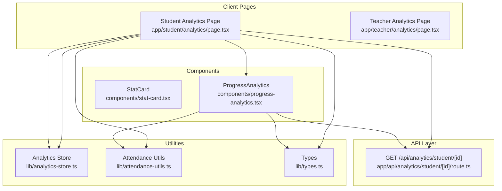
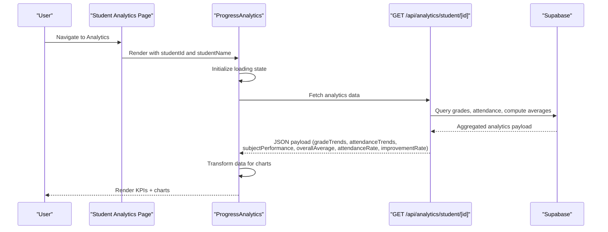
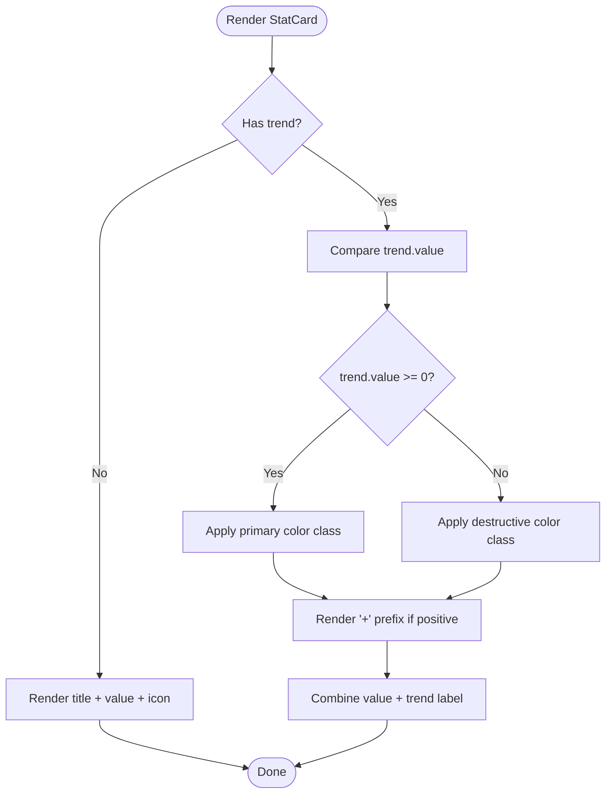
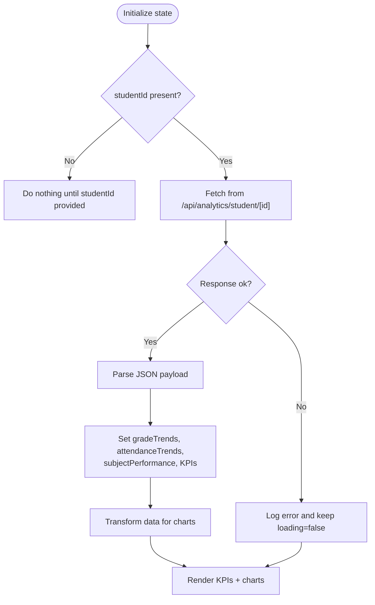
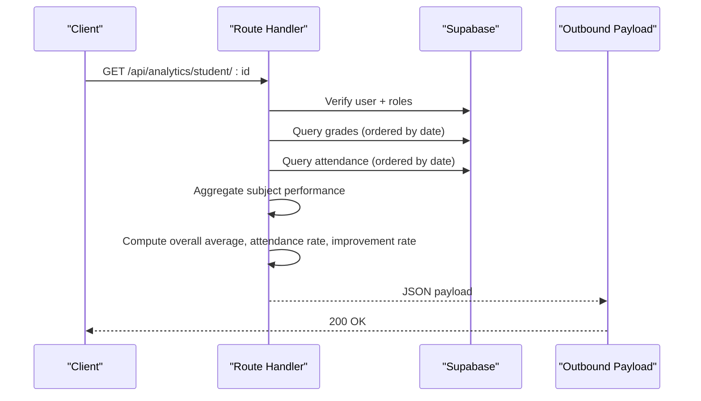
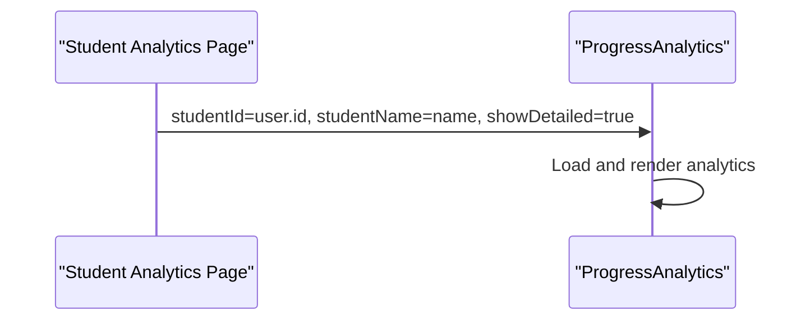
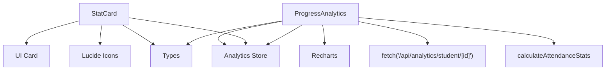

# Statistical Display Components

<cite>
**Referenced Files in This Document**
- [stat-card.tsx](file://components/stat-card.tsx)
- [progress-analytics.tsx](file://components/progress-analytics.tsx)
- [route.ts](file://app/api/analytics/student/[id]/route.ts)
- [page.tsx (Student Analytics)](file://app/student/analytics/page.tsx)
- [page.tsx (Teacher Analytics)](file://app/teacher/analytics/page.tsx)
- [analytics-store.ts](file://lib/analytics-store.ts)
- [attendance-utils.ts](file://lib/attendance-utils.ts)
- [types.ts](file://lib/types.ts)
</cite>

## Table of Contents
1. [Introduction](#introduction)
2. [Project Structure](#project-structure)
3. [Core Components](#core-components)
4. [Architecture Overview](#architecture-overview)
5. [Detailed Component Analysis](#detailed-component-analysis)
6. [Dependency Analysis](#dependency-analysis)
7. [Performance Considerations](#performance-considerations)
8. [Troubleshooting Guide](#troubleshooting-guide)
9. [Conclusion](#conclusion)

## Introduction
This document explains the statistical display components focused on KPI cards and student analytics visualizations. It covers:
- StatCard: props, visual design, and conditional rendering of trend indicators with color coding
- ProgressAnalytics: student analytics visualization (grade trends, attendance breakdown, subject performance), API integration, state management, Recharts usage, data transformation, accessibility, and performance optimization

## Project Structure
The relevant components and pages are organized under:
- UI components: StatCard and ProgressAnalytics
- API route: server-side analytics endpoint for student data
- Pages: client-side integration for student and teacher dashboards
- Utilities: analytics store and attendance utilities

**Diagram sources**
- [stat-card.tsx](file://components/stat-card.tsx#L1-L39)
- [progress-analytics.tsx](file://components/progress-analytics.tsx#L1-L189)
- [route.ts](file://app/api/analytics/student/[id]/route.ts#L1-L163)
- [page.tsx (Student Analytics)](file://app/student/analytics/page.tsx#L1-L66)
- [page.tsx (Teacher Analytics)](file://app/teacher/analytics/page.tsx#L1-L266)
- [analytics-store.ts](file://lib/analytics-store.ts#L1-L83)
- [attendance-utils.ts](file://lib/attendance-utils.ts#L1-L42)
- [types.ts](file://lib/types.ts#L1-L28)

**Section sources**
- [stat-card.tsx](file://components/stat-card.tsx#L1-L39)
- [progress-analytics.tsx](file://components/progress-analytics.tsx#L1-L189)
- [route.ts](file://app/api/analytics/student/[id]/route.ts#L1-L163)
- [page.tsx (Student Analytics)](file://app/student/analytics/page.tsx#L1-L66)
- [page.tsx (Teacher Analytics)](file://app/teacher/analytics/page.tsx#L1-L266)
- [analytics-store.ts](file://lib/analytics-store.ts#L1-L83)
- [attendance-utils.ts](file://lib/attendance-utils.ts#L1-L42)
- [types.ts](file://lib/types.ts#L1-L28)

## Core Components
- StatCard: renders a compact KPI card with title, value, icon, and optional trend indicator. Conditional rendering applies color coding based on positive/negative trend values.
- ProgressAnalytics: fetches and displays student analytics with:
  - Summary KPIs (overall average, attendance rate, improvement rate, subject count)
  - Grade trends over time (line chart)
  - Subject performance (bar chart)
  - Attendance breakdown (pie chart)

**Section sources**
- [stat-card.tsx](file://components/stat-card.tsx#L1-L39)
- [progress-analytics.tsx](file://components/progress-analytics.tsx#L1-L189)

## Architecture Overview
The analytics pipeline integrates client-side components with a server-side API route. The client components manage loading states and render Recharts visualizations. The API route performs authorization checks, aggregates data from the database, and returns a normalized payload.

**Diagram sources**
- [page.tsx (Student Analytics)](file://app/student/analytics/page.tsx#L1-L66)
- [progress-analytics.tsx](file://components/progress-analytics.tsx#L1-L189)
- [route.ts](file://app/api/analytics/student/[id]/route.ts#L1-L163)

## Detailed Component Analysis

### StatCard
- Purpose: Display a single KPI with title, value, icon, and optional trend.
- Props:
  - title: string
  - value: string | number
  - icon: LucideIcon
  - trend?: { value: number; label: string }
  - className?: string
- Visual design:
  - Card layout with title, large numeric value, optional trend label
  - Rounded icon container with primary color accent
- Conditional rendering and color coding:
  - Trend label uses positive/negative color classes based on trend.value
  - Positive trend shows a plus sign prefix and primary color
  - Negative trend uses destructive color and no leading plus sign
- Accessibility:
  - Uses semantic text sizes and muted foreground for labels
  - Icon container provides visual contrast; ensure sufficient color contrast for trend text

**Diagram sources**
- [stat-card.tsx](file://components/stat-card.tsx#L1-L39)

**Section sources**
- [stat-card.tsx](file://components/stat-card.tsx#L1-L39)

### ProgressAnalytics
- Props:
  - studentId: string
  - studentName?: string
  - showDetailed?: boolean
- State management:
  - Loading state during fetch
  - Arrays for gradeTrends, attendanceTrends, subjectPerformance
  - Numeric KPIs: overallAverage, attendanceRate, improvementRate
- API integration:
  - Fetches from GET /api/analytics/student/[id]
  - Handles ok/not-ok responses and errors
- Data transformation:
  - Grade trends: maps date to localized short date string; preserves subject and type
  - Subject performance: computes average, highest, lowest, and count per subject
  - Attendance stats: counts present, late, absent, excused; filters zero-value entries for pie chart
  - Improvement rate: difference between recent and previous 5-grade averages
- Recharts usage:
  - LineChart for grade trends over time (responsive container, tooltips, axes)
  - BarChart for subject performance (vertical layout, axes, tooltip)
  - PieChart for attendance breakdown (inner/outer radii, cells, tooltip)
- Conditional rendering:
  - Loading spinner while fetching
  - Fallback card when no data is available
  - Summary KPI cards with colored trend icons and values
- Accessibility considerations:
  - Tooltips configured with card background and border for readability
  - Responsive containers ensure charts remain usable on small screens
  - Ensure sufficient color contrast for trend indicators and chart elements
- Performance optimization:
  - Minimal re-renders by deriving chart-ready arrays from state
  - Only render detailed charts when data is available
  - Use ResponsiveContainer to avoid layout thrashing on resize

**Diagram sources**
- [progress-analytics.tsx](file://components/progress-analytics.tsx#L1-L189)
- [route.ts](file://app/api/analytics/student/[id]/route.ts#L1-L163)

**Section sources**
- [progress-analytics.tsx](file://components/progress-analytics.tsx#L1-L189)
- [route.ts](file://app/api/analytics/student/[id]/route.ts#L1-L163)

### API Integration and Data Transformation
- Endpoint: GET /api/analytics/student/[id]
- Authorization:
  - Requires authenticated user
  - Validates role-based access (student, teacher, admin, parent)
  - Teacher access requires enrollment in the student’s class
- Data aggregation:
  - Grades: ordered by date; mapped to gradeTrends with subject and type
  - Attendance: ordered by date; mapped to attendanceTrends
  - Subject performance: grouped by subject; computed average, highest, lowest, count
  - Overall average: rounded mean of all scores
  - Attendance rate: percent of present/later vs total
  - Improvement rate: rounded difference between recent and previous 5-grade averages
- Client-side transformation:
  - Grade trends: convert date to localized short date string
  - Subject performance: map to chart-friendly fields
  - Attendance pie: filter zero-value categories

**Diagram sources**
- [route.ts](file://app/api/analytics/student/[id]/route.ts#L1-L163)

**Section sources**
- [route.ts](file://app/api/analytics/student/[id]/route.ts#L1-L163)
- [progress-analytics.tsx](file://components/progress-analytics.tsx#L1-L189)

### Usage in Application Pages
- Student Analytics Page:
  - Retrieves current user ID and name, passes studentId and studentName to ProgressAnalytics
- Teacher Analytics Page:
  - Provides class and student selection; renders ProgressAnalytics for a selected student or class overview

**Diagram sources**
- [page.tsx (Student Analytics)](file://app/student/analytics/page.tsx#L1-L66)
- [progress-analytics.tsx](file://components/progress-analytics.tsx#L1-L189)

**Section sources**
- [page.tsx (Student Analytics)](file://app/student/analytics/page.tsx#L1-L66)
- [page.tsx (Teacher Analytics)](file://app/teacher/analytics/page.tsx#L1-L266)
- [progress-analytics.tsx](file://components/progress-analytics.tsx#L1-L189)

## Dependency Analysis
- StatCard depends on:
  - UI Card and content wrappers
  - Lucide icons via props
  - Utility class names for conditional styling
- ProgressAnalytics depends on:
  - Recharts for visualization
  - Client-side fetch for API integration
  - Attendance utilities for stats computation
  - Types for attendance statuses
  - Analytics store for potential client-side caching and derived computations

**Diagram sources**
- [stat-card.tsx](file://components/stat-card.tsx#L1-L39)
- [progress-analytics.tsx](file://components/progress-analytics.tsx#L1-L189)
- [attendance-utils.ts](file://lib/attendance-utils.ts#L1-L42)
- [analytics-store.ts](file://lib/analytics-store.ts#L1-L83)
- [types.ts](file://lib/types.ts#L1-L28)

**Section sources**
- [stat-card.tsx](file://components/stat-card.tsx#L1-L39)
- [progress-analytics.tsx](file://components/progress-analytics.tsx#L1-L189)
- [attendance-utils.ts](file://lib/attendance-utils.ts#L1-L42)
- [analytics-store.ts](file://lib/analytics-store.ts#L1-L83)
- [types.ts](file://lib/types.ts#L1-L28)

## Performance Considerations
- Minimize re-renders:
  - Derive chart-ready arrays from state once per fetch
  - Avoid unnecessary deep equality checks in parent components
- Chart responsiveness:
  - Use ResponsiveContainer to prevent layout shifts on resize
  - Keep chart domains reasonable to reduce rendering overhead
- Network efficiency:
  - Fetch analytics only when studentId changes
  - Debounce or coalesce requests if used in rapid succession
- Memory:
  - Filter zero-value categories for pie charts to reduce DOM nodes
  - Truncate long lists if needed for very large datasets

[No sources needed since this section provides general guidance]

## Troubleshooting Guide
- Unauthorized or forbidden access:
  - Ensure the authenticated user has the correct role and relationship to the student
- Empty or missing data:
  - Verify that the student has associated grades and attendance records
  - Confirm that the API route returns the expected fields
- Chart rendering issues:
  - Check that data arrays are non-empty before rendering charts
  - Ensure dates are valid and transformable to localized strings
- Accessibility concerns:
  - Confirm that tooltips and trend indicators meet color contrast guidelines
  - Test with screen readers and keyboard navigation

**Section sources**
- [route.ts](file://app/api/analytics/student/[id]/route.ts#L1-L163)
- [progress-analytics.tsx](file://components/progress-analytics.tsx#L1-L189)

## Conclusion
StatCard and ProgressAnalytics provide a cohesive foundation for displaying KPIs and student analytics. StatCard offers a simple, accessible way to present metrics with trend indicators. ProgressAnalytics integrates with a robust API, transforms raw data into chart-ready formats, and leverages Recharts for responsive, accessible visualizations. Proper authorization, data validation, and performance-conscious rendering ensure reliable user experiences across roles and devices.