# Form Components

<cite>
**Referenced Files in This Document**   
- [student-form.tsx](file://components/student-form.tsx)
- [validation-schemas.ts](file://lib/validation-schemas.ts)
- [input.tsx](file://components/ui/input.tsx)
- [textarea.tsx](file://components/ui/textarea.tsx)
- [select.tsx](file://components/ui/select.tsx)
- [checkbox.tsx](file://components/ui/checkbox.tsx)
- [switch.tsx](file://components/ui/switch.tsx)
- [avatar.tsx](file://components/ui/avatar.tsx)
- [student-validation.ts](file://lib/student-validation.ts)
- [deped-constants.ts](file://lib/deped-constants.ts)
- [storage.ts](file://lib/supabase/storage.ts)
- [route.ts](file://app/api/profile/upload-avatar/route.ts)
- [profile-page.tsx](file://components/profile-page.tsx)
</cite>

## Table of Contents
1. [Introduction](#introduction)
2. [Base UI Components](#base-ui-components)
3. [Student Form Component](#student-form-component)
4. [Form State Management](#form-state-management)
5. [Validation Patterns](#validation-patterns)
6. [File Upload and Avatar Component](#file-upload-and-avatar-component)
7. [Accessibility and Responsive Design](#accessibility-and-responsive-design)
8. [Form Submission and Loading States](#form-submission-and-loading-states)
9. [Best Practices](#best-practices)

## Introduction
This document provides comprehensive documentation for the form components within the school management system. It details the implementation of base UI components such as input, textarea, select, checkbox, and switch, with a focus on their props, events, and styling options. The document also covers the complex composite student-form component, its validation patterns, integration with form state management, file upload functionality through the avatar component, and best practices for form submission and loading states.

**Section sources**
- [student-form.tsx](file://components/student-form.tsx)
- [validation-schemas.ts](file://lib/validation-schemas.ts)

## Base UI Components

### Input Component
The Input component is a styled text input field that supports various types and integrates with the form system. It includes built-in styling for focus states, validation errors, and disabled states.

**Props:**
- `className`: Additional CSS classes for customization
- `type`: Input type (text, email, tel, date, etc.)
- All standard HTML input attributes via React.ComponentProps<'input'>

**Styling:**
- Default styling includes border, padding, rounded corners, and shadow
- Focus state adds a ring and changes border color
- Error state highlights the border in destructive color
- Disabled state reduces opacity and prevents interaction

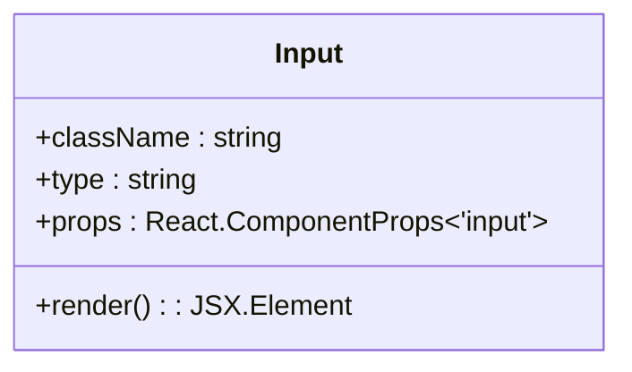

**Diagram sources**
- [input.tsx](file://components/ui/input.tsx#L5-L22)

### Textarea Component
The Textarea component provides a multi-line text input with similar styling and behavior to the Input component.

**Props:**
- `className`: Additional CSS classes for customization
- All standard HTML textarea attributes via React.ComponentProps<'textarea'>

**Styling:**
- Default styling matches Input component with larger minimum height
- Supports resizing and maintains consistent appearance
- Includes focus and error states identical to Input component

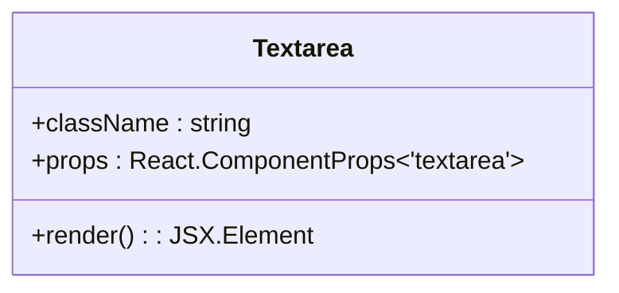

**Diagram sources**
- [textarea.tsx](file://components/ui/textarea.tsx#L5-L19)

### Select Component
The Select component implements a custom dropdown select with multiple subcomponents for different parts of the select interface.

**Subcomponents:**
- `Select`: Root component
- `SelectTrigger`: The button that displays the selected value
- `SelectContent`: The dropdown menu container
- `SelectItem`: Individual selectable items
- `SelectValue`: Displays the selected value

**Props:**
- Various props for each subcomponent to control appearance and behavior
- Size variants (default, sm)
- Support for disabled state and error states

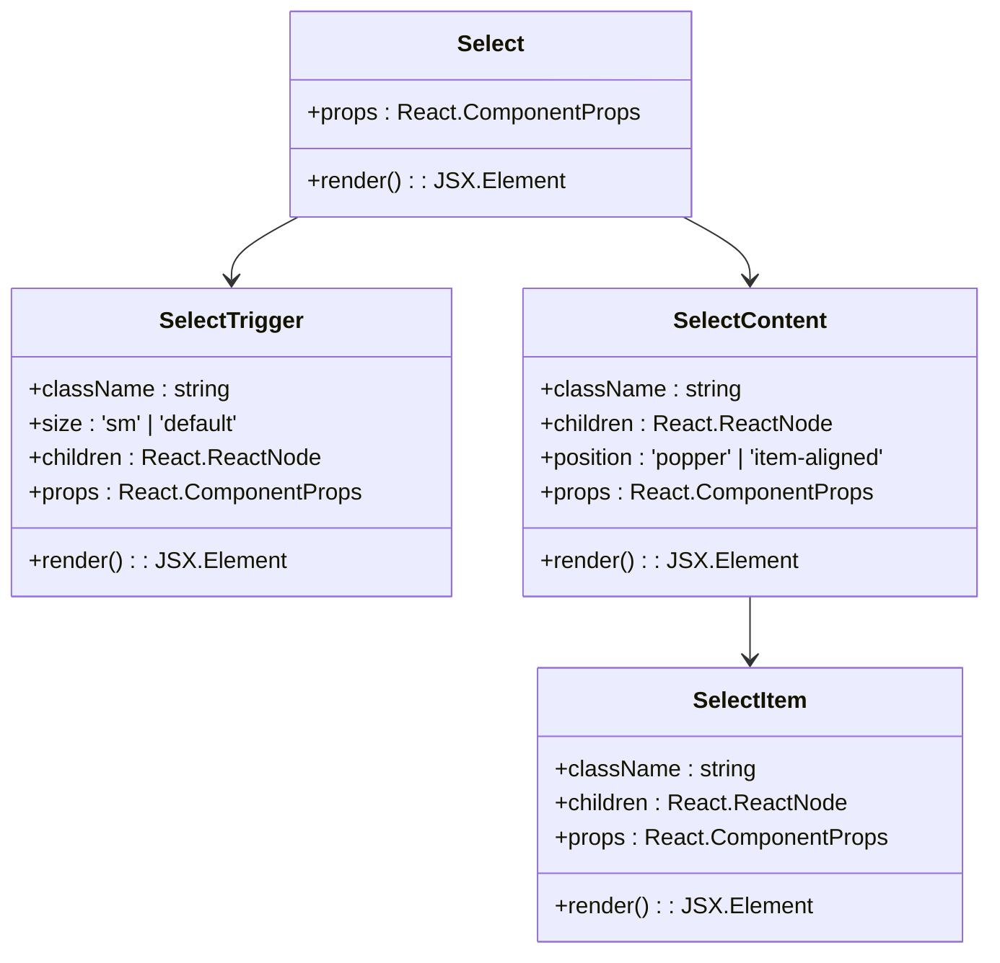

**Diagram sources**
- [select.tsx](file://components/ui/select.tsx#L9-L186)

### Checkbox Component
The Checkbox component provides a styled checkbox input with visual feedback for checked and indeterminate states.

**Props:**
- `className`: Additional CSS classes for customization
- All standard HTML checkbox attributes via React.ComponentProps

**Styling:**
- Custom checkmark icon displayed when checked
- Visual feedback for focus and error states
- Consistent size and appearance across browsers

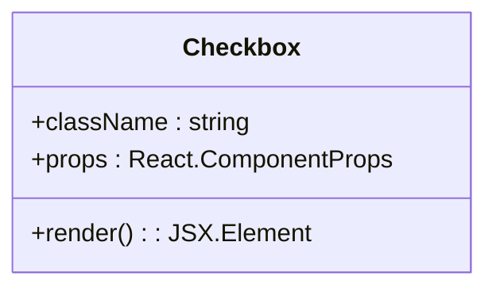

**Diagram sources**
- [checkbox.tsx](file://components/ui/checkbox.tsx#L9-L33)

### Switch Component
The Switch component implements a toggle switch control for boolean values.

**Props:**
- `className`: Additional CSS classes for customization
- All standard HTML switch attributes via React.ComponentProps

**Styling:**
- Visual indication of on/off states
- Smooth transition animation when toggling
- Focus ring for accessibility
- Disabled state with reduced opacity

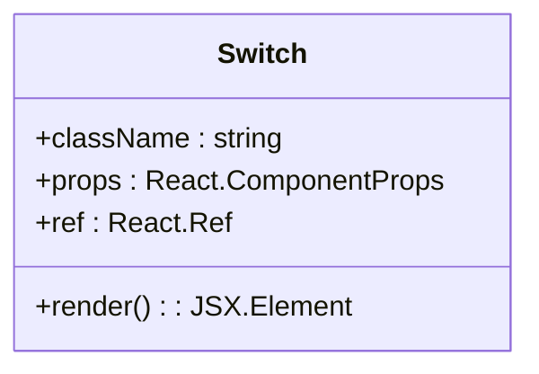

**Diagram sources**
- [switch.tsx](file://components/ui/switch.tsx#L8-L30)

**Section sources**
- [input.tsx](file://components/ui/input.tsx#L5-L22)
- [textarea.tsx](file://components/ui/textarea.tsx#L5-L19)
- [select.tsx](file://components/ui/select.tsx#L9-L186)
- [checkbox.tsx](file://components/ui/checkbox.tsx#L9-L33)
- [switch.tsx](file://components/ui/switch.tsx#L8-L30)

## Student Form Component

The StudentForm component is a complex composite form that collects comprehensive student information for the school management system. It is designed to handle creation, editing, and viewing modes with appropriate UI variations.

### Component Structure
The form is organized into collapsible sections that group related fields:
- Basic Information
- Contact & Address
- Parent/Guardian Information
- Academic Information
- DepEd Required Information
- Health & Special Needs

Each section can be expanded or collapsed to improve usability and reduce visual clutter.

### Props
The StudentForm component accepts the following props:
- `initialData`: Partial student profile data for editing existing records
- `onSubmit`: Callback function triggered on successful form submission
- `onCancel`: Optional callback for cancel button click
- `isLoading`: Boolean to control loading state of submit button
- `mode`: String indicating "create", "edit", or "view" mode

### State Management
The component manages its own state using React hooks:
- `formData`: Object containing all form field values
- `errors`: Object containing validation error messages for fields
- `isOpen` state for collapsible sections

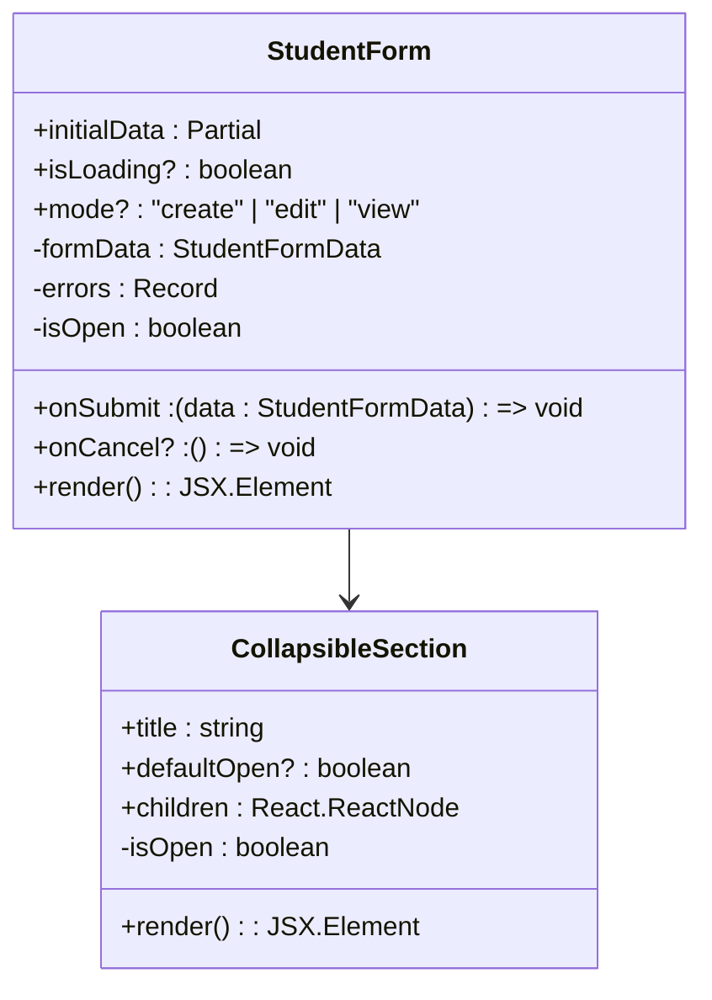

**Diagram sources**
- [student-form.tsx](file://components/student-form.tsx#L40-L65)

### Conditional Rendering
The form implements several conditional rendering patterns based on field values:
- Permanent address fields are hidden when "same as current" checkbox is checked
- Track and strand fields are only shown for Senior High School students (grades 11-12)
- Last school attended fields appear only for transferees and returning students
- 4Ps household ID and IP group fields are shown only when respective checkboxes are checked
- Disability details field appears only when a disability type is selected

### Dynamic Options
The form uses dynamic options from constants files:
- Philippine regions for address fields
- Grade levels and sections
- Enrollment status options
- SHS tracks and corresponding academic strands
- Disability types and blood types

**Section sources**
- [student-form.tsx](file://components/student-form.tsx#L68-L740)
- [deped-constants.ts](file://lib/deped-constants.ts#L16-L256)

## Form State Management

The form components use React's built-in state management rather than external libraries like React Hook Form. The StudentForm component manages its state using useState hooks for form data and validation errors.

### State Updates
Field updates are handled through a generic updateField function that uses TypeScript generics to ensure type safety:

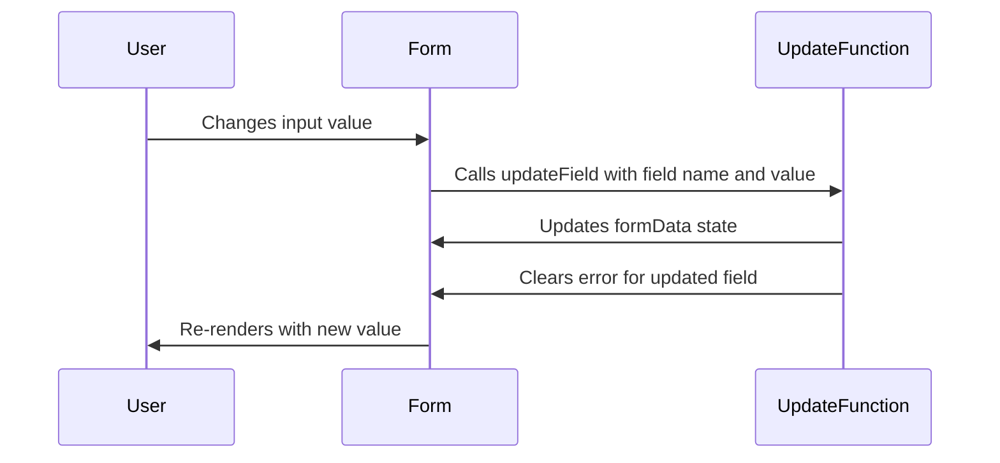

**Diagram sources**
- [student-form.tsx](file://components/student-form.tsx#L166-L179)

### Controlled Components
All form inputs are implemented as controlled components, meaning their values are controlled by React state rather than the DOM. This ensures a single source of truth for form data and enables real-time validation and processing.

### Effect Hooks
The component uses useEffect hooks to handle side effects:
- Reset track and strand when grade changes from Senior High to Junior High
- Reset strand when track changes to ensure data consistency

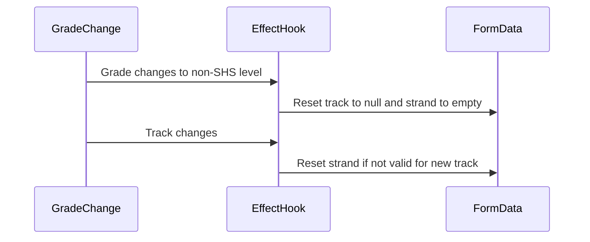

**Diagram sources**
- [student-form.tsx](file://components/student-form.tsx#L182-L193)

**Section sources**
- [student-form.tsx](file://components/student-form.tsx#L92-L193)

## Validation Patterns

The form implements a comprehensive validation system that includes both client-side validation and integration with Zod schemas for API endpoint validation.

### Client-Side Validation
The StudentForm component implements client-side validation in the validateForm function:

**Required Fields:**
- First name and last name are required
- LRN validation when provided (12 numeric digits)
- At least one parent/guardian contact number
- Email format validation when provided

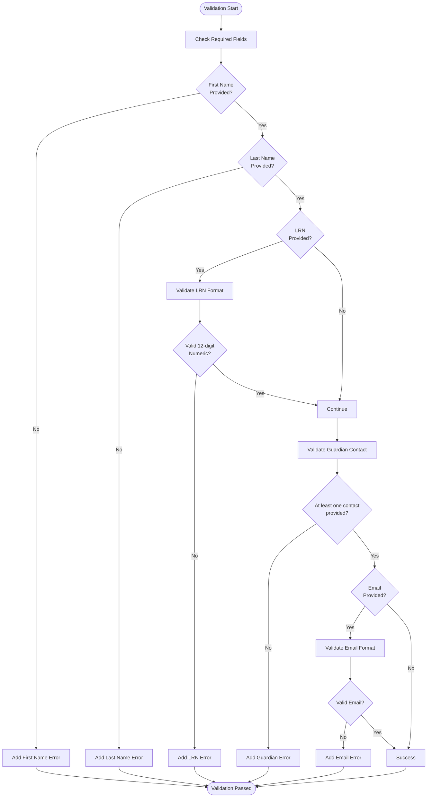

**Diagram sources**
- [student-form.tsx](file://components/student-form.tsx#L195-L234)

### Validation Utility Functions
The system includes dedicated validation utilities in student-validation.ts:

**LRN Validation:**
- Checks for exactly 12 numeric digits
- Provides specific error messages for different validation failures

**Guardian Contact Validation:**
- Ensures at least one contact method is provided (father, mother, or guardian)
- Validates that the contact field has content

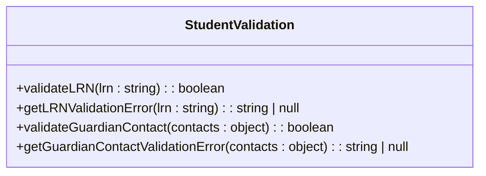

**Diagram sources**
- [student-validation.ts](file://lib/student-validation.ts#L15-L79)

### Zod Schema Integration
While the client-side form uses its own validation, the system also defines Zod schemas for API endpoint validation in validation-schemas.ts. These schemas ensure data integrity at the API level:

**Key Schemas:**
- createClassSchema: Validates class creation data
- createGradeSchema: Validates grade submission data
- saveAttendanceSchema: Validates attendance records
- updateSettingsSchema: Validates school settings updates

The Zod schemas provide an additional layer of security and data validation, preventing injection attacks and ensuring data integrity.

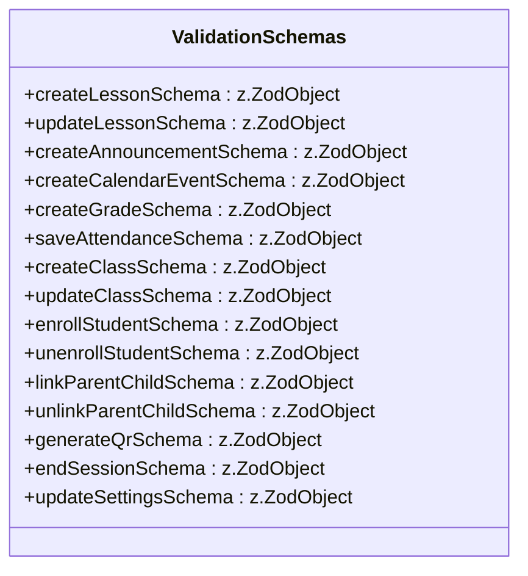

**Diagram sources**
- [validation-schemas.ts](file://lib/validation-schemas.ts#L8-L126)

**Section sources**
- [student-form.tsx](file://components/student-form.tsx#L195-L234)
- [student-validation.ts](file://lib/student-validation.ts#L15-L79)
- [validation-schemas.ts](file://lib/validation-schemas.ts#L8-L126)

## File Upload and Avatar Component

The system implements a secure file upload pattern for avatar images with client-side and server-side validation.

### Avatar Component
The Avatar component from Radix UI is used to display user images with fallback text when images are not available.

**Subcomponents:**
- `Avatar`: Container with rounded styling
- `AvatarImage`: Image element with aspect ratio preservation
- `AvatarFallback`: Text fallback with background color

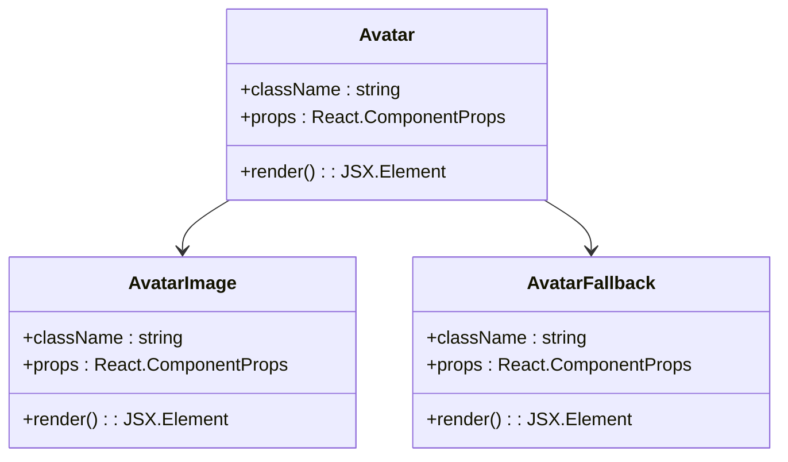

**Diagram sources**
- [avatar.tsx](file://components/ui/avatar.tsx#L8-L54)

### File Upload Process
The file upload process involves several steps to ensure security and data integrity:

**Client-Side Validation:**
- File type validation against allowed image types
- File size limit (5MB maximum)
- Magic bytes verification to confirm actual file type
- Object URL creation for preview

**Server-Side Validation:**
- Rate limiting to prevent abuse
- Authentication check
- File size validation
- Magic number validation for file type
- Secure filename generation
- Explicit content type setting
- Database update with new avatar URL

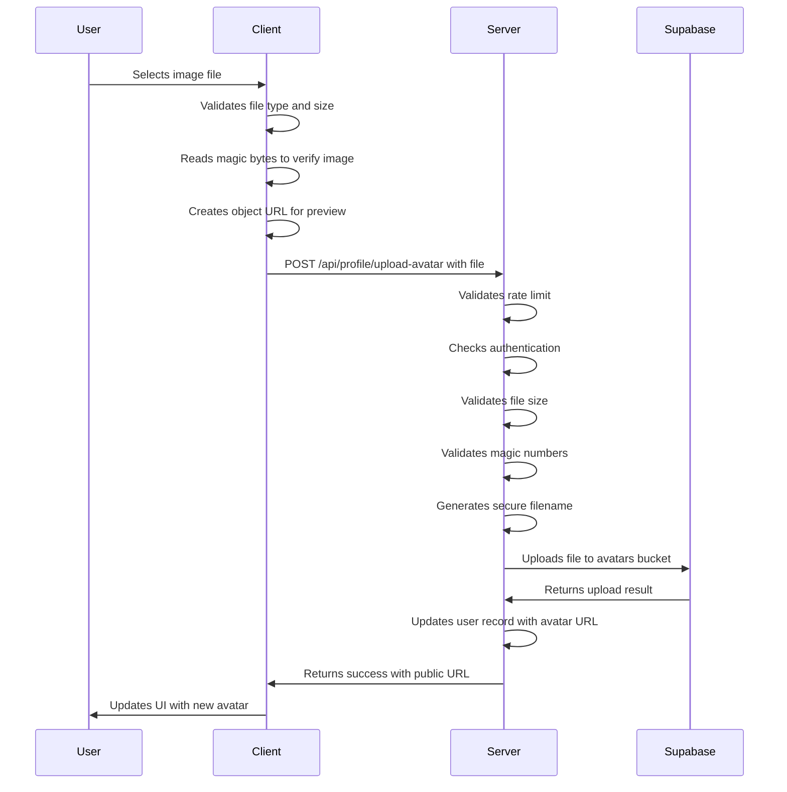

**Diagram sources**
- [profile-page.tsx](file://components/profile-page.tsx#L273-L333)
- [route.ts](file://app/api/profile/upload-avatar/route.ts#L1-L110)
- [storage.ts](file://lib/supabase/storage.ts#L1-L110)

### Security Measures
The file upload implementation includes multiple security measures:
- Client-side and server-side validation redundancy
- Magic bytes verification to prevent file type spoofing
- Rate limiting to prevent denial of service
- Secure filename generation with UUIDs to prevent path traversal
- Explicit content type setting to prevent MIME type sniffing attacks
- Size limits to prevent resource exhaustion

**Section sources**
- [avatar.tsx](file://components/ui/avatar.tsx#L8-L54)
- [profile-page.tsx](file://components/profile-page.tsx#L273-L333)
- [route.ts](file://app/api/profile/upload-avatar/route.ts#L1-L110)
- [storage.ts](file://lib/supabase/storage.ts#L33-L69)

## Accessibility and Responsive Design

The form components are designed with accessibility and responsive design principles in mind.

### Accessibility Features
- Proper labeling with Label component connected to form inputs
- Required field indicators with asterisks
- ARIA attributes for error states (aria-invalid)
- Keyboard navigation support through form controls
- Focus management with visible focus rings
- Semantic HTML structure for screen readers
- Color contrast that meets accessibility standards

### Responsive Layouts
The forms use a responsive grid system that adapts to different screen sizes:
- Single column layout on mobile devices
- Multi-column layout on tablets and desktops
- Appropriate spacing and sizing for touch targets
- Scrollable content areas for long forms

The StudentForm component specifically uses:
- Grid layouts with responsive column counts
- Flexible spacing that adjusts to screen size
- Appropriate font sizes for readability
- Touch-friendly button sizes

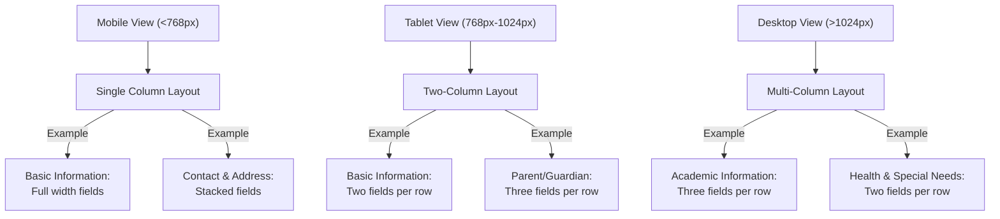

**Diagram sources**
- [student-form.tsx](file://components/student-form.tsx#L281-L738)

**Section sources**
- [student-form.tsx](file://components/student-form.tsx#L245-L276)
- [input.tsx](file://components/ui/input.tsx#L5-L22)
- [select.tsx](file://components/ui/select.tsx#L9-L186)

## Form Submission and Loading States

The form components implement proper handling of submission and loading states to provide feedback to users.

### Submission Handling
The StudentForm component handles form submission through the handleSubmit function:
- Prevents default form submission behavior
- Validates form data before submission
- Only calls onSubmit callback when validation passes
- Handles view mode appropriately (disables submission)

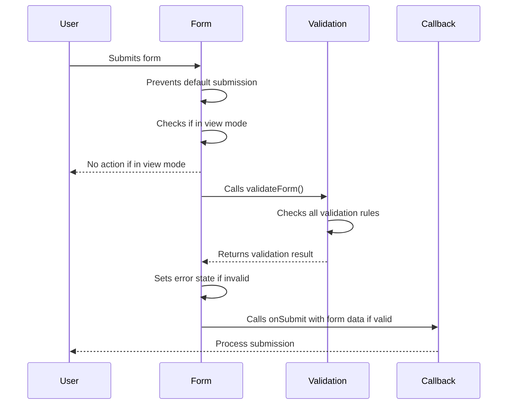

**Diagram sources**
- [student-form.tsx](file://components/student-form.tsx#L236-L243)

### Loading States
The component uses loading states to indicate processing:
- Submit button displays "Saving..." text when isLoading is true
- Button is disabled during loading to prevent multiple submissions
- Parent components control the loading state based on API call status
- Loading state is passed as a prop to allow external control

The implementation in the admin students page shows how loading states are managed:
- Setting saving state to true before API call
- Making API request to create or update student
- Handling success with toast notification and dialog closure
- Handling errors with appropriate messaging
- Setting saving state to false in finally block

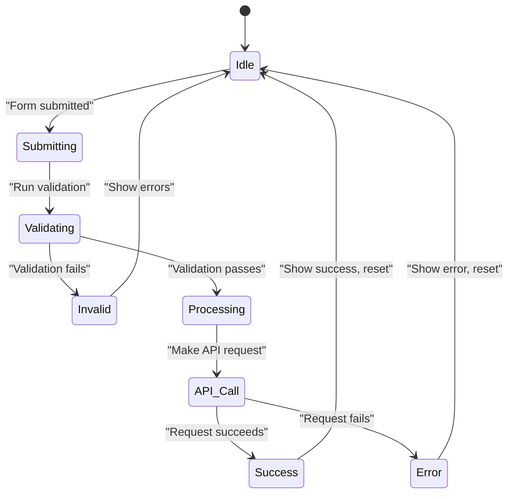

**Diagram sources**
- [student-form.tsx](file://components/student-form.tsx#L733-L735)
- [page.tsx](file://app/admin/students/page.tsx#L124-L148)

**Section sources**
- [student-form.tsx](file://components/student-form.tsx#L236-L243)
- [page.tsx](file://app/admin/students/page.tsx#L124-L148)

## Best Practices

### Form Design Principles
- Group related fields into logical sections
- Use progressive disclosure with collapsible sections
- Provide clear labels and placeholder text
- Indicate required fields visually
- Show validation errors near the relevant fields
- Use appropriate input types for better mobile experience
- Provide immediate feedback for user actions

### State Management
- Keep form state local to the component when possible
- Use controlled components for predictable state
- Validate early and often, but don't overwhelm users
- Clear validation errors when fields are updated
- Use TypeScript interfaces to define form data structure

### Validation Strategy
- Implement client-side validation for user experience
- Always validate on the server for security
- Use specific error messages that help users correct mistakes
- Don't rely solely on client-side validation
- Use established libraries like Zod for complex validation rules
- Validate data at API endpoints to prevent injection attacks

### Accessibility
- Ensure all interactive elements are keyboard accessible
- Use proper ARIA attributes for dynamic content
- Maintain sufficient color contrast
- Provide text alternatives for non-text content
- Test with screen readers and other assistive technologies
- Follow WCAG guidelines for web accessibility

### Performance
- Optimize re-renders with React.memo when appropriate
- Use debouncing for search and filter operations
- Minimize unnecessary state updates
- Load only necessary data for forms
- Implement loading states to manage user expectations
- Optimize image uploads with proper sizing and compression

### Security
- Validate and sanitize all user input
- Use parameterized queries to prevent SQL injection
- Implement proper authentication and authorization
- Rate limit sensitive operations
- Use secure file upload practices
- Protect against XSS and CSRF attacks
- Regularly update dependencies to address vulnerabilities

**Section sources**
- [student-form.tsx](file://components/student-form.tsx)
- [validation-schemas.ts](file://lib/validation-schemas.ts)
- [student-validation.ts](file://lib/student-validation.ts)
- [storage.ts](file://lib/supabase/storage.ts)
- [route.ts](file://app/api/profile/upload-avatar/route.ts)