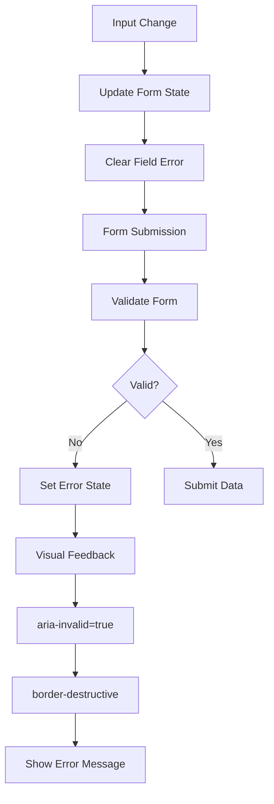

# Input Components

<cite>
**Referenced Files in This Document**   
- [input.tsx](file://components/ui/input.tsx)
- [textarea.tsx](file://components/ui/textarea.tsx)
- [label.tsx](file://components/ui/label.tsx)
- [utils.ts](file://lib/utils.ts)
- [globals.css](file://app/globals.css)
- [student-form.tsx](file://components/student-form.tsx)
- [student-validation.ts](file://lib/student-validation.ts)
- [deped-constants.ts](file://lib/deped-constants.ts)
</cite>

## Table of Contents
1. [Introduction](#introduction)
2. [Core Input Components](#core-input-components)
3. [Label Component](#label-component)
4. [Styling and Tailwind CSS Patterns](#styling-and-tailwind-css-patterns)
5. [Accessibility Integration](#accessibility-integration)
6. [Form Context Usage](#form-context-usage)
7. [Controlled Component Patterns](#controlled-component-patterns)
8. [Error State Visualization](#error-state-visualization)
9. [Validation Feedback and Best Practices](#validation-feedback-and-best-practices)
10. [Responsive Behavior](#responsive-behavior)

## Introduction
This document provides comprehensive documentation for the basic text input components in the School Management System, including Input, Textarea, and Label components. These components are built using the shadcn/ui pattern with Tailwind CSS and are designed to meet accessibility standards while providing a consistent user experience across the application. The documentation covers component props, styling patterns, accessibility features, form integration, and best practices for validation and error handling.

## Core Input Components

The Input and Textarea components are foundational form elements that provide consistent styling and behavior across the application. They are built with accessibility and usability in mind, following the shadcn/ui design system patterns.

### Input Component
The Input component is a styled wrapper around the native HTML input element that provides consistent styling, accessibility features, and error states. It accepts all standard HTML input props through React.ComponentProps<'input'>.

Key features:
- Supports all standard input types (text, email, password, tel, date, etc.)
- Built-in focus states with ring visualization
- Disabled state with appropriate styling
- File input styling with consistent appearance
- Responsive design with md:text-sm for larger screens

The component uses the cn utility function to merge Tailwind CSS classes, allowing for easy customization while maintaining the base styling.

### Textarea Component
The Textarea component is a styled wrapper around the native HTML textarea element, designed for multi-line text input. It shares many styling patterns with the Input component but is optimized for longer text content.

Key features:
- Minimum height of 16 units to ensure adequate writing space
- Flexible width with field-sizing-content behavior
- Consistent padding and border styling with the Input component
- Support for dynamic height adjustment based on content
- Proper handling of disabled states and cursor behavior

Both components use data-slot attributes for styling purposes and maintain consistent visual language with other form elements in the system.

**Section sources**
- [input.tsx](file://components/ui/input.tsx#L5-L21)
- [textarea.tsx](file://components/ui/textarea.tsx#L5-L18)

## Label Component

The Label component is implemented using Radix UI's LabelPrimitive, providing enhanced accessibility features and proper label-element relationships. It ensures that clicking the label focuses the associated input element and provides proper screen reader support.

Key features:
- Uses Radix UI's LabelPrimitive.Root for proper accessibility
- Flex layout with gap-2 for consistent spacing between label text and optional icons
- Text styling with text-sm and font-medium for proper hierarchy
- Disabled state handling through group-data-[disabled=true] and peer-disabled selectors
- Proper pointer events management in disabled states

The component is designed to work seamlessly with form inputs by using the htmlFor prop to establish the label-input relationship, which is critical for accessibility.

**Section sources**
- [label.tsx](file://components/ui/label.tsx#L8-L24)

## Styling and Tailwind CSS Patterns

The input components follow a consistent styling pattern using Tailwind CSS utility classes, with additional customization through the cn utility function that combines clsx and tailwind-merge.

### Base Styling
The components use a comprehensive set of Tailwind classes to achieve the desired visual appearance:
- Border styling with border-input color variable
- Background transparency with bg-transparent
- Rounded corners with rounded-md
- Shadow effects with shadow-xs for subtle depth
- Proper padding with px-3 py-1 (Input) and px-3 py-2 (Textarea)
- Height specification with h-9 for consistent input sizing

### Focus States
Focus states are carefully designed to provide clear visual feedback:
- Border color change to focus-visible:border-ring
- Ring visualization with focus-visible:ring-ring/50
- Ring size of 3px with focus-visible:ring-[3px]
- Smooth transitions for both color and box-shadow properties

### Dark Mode Support
The components include specific styling for dark mode:
- Semi-transparent background with dark:bg-input/30
- Adjusted destructive ring opacity with dark:aria-invalid:ring-destructive/40
- Proper contrast for text and border elements in dark themes

### Disabled States
Disabled states are handled with appropriate visual feedback:
- Reduced opacity with disabled:opacity-50
- Cursor indication with disabled:cursor-not-allowed
- Pointer events disabled with disabled:pointer-events-none

**Section sources**
- [input.tsx](file://components/ui/input.tsx#L11-L14)
- [textarea.tsx](file://components/ui/textarea.tsx#L10-L12)
- [globals.css](file://app/globals.css#L6-L80)

## Accessibility Integration

The input components are designed with accessibility as a core requirement, following WCAG guidelines and best practices for form controls.

### ARIA Attributes
The components properly implement ARIA attributes for accessibility:
- aria-invalid attribute for error states, which triggers visual feedback
- Proper labeling through htmlFor/id relationships between Label and input elements
- Disabled state announced through appropriate ARIA properties

The implementation uses the aria-invalid attribute to indicate invalid input states, which is visually represented by the border-destructive class and ring visualization.

### Keyboard Navigation
The components support standard keyboard navigation:
- Tab navigation between form elements
- Proper focus management with outline-none and focus-visible classes
- Accessible focus indicators that meet contrast requirements

### Screen Reader Support
The components provide proper semantic structure for screen readers:
- Label elements properly associated with their inputs
- Form fields announced with their labels and states
- Error states communicated through associated error messages

The use of Radix UI's LabelPrimitive ensures that the label-element relationship is properly established and communicated to assistive technologies.

**Section sources**
- [input.tsx](file://components/ui/input.tsx#L13)
- [textarea.tsx](file://components/ui/textarea.tsx#L10)
- [label.tsx](file://components/ui/label.tsx#L16-L18)

## Form Context Usage

The input components are designed to work within form contexts, as demonstrated in the StudentForm component. They follow patterns for proper form layout, validation, and submission handling.

### Form Structure
Forms in the application follow a consistent structure:
- Wrapped in a form element with proper onSubmit handler
- Organized into logical sections using collapsible components
- Spaced with space-y-4 for consistent vertical rhythm
- Grouped related fields with appropriate headings

### Label-Input Relationships
The components maintain proper label-input relationships:
- Each input has a corresponding Label component
- Labels use htmlFor to reference the input's id
- Required fields are indicated with a visual asterisk
- Error messages are placed immediately after the input

### Layout Patterns
The forms use responsive grid layouts:
- Single column on mobile with grid-cols-1
- Multi-column layouts on larger screens with md:grid-cols-2 and md:grid-cols-3
- Consistent gap spacing with gap-4 for horizontal and gap-2 for vertical
- Proper grouping of related fields

**Section sources**
- [student-form.tsx](file://components/student-form.tsx#L279-L301)
- [student-form.tsx](file://components/student-form.tsx#L258-L274)

## Controlled Component Patterns

The input components are used as controlled components, with their values managed by React state rather than internal DOM state.

### State Management
The StudentForm component demonstrates the controlled component pattern:
- Form data is stored in a single state object using useState
- Each input's value is derived from the corresponding field in the state
- onChange handlers update the state using the updateField function
- The updateField function also clears validation errors when a field is modified

### Update Pattern
The updateField function implements a generic pattern for updating form fields:
- Uses generic typing to ensure type safety
- Updates the specific field while preserving other fields with spread syntax
- Clears validation errors for the updated field
- Provides a clean API for input handlers

This pattern ensures that the form state is always consistent and that validation feedback is responsive to user input.

**Section sources**
- [student-form.tsx](file://components/student-form.tsx#L166-L179)
- [student-form.tsx](file://components/student-form.tsx#L266-L268)

## Error State Visualization

The input components provide visual feedback for error states through a combination of styling and accessibility features.

### Visual Indicators
Error states are visualized through:
- Border color change to border-destructive
- Background ring with aria-invalid:ring-destructive/20
- Dark mode adjustment with dark:aria-invalid:ring-destructive/40
- Error message display below the input

The styling uses Tailwind's arbitrary value syntax with /20 and /40 to control the opacity of the ring effect, providing a subtle but clear visual indication of errors.

### Implementation Pattern
The StudentForm component shows the complete error handling pattern:
- Validation errors are stored in a separate state object
- The aria-invalid attribute is set based on the presence of errors
- The border-destructive class is conditionally applied
- Error messages are displayed in a dedicated paragraph element

This approach separates the visual presentation of errors from the underlying validation logic, making it easier to maintain and extend.

**Diagram sources**
- [input.tsx](file://components/ui/input.tsx#L13)
- [student-form.tsx](file://components/student-form.tsx#L158-L234)

**Section sources**
- [input.tsx](file://components/ui/input.tsx#L13)
- [student-form.tsx](file://components/student-form.tsx#L158-L234)

## Validation Feedback and Best Practices

The application implements a comprehensive validation strategy that combines client-side validation with user-friendly feedback.

### Validation Strategy
The validation approach includes:
- Immediate feedback when validation rules are violated
- Clear error messages that explain what is wrong
- Visual indicators that draw attention to problematic fields
- Error clearing when users correct their input

### Client-Side Validation
The student-validation.ts file contains validation utilities:
- validateLRN and getLRNValidationError for Learner Reference Number validation
- validateGuardianContact and getGuardianContactValidationError for contact information
- Regular expression patterns for format validation
- Comprehensive error messages for user guidance

These validation functions are designed to be reusable across different forms and components.

### User Experience Considerations
The validation implementation follows best practices:
- Errors are displayed close to the relevant input
- Error messages are specific and actionable
- Visual feedback is consistent across the application
- Users can easily identify and correct errors

The pattern of clearing errors when a field is modified improves the user experience by providing immediate feedback when issues are resolved.

**Section sources**
- [student-validation.ts](file://lib/student-validation.ts#L1-L79)
- [student-form.tsx](file://components/student-form.tsx#L236-L243)

## Responsive Behavior

The input components are designed to be responsive and adapt to different screen sizes.

### Mobile-First Design
The components follow a mobile-first approach:
- Full width on mobile with w-full
- Responsive text sizing with md:text-sm
- Appropriate touch targets with proper spacing
- Vertical layout on small screens

### Responsive Layouts
The forms use responsive grid systems:
- Single column layout on mobile
- Multi-column layouts on larger screens
- Consistent spacing across breakpoints
- Proper alignment of labels and inputs

### Adaptive Styling
The components adapt to different contexts:
- Font size adjusts based on screen size
- Padding and height remain consistent for usability
- Focus states are visible on all devices
- Touch targets meet minimum size requirements

The responsive design ensures that forms are usable and accessible across a wide range of devices, from mobile phones to large desktop monitors.

**Section sources**
- [input.tsx](file://components/ui/input.tsx#L11)
- [textarea.tsx](file://components/ui/textarea.tsx#L10)
- [student-form.tsx](file://components/student-form.tsx#L287-L290)