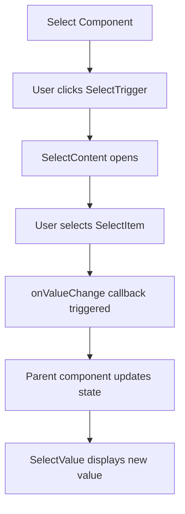
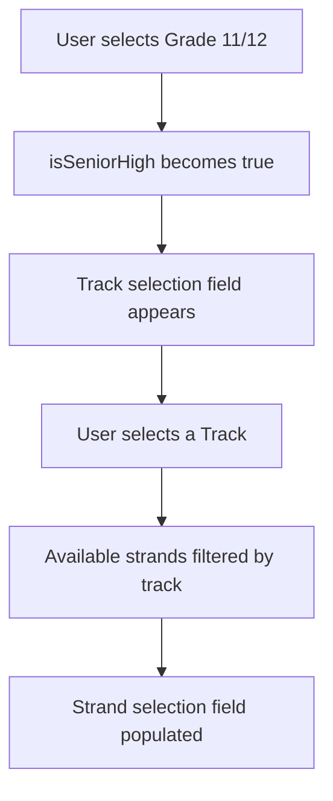
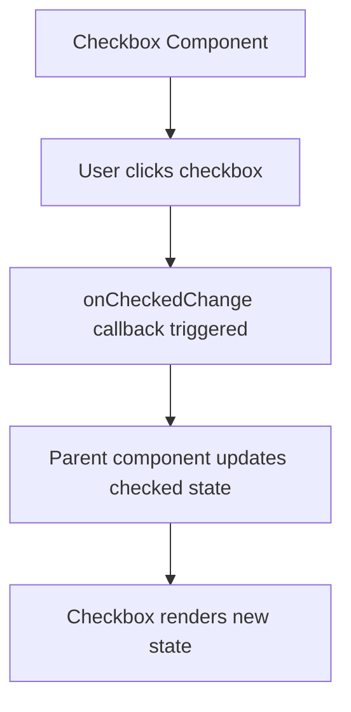
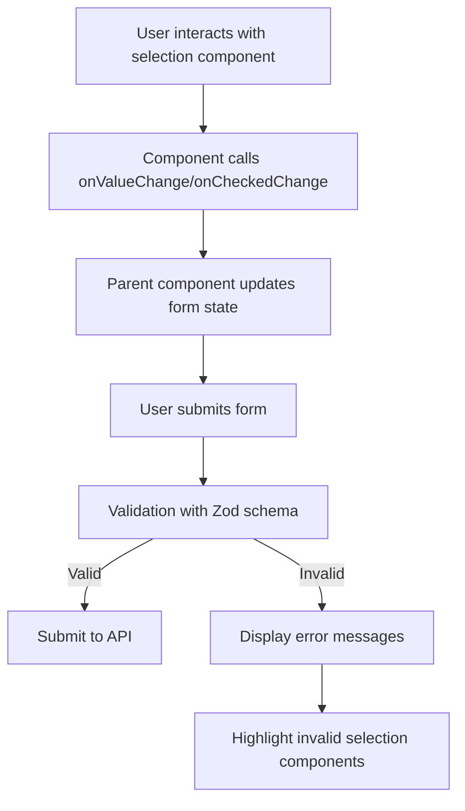

# Selection Components

<cite>
**Referenced Files in This Document**   
- [select.tsx](file://components/ui/select.tsx)
- [checkbox.tsx](file://components/ui/checkbox.tsx)
- [switch.tsx](file://components/ui/switch.tsx)
- [validation-schemas.ts](file://lib/validation-schemas.ts)
- [student-form.tsx](file://components/student-form.tsx)
- [classes/page.tsx](file://app/admin/classes/page.tsx)
- [qr-attendance/page.tsx](file://app/teacher/qr-attendance/page.tsx)
- [teacher-assignment-manager.tsx](file://components/teacher-assignment-manager.tsx)
</cite>

## Table of Contents
1. [Introduction](#introduction)
2. [Select Component](#select-component)
3. [Checkbox Component](#checkbox-component)
4. [Switch Component](#switch-component)
5. [Form Integration and Validation](#form-integration-and-validation)
6. [Accessibility and Styling](#accessibility-and-styling)
7. [Common Issues and Performance](#common-issues-and-performance)
8. [Conclusion](#conclusion)

## Introduction
This document provides comprehensive documentation for the selection components used in the School Management System: Select, Checkbox, and Switch. These components are built using Radix UI primitives and are designed to provide accessible, consistent, and reusable selection interfaces across the application. The documentation covers component composition, usage patterns, integration with form state management, validation, and accessibility considerations.

**Section sources**
- [select.tsx](file://components/ui/select.tsx)
- [checkbox.tsx](file://components/ui/checkbox.tsx)
- [switch.tsx](file://components/ui/switch.tsx)

## Select Component

The Select component is a controlled dropdown menu that allows users to select one option from a list. It is composed of several subcomponents that work together to create a complete selection interface.

### Component Composition
The Select component consists of the following parts:
- **Select**: The root component that manages the open/closed state of the dropdown
- **SelectTrigger**: The button that displays the selected value and opens the dropdown
- **SelectValue**: Displays the currently selected value within the trigger
- **SelectContent**: The container for the dropdown options that appears when the trigger is clicked
- **SelectItem**: Individual selectable options within the content area
- **SelectGroup**: Groups related items together with a label
- **SelectLabel**: Displays a label for a group of items
- **SelectSeparator**: Visual divider between groups or sections
- **SelectScrollUpButton/SelectScrollDownButton**: Navigation buttons for scrolling through long lists

### Value Binding and Event Handling
The Select component uses the `value` prop to control its state and the `onValueChange` callback to handle selection changes. When a user selects an item, the `onValueChange` callback is triggered with the selected value as an argument.



**Diagram sources**
- [select.tsx](file://components/ui/select.tsx#L9-L185)
- [student-form.tsx](file://components/student-form.tsx#L313-L325)

### Grouping Options and Conditional Rendering
The Select component supports grouping options using SelectGroup and SelectLabel. Conditional rendering can be implemented based on the current selection, as demonstrated in the student form where track selection determines available strands.



**Diagram sources**
- [student-form.tsx](file://components/student-form.tsx#L160-L193)
- [classes/page.tsx](file://app/admin/classes/page.tsx#L84-L98)

**Section sources**
- [select.tsx](file://components/ui/select.tsx)
- [student-form.tsx](file://components/student-form.tsx)

## Checkbox Component

The Checkbox component provides a binary selection control that can be in one of three states: checked, unchecked, or indeterminate.

### State Management
The Checkbox component uses the `checked` prop to control its state and the `onCheckedChange` callback to handle state changes. The component supports both controlled and uncontrolled usage patterns.

### Indeterminate State
The indeterminate state is visually represented but cannot be achieved through direct user interaction. It must be set programmatically and is typically used in hierarchical selection interfaces where a parent checkbox represents the state of multiple child checkboxes.

### Usage Patterns
The Checkbox component is commonly used for:
- Boolean preferences (e.g., "Require Location")
- Agreement to terms and conditions
- Toggling optional features
- Filtering and selection in lists



**Diagram sources**
- [checkbox.tsx](file://components/ui/checkbox.tsx#L9-L32)
- [student-form.tsx](file://components/student-form.tsx#L370-L381)

**Section sources**
- [checkbox.tsx](file://components/ui/checkbox.tsx)
- [student-form.tsx](file://components/student-form.tsx)

## Switch Component

The Switch component provides a toggle control for binary options, typically used for enabling/disabling features or settings.

### Toggle Behavior
The Switch component functions as a boolean toggle with distinct visual states for "on" and "off" positions. It uses the `checked` prop to control its state and the `onCheckedChange` callback to handle state changes.

### Visual States
The Switch has two primary visual states:
- **Checked (on)**: The thumb is positioned on the right side, and the background color indicates the active state
- **Unchecked (off)**: The thumb is positioned on the left side, and the background color indicates the inactive state

The component provides smooth transitions between states with appropriate visual feedback.

```mermaid
flowchart TD
A[Switch Component] --> B[User clicks switch]
B --> C{Current State}
C --> |Unchecked| D[Transition to checked state]
C --> |Checked| E[Transition to unchecked state]
D --> F[onCheckedChange(true)]
E --> G[onCheckedChange(false)]
F --> H[Parent updates state]
G --> H
```

**Diagram sources**
- [switch.tsx](file://components/ui/switch.tsx#L8-L29)
- [qr-attendance/page.tsx](file://app/teacher/qr-attendance/page.tsx#L499-L500)

**Section sources**
- [switch.tsx](file://components/ui/switch.tsx)
- [qr-attendance/page.tsx](file://app/teacher/qr-attendance/page.tsx)

## Form Integration and Validation

### Form State Management
Selection components are integrated with form state management through controlled component patterns. The parent component maintains the form state and passes values to the selection components via props.

In the student form example, a single `formData` state object manages all form fields, with individual selection components updating specific properties through their respective change handlers.

### Validation with Zod Schemas
Form validation is implemented using Zod schemas defined in `lib/validation-schemas.ts`. The selection components themselves do not perform validation, but their values are validated when the form is submitted.

Key validation schemas relevant to selection components include:
- `enrollStudentSchema`: Validates student enrollment with required selection fields
- `createClassSchema`: Validates class creation with subject and grade selections
- `createAnnouncementSchema`: Validates announcement creation with target audience and priority selections



**Diagram sources**
- [validation-schemas.ts](file://lib/validation-schemas.ts#L8-L126)
- [student-form.tsx](file://components/student-form.tsx#L195-L234)

**Section sources**
- [validation-schemas.ts](file://lib/validation-schemas.ts)
- [student-form.tsx](file://components/student-form.tsx)

## Accessibility and Styling

### Accessibility Attributes
All selection components include appropriate accessibility attributes:
- **ARIA labels**: Provided through associated Label components
- **Keyboard navigation**: Full keyboard support for all selection components
- **Focus management**: Proper focus handling during interaction
- **Screen reader support**: Semantic HTML and ARIA attributes for assistive technologies

The components use data attributes (e.g., `data-slot`, `data-state`) to manage visual states without affecting accessibility.

### Styling Customization
Styling is implemented using Tailwind CSS with the `cn` utility function for class composition. The components support customization through:
- **className prop**: Allows additional classes to be passed
- **Size variants**: Select component supports 'sm' and 'default' sizes
- **Theme support**: Dark mode styles are included in the base styling
- **State-based styling**: Different styles for focus, hover, disabled, and invalid states

The styling approach ensures consistency across the application while allowing for necessary customization.

**Section sources**
- [select.tsx](file://components/ui/select.tsx)
- [checkbox.tsx](file://components/ui/checkbox.tsx)
- [switch.tsx](file://components/ui/switch.tsx)
- [utils.ts](file://lib/utils.ts)

## Common Issues and Performance

### Uncontrolled-to-Controlled Transitions
A common issue occurs when transitioning a selection component from uncontrolled to controlled state. To avoid this:
- Initialize the component with a proper value (not undefined)
- Ensure the value prop is consistently provided after initial render
- Use useState with an initial value that matches the default selection

### Performance for Large Option Lists
For Select components with large option lists:
- Implement virtualization for very long lists
- Use search/filter functionality to reduce visible options
- Consider pagination or infinite scrolling for extremely large datasets
- Optimize rendering with React.memo for static option lists

The Select component includes built-in scroll buttons (SelectScrollUpButton and SelectScrollDownButton) to aid navigation in long lists.

### Best Practices
- Always pair selection components with descriptive labels
- Provide clear visual feedback for all states
- Ensure sufficient touch target size (minimum 44px)
- Test thoroughly in both light and dark modes
- Validate selections on form submission, not just on change
- Handle edge cases like empty option lists gracefully

**Section sources**
- [select.tsx](file://components/ui/select.tsx)
- [student-form.tsx](file://components/student-form.tsx)
- [classes/page.tsx](file://app/admin/classes/page.tsx)

## Conclusion
The selection components (Select, Checkbox, and Switch) in the School Management System provide robust, accessible, and consistent interfaces for user input. Built on Radix UI primitives, these components offer excellent accessibility features while maintaining flexibility for customization. When integrating these components into forms, follow the controlled component pattern with proper state management and validation using Zod schemas. Pay attention to accessibility requirements and performance considerations, especially when dealing with large option lists. The documented patterns and examples provide a solid foundation for implementing selection interfaces throughout the application.