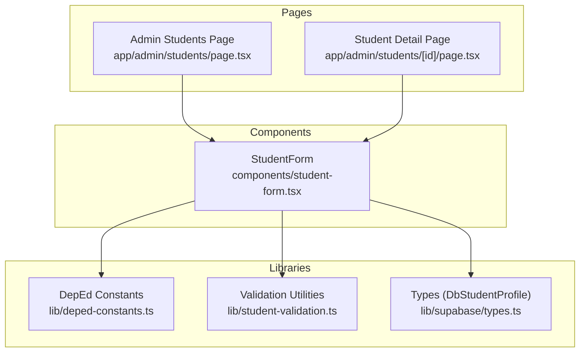
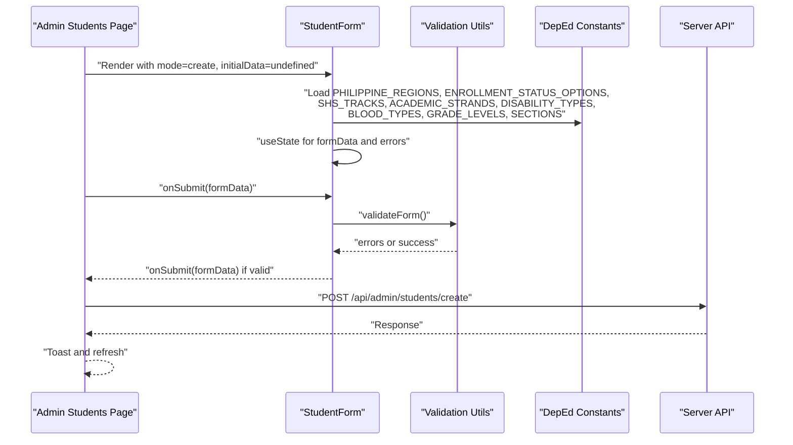
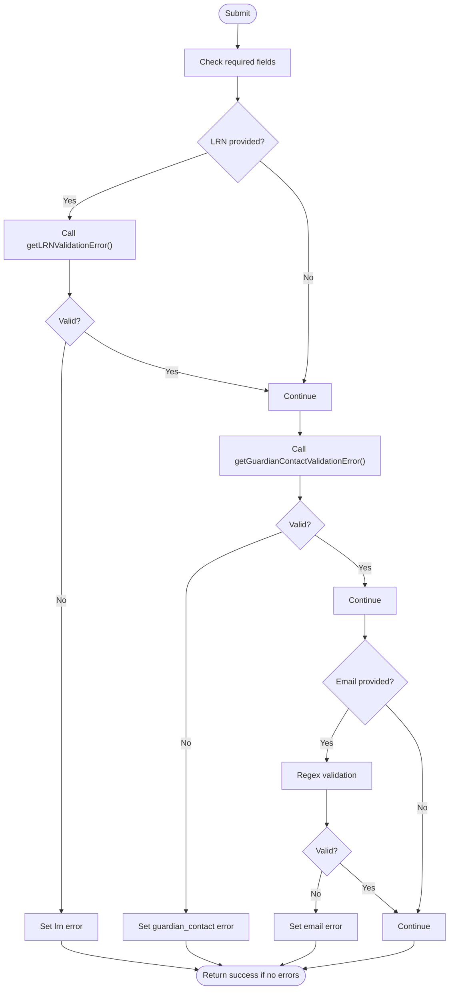
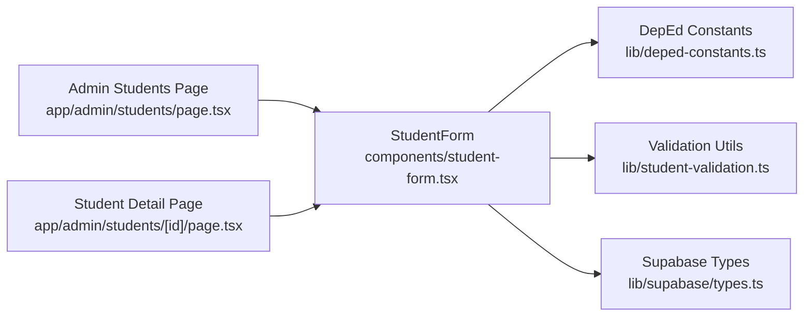

# Student Form Component

<cite>
**Referenced Files in This Document**
- [student-form.tsx](file://components/student-form.tsx)
- [deped-constants.ts](file://lib/deped-constants.ts)
- [student-validation.ts](file://lib/student-validation.ts)
- [types.ts](file://lib/types.ts)
- [types.ts](file://lib/supabase/types.ts)
- [page.tsx](file://app/admin/students/page.tsx)
- [page.tsx](file://app/admin/students/[id]/page.tsx)
</cite>

## Table of Contents
1. [Introduction](#introduction)
2. [Project Structure](#project-structure)
3. [Core Components](#core-components)
4. [Architecture Overview](#architecture-overview)
5. [Detailed Component Analysis](#detailed-component-analysis)
6. [Dependency Analysis](#dependency-analysis)
7. [Performance Considerations](#performance-considerations)
8. [Troubleshooting Guide](#troubleshooting-guide)
9. [Conclusion](#conclusion)

## Introduction
This document provides comprehensive technical and practical documentation for the StudentForm component, a complex composite form used to create and edit student profiles. It explains the component’s structure with collapsible sections, controlled component patterns, state management, validation logic, integration with DepEd constants, conditional rendering, accessibility attributes, responsive layout, and usage patterns for onSubmit, onCancel, and isLoading props. It also covers view mode functionality and disabled interactions.

## Project Structure
The StudentForm component resides under components and integrates with shared libraries for DepEd constants and validation utilities. Parent pages demonstrate usage patterns for create and edit modes.

**Diagram sources**
- [student-form.tsx](file://components/student-form.tsx#L1-L741)
- [deped-constants.ts](file://lib/deped-constants.ts#L1-L256)
- [student-validation.ts](file://lib/student-validation.ts#L1-L79)
- [types.ts](file://lib/supabase/types.ts#L1-L105)
- [page.tsx](file://app/admin/students/page.tsx#L1-L325)
- [page.tsx](file://app/admin/students/[id]/page.tsx#L1-L939)

**Section sources**
- [student-form.tsx](file://components/student-form.tsx#L1-L741)
- [deped-constants.ts](file://lib/deped-constants.ts#L1-L256)
- [student-validation.ts](file://lib/student-validation.ts#L1-L79)
- [types.ts](file://lib/supabase/types.ts#L1-L105)
- [page.tsx](file://app/admin/students/page.tsx#L1-L325)
- [page.tsx](file://app/admin/students/[id]/page.tsx#L1-L939)

## Core Components
- StudentForm: A composite form with collapsible sections covering Basic Information, Contact & Address, Parent/Guardian, Academic, DepEd Required, and Health & Special Needs. It manages its own state, validates inputs, and emits submission events.
- CollapsibleSection: A reusable wrapper that toggles visibility of grouped form controls.
- Validation utilities: Centralized validation functions for LRN and guardian contact requirements.
- DepEd constants: Shared options for regions, enrollment statuses, tracks, strands, disabilities, blood types, grade levels, and sections.

Key responsibilities:
- Controlled components: All inputs are controlled via useState, enabling real-time validation and error clearing upon field updates.
- Conditional rendering: Based on grade level (Senior High vs. Junior High) and track selection, sections and fields adapt dynamically.
- Accessibility: Uses labels, aria-invalid, and disabled states to improve usability.
- Responsive layout: Tailwind CSS grid and responsive breakpoints ensure forms adapt to various screen sizes.

**Section sources**
- [student-form.tsx](file://components/student-form.tsx#L40-L66)
- [student-form.tsx](file://components/student-form.tsx#L160-L194)
- [student-form.tsx](file://components/student-form.tsx#L195-L234)
- [student-validation.ts](file://lib/student-validation.ts#L1-L79)
- [deped-constants.ts](file://lib/deped-constants.ts#L1-L256)

## Architecture Overview
The form integrates with external libraries and is consumed by admin pages. The following sequence illustrates submission flow in create mode.

**Diagram sources**
- [student-form.tsx](file://components/student-form.tsx#L195-L243)
- [student-validation.ts](file://lib/student-validation.ts#L1-L79)
- [deped-constants.ts](file://lib/deped-constants.ts#L1-L256)
- [page.tsx](file://app/admin/students/page.tsx#L124-L148)

## Detailed Component Analysis

### Component Structure and Sections
StudentForm organizes fields into six collapsible sections:
- Basic Information: LRN, names, birthdate, sex, birthplace.
- Contact & Address: Current and permanent addresses, region selectors, contact info.
- Parent/Guardian: Father, mother, and guardian details.
- Academic Information: Grade, section, school year, enrollment status, last school info, track and strand for Senior High.
- DepEd Required Information: PSA birth certificate number, 4Ps beneficiary, IP status, mother tongue, religion.
- Health & Special Needs: Disability type and details, emergency contact, blood type, medical conditions.

Each section uses a consistent pattern: controlled inputs, labels, optional placeholders, and Tailwind-based responsive grids.

**Section sources**
- [student-form.tsx](file://components/student-form.tsx#L281-L740)
- [deped-constants.ts](file://lib/deped-constants.ts#L1-L256)

### Controlled Components and State Management
- State initialization: The component initializes a comprehensive StudentFormData object from initialData or defaults.
- Field updates: A generic updateField helper updates a single field and clears associated error.
- Error state: A record keyed by field name stores validation errors; cleared on field change.
- View mode: When mode is "view", all inputs are disabled and actions are hidden.

Implementation highlights:
- Controlled inputs: Inputs receive value and onChange handlers; disabled in view mode.
- Error display: Each input shows an error message when present and applies destructive styling.
- Accessibility: Labels are associated with inputs; aria-invalid reflects validation state.

**Section sources**
- [student-form.tsx](file://components/student-form.tsx#L92-L156)
- [student-form.tsx](file://components/student-form.tsx#L166-L179)
- [student-form.tsx](file://components/student-form.tsx#L236-L243)
- [student-form.tsx](file://components/student-form.tsx#L245-L276)

### Validation Logic
StudentForm performs client-side validation before submission:
- Required fields: First name and last name are required.
- LRN validation: Uses getLRNValidationError to enforce exact 12-digit numeric format.
- Guardian contact validation: Uses getGuardianContactValidationError to ensure at least one parent/guardian contact is provided.
- Email validation: Basic regex-based validation when an email is provided.

Validation runs on submit and clears per-field errors when the user edits a field.

**Diagram sources**
- [student-form.tsx](file://components/student-form.tsx#L195-L234)
- [student-validation.ts](file://lib/student-validation.ts#L1-L79)

**Section sources**
- [student-form.tsx](file://components/student-form.tsx#L195-L234)
- [student-validation.ts](file://lib/student-validation.ts#L1-L79)

### Integration with DepEd Constants
StudentForm imports and uses DepEd constants for:
- Regions: Populates region dropdowns for current and permanent addresses.
- Enrollment status: Dropdown options for enrollment status.
- Tracks and strands: Senior High tracks and academic strands; strand options depend on selected track.
- Disability types and blood types: Dropdowns for health-related fields.
- Grade levels and sections: Defaults and options for grade and section.

Conditional rendering:
- Senior High detection: When grade is "11" or "12", track and strand fields become visible and enabled.
- Strand reset: When track changes, strand resets to empty if not in available strands.
- Grade change: When leaving Senior High, track and strand are reset.

**Section sources**
- [student-form.tsx](file://components/student-form.tsx#L160-L194)
- [deped-constants.ts](file://lib/deped-constants.ts#L1-L256)

### Props and Usage Patterns
- initialData: Partial DbStudentProfile used to prefill the form.
- onSubmit: Callback invoked with StudentFormData when validation passes.
- onCancel: Optional callback invoked on cancel action (hidden in view mode).
- isLoading: Disables submit button and displays saving text.
- mode: "create" | "edit" | "view". In view mode, all inputs are disabled and actions are hidden.

Parent usage examples:
- Create mode: Admin Students page opens a dialog and passes mode="create".
- Edit mode: Student Detail page opens a dialog and passes mode="edit" with initialData.

**Section sources**
- [student-form.tsx](file://components/student-form.tsx#L75-L89)
- [page.tsx](file://app/admin/students/page.tsx#L124-L148)
- [page.tsx](file://app/admin/students/[id]/page.tsx#L338-L442)

### Accessibility Attributes
- Labels: Each input has an associated Label with htmlFor matching the field id.
- aria-invalid: Applied to inputs with validation errors to signal assistive technologies.
- Disabled states: All inputs and buttons are disabled in view mode.
- Focus and keyboard navigation: Uses native HTML inputs and selects; ensure focus management remains consistent with dialogs.

**Section sources**
- [student-form.tsx](file://components/student-form.tsx#L245-L276)
- [student-form.tsx](file://components/student-form.tsx#L313-L326)
- [student-form.tsx](file://components/student-form.tsx#L726-L739)

### Responsive Layout with Tailwind CSS
- Grid layouts: Responsive two-column grids on medium screens and single-column on small screens.
- Collapsible sections: Reduce vertical space and improve usability on smaller screens.
- Spacing and typography: Consistent padding, margins, and text styles for readability.

**Section sources**
- [student-form.tsx](file://components/student-form.tsx#L281-L740)

### View Mode Functionality and Disabled Interactions
- Behavior: When mode is "view", the form hides submit actions, disables all inputs, and prevents user interaction.
- Use case: Display-only mode in detail pages where editing is not allowed.

**Section sources**
- [student-form.tsx](file://components/student-form.tsx#L83-L90)
- [student-form.tsx](file://components/student-form.tsx#L726-L739)

## Dependency Analysis
The component depends on:
- DepEd constants for dropdown options and helper functions.
- Validation utilities for LRN and guardian contact checks.
- Supabase types for DbStudentProfile shape and union types.

**Diagram sources**
- [student-form.tsx](file://components/student-form.tsx#L1-L741)
- [deped-constants.ts](file://lib/deped-constants.ts#L1-L256)
- [student-validation.ts](file://lib/student-validation.ts#L1-L79)
- [types.ts](file://lib/supabase/types.ts#L1-L105)
- [page.tsx](file://app/admin/students/page.tsx#L1-L325)
- [page.tsx](file://app/admin/students/[id]/page.tsx#L1-L939)

**Section sources**
- [student-form.tsx](file://components/student-form.tsx#L1-L741)
- [deped-constants.ts](file://lib/deped-constants.ts#L1-L256)
- [student-validation.ts](file://lib/student-validation.ts#L1-L79)
- [types.ts](file://lib/supabase/types.ts#L1-L105)
- [page.tsx](file://app/admin/students/page.tsx#L1-L325)
- [page.tsx](file://app/admin/students/[id]/page.tsx#L1-L939)

## Performance Considerations
- Controlled components: Using a single state object minimizes re-renders; updating a single field via updateField avoids unnecessary propagation.
- Conditional rendering: Dynamic sections and fields reduce DOM size when not needed.
- Debounced search in parent pages: While not part of the form itself, the surrounding pages demonstrate efficient filtering strategies that complement form performance.
- Validation cost: Client-side validation is lightweight; keep future validations minimal to preserve responsiveness.

[No sources needed since this section provides general guidance]

## Troubleshooting Guide
Common issues and resolutions:
- LRN validation failures: Ensure the LRN is exactly 12 digits and numeric. The form displays specific error messages for wrong length or non-numeric characters.
- Missing guardian contact: At least one of father_contact, mother_contact, or guardian_contact must be provided. The form aggregates and displays a single error for this group.
- Email format errors: Provide a valid email address when entering an email.
- Senior High track/strand mismatch: Changing track resets strand; ensure strand is selected after track.
- View mode interactions: In view mode, all inputs are disabled and actions are hidden; switch to edit mode to enable interactions.

**Section sources**
- [student-validation.ts](file://lib/student-validation.ts#L1-L79)
- [student-form.tsx](file://components/student-form.tsx#L160-L194)
- [student-form.tsx](file://components/student-form.tsx#L236-L243)

## Conclusion
StudentForm is a robust, controlled, and accessible composite form tailored for DepEd-compliant student profile management. It leverages centralized constants and validation utilities, supports dynamic conditional rendering, and integrates cleanly with parent pages for create and edit workflows. Its view mode ensures safe read-only presentation, while its controlled state and validation logic provide a reliable user experience across devices.