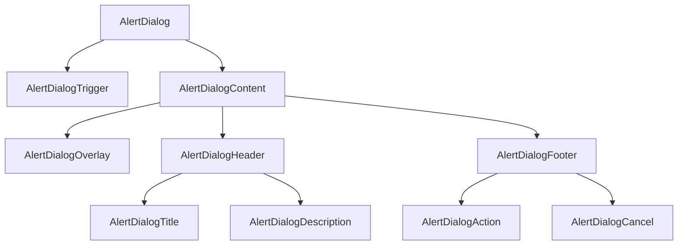
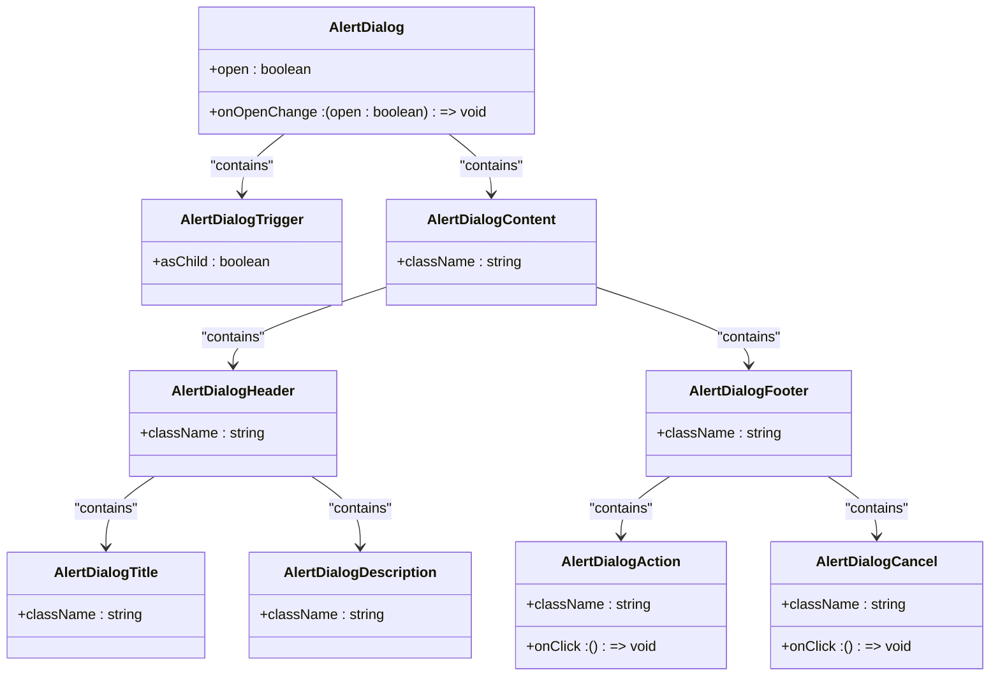
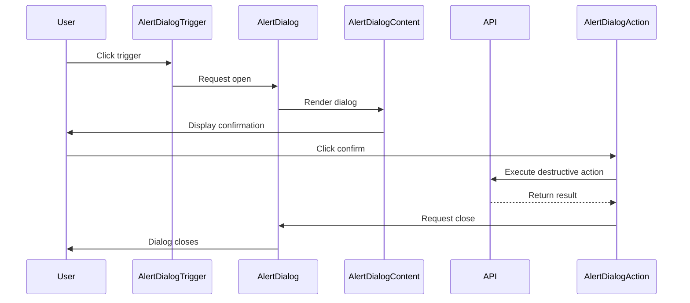
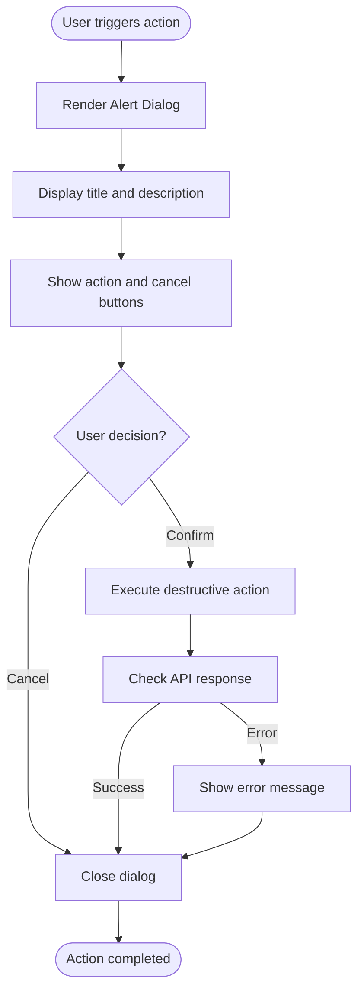
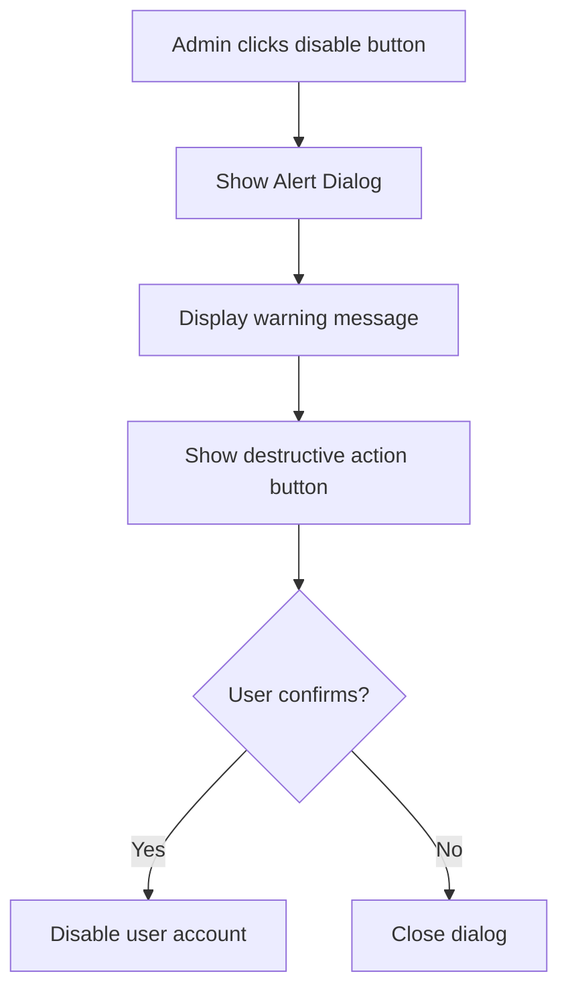
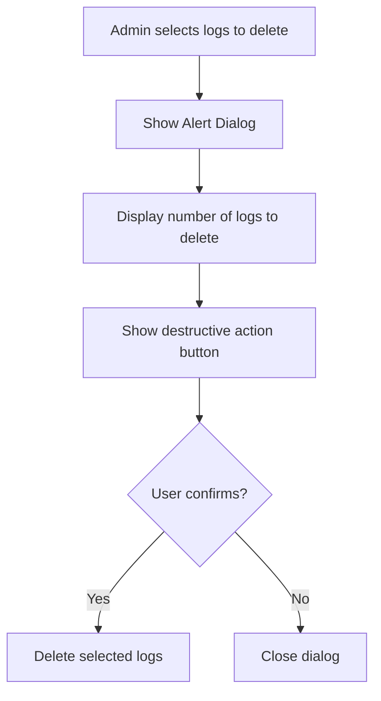
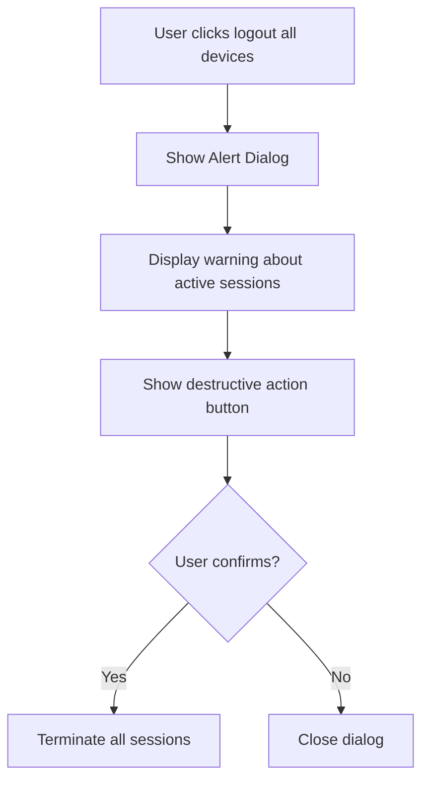
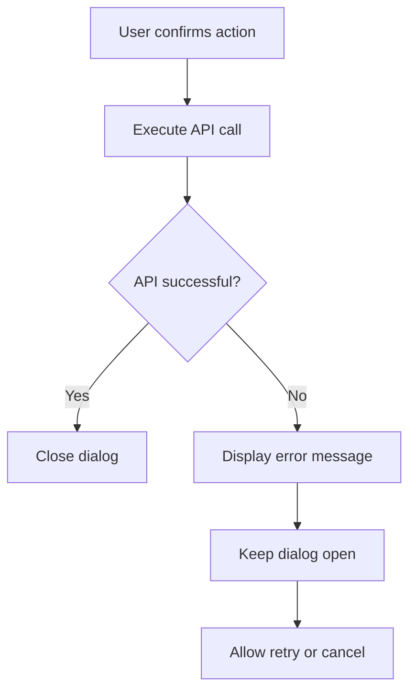

# Alert Dialog Components

<cite>
**Referenced Files in This Document**   
- [alert-dialog.tsx](file://components/ui/alert-dialog.tsx)
- [button.tsx](file://components/ui/button.tsx)
- [session-timeout-modal.tsx](file://components/session-timeout-modal.tsx)
- [active-sessions.tsx](file://components/active-sessions.tsx)
- [app/admin/users/page.tsx](file://app/admin/users/page.tsx)
- [app/admin/audit-logs/page.tsx](file://app/admin/audit-logs/page.tsx)
- [app/student/lessons/page.tsx](file://app/student/lessons/page.tsx)
- [use-session-timeout.ts](file://lib/hooks/use-session-timeout.ts)
</cite>

## Table of Contents
1. [Introduction](#introduction)
2. [Core Components](#core-components)
3. [Architecture Overview](#architecture-overview)
4. [Detailed Component Analysis](#detailed-component-analysis)
5. [Usage Examples](#usage-examples)
6. [Accessibility Considerations](#accessibility-considerations)
7. [Integration with Form Submissions and API Error Handling](#integration-with-form-submissions-and-api-error-handling)
8. [Conclusion](#conclusion)

## Introduction
The Alert Dialog components in the shadcn/ui library provide a specialized dialog pattern for critical actions requiring user confirmation. These components extend the base Dialog functionality with enhanced visual hierarchy and destructive action patterns, making them ideal for operations like user status toggling, audit log deletion, and session termination. This document details the implementation and usage of AlertDialog, AlertDialogTrigger, AlertDialogContent, AlertDialogHeader, AlertDialogFooter, AlertDialogTitle, and AlertDialogDescription, focusing on their role in enforcing user confirmation for high-impact operations.

## Core Components
The Alert Dialog components are built on top of Radix UI's primitives, providing a consistent and accessible interface for critical actions. The components include AlertDialog for the root container, AlertDialogTrigger for the activation element, AlertDialogContent for the dialog body, AlertDialogHeader and AlertDialogFooter for structural organization, AlertDialogTitle for the main heading, AlertDialogDescription for additional context, AlertDialogAction for the primary/confirm action, and AlertDialogCancel for the secondary/cancel action. These components work together to create a modal experience that demands user attention for destructive operations.

**Section sources**
- [alert-dialog.tsx](file://components/ui/alert-dialog.tsx)

## Architecture Overview
The Alert Dialog components follow a composable architecture where each piece serves a specific purpose in the confirmation flow. The components are structured to ensure proper accessibility and visual hierarchy, with the AlertDialog wrapping the entire component tree and managing open/closed state. The AlertDialogContent is rendered through a portal to ensure it appears above all other content, while the AlertDialogOverlay provides a backdrop that dims the rest of the application. The header, footer, title, and description components provide semantic structure, and the action and cancel buttons are styled to reflect their importance and potential consequences.

**Diagram sources**
- [alert-dialog.tsx](file://components/ui/alert-dialog.tsx)

## Detailed Component Analysis

### Component Analysis
The AlertDialog component serves as the root container that manages the open/closed state of the dialog. It uses Radix UI's Root component under the hood, ensuring proper accessibility and state management. The AlertDialogTrigger is the element that opens the dialog when clicked, typically a button or link. The AlertDialogContent contains the actual dialog box and is rendered through a portal to ensure it appears above all other content. The AlertDialogOverlay provides a semi-transparent backdrop that dims the rest of the application and captures clicks outside the dialog to close it.

The AlertDialogHeader and AlertDialogFooter provide structural organization for the dialog content, with the header typically containing the title and description, and the footer containing the action buttons. The AlertDialogTitle provides the main heading for the dialog, while the AlertDialogDescription offers additional context or warning text. The AlertDialogAction represents the primary action (usually confirmation), and the AlertDialogCancel represents the secondary action (usually cancellation).

#### For Object-Oriented Components:

**Diagram sources**
- [alert-dialog.tsx](file://components/ui/alert-dialog.tsx)

#### For API/Service Components:

**Diagram sources**
- [alert-dialog.tsx](file://components/ui/alert-dialog.tsx)
- [app/admin/users/page.tsx](file://app/admin/users/page.tsx)

#### For Complex Logic Components:

**Diagram sources**
- [alert-dialog.tsx](file://components/ui/alert-dialog.tsx)
- [app/admin/users/page.tsx](file://app/admin/users/page.tsx)

**Section sources**
- [alert-dialog.tsx](file://components/ui/alert-dialog.tsx)

## Usage Examples

### Admin User Status Toggling
The Alert Dialog is used when administrators need to toggle a user's active status. This critical action requires confirmation to prevent accidental deactivation of user accounts. The dialog clearly presents the consequences of the action, with appropriate styling to emphasize the destructive nature of disabling an account.

**Diagram sources**
- [app/admin/users/page.tsx](file://app/admin/users/page.tsx)

### Audit Log Deletion
When administrators need to delete audit logs, the Alert Dialog ensures they understand the irreversible nature of this action. The dialog provides clear context about what will be deleted and requires explicit confirmation before proceeding.

**Diagram sources**
- [app/admin/audit-logs/page.tsx](file://app/admin/audit-logs/page.tsx)

### Session Termination
The Alert Dialog is used when users need to terminate their active sessions across all devices. This security-critical action requires confirmation to prevent accidental logout from all sessions.

**Diagram sources**
- [components/active-sessions.tsx](file://components/active-sessions.tsx)

## Accessibility Considerations
The Alert Dialog components implement several accessibility features to ensure they are usable by all users. The components use the ARIA `alertdialog` role instead of the standard `dialog` role to indicate that the dialog requires immediate attention and contains important information. When the dialog opens, focus is automatically moved to the confirm or cancel button, ensuring keyboard users can immediately interact with the dialog. Screen readers announce the dialog's title and description, clearly communicating the destructive consequences of the action. The components also manage focus trapping within the dialog, preventing keyboard navigation from leaving the dialog until an action is taken.

**Section sources**
- [alert-dialog.tsx](file://components/ui/alert-dialog.tsx)

## Integration with Form Submissions and API Error Handling
The Alert Dialog components integrate seamlessly with form submissions and API calls. When a confirmation action fails due to API errors, the components work with the application's error handling system to display appropriate feedback. The centralized API error handler ensures that sensitive information is not exposed to clients while still providing meaningful error messages. In cases where confirmation actions fail, the dialog typically remains open, allowing users to retry the action or cancel.

**Diagram sources**
- [lib/api-errors.ts](file://lib/api-errors.ts)
- [app/admin/users/page.tsx](file://app/admin/users/page.tsx)

## Conclusion
The Alert Dialog components provide a robust and accessible solution for handling critical actions that require user confirmation. By extending the base Dialog with destructive action patterns and enhanced visual hierarchy, these components help prevent accidental data loss or account changes. The implementation follows accessibility best practices, ensuring that all users can understand and interact with confirmation dialogs. The components integrate well with form submissions and API error handling, providing a consistent user experience across different types of destructive operations in the application.