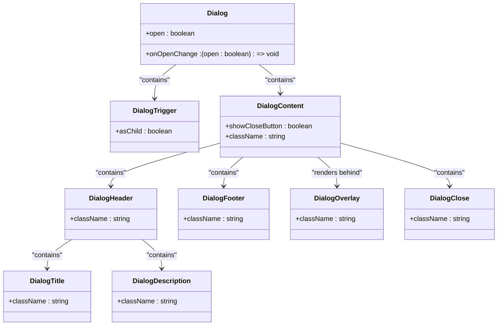
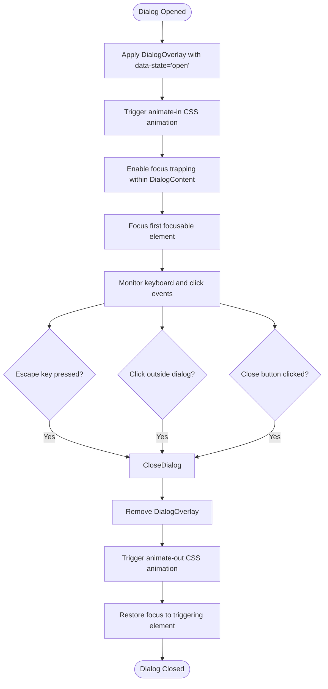
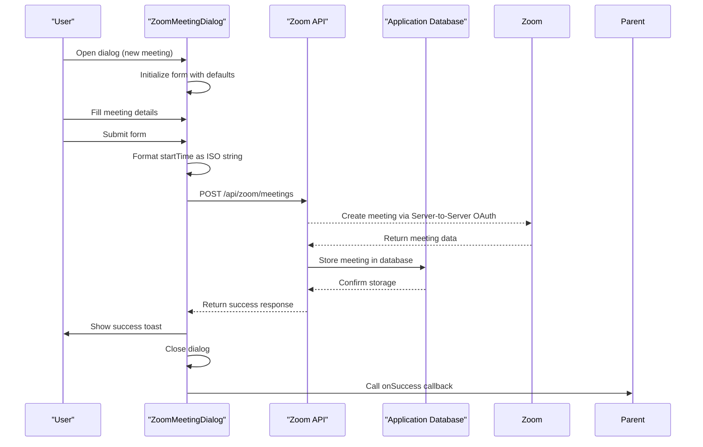
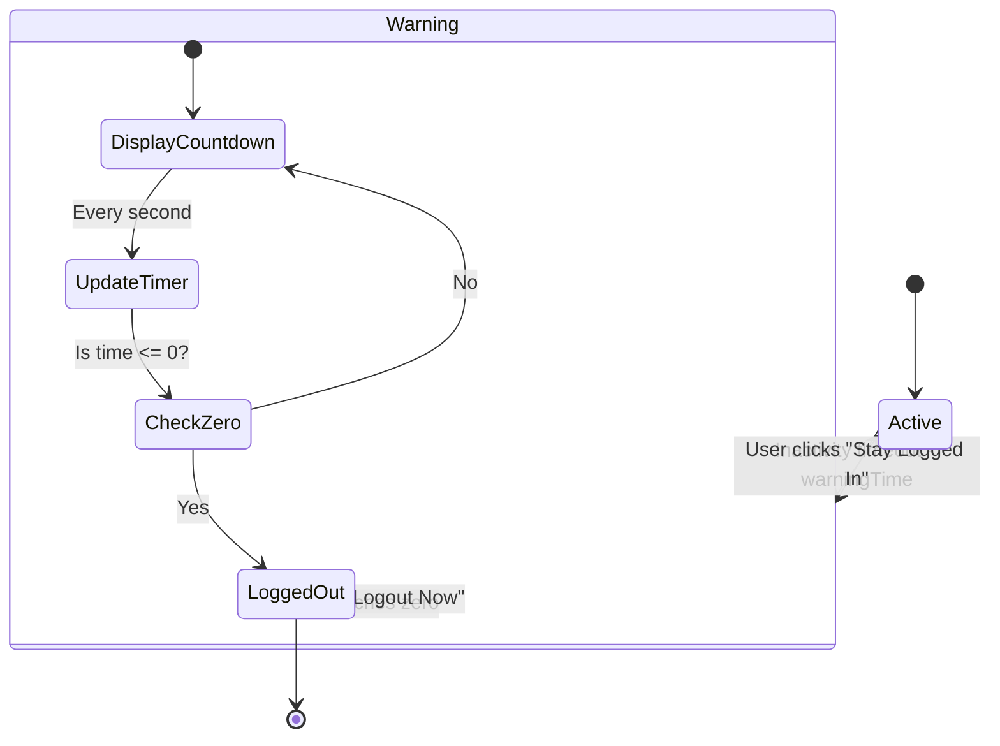
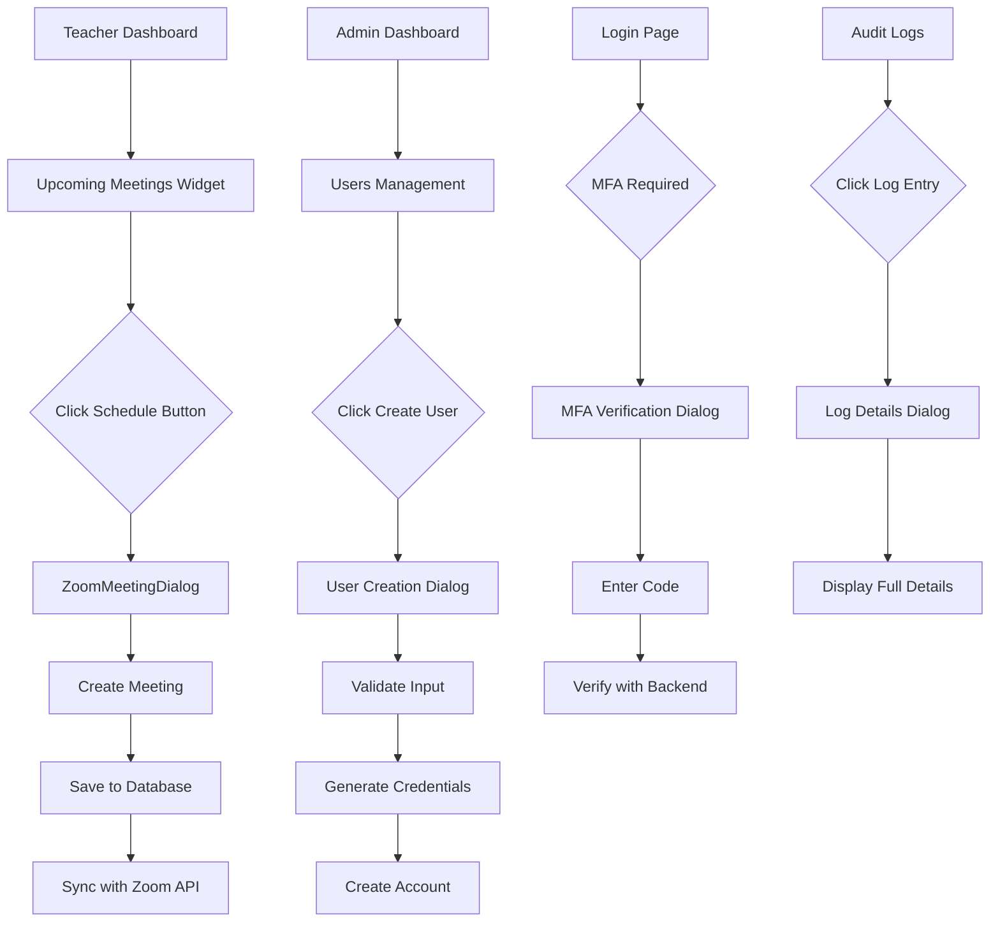

# Dialog Components

<cite>
**Referenced Files in This Document**   
- [dialog.tsx](file://components/ui/dialog.tsx)
- [zoom-meeting-dialog.tsx](file://components/zoom-meeting-dialog.tsx)
- [session-timeout-modal.tsx](file://components/session-timeout-modal.tsx)
- [use-session-timeout.ts](file://lib/hooks/use-session-timeout.ts)
- [client.ts](file://lib/zoom/client.ts)
- [types.ts](file://lib/zoom/types.ts)
- [admin/users/page.tsx](file://app/admin/users/page.tsx)
- [teacher/meetings/page.tsx](file://app/teacher/meetings/page.tsx)
- [zoom-meetings-list.tsx](file://components/zoom-meetings-list.tsx)
</cite>

## Table of Contents
1. [Introduction](#introduction)
2. [Base Dialog Components](#base-dialog-components)
3. [Accessibility and User Experience](#accessibility-and-user-experience)
4. [ZoomMeetingDialog Component](#zoommeetingdialog-component)
5. [SessionTimeoutModal Component](#sessiontimeoutmodal-component)
6. [Usage Examples Across Application](#usage-examples-across-application)
7. [State Management with Zustand](#state-management-with-zustand)
8. [Best Practices for Dialog Implementation](#best-practices-for-dialog-implementation)
9. [Conclusion](#conclusion)

## Introduction

This document provides comprehensive documentation for the dialog-based UI components used throughout the school management system. The application leverages the shadcn/ui library's dialog components as a foundation for modal interactions, extending them with custom functionality for specific use cases such as Zoom meeting management and session timeout warnings. These components follow accessibility best practices, implement proper focus management, and integrate seamlessly with the application's state management system.

The dialog components serve as critical interaction points across various user roles including administrators, teachers, students, and parents. They are used for data entry, confirmation prompts, information display, and complex workflows such as scheduling virtual meetings and managing user accounts. The implementation emphasizes user experience, accessibility, and mobile responsiveness while maintaining a consistent design language across the application.

**Section sources**
- [dialog.tsx](file://components/ui/dialog.tsx)

## Base Dialog Components

The application utilizes a suite of dialog components from the shadcn/ui library, which are built on top of Radix UI's accessible primitives. These components include Dialog, DialogTrigger, DialogContent, DialogHeader, DialogFooter, DialogClose, and DialogOverlay, each serving a specific purpose in the modal interaction pattern.

The Dialog component acts as the root container that manages the open/closed state of the modal. It wraps the entire dialog structure and coordinates state between the trigger and content. The DialogTrigger component is used to open the dialog when clicked or activated, while DialogClose serves to close the dialog. These triggers and closers can be placed anywhere within the dialog tree, providing flexibility in interaction design.

DialogContent represents the actual modal panel that appears on screen, positioned centrally with appropriate z-index stacking. It includes built-in focus trapping to ensure keyboard navigation remains within the dialog, enhancing accessibility. The component automatically focuses the first focusable element when opened, following WCAG guidelines for modal dialogs.

DialogHeader and DialogFooter provide semantic structure for the dialog's top and bottom sections respectively. The header typically contains the DialogTitle and optional DialogDescription, establishing the purpose of the modal. The footer houses action buttons, with recommended placement of primary actions on the right and secondary actions on the left, following platform conventions.

**Diagram sources**
- [dialog.tsx](file://components/ui/dialog.tsx)

**Section sources**
- [dialog.tsx](file://components/ui/dialog.tsx)

## Accessibility and User Experience

The dialog components implement comprehensive accessibility features to ensure they are usable by all users, including those relying on assistive technologies. The implementation follows WAI-ARIA Authoring Practices for dialog patterns, providing appropriate ARIA attributes and keyboard navigation.

Focus trapping is automatically handled by the Radix UI primitives, preventing keyboard navigation from escaping the dialog while it is open. When a dialog opens, focus is automatically moved to the first focusable element within the content, typically the close button or primary action. This ensures screen reader users immediately understand they are in a modal context.

The DialogOverlay component provides a backdrop that dims the underlying content and captures clicks outside the dialog to dismiss it. This overlay uses the data-state attribute to transition between "open" and "closed" states, triggering CSS animations for fade-in and fade-out effects. The animation is implemented using Tailwind's animation utilities with data attribute selectors, ensuring smooth visual transitions.

ARIA attributes are properly applied to communicate the dialog's role and state to assistive technologies. The Dialog component has an implicit role of "dialog" or "alertdialog" depending on its use case. The DialogTitle becomes the accessible name for the dialog, announced by screen readers when the dialog opens. For confirmation dialogs that require immediate attention, the alertdialog role is used to interrupt the user's workflow appropriately.

Keyboard navigation follows standard conventions: Tab and Shift+Tab cycle through focusable elements within the dialog, with focus wrapping at the boundaries. The Escape key closes the dialog, providing a quick exit for keyboard users. Clicking the overlay or the close button also dismisses the dialog, offering multiple dismissal methods to accommodate different user preferences.

**Diagram sources**
- [dialog.tsx](file://components/ui/dialog.tsx)

**Section sources**
- [dialog.tsx](file://components/ui/dialog.tsx)

## ZoomMeetingDialog Component

The ZoomMeetingDialog component extends the base dialog functionality to provide a specialized interface for creating and editing Zoom meetings within the school management system. This custom dialog integrates with the Zoom API to manage virtual classroom sessions, allowing teachers and administrators to schedule, modify, and configure meetings with appropriate settings.

The component accepts several props including `open` (boolean controlling visibility), `onOpenChange` (callback for state changes), `meeting` (optional existing meeting data for editing), `onSuccess` (callback triggered after successful save), and `defaultClassId` (pre-selected class for new meetings). When editing an existing meeting, the form is populated with the meeting's current values; for new meetings, default values are provided with a start time set to one hour from the current time.

The dialog includes a comprehensive form with fields for meeting title, description, date, time, duration, associated class, target audience, and various meeting settings. The target audience selector allows the meeting to be restricted to specific groups such as a particular class, all students, all teachers, everyone in the system, or only invited participants. This ensures appropriate access control based on the meeting's purpose.

Meeting settings include toggles for waiting room, mute upon entry, host video, and participant video, all of which are configured according to institutional policies. The waiting room is always enabled to maintain security, with registered participants automatically bypassing it. The form handles both creation (POST) and update (PATCH) operations through the same interface, with the HTTP method determined by the presence of an existing meeting ID.

**Diagram sources**
- [zoom-meeting-dialog.tsx](file://components/zoom-meeting-dialog.tsx)
- [client.ts](file://lib/zoom/client.ts)

**Section sources**
- [zoom-meeting-dialog.tsx](file://components/zoom-meeting-dialog.tsx)
- [types.ts](file://lib/zoom/types.ts)
- [client.ts](file://lib/zoom/client.ts)

## SessionTimeoutModal Component

The SessionTimeoutModal component implements a warning dialog that alerts users when their session is about to expire due to inactivity. This component uses the AlertDialog variant from shadcn/ui, which is optimized for high-priority notifications that require user acknowledgment. The modal is triggered by the useSessionTimeout hook when the remaining time reaches the configured warning threshold.

The component displays a countdown timer showing the remaining time before automatic logout, formatted as minutes and seconds. It provides two action buttons: "Logout Now" which immediately terminates the session, and "Stay Logged In" which extends the session duration. The visual design includes a yellow warning icon and color scheme to convey urgency without being overly alarming.

The implementation integrates with the application's authentication system, handling both client-side session state and server-side session invalidation. When the session is extended, the inactivity timer is reset and the warning is dismissed. When the session expires, the user is redirected to the login page with a query parameter indicating the reason for logout, allowing for appropriate messaging on the login screen.

The modal is non-dismissible through the escape key or clicking outside, ensuring the user must actively choose to extend or end their session. This prevents accidental logouts while maintaining security requirements for session management. The component is designed to be unobtrusive during normal use but impossible to ignore when the session is about to expire.

**Diagram sources**
- [session-timeout-modal.tsx](file://components/session-timeout-modal.tsx)
- [use-session-timeout.ts](file://lib/hooks/use-session-timeout.ts)

**Section sources**
- [session-timeout-modal.tsx](file://components/session-timeout-modal.tsx)
- [use-session-timeout.ts](file://lib/hooks/use-session-timeout.ts)

## Usage Examples Across Application

Dialog components are used extensively throughout the application in various contexts, demonstrating their versatility and importance in the user interface. In the teacher meeting scheduling workflow, the ZoomMeetingDialog is accessed from the teacher's meetings page, allowing educators to create virtual classrooms for their students. The dialog is triggered by a "Schedule Meeting" button and provides a streamlined interface for setting up Zoom sessions with appropriate defaults for educational contexts.

In the admin user management interface, dialogs are used for both creating new user accounts and viewing detailed audit logs. The user creation dialog guides administrators through the account creation process, with conditional fields based on the user role (student, teacher, or admin). For students, the LRN (Learner Reference Number) is required instead of an email address, reflecting the institution's enrollment practices.

The authentication flows utilize dialogs for multi-factor authentication enrollment and verification. When users enable MFA, a dialog guides them through scanning a QR code with their authenticator app and entering a verification code. This modal context keeps the user focused on the security setup process without navigating away from their current location in the application.

Other notable uses include the audit logs page, where clicking on a log entry opens a dialog with detailed information about the authentication event, and the profile management section, where users can update their personal information through a modal form. These consistent patterns create a predictable user experience across different parts of the application.

**Diagram sources**
- [admin/users/page.tsx](file://app/admin/users/page.tsx)
- [teacher/meetings/page.tsx](file://app/teacher/meetings/page.tsx)
- [zoom-meetings-list.tsx](file://components/zoom-meetings-list.tsx)

**Section sources**
- [admin/users/page.tsx](file://app/admin/users/page.tsx)
- [teacher/meetings/page.tsx](file://app/teacher/meetings/page.tsx)
- [zoom-meetings-list.tsx](file://components/zoom-meetings-list.tsx)

## State Management with Zustand

The dialog components integrate with the application's state management system, which is built on Zustand for efficient state handling. The useSessionTimeout hook, which controls the SessionTimeoutModal, is a Zustand store that manages session state including the remaining time, warning status, and provides actions to extend or terminate the session.

The hook tracks both inactivity timeout and absolute session timeout, providing a comprehensive session management solution. The inactivity timer resets whenever user activity is detected through events such as mouse movement, keystrokes, or scrolling. The absolute timeout is based on the JWT's session_start metadata, ensuring server-side session validity is respected.

For form handling within dialogs, local component state is typically used with React's useState hook, as the state is ephemeral and tied to the dialog's lifecycle. When a form is submitted successfully, the parent component's state is updated through callback functions like onSuccess, maintaining a unidirectional data flow.

The ZoomMeetingDialog uses local state to manage form inputs, with the state reset when the dialog opens based on whether an existing meeting is being edited. This approach keeps the dialog self-contained while allowing it to be reused in different contexts with different data. The state updates are batched for performance, and validation occurs on submission rather than on every keystroke to avoid unnecessary re-renders.

**Section sources**
- [use-session-timeout.ts](file://lib/hooks/use-session-timeout.ts)
- [auth-store.ts](file://lib/auth-store.ts)
- [zoom-meeting-dialog.tsx](file://components/zoom-meeting-dialog.tsx)

## Best Practices for Dialog Implementation

When implementing dialogs in the application, several best practices are followed to ensure optimal user experience and technical quality. Form submissions within dialogs should always provide clear feedback through loading states and success/error notifications. The ZoomMeetingDialog, for example, disables the submit button during API calls and shows a loading spinner to prevent duplicate submissions.

Mobile responsiveness is achieved through responsive design using Tailwind CSS. The DialogContent has a max-width that adapts to screen size, with a maximum of sm:max-w-lg on larger screens and full width with 2rem margins on mobile. This ensures the dialog is readable and tappable on smaller devices without requiring horizontal scrolling.

Error handling is implemented consistently across all dialog components. API errors are caught and displayed using the Sonner toast library, providing non-intrusive notifications that don't disrupt the user's workflow. Form validation is performed both client-side for immediate feedback and server-side for security, with error messages returned in a consistent format.

Performance considerations include lazy loading of dialog content when possible and avoiding unnecessary re-renders through proper state management. The dialogs are only rendered when open, using conditional rendering rather than CSS display properties, which improves performance by reducing the DOM size when dialogs are not in use.

Accessibility is prioritized through semantic HTML, proper ARIA attributes, and keyboard navigation support. All interactive elements have appropriate labels, and color contrast meets WCAG standards. The dialogs are tested with screen readers and keyboard-only navigation to ensure they are usable by all users.

**Section sources**
- [zoom-meeting-dialog.tsx](file://components/zoom-meeting-dialog.tsx)
- [session-timeout-modal.tsx](file://components/session-timeout-modal.tsx)
- [dialog.tsx](file://components/ui/dialog.tsx)

## Conclusion

The dialog components in the school management system provide a robust foundation for modal interactions across various use cases. By building on accessible primitives from Radix UI and extending them with application-specific functionality, the implementation achieves a balance between consistency and flexibility.

The ZoomMeetingDialog demonstrates how base components can be extended for complex workflows, integrating with external APIs while maintaining a clean user interface. The SessionTimeoutModal shows how dialogs can be used for system notifications that require user action, with appropriate visual design and interaction patterns.

These components follow best practices for accessibility, mobile responsiveness, and state management, creating a cohesive user experience across different parts of the application. The consistent patterns make the interface predictable and easy to learn, while the extensibility allows for specialized functionality when needed.

Future enhancements could include additional dialog types for specific workflows, improved animation performance, and enhanced accessibility features such as better screen reader announcements and support for reduced motion preferences.