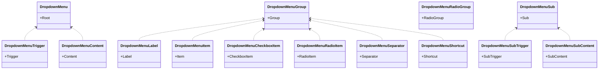

# Dropdown Menu Components

<cite>
**Referenced Files in This Document**
- [dropdown-menu.tsx](file://components/ui/dropdown-menu.tsx)
- [page.tsx](file://app/page.tsx)
- [dashboard-sidebar.tsx](file://components/dashboard-sidebar.tsx)
- [notification-center.tsx](file://components/notification-center.tsx)
- [layout.tsx](file://app/admin/layout.tsx)
- [layout.tsx](file://app/teacher/layout.tsx)
- [utils.ts](file://lib/utils.ts)
- [globals.css](file://app/globals.css)
- [globals.css](file://styles/globals.css)
- [postcss.config.mjs](file://postcss.config.mjs)
</cite>

## Table of Contents
1. [Introduction](#introduction)
2. [Project Structure](#project-structure)
3. [Core Components](#core-components)
4. [Architecture Overview](#architecture-overview)
5. [Detailed Component Analysis](#detailed-component-analysis)
6. [Dependency Analysis](#dependency-analysis)
7. [Performance Considerations](#performance-considerations)
8. [Troubleshooting Guide](#troubleshooting-guide)
9. [Conclusion](#conclusion)
10. [Appendices](#appendices)

## Introduction
This document explains the dropdown menu system used for contextual navigation and actions across the application. It covers the implementation of DropdownMenu, DropdownMenuTrigger, DropdownMenuContent, and item variants including DropdownMenuItem, DropdownMenuCheckboxItem, and DropdownMenuRadioItem. It also documents logical grouping with DropdownMenuGroup and DropdownMenuSeparator, keyboard hint display with DropdownMenuShortcut, nested hierarchical menus with DropdownMenuSub and DropdownMenuSubTrigger, and how data-state and data-variant attributes control styling and behavior. Usage examples are provided from the dashboard header (role-based navigation), dashboard sidebar (user profile actions), and notification center (actions and settings). Accessibility considerations such as keyboard navigation, focus management, and screen reader support are addressed, along with styling customization through the cn utility and integration with Tailwind CSS.

## Project Structure
The dropdown menu system is implemented as a reusable UI component library module and consumed in several pages and layouts:
- UI primitives live under components/ui/dropdown-menu.tsx
- Usage appears in app/page.tsx (header user menu), components/dashboard-sidebar.tsx (sidebar user area), and components/notification-center.tsx (notification actions)
- Styling relies on Tailwind CSS and the cn utility for merging classes
- Theme variables and dark mode are configured in app/globals.css and styles/globals.css

**Diagram sources**
- [dropdown-menu.tsx](file://components/ui/dropdown-menu.tsx#L1-L258)
- [page.tsx](file://app/page.tsx#L180-L230)
- [dashboard-sidebar.tsx](file://components/dashboard-sidebar.tsx#L1-L225)
- [notification-center.tsx](file://components/notification-center.tsx#L1-L190)
- [layout.tsx](file://app/admin/layout.tsx#L1-L62)
- [layout.tsx](file://app/teacher/layout.tsx#L1-L60)
- [utils.ts](file://lib/utils.ts#L1-L10)
- [globals.css](file://app/globals.css#L1-L41)
- [globals.css](file://styles/globals.css#L1-L43)
- [postcss.config.mjs](file://postcss.config.mjs#L1-L8)

**Section sources**
- [dropdown-menu.tsx](file://components/ui/dropdown-menu.tsx#L1-L258)
- [page.tsx](file://app/page.tsx#L180-L230)
- [dashboard-sidebar.tsx](file://components/dashboard-sidebar.tsx#L1-L225)
- [notification-center.tsx](file://components/notification-center.tsx#L1-L190)
- [layout.tsx](file://app/admin/layout.tsx#L1-L62)
- [layout.tsx](file://app/teacher/layout.tsx#L1-L60)
- [utils.ts](file://lib/utils.ts#L1-L10)
- [globals.css](file://app/globals.css#L1-L41)
- [globals.css](file://styles/globals.css#L1-L43)
- [postcss.config.mjs](file://postcss.config.mjs#L1-L8)

## Core Components
The dropdown menu primitives wrap Radix UI’s primitives and expose a consistent API with Tailwind-based styling and accessibility attributes. Key components:
- Root container: DropdownMenu
- Trigger element: DropdownMenuTrigger
- Content container: DropdownMenuContent
- Item variants:
  - DropdownMenuItem
  - DropdownMenuCheckboxItem
  - DropdownMenuRadioItem
- Grouping and separators:
  - DropdownMenuGroup
  - DropdownMenuLabel
  - DropdownMenuSeparator
- Keyboard hints:
  - DropdownMenuShortcut
- Nested submenus:
  - DropdownMenuSub
  - DropdownMenuSubTrigger
  - DropdownMenuSubContent

Each primitive attaches a data-slot attribute for testing and styling hooks, and uses data-state and data-variant attributes to drive animations and variant styling.

**Section sources**
- [dropdown-menu.tsx](file://components/ui/dropdown-menu.tsx#L1-L258)

## Architecture Overview
The dropdown system integrates with:
- Radix UI for robust accessibility and state management
- cn utility for safe class merging and Tailwind integration
- Tailwind CSS for responsive, theme-aware styling
- Application pages and layouts for role-based navigation and actions

**Diagram sources**
- [page.tsx](file://app/page.tsx#L180-L230)
- [dropdown-menu.tsx](file://components/ui/dropdown-menu.tsx#L1-L258)

## Detailed Component Analysis

### DropdownMenu Primitive Family
The component family wraps Radix UI primitives and adds:
- data-slot attributes for consistent identification
- data-state attributes for animation and transitions
- data-variant attributes for destructive and default variants
- data-inset for indented items
- Tailwind-based class composition via cn

**Diagram sources**
- [dropdown-menu.tsx](file://components/ui/dropdown-menu.tsx#L1-L258)

**Section sources**
- [dropdown-menu.tsx](file://components/ui/dropdown-menu.tsx#L1-L258)

### Role-Based Navigation in Header (Dashboard)
The home page demonstrates a user menu with role-aware navigation:
- Uses DropdownMenuTrigger to render an avatar and name
- DropdownMenuContent lists:
  - User identity
  - Dashboard link derived from user role
  - Profile link derived from user role
  - Logout action
- Items use data-variant for destructive styling and asChild to integrate with Next.js Link

**Diagram sources**
- [page.tsx](file://app/page.tsx#L180-L230)
- [dropdown-menu.tsx](file://components/ui/dropdown-menu.tsx#L62-L83)

**Section sources**
- [page.tsx](file://app/page.tsx#L180-L230)

### User Profile Actions in Sidebar (Role-Aware)
The dashboard sidebar includes a user area with:
- Avatar and role label
- Logout button
- Role-aware navigation links (defined in the sidebar component)
- Mobile-friendly sheet-based navigation

While the sidebar itself does not directly use DropdownMenu, it demonstrates role-based navigation and can serve as a model for integrating DropdownMenu for user actions.

**Section sources**
- [dashboard-sidebar.tsx](file://components/dashboard-sidebar.tsx#L1-L225)

### Notification Center Actions (Actions and Settings)
The notification center uses a popover for notifications and includes:
- Mark all read action
- Delete notification action
- Links to notification destinations
- Scrollable content area

Although this component primarily uses Popover, it illustrates how dropdown-like actions can be composed with other primitives for rich user experiences.

**Section sources**
- [notification-center.tsx](file://components/notification-center.tsx#L1-L190)

### Nested Hierarchical Menus (Submenus)
Nested submenus are supported via:
- DropdownMenuSub to define a submenu context
- DropdownMenuSubTrigger to reveal nested content
- DropdownMenuSubContent to render nested items

These primitives enable hierarchical navigation and grouped actions.

**Diagram sources**
- [dropdown-menu.tsx](file://components/ui/dropdown-menu.tsx#L195-L239)

**Section sources**
- [dropdown-menu.tsx](file://components/ui/dropdown-menu.tsx#L195-L239)

### Keyboard Navigation, Focus Management, and Screen Reader Support
- Keyboard navigation: Radix UI primitives provide built-in keyboard handling (arrow keys, Enter, Escape) for navigating items and closing menus.
- Focus management: The primitives manage focus trapping and focus restoration when menus open/close.
- Screen reader support: Radix UI ensures ARIA attributes and roles are applied for assistive technologies.

These behaviors are inherited from the underlying Radix UI components and are not explicitly re-implemented in the wrapper.

**Section sources**
- [dropdown-menu.tsx](file://components/ui/dropdown-menu.tsx#L1-L258)

### Styling Customization Through cn and Tailwind CSS
- cn utility: The cn function merges Tailwind classes safely, resolving conflicts and applying theme-aware defaults.
- Tailwind integration: Components apply Tailwind classes for spacing, colors, shadows, and animations, with responsive variants.
- Theme variables: Theme tokens are defined in app/globals.css and styles/globals.css, enabling consistent theming across components.
- PostCSS plugin: The Tailwind plugin is configured via postcss.config.mjs.

**Diagram sources**
- [utils.ts](file://lib/utils.ts#L1-L10)
- [globals.css](file://app/globals.css#L1-L41)
- [globals.css](file://styles/globals.css#L1-L43)
- [postcss.config.mjs](file://postcss.config.mjs#L1-L8)

**Section sources**
- [utils.ts](file://lib/utils.ts#L1-L10)
- [globals.css](file://app/globals.css#L1-L41)
- [globals.css](file://styles/globals.css#L1-L43)
- [postcss.config.mjs](file://postcss.config.mjs#L1-L8)

## Dependency Analysis
The dropdown menu primitives depend on:
- Radix UI for accessibility and state management
- Lucide icons for visual indicators
- cn utility for class composition
- Tailwind CSS for styling

**Diagram sources**
- [dropdown-menu.tsx](file://components/ui/dropdown-menu.tsx#L1-L258)
- [utils.ts](file://lib/utils.ts#L1-L10)
- [globals.css](file://app/globals.css#L1-L41)
- [globals.css](file://styles/globals.css#L1-L43)
- [postcss.config.mjs](file://postcss.config.mjs#L1-L8)

**Section sources**
- [dropdown-menu.tsx](file://components/ui/dropdown-menu.tsx#L1-L258)
- [utils.ts](file://lib/utils.ts#L1-L10)
- [globals.css](file://app/globals.css#L1-L41)
- [globals.css](file://styles/globals.css#L1-L43)
- [postcss.config.mjs](file://postcss.config.mjs#L1-L8)

## Performance Considerations
- Lazy rendering: DropdownMenuContent is rendered inside a Portal to avoid layout thrashing and to keep z-index concerns isolated.
- Minimal re-renders: Prefer passing only necessary props to menu items and avoid heavy computations in render paths.
- Animations: Built-in animations are lightweight; avoid excessive nesting that could increase DOM depth.
- Accessibility: Leverage Radix UI’s optimized focus management to reduce layout shifts during interactions.

[No sources needed since this section provides general guidance]

## Troubleshooting Guide
Common issues and resolutions:
- Menu not opening/closing: Ensure DropdownMenuTrigger is placed inside DropdownMenu and that the trigger element is interactive.
- Styling conflicts: Verify cn utility usage and Tailwind configuration; confirm theme variables are defined and PostCSS plugin is active.
- Focus issues: Confirm that focus traps and focus restoration are handled by Radix UI; avoid overriding focus behavior manually.
- Nested menu not visible: Ensure DropdownMenuSub is used around DropdownMenuSubTrigger and DropdownMenuSubContent.
- Keyboard navigation not working: Confirm that items are focusable and that no custom event handlers prevent default behavior.

**Section sources**
- [dropdown-menu.tsx](file://components/ui/dropdown-menu.tsx#L1-L258)
- [utils.ts](file://lib/utils.ts#L1-L10)
- [globals.css](file://app/globals.css#L1-L41)
- [globals.css](file://styles/globals.css#L1-L43)
- [postcss.config.mjs](file://postcss.config.mjs#L1-L8)

## Conclusion
The dropdown menu system provides a robust, accessible, and customizable foundation for contextual navigation and actions. By leveraging Radix UI primitives, the cn utility, and Tailwind CSS, the components deliver consistent behavior and styling across role-based dashboards and notification centers. The data-state and data-variant attributes enable dynamic styling and animations, while nested submenus support complex hierarchical navigation. Following the usage patterns demonstrated in the home page header, dashboard sidebar, and notification center will help maintain consistency and accessibility across the application.

[No sources needed since this section summarizes without analyzing specific files]

## Appendices

### Usage Examples Index
- Role-based navigation in header: [page.tsx](file://app/page.tsx#L180-L230)
- Role-aware sidebar navigation: [dashboard-sidebar.tsx](file://components/dashboard-sidebar.tsx#L1-L225)
- Notification actions and settings: [notification-center.tsx](file://components/notification-center.tsx#L1-L190)
- Admin layout integration: [layout.tsx](file://app/admin/layout.tsx#L1-L62)
- Teacher layout integration: [layout.tsx](file://app/teacher/layout.tsx#L1-L60)

### Styling Reference
- cn utility: [utils.ts](file://lib/utils.ts#L1-L10)
- Theme variables and dark mode: [globals.css](file://app/globals.css#L1-L41), [globals.css](file://styles/globals.css#L1-L43)
- Tailwind plugin configuration: [postcss.config.mjs](file://postcss.config.mjs#L1-L8)