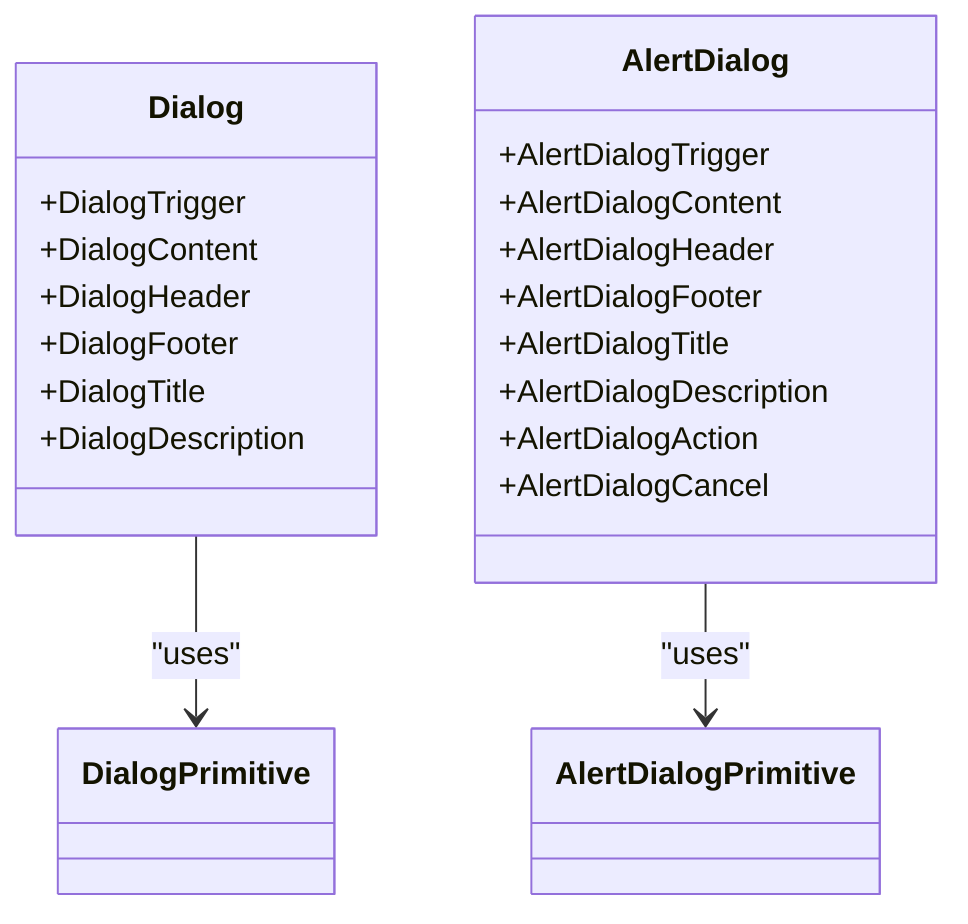
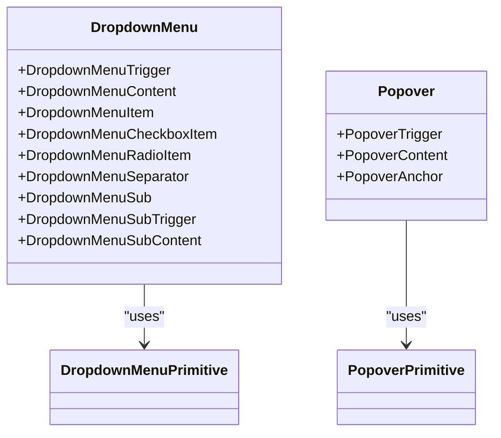
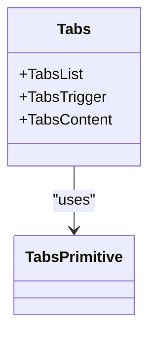
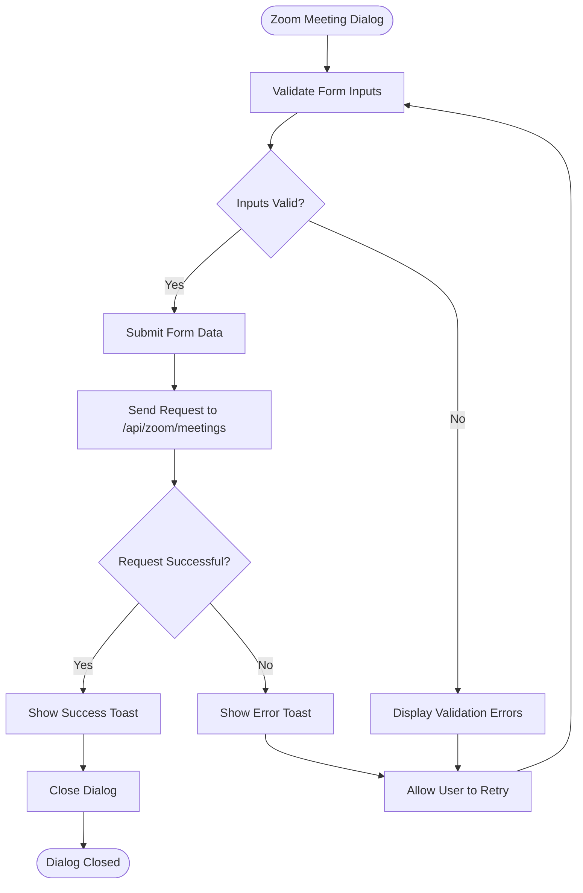
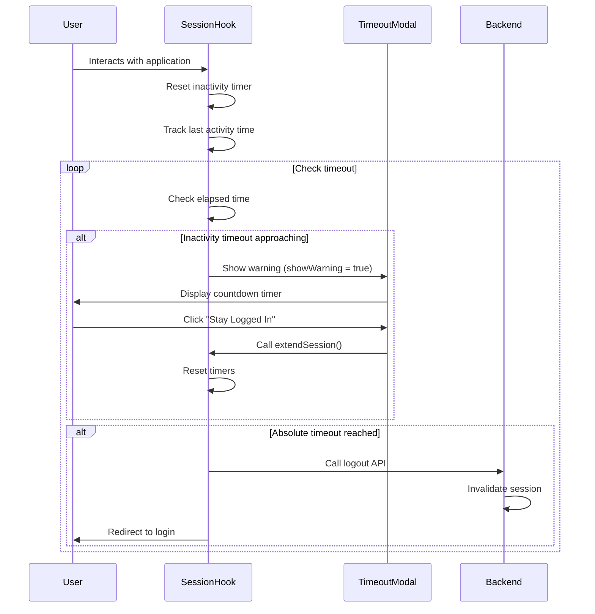
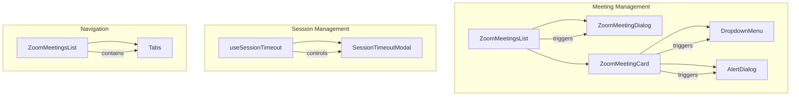

# Interactive Components

<cite>
**Referenced Files in This Document**   
- [dialog.tsx](file://components/ui/dialog.tsx)
- [alert-dialog.tsx](file://components/ui/alert-dialog.tsx)
- [dropdown-menu.tsx](file://components/ui/dropdown-menu.tsx)
- [popover.tsx](file://components/ui/popover.tsx)
- [tabs.tsx](file://components/ui/tabs.tsx)
- [zoom-meeting-dialog.tsx](file://components/zoom-meeting-dialog.tsx)
- [session-timeout-modal.tsx](file://components/session-timeout-modal.tsx)
- [use-session-timeout.ts](file://lib/hooks/use-session-timeout.ts)
- [zoom-meetings-list.tsx](file://components/zoom-meetings-list.tsx)
- [zoom-meeting-card.tsx](file://components/zoom-meeting-card.tsx)
- [page.tsx](file://app/admin/meetings/page.tsx)
- [page.tsx](file://app/teacher/meetings/page.tsx)
- [route.ts](file://app/api/zoom/meetings/register-student/route.ts)
</cite>

## Table of Contents
1. [Introduction](#introduction)
2. [Dialog and Alert Dialog Components](#dialog-and-alert-dialog-components)
3. [Dropdown Menu and Popover Components](#dropdown-menu-and-popover-components)
4. [Tabs Component](#tabs-component)
5. [Zoom Meeting Dialog](#zoom-meeting-dialog)
6. [Session Timeout Modal](#session-timeout-modal)
7. [Event Handling and Accessibility](#event-handling-and-accessibility)
8. [Usage Examples](#usage-examples)
9. [Conclusion](#conclusion)

## Introduction
This document provides comprehensive documentation for interactive UI components in the School Management System. The components covered include dialog and alert dialog implementations for critical actions, dropdown menus and popovers for contextual actions, tabs for content organization, and specialized components for real-time interaction handling such as zoom meeting dialogs and session timeout modals. The documentation includes details on event handling patterns, animation transitions, and accessibility considerations like focus trapping and ARIA roles.

## Dialog and Alert Dialog Components

The dialog and alert dialog components are used for displaying modal content and handling critical user actions that require confirmation. The dialog component is implemented using Radix UI's Dialog primitive, providing a flexible foundation for modal interactions. The alert dialog component extends this functionality with a more focused interface for confirmation flows.

The dialog component supports various sub-components including DialogTrigger, DialogContent, DialogHeader, DialogFooter, DialogTitle, and DialogDescription, allowing for structured modal content. The alert dialog component provides a similar structure but with a more streamlined interface focused on confirmation actions, using AlertDialogAction and AlertDialogCancel for primary and secondary actions respectively.

**Diagram sources**
- [dialog.tsx](file://components/ui/dialog.tsx#L9-L143)
- [alert-dialog.tsx](file://components/ui/alert-dialog.tsx#L9-L141)

**Section sources**
- [dialog.tsx](file://components/ui/dialog.tsx#L1-L144)
- [alert-dialog.tsx](file://components/ui/alert-dialog.tsx#L1-L142)

## Dropdown Menu and Popover Components

The dropdown menu and popover components provide contextual actions in tables and lists. The dropdown menu component is implemented using Radix UI's DropdownMenu primitive, offering a hierarchical menu system with support for nested submenus, checkboxes, radio items, and keyboard navigation.

The dropdown menu includes several sub-components: DropdownMenuTrigger, DropdownMenuContent, DropdownMenuItem, DropdownMenuCheckboxItem, DropdownMenuRadioItem, DropdownMenuSeparator, and DropdownMenuSub for nested menus. The component supports accessibility features including proper focus management and ARIA roles.

The popover component provides a lightweight alternative for contextual information, implemented using Radix UI's Popover primitive. It includes PopoverTrigger, PopoverContent, and PopoverAnchor sub-components, allowing for flexible positioning and content display.

**Diagram sources**
- [dropdown-menu.tsx](file://components/ui/dropdown-menu.tsx#L9-L257)
- [popover.tsx](file://components/ui/popover.tsx#L8-L48)

**Section sources**
- [dropdown-menu.tsx](file://components/ui/dropdown-menu.tsx#L1-L258)
- [popover.tsx](file://components/ui/popover.tsx#L1-L49)

## Tabs Component

The tabs component is used for content organization in dashboards, allowing users to switch between different views or sections of content. Implemented using Radix UI's Tabs primitive, the component provides a clean interface for tabbed navigation with smooth transitions between content sections.

The tabs component includes Tabs, TabsList, TabsTrigger, and TabsContent sub-components. The TabsList container holds the tab triggers, while TabsContent provides the corresponding content panels. The component supports keyboard navigation and screen reader accessibility through proper ARIA attributes.

**Diagram sources**
- [tabs.tsx](file://components/ui/tabs.tsx#L8-L66)

**Section sources**
- [tabs.tsx](file://components/ui/tabs.tsx#L1-L67)

## Zoom Meeting Dialog

The zoom meeting dialog component provides a comprehensive interface for scheduling and managing virtual meetings. This component combines multiple UI elements including form inputs, select dropdowns, switches, and date/time pickers to collect meeting details.

The dialog allows users to specify meeting title, description, date, time, duration, associated class, target audience, and various meeting settings such as waiting room, mute upon entry, and video preferences. The component handles both creating new meetings and editing existing ones, with appropriate form population based on the meeting prop.

The implementation includes client-side validation, loading states, and integration with the backend API for meeting creation and updates. Error handling is provided through toast notifications, and the component supports responsive design with appropriate sizing for different screen sizes.

**Diagram sources**
- [zoom-meeting-dialog.tsx](file://components/zoom-meeting-dialog.tsx#L28-L325)

**Section sources**
- [zoom-meeting-dialog.tsx](file://components/zoom-meeting-dialog.tsx#L1-L326)

## Session Timeout Modal

The session timeout modal component handles real-time interaction by warning users of impending session expiration due to inactivity. This component is integrated with the useSessionTimeout hook to monitor user activity and display appropriate warnings.

The modal displays a countdown timer showing the remaining time before session expiration, with options to extend the session or log out immediately. The implementation includes both inactivity timeout (based on user interaction) and absolute timeout (based on server-side session duration) tracking.

The component uses the alert dialog structure but with custom styling and content for the timeout warning. It includes proper focus management to ensure accessibility and provides visual indicators of the pending timeout.

**Diagram sources**
- [session-timeout-modal.tsx](file://components/session-timeout-modal.tsx#L22-L73)
- [use-session-timeout.ts](file://lib/hooks/use-session-timeout.ts#L34-L197)

**Section sources**
- [session-timeout-modal.tsx](file://components/session-timeout-modal.tsx#L1-L74)
- [use-session-timeout.ts](file://lib/hooks/use-session-timeout.ts#L1-L198)

## Event Handling and Accessibility

The interactive components implement comprehensive event handling patterns and accessibility features to ensure a usable experience for all users. Event handling includes proper propagation management, loading states, and error handling for asynchronous operations.

Accessibility considerations include:
- Proper ARIA roles and attributes for screen readers
- Keyboard navigation support for all interactive elements
- Focus trapping within modal dialogs
- Sufficient color contrast and visual indicators
- Responsive design for different screen sizes
- Semantic HTML structure

The components use Radix UI primitives which provide built-in accessibility features, and extend these with additional enhancements specific to the application's needs. Focus management is handled automatically by the primitives, with additional custom focus handling where needed.

## Usage Examples

The interactive components are used throughout the application in various contexts:

1. **Meeting Management**: The zoom meeting dialog is used in both admin and teacher meeting pages to schedule and edit virtual classes. The dialog is triggered from the ZoomMeetingsList component when users click "Schedule Meeting" or edit an existing meeting.

2. **Critical Actions**: Alert dialogs are used for confirmation flows such as deleting meetings, with appropriate warning messages and action buttons.

3. **Contextual Actions**: Dropdown menus are used in the ZoomMeetingCard component for additional actions like copying join links, editing, or deleting meetings.

4. **Content Organization**: Tabs are used in the ZoomMeetingsList component to separate upcoming and past meetings.

5. **Session Management**: The session timeout modal is integrated with the useSessionTimeout hook to handle inactive sessions across the application.

These components are designed to be reusable and consistent across different parts of the application, providing a cohesive user experience.

**Diagram sources**
- [zoom-meetings-list.tsx](file://components/zoom-meetings-list.tsx#L25-L245)
- [zoom-meeting-card.tsx](file://components/zoom-meeting-card.tsx#L49-L273)
- [page.tsx](file://app/admin/meetings/page.tsx#L1-L52)
- [page.tsx](file://app/teacher/meetings/page.tsx#L1-L52)
- [use-session-timeout.ts](file://lib/hooks/use-session-timeout.ts#L34-L197)

**Section sources**
- [zoom-meetings-list.tsx](file://components/zoom-meetings-list.tsx#L1-L246)
- [zoom-meeting-card.tsx](file://components/zoom-meeting-card.tsx#L1-L274)
- [page.tsx](file://app/admin/meetings/page.tsx#L1-L53)
- [page.tsx](file://app/teacher/meetings/page.tsx#L1-L53)
- [use-session-timeout.ts](file://lib/hooks/use-session-timeout.ts#L1-L198)

## Conclusion

The interactive components in the School Management System provide a robust foundation for user interactions, with a focus on usability, accessibility, and consistency. The components are built on Radix UI primitives, ensuring high-quality implementation of common UI patterns while allowing for customization to meet specific application needs.

The documentation covers the key components as requested, including dialog and alert dialog implementations for critical actions, dropdown menu and popover for contextual actions, tabs for content organization, and specialized components for real-time interaction handling. The examples provided demonstrate how these components are used in actual features like meeting registration and session management.

The components follow modern React patterns with proper state management, event handling, and accessibility considerations, providing a solid foundation for the application's user interface.