# Popover Components

<cite>
**Referenced Files in This Document**   
- [popover.tsx](file://components/ui/popover.tsx)
- [teacher/attendance/page.tsx](file://app/teacher/attendance/page.tsx)
- [admin/attendance/page.tsx](file://app/admin/attendance/page.tsx)
- [calendar-view.tsx](file://components/calendar-view.tsx)
- [qr-scanner.tsx](file://components/qr-scanner.tsx)
- [notification-center.tsx](file://components/notification-center.tsx)
- [dialog.tsx](file://components/ui/dialog.tsx)
</cite>

## Table of Contents
1. [Introduction](#introduction)
2. [Core Components](#core-components)
3. [Architecture Overview](#architecture-overview)
4. [Detailed Component Analysis](#detailed-component-analysis)
5. [Usage Examples](#usage-examples)
6. [Accessibility Considerations](#accessibility-considerations)
7. [Integration with Floating UI](#integration-with-floating-ui)
8. [Conclusion](#conclusion)

## Introduction
The Popover component in the shadcn/ui library provides a lightweight overlay for contextual information and actions. Unlike modals or dialogs, popovers are designed for non-blocking interactions that allow users to maintain context with the underlying content. This documentation details the implementation and usage of Popover, PopoverTrigger, PopoverContent, and PopoverAnchor components, highlighting their role in enhancing user experience through contextual interactions.

## Core Components

The popover system consists of four primary components that work together to create interactive overlays:

- **Popover**: The root component that manages the open/closed state of the popover
- **PopoverTrigger**: The element that toggles the popover's visibility when clicked
- **PopoverContent**: The container for the popover's content that appears when triggered
- **PopoverAnchor**: An optional component that defines the positioning reference point

These components are built on top of Radix UI's primitives, ensuring accessibility and proper focus management while providing a clean API for integration.

**Section sources**
- [popover.tsx](file://components/ui/popover.tsx#L8-L48)

## Architecture Overview

The popover implementation follows a declarative pattern using React's component composition model. The architecture leverages Radix UI's accessible primitives while adding custom styling and configuration options through Tailwind CSS and utility functions.

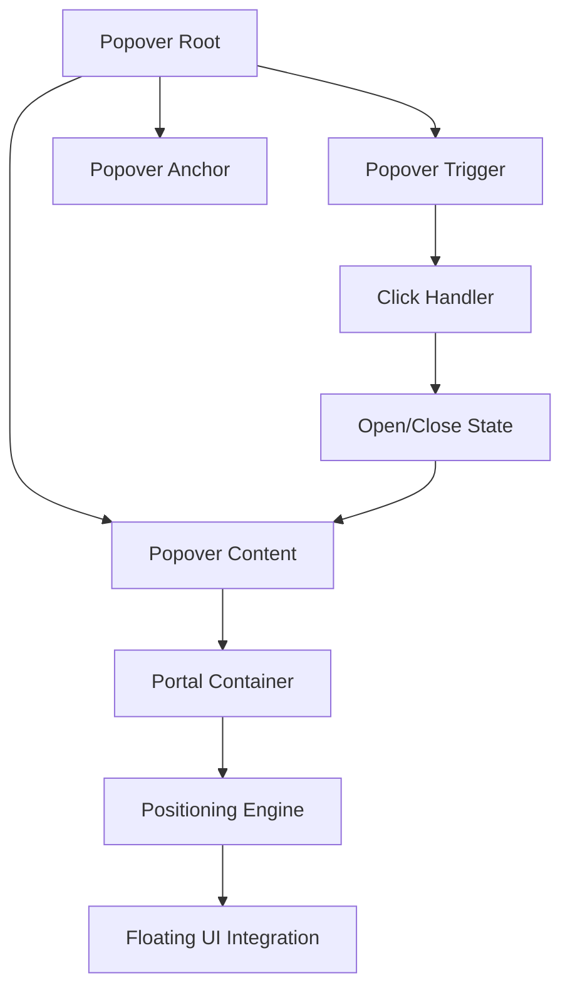

**Diagram sources**
- [popover.tsx](file://components/ui/popover.tsx#L8-L48)

## Detailed Component Analysis

### Popover Component
The Popover component serves as the state container for the entire popover system. It wraps Radix UI's Root component and adds a data-slot attribute for styling purposes.

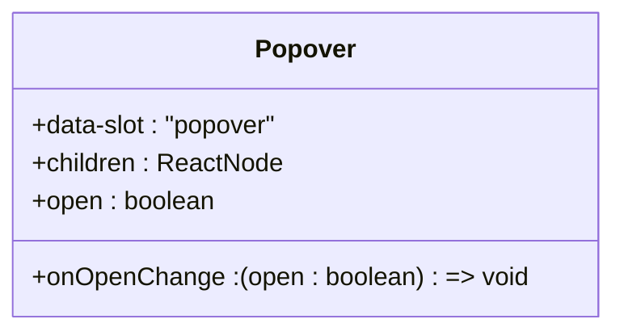

**Diagram sources**
- [popover.tsx](file://components/ui/popover.tsx#L8-L12)

### PopoverTrigger Component
The PopoverTrigger component renders the element that users interact with to open or close the popover. It's typically used with buttons or other interactive elements.

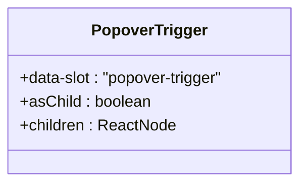

**Diagram sources**
- [popover.tsx](file://components/ui/popover.tsx#L14-L18)

### PopoverContent Component
The PopoverContent component displays the actual content of the popover. It includes several important features:

- **Positioning**: Uses the align and sideOffset props to control placement
- **Animation**: Implements entrance and exit animations via data-state attributes
- **Portal**: Renders in a portal to avoid z-index and overflow issues
- **Styling**: Applies consistent styling with Tailwind CSS classes

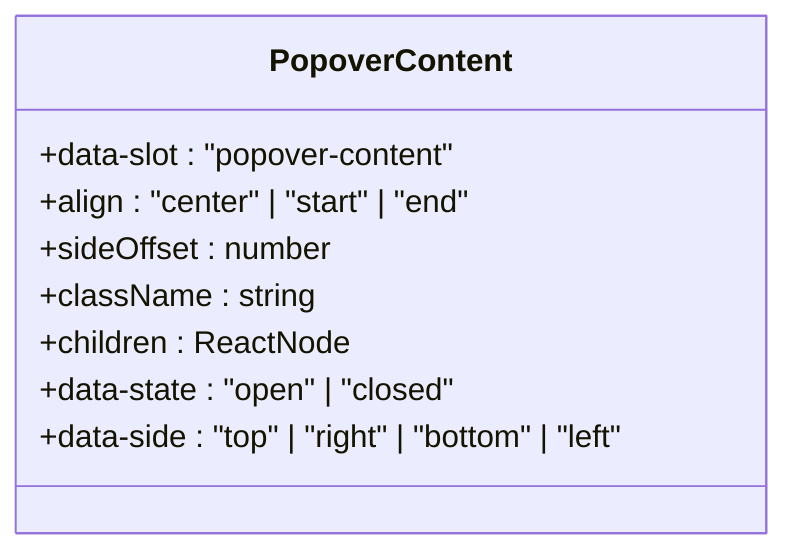

**Diagram sources**
- [popover.tsx](file://components/ui/popover.tsx#L20-L40)

### PopoverAnchor Component
The PopoverAnchor component provides a reference point for positioning the popover content. It's particularly useful when the trigger element should not be the positioning reference.

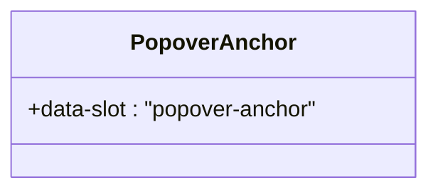

**Diagram sources**
- [popover.tsx](file://components/ui/popover.tsx#L42-L46)

## Usage Examples

### Calendar Date Selection
In the teacher attendance interface, a popover is used to select dates with a calendar component. The popover triggers when clicking a date button and displays a calendar for selection.

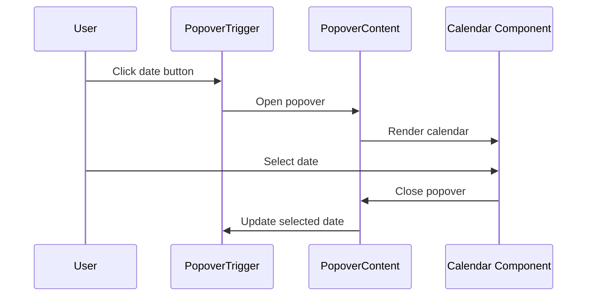

**Diagram sources**
- [teacher/attendance/page.tsx](file://app/teacher/attendance/page.tsx#L182-L192)
- [admin/attendance/page.tsx](file://app/admin/attendance/page.tsx#L167-L177)

### QR Scanner Results
The QR scanner component uses a popover pattern (implemented as a modal) to display scan results. When a QR code is scanned, the scanner interface closes and the result is processed.

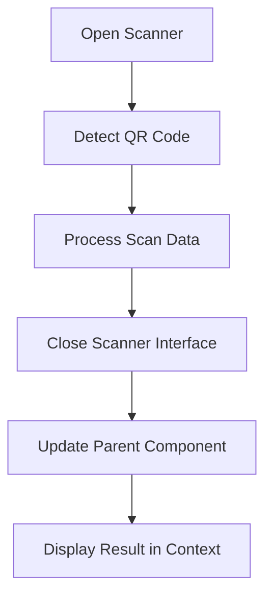

**Diagram sources**
- [qr-scanner.tsx](file://components/qr-scanner.tsx#L1-L160)
- [student/qr-checkin/page.tsx](file://app/student/qr-checkin/page.tsx#L302-L305)

### Event Details in Calendar
The calendar view component displays event details when a date is selected. This implementation shows how popovers can provide contextual information without navigating away from the current view.

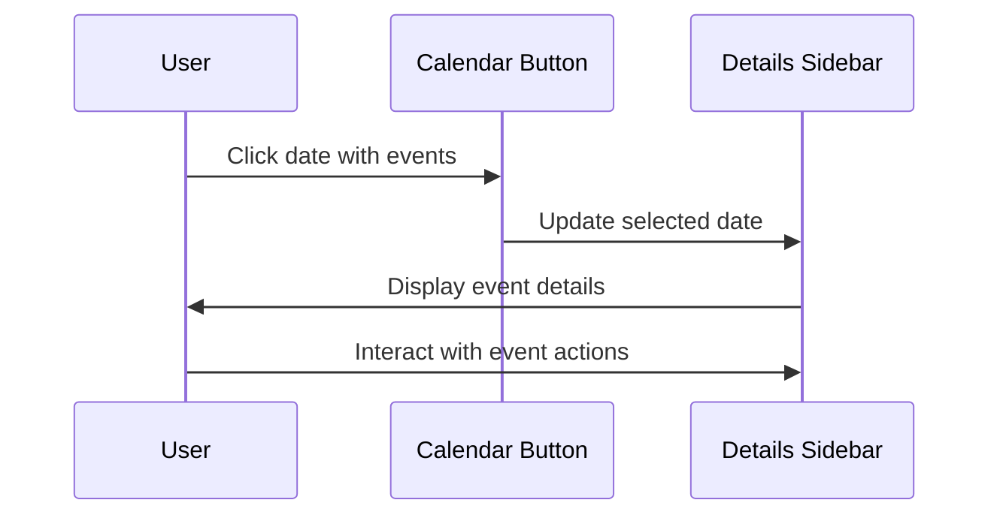

**Diagram sources**
- [calendar-view.tsx](file://components/calendar-view.tsx#L214-L433)

### Notification Center
The notification center uses a popover to display user notifications. This implementation includes additional features like unread counters and mark-as-read functionality.

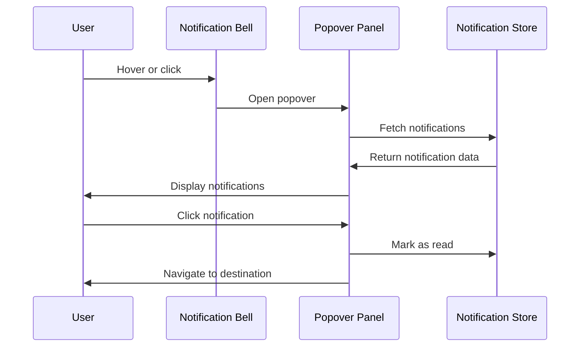

**Diagram sources**
- [notification-center.tsx](file://components/notification-center.tsx#L94-L187)

## Accessibility Considerations

### Click-Outside Dismissal
The popover system supports click-outside dismissal through Radix UI's built-in functionality. When users click outside the popover content, it automatically closes, maintaining expected interaction patterns.

**Section sources**
- [popover.tsx](file://components/ui/popover.tsx#L27-L39)

### Keyboard Navigation
The implementation supports standard keyboard navigation:
- **Enter/Space**: Activate the trigger to open/close the popover
- **Escape**: Close the popover when open
- **Tab**: Navigate through interactive elements within the popover
- **Shift+Tab**: Reverse tab navigation

These behaviors are inherited from Radix UI's accessible primitives, ensuring compliance with WAI-ARIA guidelines.

**Section sources**
- [popover.tsx](file://components/ui/popover.tsx#L8-L48)

### Screen Reader Announcements
The popover components include appropriate ARIA attributes for screen reader support:
- The trigger receives `aria-haspopup="dialog"` and `aria-expanded` attributes
- The content region is properly labeled and focused when opened
- Close buttons include `sr-only` text for screen readers

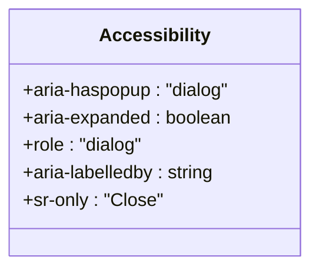

**Diagram sources**
- [popover.tsx](file://components/ui/popover.tsx#L8-L48)
- [dialog.tsx](file://components/ui/dialog.tsx#L70-L76)

## Integration with Floating UI

### Dynamic Positioning
The popover system integrates with Floating UI (via Radix UI) to provide dynamic positioning that avoids collisions with screen boundaries. This ensures the popover remains visible even when triggered near the edges of the viewport.

**Section sources**
- [popover.tsx](file://components/ui/popover.tsx#L30-L32)

### Collision Detection
The positioning system automatically detects and resolves collisions by:
- Flipping the popover to the opposite side when space is limited
- Adjusting alignment based on available space
- Using sideOffset to maintain consistent spacing

This behavior is particularly important in complex layouts like the attendance dashboard where multiple UI elements compete for space.

**Section sources**
- [popover.tsx](file://components/ui/popover.tsx#L23-L24)

### Alignment System
The alignment system provides three options through the align prop:
- **center**: Content is centered relative to the trigger
- **start**: Content is aligned to the start edge of the trigger
- **end**: Content is aligned to the end edge of the trigger

The sideOffset prop controls the distance between the popover and the trigger element, with a default value of 4 pixels.

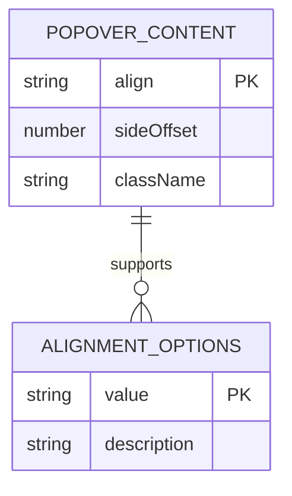

**Diagram sources**
- [popover.tsx](file://components/ui/popover.tsx#L22-L23)

## Conclusion
The popover components in the shadcn/ui library provide a robust solution for displaying contextual information and actions. By building on Radix UI's accessible primitives and integrating with Floating UI for dynamic positioning, these components offer a reliable and consistent user experience across various use cases. The implementation demonstrates best practices in accessibility, responsive design, and user interaction patterns, making it suitable for critical educational applications where usability and accessibility are paramount.