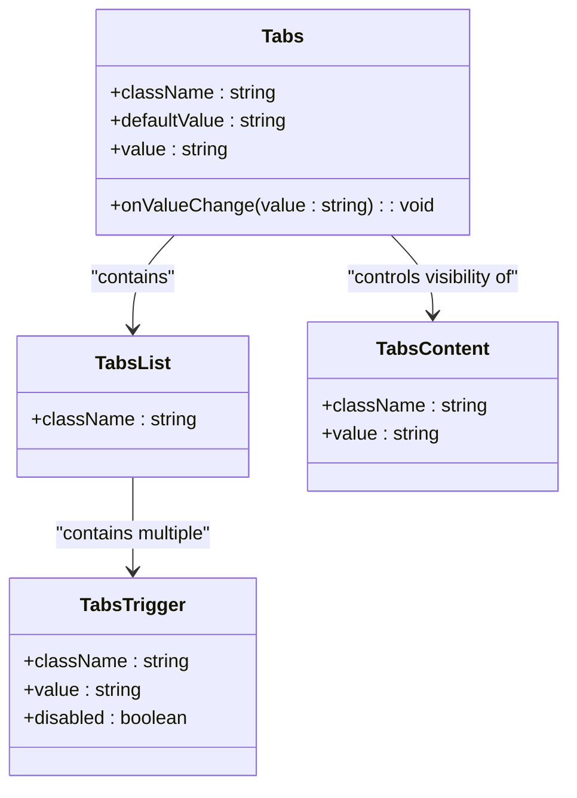
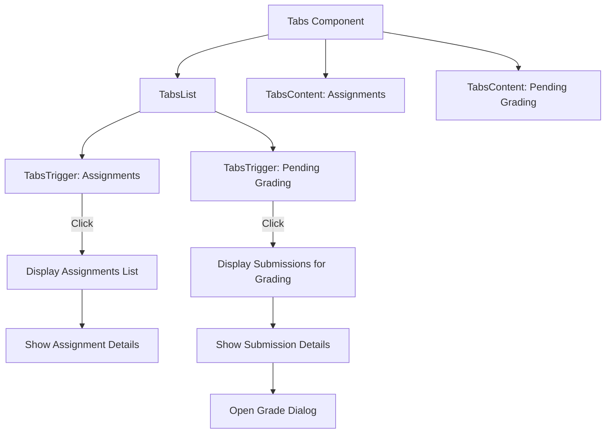
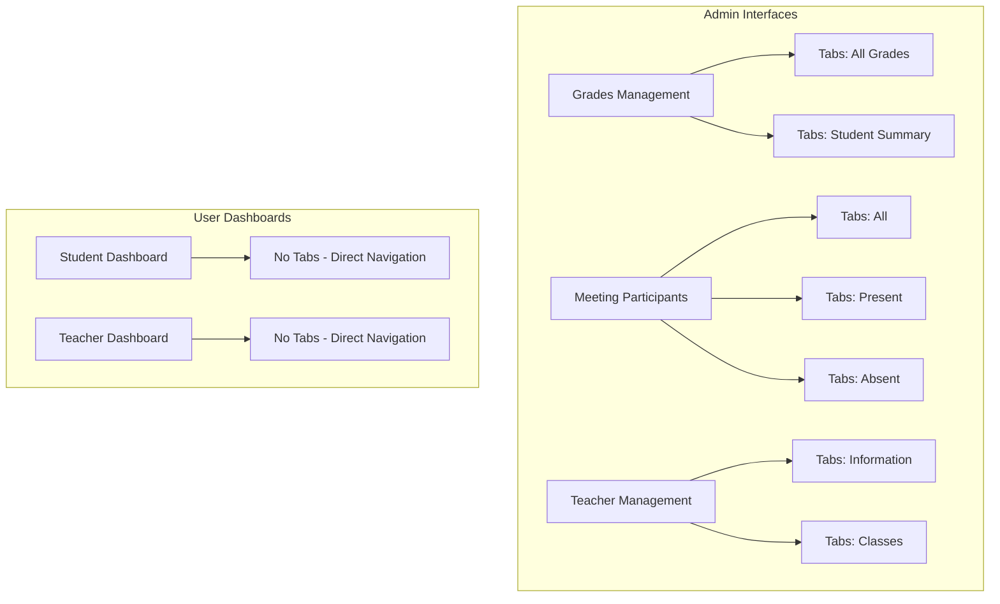

# Tabs Components

<cite>
**Referenced Files in This Document**   
- [tabs.tsx](file://components/ui/tabs.tsx)
- [teacher-assignment-manager.tsx](file://components/teacher-assignment-manager.tsx)
- [grades/page.tsx](file://app/admin/grades/page.tsx)
- [meetings/[id]/participants/page.tsx](file://app/admin/meetings/[id]/participants/page.tsx)
- [teachers/page.tsx](file://app/admin/teachers/page.tsx)
- [student/page.tsx](file://app/student/page.tsx)
- [teacher/page.tsx](file://app/teacher/page.tsx)
</cite>

## Table of Contents
1. [Introduction](#introduction)
2. [Core Components](#core-components)
3. [State Management and Visual Styling](#state-management-and-visual-styling)
4. [Usage in Teacher Assignment Manager](#usage-in-teacher-assignment-manager)
5. [Usage in Student and Teacher Dashboards](#usage-in-student-and-teacher-dashboards)
6. [Accessibility Considerations](#accessibility-considerations)
7. [Responsive Behavior and Long Label Handling](#responsive-behavior-and-long-label-handling)

## Introduction
The Tabs components in the school management system provide a structured navigation mechanism for organizing content within dashboards. Built on the shadcn/ui library, these components enable users to switch between different views of related content without leaving the page. The implementation includes four main components: Tabs, TabsList, TabsTrigger, and TabsContent, which work together to create an accessible and visually consistent tabbed interface across various parts of the application.

## Core Components

The Tabs component system consists of four primary elements that work together to create a cohesive tabbed interface:

- **Tabs**: The root container that manages the overall state of the tab group
- **TabsList**: The container for tab triggers, typically displayed as a horizontal or vertical list
- **TabsTrigger**: Individual tab buttons that users click to activate different content views
- **TabsContent**: Panels that contain the content associated with each tab

These components are implemented as wrappers around Radix UI's primitives, enhancing them with project-specific styling and accessibility features.

**Section sources**
- [tabs.tsx](file://components/ui/tabs.tsx#L8-L66)

## State Management and Visual Styling

### Data-State Attribute and Visual Feedback
The tabs system uses the `data-state` attribute to control visual styling based on the active state of each tab. When a tab is active, Radix UI automatically sets `data-state="active"` on the corresponding TabsTrigger element. This attribute is used in CSS selectors to apply different styles to active versus inactive tabs.

The styling approach employs several visual cues to indicate the active state:
- **Background transitions**: Active tabs have a distinct background color that contrasts with inactive tabs
- **Border styling**: Subtle border changes help distinguish the active tab
- **Shadow effects**: Active tabs use `shadow-sm` to create a slight elevation effect
- **Color transitions**: Smooth color transitions enhance the user experience when switching between tabs

The implementation uses Tailwind CSS classes with data attribute selectors to achieve these effects without requiring JavaScript-based style manipulation.

**Diagram sources**
- [tabs.tsx](file://components/ui/tabs.tsx#L8-L66)

**Section sources**
- [tabs.tsx](file://components/ui/tabs.tsx#L8-L66)

## Usage in Teacher Assignment Manager

The teacher assignment manager uses tabs to organize assignments and pending grading tasks. The implementation separates content into two main views:

- **Assignments tab**: Displays all assignments for the selected class, showing their status (draft/published), due dates, and grading progress
- **Pending Grading tab**: Lists all submissions that require grading, allowing teachers to quickly access and evaluate student work

The component uses the `defaultValue` prop to set the initial active tab and manages state internally through the Radix UI primitives. When a teacher selects a submission for grading, a dialog is opened with detailed information about the student's submission.

**Diagram sources**
- [teacher-assignment-manager.tsx](file://components/teacher-assignment-manager.tsx#L229-L414)

**Section sources**
- [teacher-assignment-manager.tsx](file://components/teacher-assignment-manager.tsx#L229-L414)

## Usage in Student and Teacher Dashboards

### Admin Grade Management
In the admin grade management interface, tabs are used to separate different views of grade data:
- **All Grades**: Displays a comprehensive table of all grades across classes
- **Student Summary**: Provides an aggregated view of student performance

The implementation uses the `defaultValue` prop to set the initial view and maintains state across user interactions.

### Meeting Participants Management
The meeting participants interface uses tabs to filter participant lists:
- **All**: Shows all registered participants
- **Present**: Displays only participants who have attended
- **Absent**: Lists participants who have not attended

This implementation demonstrates dynamic tab state management, where the active tab can be controlled programmatically through the `value` and `onValueChange` props.

### Teacher Profile Management
In the teacher management interface, tabs organize information within the teacher details dialog:
- **Information**: Displays personal and contact information
- **Classes**: Lists all classes assigned to the teacher

**Diagram sources**
- [grades/page.tsx](file://app/admin/grades/page.tsx#L263-L408)
- [meetings/[id]/participants/page.tsx](file://app/admin/meetings/[id]/participants/page.tsx#L291-L302)
- [teachers/page.tsx](file://app/admin/teachers/page.tsx#L508-L586)

**Section sources**
- [grades/page.tsx](file://app/admin/grades/page.tsx#L263-L408)
- [meetings/[id]/participants/page.tsx](file://app/admin/meetings/[id]/participants/page.tsx#L291-L302)
- [teachers/page.tsx](file://app/admin/teachers/page.tsx#L508-L586)

## Accessibility Considerations

The tabs implementation follows WAI-ARIA best practices for keyboard navigation and screen reader support:

- **ARIA Roles**: The component hierarchy uses proper ARIA roles:
  - `tablist` role on the TabsList container
  - `tab` role on each TabsTrigger
  - `tabpanel` role on each TabsContent

- **Keyboard Navigation**: The implementation supports standard keyboard interactions:
  - **Arrow keys**: Navigate between tabs (horizontal tabs use left/right arrows, vertical tabs use up/down arrows)
  - **Home/End**: Jump to the first or last tab
  - **Ctrl+Tab**: Switch tabs while maintaining focus position

- **Focus Management**: The component ensures proper focus handling:
  - Focus remains trapped within the tab list when navigating with arrow keys
  - When a tab is activated, focus moves to the associated content panel
  - The active tab is always programmatically determined and visually indicated

- **Screen Reader Support**: The implementation provides appropriate announcements:
  - Screen readers announce the tab list and the number of tabs
  - The active tab is announced as "selected"
  - Tab panel content is properly associated with its trigger

**Section sources**
- [tabs.tsx](file://components/ui/tabs.tsx#L8-L66)

## Responsive Behavior and Long Label Handling

The tabs components are designed to be responsive and handle various content scenarios:

### Responsive Design
- On mobile devices, tabs may stack vertically or convert to a dropdown selector when space is limited
- The tab list container uses `inline-flex` with `w-fit` to minimize horizontal space usage
- Tab triggers use `whitespace-nowrap` to prevent text wrapping, ensuring consistent appearance

### Long Label Handling
- The implementation uses `line-clamp` utilities in content areas to handle long text gracefully
- Tab labels are designed to be concise, with longer descriptions displayed in the content panel
- The `data-[state=active]` selector ensures that active tabs remain visually distinct even with truncated text

### Performance Considerations
- Tab content is unmounted when not active, reducing memory usage
- The component uses React's reconciliation to minimize re-renders during tab switching
- CSS transitions are optimized for smooth animations without jank

**Section sources**
- [tabs.tsx](file://components/ui/tabs.tsx#L8-L66)
- [teacher-assignment-manager.tsx](file://components/teacher-assignment-manager.tsx#L229-L414)