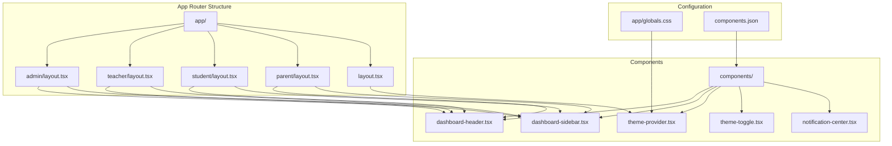
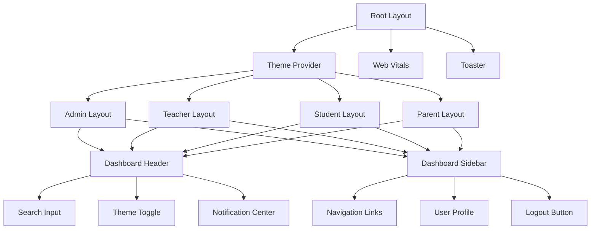
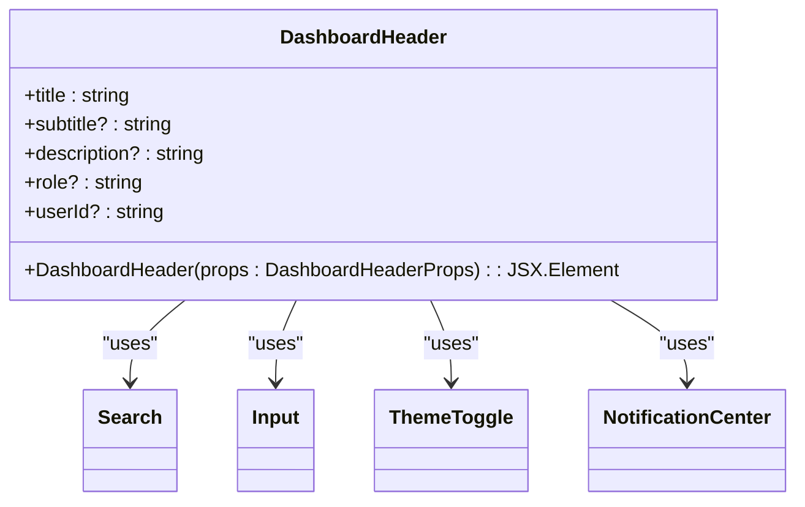
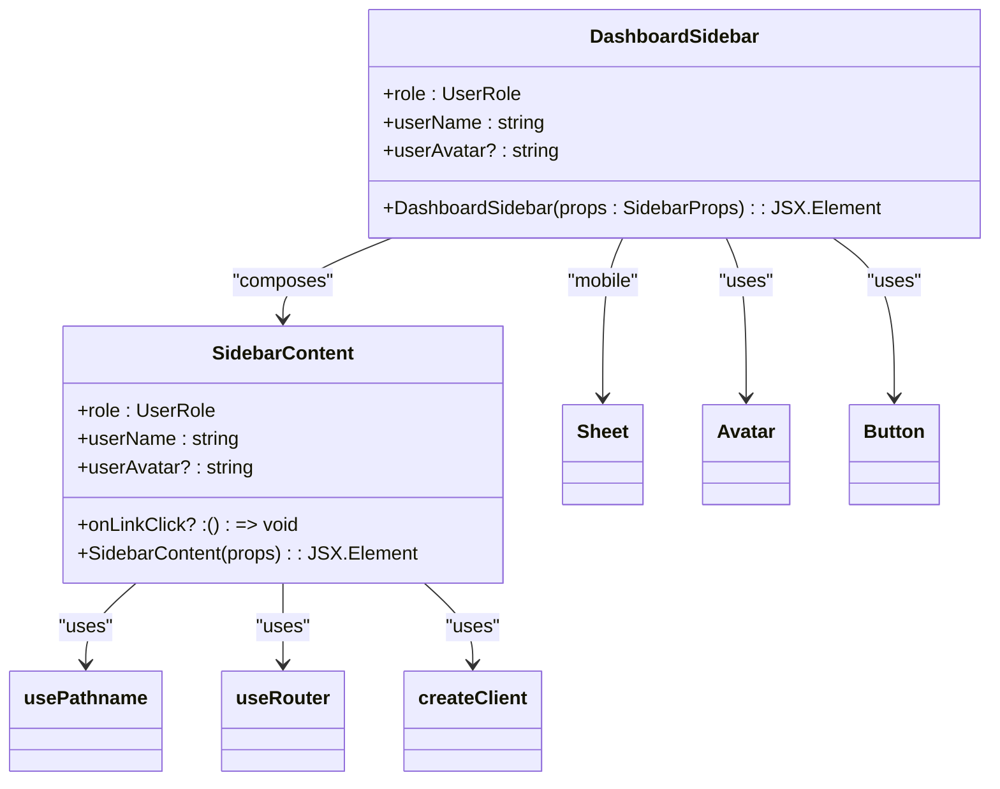
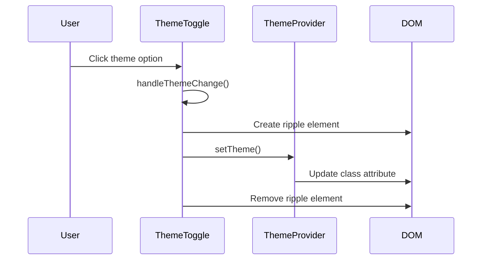
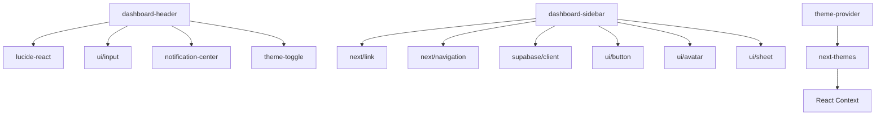

# Layout Components

<cite>
**Referenced Files in This Document**   
- [dashboard-header.tsx](file://components/dashboard-header.tsx)
- [dashboard-sidebar.tsx](file://components/dashboard-sidebar.tsx)
- [theme-provider.tsx](file://components/theme-provider.tsx)
- [theme-toggle.tsx](file://components/theme-toggle.tsx)
- [notification-center.tsx](file://components/notification-center.tsx)
- [layout.tsx](file://app/layout.tsx)
- [admin/layout.tsx](file://app/admin/layout.tsx)
- [teacher/layout.tsx](file://app/teacher/layout.tsx)
- [student/layout.tsx](file://app/student/layout.tsx)
- [parent/layout.tsx](file://app/parent/layout.tsx)
- [globals.css](file://app/globals.css)
- [components.json](file://components.json)
- [types.ts](file://lib/types.ts)
</cite>

## Table of Contents
1. [Introduction](#introduction)
2. [Project Structure](#project-structure)
3. [Core Components](#core-components)
4. [Architecture Overview](#architecture-overview)
5. [Detailed Component Analysis](#detailed-component-analysis)
6. [Dependency Analysis](#dependency-analysis)
7. [Performance Considerations](#performance-considerations)
8. [Troubleshooting Guide](#troubleshooting-guide)
9. [Conclusion](#conclusion)

## Introduction
The School-Management-System employs a modular layout architecture built with Next.js App Router, featuring role-based dashboards with consistent header and sidebar components. The layout system provides a responsive user interface with dynamic theme switching capabilities powered by Tailwind CSS and next-themes. This documentation details the implementation of the dashboard-header and dashboard-sidebar components, their integration with the theme system, and accessibility features across different user roles including administrators, teachers, students, and parents.

## Project Structure
The layout components are organized within the Next.js App Router structure, with shared components in the components directory and role-specific layouts in their respective directories. The system follows a component-based architecture with clear separation between UI presentation and business logic.

**Diagram sources**
- [app/layout.tsx](file://app/layout.tsx#L1-L43)
- [components/dashboard-header.tsx](file://components/dashboard-header.tsx#L1-L35)
- [components/dashboard-sidebar.tsx](file://components/dashboard-sidebar.tsx#L1-L225)

**Section sources**
- [app/layout.tsx](file://app/layout.tsx#L1-L43)
- [components/dashboard-header.tsx](file://components/dashboard-header.tsx#L1-L35)

## Core Components
The core layout components consist of dashboard-header and dashboard-sidebar, which provide consistent navigation and branding across all role-based dashboards. These components are designed to be responsive, accessible, and theme-aware, adapting to different screen sizes and user preferences.

**Section sources**
- [dashboard-header.tsx](file://components/dashboard-header.tsx#L1-L35)
- [dashboard-sidebar.tsx](file://components/dashboard-sidebar.tsx#L1-L225)

## Architecture Overview
The layout architecture follows a hierarchical pattern with the root layout providing global theming, while role-specific layouts compose the header and sidebar components with appropriate configuration. The system leverages Next.js App Router for server-side rendering and client-side navigation, with a focus on performance and accessibility.

**Diagram sources**
- [app/layout.tsx](file://app/layout.tsx#L1-L43)
- [app/admin/layout.tsx](file://app/admin/layout.tsx#L1-L62)
- [app/teacher/layout.tsx](file://app/teacher/layout.tsx#L1-L60)

## Detailed Component Analysis

### Dashboard Header Analysis
The dashboard-header component provides a consistent top navigation bar across all dashboards, featuring a title area, search functionality, theme toggle, and notification center. It is designed to be sticky and responsive, adapting to different screen sizes.

**Diagram sources**
- [dashboard-header.tsx](file://components/dashboard-header.tsx#L1-L35)
- [theme-toggle.tsx](file://components/theme-toggle.tsx#L1-L79)

**Section sources**
- [dashboard-header.tsx](file://components/dashboard-header.tsx#L1-L35)

### Dashboard Sidebar Analysis
The dashboard-sidebar component provides role-specific navigation with different menu items based on user role. It features a responsive design with mobile support via a sheet component, and includes user profile information and logout functionality.

**Diagram sources**
- [dashboard-sidebar.tsx](file://components/dashboard-sidebar.tsx#L1-L225)
- [ui/button.tsx](file://components/ui/button.tsx)
- [ui/avatar.tsx](file://components/ui/avatar.tsx)

**Section sources**
- [dashboard-sidebar.tsx](file://components/dashboard-sidebar.tsx#L1-L225)

### Theme System Analysis
The theme system enables dynamic theme switching with support for light, dark, and system preferences. The implementation includes visual feedback through animated transitions when changing themes.

**Diagram sources**
- [theme-provider.tsx](file://components/theme-provider.tsx#L1-L12)
- [theme-toggle.tsx](file://components/theme-toggle.tsx#L1-L79)

**Section sources**
- [theme-provider.tsx](file://components/theme-provider.tsx#L1-L12)
- [theme-toggle.tsx](file://components/theme-toggle.tsx#L1-L79)

## Dependency Analysis
The layout components have a well-defined dependency structure, with shared UI components and role-specific configurations. The system leverages Next.js routing, Supabase authentication, and various UI libraries to provide a cohesive user experience.

**Diagram sources**
- [package.json](file://package.json#L1-L90)
- [components.json](file://components.json#L1-L22)

**Section sources**
- [package.json](file://package.json#L1-L90)
- [components.json](file://components.json#L1-L22)

## Performance Considerations
The layout components are optimized for performance with client-side rendering only where necessary. The header and sidebar are marked with "use client" directive but are designed to minimize re-renders through proper state management and memoization. The theme system leverages CSS variables for instant theme switching without page reloads.

The responsive design ensures optimal performance across devices, with mobile-specific optimizations like the sheet-based sidebar that reduces initial load complexity on smaller screens. The notification center implements lazy loading of notifications and efficient state management through Zustand store.

## Troubleshooting Guide
When encountering issues with layout components, consider the following common problems and solutions:

**Section sources**
- [dashboard-header.tsx](file://components/dashboard-header.tsx#L1-L35)
- [dashboard-sidebar.tsx](file://components/dashboard-sidebar.tsx#L1-L225)
- [theme-toggle.tsx](file://components/theme-toggle.tsx#L1-L79)

## Conclusion
The layout components in the School-Management-System provide a robust, accessible, and theme-aware foundation for role-based dashboards. The architecture effectively separates concerns between global theming, role-specific layouts, and reusable UI components. The implementation follows modern React and Next.js best practices, with attention to performance, accessibility, and user experience across different devices and screen sizes.