# UI Components

<cite>
**Referenced Files in This Document**   
- [button.tsx](file://components/ui/button.tsx)
- [dialog.tsx](file://components/ui/dialog.tsx)
- [table.tsx](file://components/ui/table.tsx)
- [card.tsx](file://components/ui/card.tsx)
- [input.tsx](file://components/ui/input.tsx)
- [select.tsx](file://components/ui/select.tsx)
- [dropdown-menu.tsx](file://components/ui/dropdown-menu.tsx)
- [tabs.tsx](file://components/ui/tabs.tsx)
- [avatar.tsx](file://components/ui/avatar.tsx)
- [badge.tsx](file://components/ui/badge.tsx)
- [dashboard-header.tsx](file://components/dashboard-header.tsx)
- [dashboard-sidebar.tsx](file://components/dashboard-sidebar.tsx)
- [data-table.tsx](file://components/data-table.tsx)
- [stat-card.tsx](file://components/stat-card.tsx)
- [theme-provider.tsx](file://components/theme-provider.tsx)
- [theme-toggle.tsx](file://components/theme-toggle.tsx)
- [notification-center.tsx](file://components/notification-center.tsx)
</cite>

## Table of Contents
1. [Introduction](#introduction)
2. [Component Architecture](#component-architecture)
3. [Layout Components](#layout-components)
4. [Data Display Components](#data-display-components)
5. [Form Components](#form-components)
6. [Interactive Components](#interactive-components)
7. [Theming and Styling](#theming-and-styling)
8. [Accessibility and Responsive Design](#accessibility-and-responsive-design)
9. [Component Composition and State Management](#component-composition-and-state-management)
10. [Performance Optimization](#performance-optimization)

## Introduction
The School-Management-System UI component library is built on shadcn/ui primitives and extended with custom business components tailored for educational administration. This documentation provides comprehensive guidance on the component architecture, usage patterns, and implementation details for developers working on the system. The library follows a modular design approach, combining reusable UI primitives with domain-specific components that address the unique requirements of school management workflows.

## Component Architecture
The UI component library follows a layered architecture that extends shadcn/ui primitives with custom business components. The foundation consists of atomic UI primitives that provide consistent styling and behavior across the application. These primitives are then composed into higher-level business components that encapsulate domain-specific functionality for school management operations.

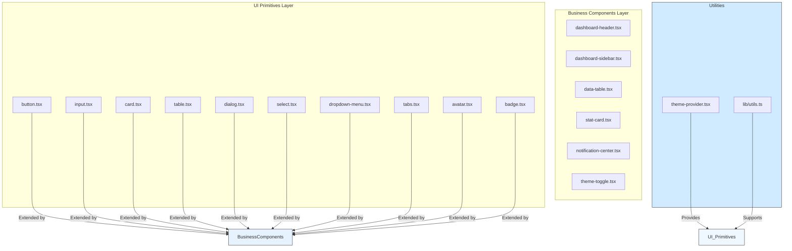

**Diagram sources**
- [button.tsx](file://components/ui/button.tsx)
- [input.tsx](file://components/ui/input.tsx)
- [card.tsx](file://components/ui/card.tsx)
- [table.tsx](file://components/ui/table.tsx)
- [dialog.tsx](file://components/ui/dialog.tsx)
- [select.tsx](file://components/ui/select.tsx)
- [dropdown-menu.tsx](file://components/ui/dropdown-menu.tsx)
- [tabs.tsx](file://components/ui/tabs.tsx)
- [avatar.tsx](file://components/ui/avatar.tsx)
- [badge.tsx](file://components/ui/badge.tsx)
- [dashboard-header.tsx](file://components/dashboard-header.tsx)
- [dashboard-sidebar.tsx](file://components/dashboard-sidebar.tsx)
- [data-table.tsx](file://components/data-table.tsx)
- [stat-card.tsx](file://components/stat-card.tsx)
- [theme-provider.tsx](file://components/theme-provider.tsx)

**Section sources**
- [button.tsx](file://components/ui/button.tsx)
- [dashboard-header.tsx](file://components/dashboard-header.tsx)
- [dashboard-sidebar.tsx](file://components/dashboard-sidebar.tsx)

## Layout Components

### Dashboard Header
The DashboardHeader component provides a consistent header across all dashboard views in the application. It includes search functionality, theme toggling, and notification center integration.

**Props/Attributes:**
- `title` (string): Main title displayed in the header
- `subtitle` (string, optional): Secondary text below the title
- `description` (string, optional): Alternative to subtitle with same visual treatment
- `role` (string, optional): User role for contextual display
- `userId` (string, optional): User identifier for notification center

**Events:**
- Inherits standard DOM events from the header element

**Slots:**
- No slots available

**Customization Options:**
- The component automatically prioritizes subtitle over description
- Search functionality is hidden on mobile devices
- Notification center only renders when userId is provided

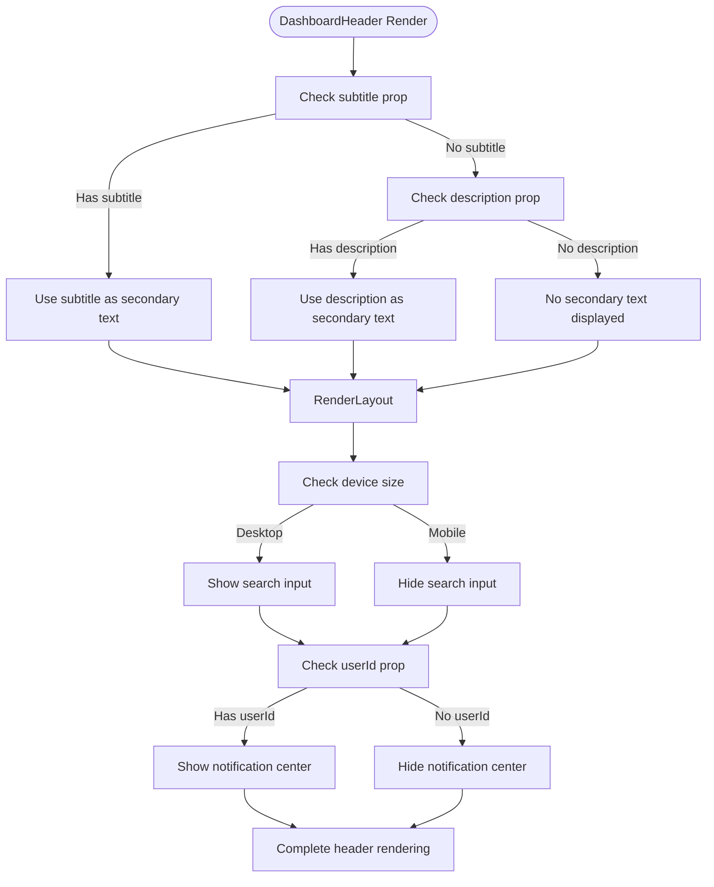

**Diagram sources**
- [dashboard-header.tsx](file://components/dashboard-header.tsx)

**Section sources**
- [dashboard-header.tsx](file://components/dashboard-header.tsx)

### Dashboard Sidebar
The DashboardSidebar component provides role-based navigation for different user types in the school management system. It adapts its content based on the user's role and supports both desktop and mobile layouts.

**Props/Attributes:**
- `role` (UserRole): User role determining available navigation links
- `userName` (string): Display name for the user
- `userAvatar` (string, optional): URL to user's avatar image

**Events:**
- `onLinkClick`: Triggered when a navigation link is clicked (internal)
- Logout event through Supabase authentication

**Slots:**
- No slots available

**Customization Options:**
- Role-specific navigation links for admin, teacher, student, and parent roles
- Mobile-responsive design with sheet-based drawer on smaller screens
- Dynamic role labeling based on user type
- Custom styling for active navigation items

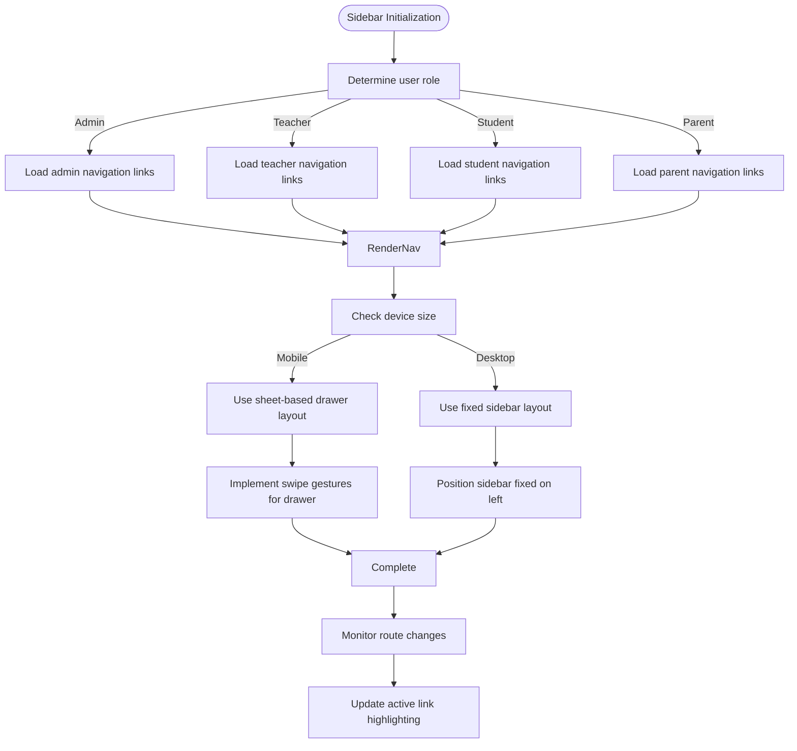

**Diagram sources**
- [dashboard-sidebar.tsx](file://components/dashboard-sidebar.tsx)

**Section sources**
- [dashboard-sidebar.tsx](file://components/dashboard-sidebar.tsx)

## Data Display Components

### Data Table
The DataTable component provides a flexible table implementation for displaying collections of data with support for custom rendering and row interactions.

**Props/Attributes:**
- `columns` (Column<T>[]): Array of column definitions with key, header, and optional render function
- `data` (T[]): Array of data items to display
- `onRowClick` ((item: T) => void, optional): Callback function when a row is clicked

**Column Interface:**
- `key`: Property key from data object or string identifier
- `header`: String, React node, or render function for column header
- `render`: Optional function to customize cell rendering
- `className`: Optional CSS classes for the column

**Events:**
- Row click events when onRowClick is provided
- Inherited table interaction events

**Slots:**
- No slots available

**Customization Options:**
- Support for dynamic header rendering with functions
- Custom cell rendering for specific columns
- Clickable rows with callback support
- Responsive design with horizontal scrolling on smaller screens

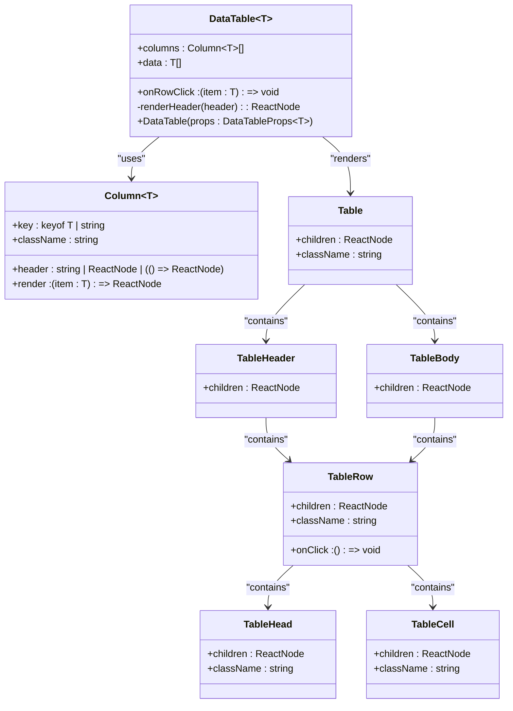

**Diagram sources**
- [data-table.tsx](file://components/data-table.tsx)
- [table.tsx](file://components/ui/table.tsx)

**Section sources**
- [data-table.tsx](file://components/data-table.tsx)

### Stat Card
The StatCard component displays key metrics with visual indicators and trend information.

**Props/Attributes:**
- `title` (string): Label for the metric
- `value` (string | number): Value to display
- `icon` (LucideIcon): Icon component to display
- `trend` (object, optional): Trend information with value and label
- `className` (string, optional): Additional CSS classes

**Trend Object:**
- `value`: Percentage change (positive or negative)
- `label`: Descriptive text for the trend

**Events:**
- No specific events
- Inherits standard DOM events

**Slots:**
- No slots available

**Customization Options:**
- Automatic color coding for positive (primary) and negative (destructive) trends
- Flexible value types (string or number)
- Icon integration with Lucide icons
- Custom styling through className prop

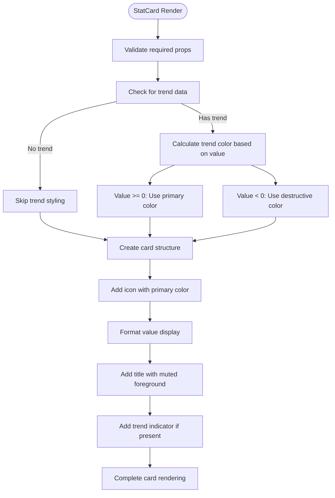

**Diagram sources**
- [stat-card.tsx](file://components/stat-card.tsx)
- [card.tsx](file://components/ui/card.tsx)

**Section sources**
- [stat-card.tsx](file://components/stat-card.tsx)

## Form Components

### Input
The Input component provides a styled text input field with consistent styling and validation states.

**Props/Attributes:**
- Inherits all standard HTML input attributes
- `className` (string, optional): Additional CSS classes
- `type` (string, optional): Input type (text, email, password, etc.)

**Events:**
- All standard input events (onChange, onFocus, onBlur, etc.)
- Focus and validation state changes

**Slots:**
- No slots available

**Customization Options:**
- Built-in focus and validation styling
- Support for file inputs with custom styling
- Responsive sizing with different states
- Accessibility features including selection styling

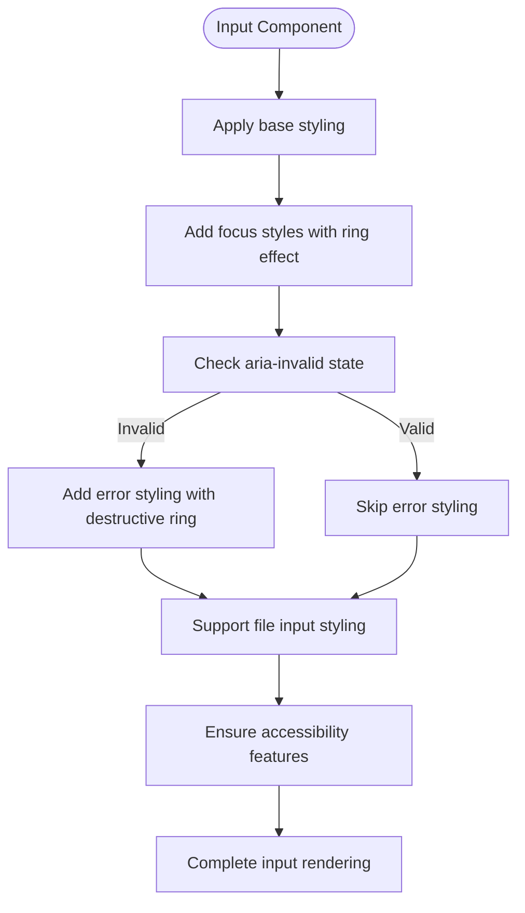

**Diagram sources**
- [input.tsx](file://components/ui/input.tsx)

**Section sources**
- [input.tsx](file://components/ui/input.tsx)

### Select
The Select component provides a customizable dropdown selection interface with support for different sizes and accessibility features.

**Props/Attributes:**
- Inherits all standard select attributes
- `size` ('sm' | 'default', optional): Size variant (default: 'default')
- `className` (string, optional): Additional CSS classes

**Events:**
- Value change events
- Open/close state changes
- Keyboard navigation events

**Slots:**
- `SelectTrigger`: The element that toggles the dropdown
- `SelectContent`: The dropdown menu container
- `SelectItem`: Individual selectable items
- `SelectValue`: Displayed value when an option is selected
- `SelectGroup`: Grouping container for related items
- `SelectLabel`: Label for groups
- `SelectSeparator`: Visual separator between items
- `SelectScrollUpButton`: Scroll control for long lists
- `SelectScrollDownButton`: Scroll control for long lists

**Customization Options:**
- Two size variants: default and small
- Scroll controls for long option lists
- Grouping and separation of options
- Custom styling for active and disabled states
- Accessibility support with proper ARIA attributes

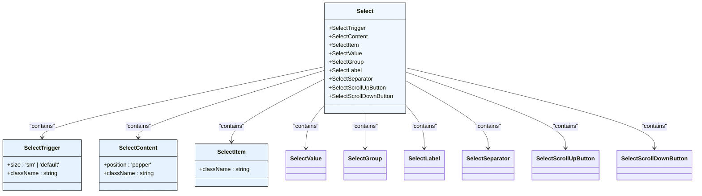

**Diagram sources**
- [select.tsx](file://components/ui/select.tsx)

**Section sources**
- [select.tsx](file://components/ui/select.tsx)

## Interactive Components

### Dialog
The Dialog component provides a modal dialog interface with configurable content areas and accessibility features.

**Props/Attributes:**
- Inherits all standard dialog attributes
- `showCloseButton` (boolean, optional): Whether to display the close button (default: true)
- `className` (string, optional): Additional CSS classes

**Events:**
- Open/close state changes
- Escape key dismissal
- Click outside to close
- Close button click

**Slots:**
- `DialogTrigger`: Element that opens the dialog
- `DialogContent`: Main dialog container
- `DialogHeader`: Header section with title and optional action
- `DialogTitle`: Main title of the dialog
- `DialogDescription`: Descriptive text below the title
- `DialogFooter`: Footer section for action buttons
- `DialogClose`: Close button or element
- `DialogOverlay`: Background overlay that can be clicked to close

**Customization Options:**
- Configurable close button visibility
- Pre-styled header and footer sections
- Animation support for entrance and exit
- Focus trapping within the dialog
- Responsive sizing with maximum width constraints

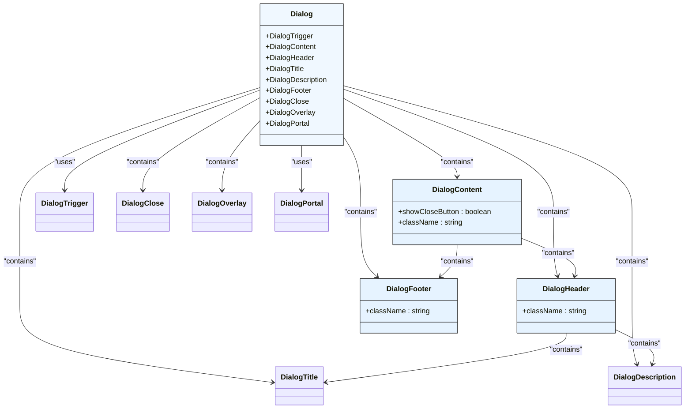

**Diagram sources**
- [dialog.tsx](file://components/ui/dialog.tsx)

**Section sources**
- [dialog.tsx](file://components/ui/dialog.tsx)

### Dropdown Menu
The DropdownMenu component provides a versatile dropdown menu system with support for nested menus, checkboxes, radio groups, and keyboard navigation.

**Props/Attributes:**
- Inherits all standard dropdown menu attributes
- `sideOffset` (number, optional): Distance from the trigger element (default: 4)
- `className` (string, optional): Additional CSS classes
- `variant` ('default' | 'destructive'): Style variant for menu items

**Events:**
- Open/close state changes
- Item selection
- Keyboard navigation (arrow keys, escape, enter)
- Submenu opening/closing

**Slots:**
- `DropdownMenuTrigger`: Element that toggles the menu
- `DropdownMenuContent`: Menu container
- `DropdownMenuItem`: Standard menu item
- `DropdownMenuCheckboxItem`: Checkable menu item with checkbox
- `DropdownMenuRadioItem`: Radio menu item within a group
- `DropdownMenuRadioGroup`: Container for radio items
- `DropdownMenuLabel`: Label for menu sections
- `DropdownMenuSeparator`: Visual separator between items
- `DropdownMenuShortcut`: Keyboard shortcut indicator
- `DropdownMenuSub`: Container for nested submenu
- `DropdownMenuSubTrigger`: Trigger for nested submenu
- `DropdownMenuSubContent`: Content container for nested submenu
- `DropdownMenuPortal`: Portal for rendering menu in different DOM location

**Customization Options:**
- Destructive variant for dangerous actions
- Inset styling for hierarchical items
- Keyboard shortcut display
- Nested submenu support
- Checkbox and radio group functionality
- Animation support for entrance and exit
- Accessibility features including focus management

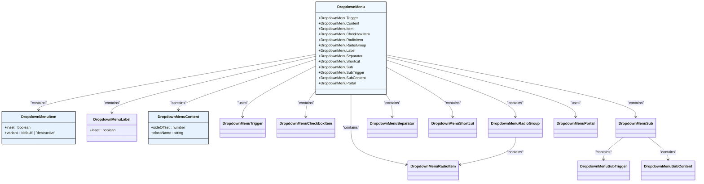

**Diagram sources**
- [dropdown-menu.tsx](file://components/ui/dropdown-menu.tsx)

**Section sources**
- [dropdown-menu.tsx](file://components/ui/dropdown-menu.tsx)

### Tabs
The Tabs component provides a tabbed interface for organizing content into multiple sections that can be viewed one at a time.

**Props/Attributes:**
- Inherits all standard tabs attributes
- `className` (string, optional): Additional CSS classes

**Events:**
- Tab selection changes
- Keyboard navigation between tabs

**Slots:**
- `Tabs`: Root component that manages tab state
- `TabsList`: Container for tab triggers
- `TabsTrigger`: Individual tab button that activates a content panel
- `TabsContent`: Panel that displays content when its corresponding tab is active

**Customization Options:**
- Visual indication of active tab
- Smooth transitions between tabs
- Keyboard navigation support
- Focus styling for accessibility
- Responsive design with proper spacing

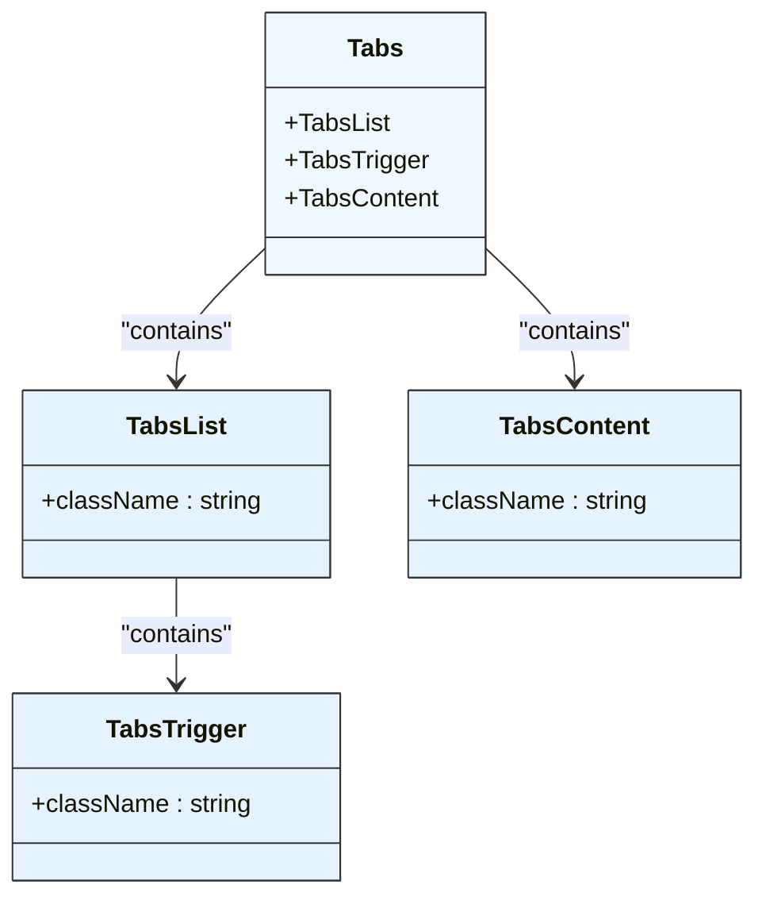

**Diagram sources**
- [tabs.tsx](file://components/ui/tabs.tsx)

**Section sources**
- [tabs.tsx](file://components/ui/tabs.tsx)

## Theming and Styling

### Theme Provider
The ThemeProvider component wraps the application and manages theme state using next-themes for both light and dark mode support.

**Props/Attributes:**
- Inherits all ThemeProviderProps from next-themes
- `children`: Child components to be wrapped by the theme provider

**Events:**
- Theme change events
- System preference detection

**Slots:**
- Default slot for child components

**Customization Options:**
- Automatic detection of system preference
- Persistent theme storage
- Support for forced light or dark themes
- Script optimization to prevent flash of unstyled content

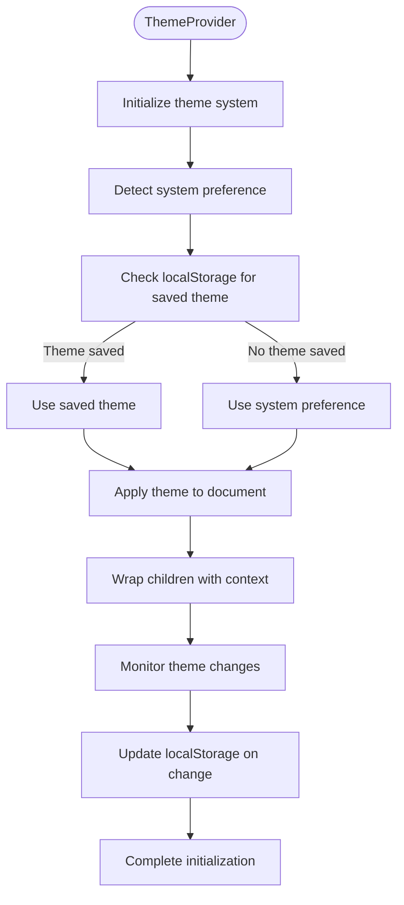

**Diagram sources**
- [theme-provider.tsx](file://components/theme-provider.tsx)

**Section sources**
- [theme-provider.tsx](file://components/theme-provider.tsx)

### Theme Toggle
The ThemeToggle component provides a user interface element for switching between light and dark themes.

**Props/Attributes:**
- No specific props beyond standard button attributes
- Inherits styling from Button component

**Events:**
- Click event to toggle theme
- Theme change propagation

**Slots:**
- No slots available

**Customization Options:**
- Icon-based interface showing current theme
- Integration with ThemeProvider context
- Accessible labeling for screen readers
- Smooth transition between themes

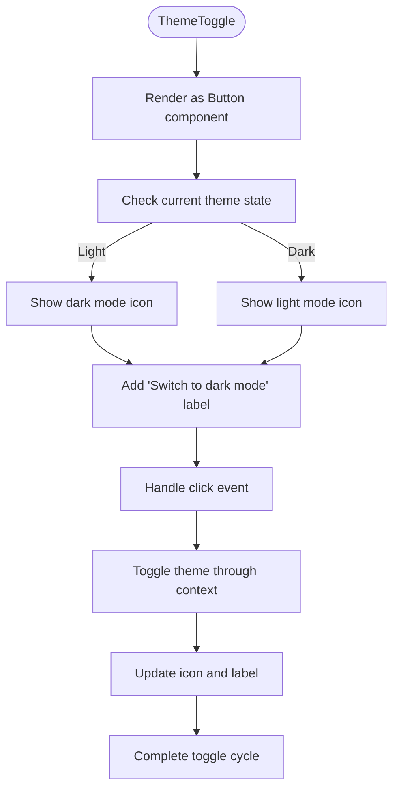

**Section sources**
- [theme-toggle.tsx](file://components/theme-toggle.tsx)

## Accessibility and Responsive Design

### Accessibility Compliance
The UI component library follows WCAG 2.1 guidelines to ensure accessibility for all users. Key accessibility features include:

- **Keyboard Navigation**: All interactive components are fully operable via keyboard
- **Screen Reader Support**: Proper ARIA attributes and semantic HTML elements
- **Focus Management**: Visible focus indicators and logical tab order
- **Color Contrast**: Sufficient contrast ratios between text and background
- **Alternative Text**: Descriptive labels for icons and images
- **Form Labels**: Proper labeling of form controls
- **Dynamic Content**: ARIA live regions for dynamic updates

Each component implements specific accessibility features:
- Buttons have proper role and keyboard interaction
- Dialogs implement focus trapping and proper ARIA roles
- Tables have proper header associations and navigation
- Forms include validation feedback and error messaging
- Interactive elements have hover, focus, and active states

**Section sources**
- [button.tsx](file://components/ui/button.tsx)
- [dialog.tsx](file://components/ui/dialog.tsx)
- [table.tsx](file://components/ui/table.tsx)
- [input.tsx](file://components/ui/input.tsx)

### Responsive Design
The component library implements a mobile-first responsive design approach that adapts to different screen sizes:

- **Breakpoints**: Uses consistent breakpoints across all components
- **Flexible Layouts**: Components adapt their layout based on available space
- **Touch Targets**: Adequate sizing for touch interactions
- **Content Prioritization**: Essential content displayed first on smaller screens
- **Progressive Disclosure**: Additional features revealed as screen size increases

Specific responsive behaviors:
- Dashboard sidebar collapses to a drawer on mobile
- Tables scroll horizontally on smaller screens
- Header elements reorganize based on available width
- Form layouts adjust from horizontal to vertical stacking
- Navigation patterns change from horizontal tabs to vertical lists

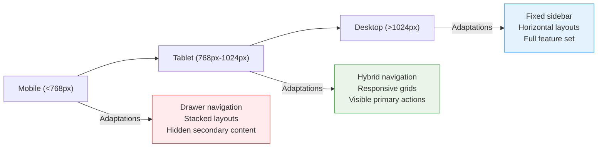

**Section sources**
- [dashboard-header.tsx](file://components/dashboard-header.tsx)
- [dashboard-sidebar.tsx](file://components/dashboard-sidebar.tsx)
- [data-table.tsx](file://components/data-table.tsx)

## Component Composition and State Management

### Component Composition Patterns
The component library encourages composition over inheritance, allowing developers to build complex interfaces by combining simple components:

- **Primitive Components**: Atomic elements like Button, Input, and Card
- **Composite Components**: Business components built from primitives
- **Higher-Order Components**: Components that enhance other components
- **Compound Components**: Components that work together as a system

Key composition patterns:
- **Slot Pattern**: Using children as slots for content insertion
- **Render Props**: Passing functions that return JSX
- **Context Consumers**: Components that consume shared state
- **Compound Components**: Components that share implicit state

Examples of composition in the library:
- DashboardHeader combines Input, Button, and Avatar components
- DataTable uses Table primitives with custom logic
- DashboardSidebar composes navigation links and user information
- StatCard combines Card with custom metric display

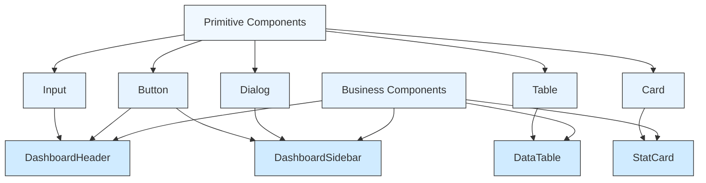

**Section sources**
- [dashboard-header.tsx](file://components/dashboard-header.tsx)
- [data-table.tsx](file://components/data-table.tsx)
- [stat-card.tsx](file://components/stat-card.tsx)
- [dashboard-sidebar.tsx](file://components/dashboard-sidebar.tsx)

### State Management Integration
Components integrate with the application's state management system through various patterns:

- **Context API**: Theme and user state shared across components
- **Supabase Integration**: Authentication and data fetching
- **Client-Side State**: React hooks for component-specific state
- **URL State**: Synchronization with route parameters

State management considerations:
- Components minimize internal state when possible
- Business logic is separated from presentation
- Data fetching is handled at appropriate levels
- Loading and error states are properly displayed
- User interactions update state predictably

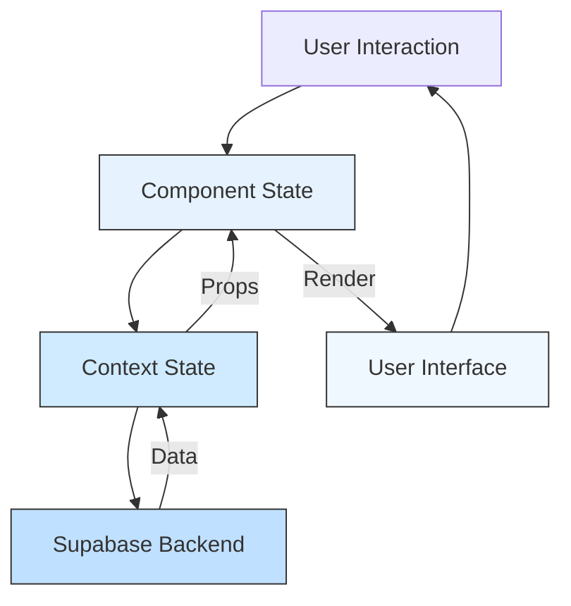

**Section sources**
- [dashboard-sidebar.tsx](file://components/dashboard-sidebar.tsx)
- [notification-center.tsx](file://components/notification-center.tsx)

## Performance Optimization

### Component Usage Tips
To ensure optimal performance when using components:

- **Lazy Loading**: Load components only when needed
- **Memoization**: Use React.memo for components with expensive renders
- **Virtualization**: Implement for long lists and tables
- **Code Splitting**: Split components into separate bundles
- **Image Optimization**: Use optimized images and lazy loading

Specific recommendations:
- Use DataTable for large datasets with virtualization
- Implement loading states for async operations
- Debounce search and filter operations
- Use efficient data structures for lookups
- Minimize re-renders with proper state management

### Rendering Optimization
The following practices improve rendering performance:

- **Avoid Inline Functions**: Define event handlers outside render
- **Use Keys Properly**: Ensure stable keys for list items
- **Minimize Props**: Pass only necessary props to components
- **Optimize Effects**: Clean up effects and avoid unnecessary dependencies
- **Use Production Builds**: Ensure optimized builds for deployment

Performance monitoring:
- Use React DevTools to identify re-renders
- Monitor bundle sizes with analysis tools
- Test on lower-end devices
- Measure Core Web Vitals
- Implement error boundaries

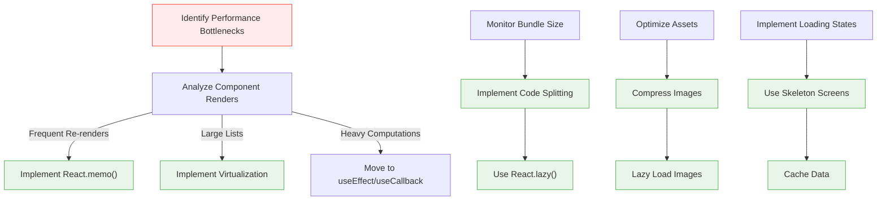

**Section sources**
- [data-table.tsx](file://components/data-table.tsx)
- [dashboard-header.tsx](file://components/dashboard-header.tsx)