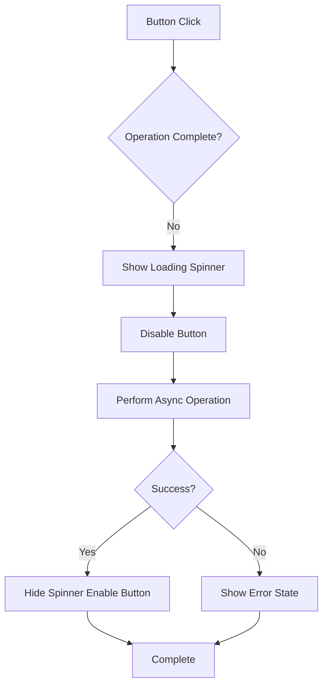
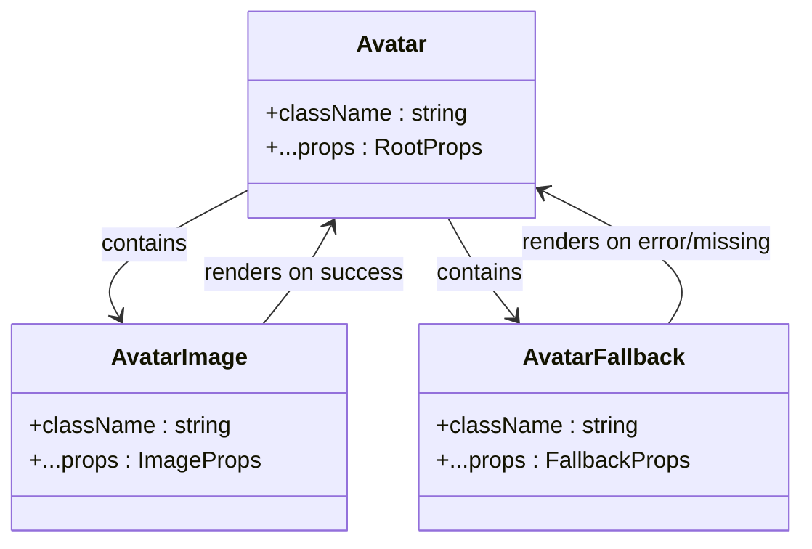
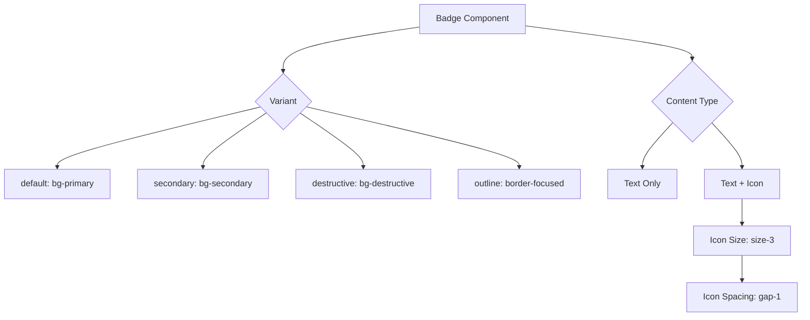
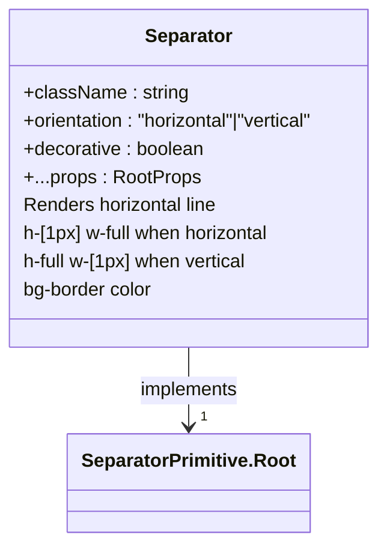
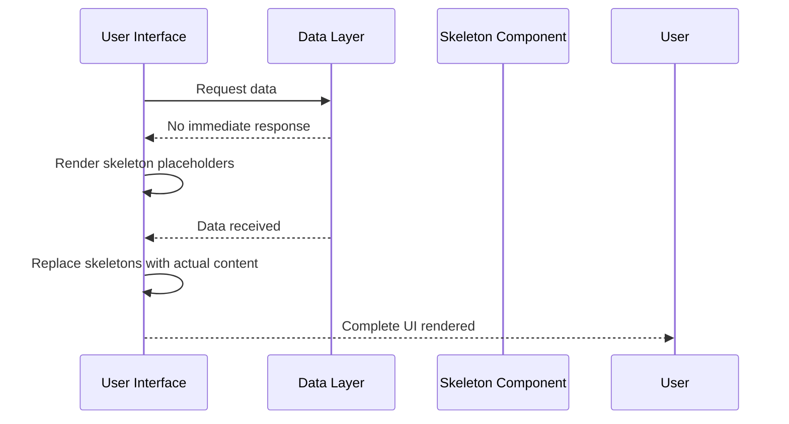
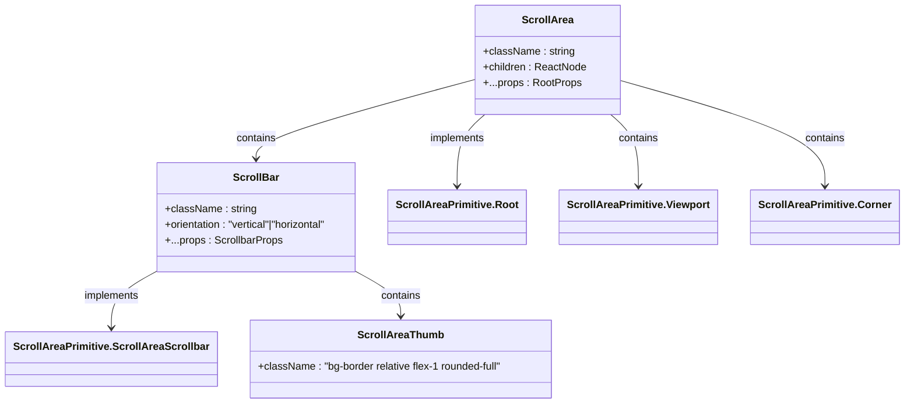
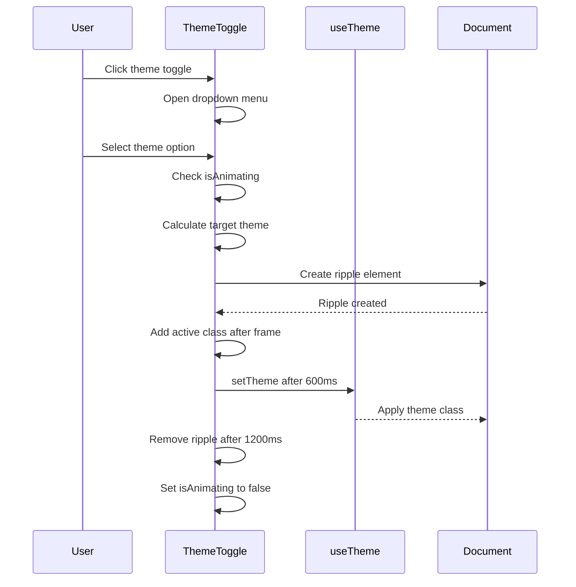
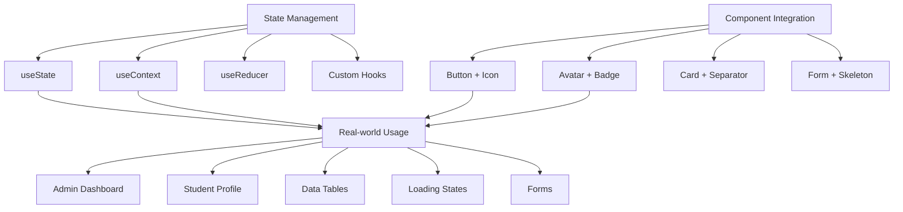

# UI Primitives

<cite>
**Referenced Files in This Document**   
- [button.tsx](file://components/ui/button.tsx)
- [avatar.tsx](file://components/ui/avatar.tsx)
- [badge.tsx](file://components/ui/badge.tsx)
- [separator.tsx](file://components/ui/separator.tsx)
- [skeleton.tsx](file://components/ui/skeleton.tsx)
- [scroll-area.tsx](file://components/ui/scroll-area.tsx)
- [theme-toggle.tsx](file://components/theme-toggle.tsx)
- [globals.css](file://styles/globals.css)
- [theme-provider.tsx](file://components/theme-provider.tsx)
- [utils.ts](file://lib/utils.ts)
- [components.json](file://components.json)
</cite>

## Table of Contents
1. [Introduction](#introduction)
2. [Button Component](#button-component)
3. [Avatar Component](#avatar-component)
4. [Badge Component](#badge-component)
5. [Separator Component](#separator-component)
6. [Skeleton Component](#skeleton-component)
7. [Scroll Area Component](#scroll-area-component)
8. [Theme Toggle Component](#theme-toggle-component)
9. [Styling and Customization](#styling-and-customization)
10. [Accessibility Guidelines](#accessibility-guidelines)
11. [Responsive Behavior](#responsive-behavior)
12. [Integration Examples](#integration-examples)

## Introduction
This documentation provides comprehensive details about the foundational UI primitive components used in the School Management System, based on the shadcn/ui design system. The components covered include buttons, avatars, badges, separators, skeletons, scroll areas, and theme toggle functionality. These primitives are designed with accessibility, responsiveness, and customization in mind, leveraging Tailwind CSS and CSS variables for styling. The documentation explains each component's variants, states, and integration patterns with state management.

## Button Component

The Button component is a versatile UI primitive that supports multiple variants, sizes, and loading states. It is built using the class-variance-authority (CVA) pattern for consistent styling across variants.

### Variants
The button supports six variants:
- **default**: Primary action with primary background color
- **destructive**: For dangerous actions with destructive color scheme
- **outline**: Border-focused style with transparent background
- **secondary**: Secondary action with secondary background
- **ghost**: Minimal style that only shows on hover
- **link**: Text link style with underline on hover

### Sizes
The button supports multiple size options:
- **default**: Standard size (h-9 px-4 py-2)
- **sm**: Small size (h-8 rounded-md)
- **lg**: Large size (h-10 rounded-md px-6)
- **icon**: Square icon button (size-9)
- **icon-sm**: Small icon button (size-8)
- **icon-lg**: Large icon button (size-10)

### Loading States
While the button component itself doesn't manage loading states, it can be integrated with loading indicators. As seen in the profile page implementation, loading states can be implemented by conditionally rendering a spinner icon and disabling the button during async operations.



**Diagram sources**
- [button.tsx](file://components/ui/button.tsx#L7-L37)
- [profile-page.tsx](file://components/profile-page.tsx#L939-L945)

**Section sources**
- [button.tsx](file://components/ui/button.tsx#L39-L60)

## Avatar Component

The Avatar component displays user profile images with fallback options for when images are unavailable. It follows the composition pattern with three subcomponents: Avatar, AvatarImage, and AvatarFallback.

### Image Fallbacks
The component hierarchy ensures graceful degradation:
1. **AvatarImage**: Attempts to load the provided image source
2. **AvatarFallback**: Displays when the image fails to load or no image is provided

### Initials Display
The AvatarFallback component can display user initials when no profile image is available. The fallback has a muted background and centers content within a rounded container.

### Implementation Details
The avatar uses relative positioning with overflow-hidden to create the circular crop effect. The component is size-8 by default but can be customized with the className prop.



**Diagram sources**
- [avatar.tsx](file://components/ui/avatar.tsx#L8-L53)

**Section sources**
- [avatar.tsx](file://components/ui/avatar.tsx#L8-L53)

## Badge Component

The Badge component is used for status indicators, categories, and other small pieces of information. It provides visual distinction through color and style variants.

### Variants
The badge supports four variants:
- **default**: Primary color scheme
- **secondary**: Secondary color scheme
- **destructive**: Red color scheme for error/warning states
- **outline**: Subtle border-based style

### Usage Patterns
Badges are typically used for:
- Status indicators (active, inactive, pending)
- Category labels
- Count indicators
- Skill tags

### Styling
The badge uses inline-flex with items-center for proper alignment of text and icons. It has a small text size (text-xs) and appropriate padding (px-2 py-0.5) for compact display.



**Diagram sources**
- [badge.tsx](file://components/ui/badge.tsx#L7-L26)

**Section sources**
- [badge.tsx](file://components/ui/badge.tsx#L28-L46)

## Separator Component

The Separator component creates visual divisions between content sections. It's a simple but essential layout primitive for organizing information.

### Orientation
The separator supports two orientations:
- **horizontal**: Default orientation (1px height, full width)
- **vertical**: Vertical orientation (full height, 1px width)

### Accessibility
The component includes a decorative prop (default: true) that indicates whether the separator is purely visual or has semantic meaning. When decorative is true, it won't be exposed to assistive technologies.

### Styling
The separator uses the bg-border color with shrink-0 to prevent unwanted shrinking in flex layouts.



**Diagram sources**
- [separator.tsx](file://components/ui/separator.tsx#L8-L31)

**Section sources**
- [separator.tsx](file://components/ui/separator.tsx#L8-L31)

## Skeleton Component

The Skeleton component provides loading placeholders that mimic the shape and size of content before it loads. This improves perceived performance by giving users immediate feedback.

### Implementation
The skeleton is a simple div with:
- **animate-pulse**: Tailwind animation for subtle pulsing effect
- **rounded-md**: Consistent border radius
- **bg-muted**: Subtle background color that matches the design system

### Usage
Skeleton components are typically used in loading states to maintain layout stability and provide visual feedback during data fetching.



**Diagram sources**
- [skeleton.tsx](file://components/ui/skeleton.tsx#L3-L15)

**Section sources**
- [skeleton.tsx](file://components/ui/skeleton.tsx#L3-L15)

## Scroll Area Component

The Scroll Area component creates custom styled scrollable regions with consistent scrollbar appearance across browsers.

### Structure
The component consists of:
- **ScrollArea**: Container component
- **Viewport**: The scrollable content area
- **ScrollBar**: Custom scrollbar UI
- **ScrollAreaThumb**: The draggable thumb element

### Orientation Support
The scroll area supports both vertical and horizontal scrolling:
- Vertical scrollbars appear on the right (width: 2.5)
- Horizontal scrollbars appear at the bottom (height: 2.5)

### Styling
The scrollbar is hidden by default and appears on hover with a smooth transition. The thumb has a rounded full style with bg-border color.



**Diagram sources**
- [scroll-area.tsx](file://components/ui/scroll-area.tsx#L8-L58)

**Section sources**
- [scroll-area.tsx](file://components/ui/scroll-area.tsx#L8-L58)

## Theme Toggle Component

The Theme Toggle component provides a user interface for switching between light, dark, and system themes with a visual ripple animation.

### Functionality
The component:
- Uses next-themes for theme management
- Provides three options: Light, Dark, and System
- Includes a visual ripple animation during theme transitions
- Prevents multiple simultaneous theme changes with isAnimating state

### Animation
The theme toggle includes a ripple effect that:
- Creates a full-screen overlay with the target theme color
- Animates from a small circle to cover the entire viewport
- Removes the overlay after animation completes

### Implementation
The component uses a DropdownMenu to present theme options and handles theme changes with a debounce mechanism to prevent rapid toggling.



**Diagram sources**
- [theme-toggle.tsx](file://components/theme-toggle.tsx#L15-L78)
- [theme-provider.tsx](file://components/theme-provider.tsx#L9-L11)

**Section sources**
- [theme-toggle.tsx](file://components/theme-toggle.tsx#L15-L78)

## Styling and Customization

The UI primitives are styled using a combination of CSS variables and Tailwind classes, providing extensive customization options.

### CSS Variables
The theme system uses CSS custom properties defined in globals.css:
- **Color variables**: --background, --foreground, --primary, --secondary, etc.
- **Radius variables**: --radius, --radius-sm, --radius-md, etc.
- **Font variables**: --font-sans, --font-mono

These variables are defined for both light and dark color schemes, with the dark theme activated by the .dark class.

### Tailwind Classes
Components leverage Tailwind's utility-first approach with:
- **cn function**: From lib/utils.ts for merging Tailwind classes
- **Component-specific classes**: Base styles defined in each component
- **Variant styles**: Managed by class-variance-authority

### Theme Configuration
The components.json file configures the styling system:
- Style: "new-york" theme
- CSS variables: Enabled
- Base color: "neutral"
- CSS file: app/globals.css

```mermaid
graph TD
A[CSS Variables] --> B[globals.css]
B --> C[:root definitions]
B --> D[.dark definitions]
B --> E[@theme inline]
A --> F[Theme Customization]
F --> G[Color scheme]
F --> H[Border radius]
F --> I[Font families]
I --> J[Geist font stack]
K[Tailwind Classes] --> L[Utility-first]
L --> M[cn function]
M --> N[lib/utils.ts]
N --> O[clsx + tailwind-merge]
P[Component Styling] --> Q[Base classes]
P --> R[Variant classes]
P --> S[Size classes]
```

**Diagram sources**
- [globals.css](file://styles/globals.css#L6-L116)
- [utils.ts](file://lib/utils.ts#L4-L6)
- [components.json](file://components.json#L3-L11)

**Section sources**
- [globals.css](file://styles/globals.css#L6-L116)
- [utils.ts](file://lib/utils.ts#L4-L6)

## Accessibility Guidelines

The UI primitives follow accessibility best practices to ensure usability for all users.

### Keyboard Navigation
- All interactive components are keyboard accessible
- Buttons and links can be activated with Enter/Space
- Dropdown menus support arrow key navigation
- Focus states are clearly visible with focus-visible utilities

### Screen Reader Support
- Semantic HTML elements are used appropriately
- ARIA attributes are applied where needed
- Icons are accompanied by visually hidden text when necessary
- Decorative elements are marked as such

### Color Contrast
- Text and background colors meet WCAG contrast requirements
- Focus rings provide clear visual indication
- Error states are visually distinct
- Dark and light themes maintain appropriate contrast ratios

### Focus Management
- Components use focus-visible to show focus only when using keyboard
- Focus styles are consistent across components
- Interactive elements have appropriate outline and ring utilities

## Responsive Behavior

The UI primitives are designed to work across different screen sizes and devices.

### Breakpoint Support
Components respond to Tailwind's default breakpoints:
- **sm**: 640px and above
- **md**: 768px and above
- **lg**: 1024px and above
- **xl**: 1280px and above

### Mobile Considerations
- Touch targets are appropriately sized (minimum 44px)
- Gestures are supported where applicable
- Layouts adapt to smaller screens
- Font sizes are legible on mobile devices

### Fluid Typography
Text elements use relative units that scale appropriately:
- rem units for consistent scaling
- Responsive text utilities (text-sm, text-lg, etc.)
- Viewport-relative sizing where appropriate

## Integration Examples

The UI primitives can be integrated with other components and state management patterns.

### With State Management
Components can be connected to React state:
- Loading states with useState
- Theme persistence with context
- Form validation states
- Async operation feedback

### Component Composition
Primitives can be combined to create complex UI:
- Buttons with icons
- Avatars in navigation
- Badges with cards
- Separators in lists

### Real-world Usage
In the School Management System, these components are used throughout:
- Admin dashboard with theme toggle
- Student profiles with avatars and badges
- Data tables with separators
- Loading states with skeletons
- Forms with buttons and inputs



**Diagram sources**
- [profile-page.tsx](file://components/profile-page.tsx#L939-L945)
- [theme-toggle.tsx](file://components/theme-toggle.tsx#L15-L78)
- [app/page.tsx](file://app/page.tsx#L328-L347)

**Section sources**
- [profile-page.tsx](file://components/profile-page.tsx#L939-L945)
- [theme-toggle.tsx](file://components/theme-toggle.tsx#L15-L78)